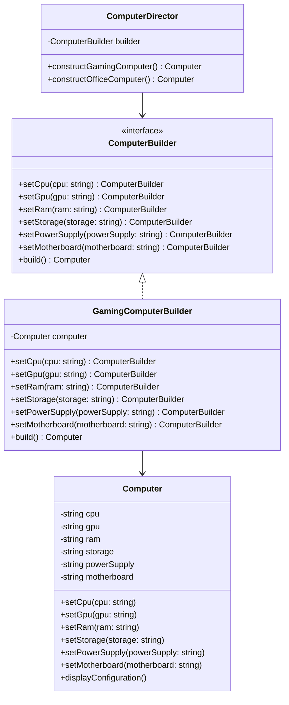

## 4.4.1 Implementing Builder in TypeScript

The Builder Pattern is a creational design pattern that provides a flexible solution to constructing complex objects. It is particularly useful when an object requires multiple steps to be created or when the object creation process involves numerous optional parameters. In this section, we will explore how to implement the Builder Pattern in TypeScript, leveraging its type system and method chaining to enhance usability and maintainability.

### Understanding the Builder Pattern

The Builder Pattern separates the construction of a complex object from its representation, allowing the same construction process to create different representations. This pattern is particularly beneficial when dealing with objects that require numerous configuration options or when the creation process is complex and involves multiple steps.

#### Key Components of the Builder Pattern

1. **Builder Interface/Abstract Class**: Defines the methods for constructing different parts of the product.
2. **ConcreteBuilder**: Implements the Builder interface and provides specific implementations for the construction steps.
3. **Product**: The complex object that is being constructed.
4. **Director** (Optional): Orchestrates the building process using the Builder interface.

### Example Scenario: Building a Complex Computer Configuration

Let's consider a scenario where we need to build a complex computer configuration. A computer can have various components such as a CPU, GPU, RAM, storage, and more. Each of these components can have different specifications, making the construction process intricate.

#### Step 1: Define the Product

First, we define the `Computer` class, which represents the complex object we want to build.

```typescript
class Computer {
  private cpu: string;
  private gpu: string;
  private ram: string;
  private storage: string;
  private powerSupply: string;
  private motherboard: string;

  constructor() {
    // Initialize with default values
    this.cpu = '';
    this.gpu = '';
    this.ram = '';
    this.storage = '';
    this.powerSupply = '';
    this.motherboard = '';
  }

  // Setters for each component
  setCpu(cpu: string): void {
    this.cpu = cpu;
  }

  setGpu(gpu: string): void {
    this.gpu = gpu;
  }

  setRam(ram: string): void {
    this.ram = ram;
  }

  setStorage(storage: string): void {
    this.storage = storage;
  }

  setPowerSupply(powerSupply: string): void {
    this.powerSupply = powerSupply;
  }

  setMotherboard(motherboard: string): void {
    this.motherboard = motherboard;
  }

  // Method to display the computer configuration
  displayConfiguration(): void {
    console.log(`Computer Configuration:
      CPU: ${this.cpu}
      GPU: ${this.gpu}
      RAM: ${this.ram}
      Storage: ${this.storage}
      Power Supply: ${this.powerSupply}
      Motherboard: ${this.motherboard}`);
  }
}
```

#### Step 2: Define the Builder Interface

Next, we define the `ComputerBuilder` interface, which declares the methods for constructing different parts of the computer.

```typescript
interface ComputerBuilder {
  setCpu(cpu: string): ComputerBuilder;
  setGpu(gpu: string): ComputerBuilder;
  setRam(ram: string): ComputerBuilder;
  setStorage(storage: string): ComputerBuilder;
  setPowerSupply(powerSupply: string): ComputerBuilder;
  setMotherboard(motherboard: string): ComputerBuilder;
  build(): Computer;
}
```

#### Step 3: Implement the ConcreteBuilder

The `GamingComputerBuilder` class implements the `ComputerBuilder` interface and provides specific implementations for the construction steps.

```typescript
class GamingComputerBuilder implements ComputerBuilder {
  private computer: Computer;

  constructor() {
    this.computer = new Computer();
  }

  setCpu(cpu: string): ComputerBuilder {
    this.computer.setCpu(cpu);
    return this;
  }

  setGpu(gpu: string): ComputerBuilder {
    this.computer.setGpu(gpu);
    return this;
  }

  setRam(ram: string): ComputerBuilder {
    this.computer.setRam(ram);
    return this;
  }

  setStorage(storage: string): ComputerBuilder {
    this.computer.setStorage(storage);
    return this;
  }

  setPowerSupply(powerSupply: string): ComputerBuilder {
    this.computer.setPowerSupply(powerSupply);
    return this;
  }

  setMotherboard(motherboard: string): ComputerBuilder {
    this.computer.setMotherboard(motherboard);
    return this;
  }

  build(): Computer {
    return this.computer;
  }
}
```

#### Step 4: Using the Builder with Method Chaining

Method chaining is a powerful technique that enhances the usability of the Builder Pattern. It allows us to chain method calls together, making the code more readable and concise.

```typescript
const gamingComputer = new GamingComputerBuilder()
  .setCpu('Intel i9')
  .setGpu('NVIDIA RTX 3080')
  .setRam('32GB')
  .setStorage('1TB SSD')
  .setPowerSupply('750W')
  .setMotherboard('ASUS ROG')
  .build();

gamingComputer.displayConfiguration();
```

### The Role of the Director

In some implementations of the Builder Pattern, a `Director` class is used to orchestrate the building process. The Director is responsible for constructing the product using the Builder interface. It allows for encapsulating the construction logic and provides a way to reuse the building process for different configurations.

```typescript
class ComputerDirector {
  private builder: ComputerBuilder;

  constructor(builder: ComputerBuilder) {
    this.builder = builder;
  }

  constructGamingComputer(): Computer {
    return this.builder
      .setCpu('Intel i9')
      .setGpu('NVIDIA RTX 3080')
      .setRam('32GB')
      .setStorage('1TB SSD')
      .setPowerSupply('750W')
      .setMotherboard('ASUS ROG')
      .build();
  }

  constructOfficeComputer(): Computer {
    return this.builder
      .setCpu('Intel i5')
      .setGpu('Integrated Graphics')
      .setRam('16GB')
      .setStorage('512GB SSD')
      .setPowerSupply('500W')
      .setMotherboard('Gigabyte B450')
      .build();
  }
}

// Using the Director
const builder = new GamingComputerBuilder();
const director = new ComputerDirector(builder);

const gamingPC = director.constructGamingComputer();
gamingPC.displayConfiguration();

const officePC = director.constructOfficeComputer();
officePC.displayConfiguration();
```

### Leveraging TypeScript's Type System

TypeScript's type system enhances the implementation of the Builder Pattern by providing type safety and ensuring that the builder methods are used correctly. By defining interfaces and using method chaining, we can create a fluent API that is both intuitive and robust.

#### Type Safety with Interfaces

The use of interfaces in TypeScript allows us to define a contract for the builder, ensuring that all necessary methods are implemented. This provides compile-time checks and reduces the risk of runtime errors.

#### Method Chaining with Fluent Interfaces

Method chaining, also known as a fluent interface, improves the readability and usability of the builder. By returning the builder instance (`this`) from each method, we can chain method calls together, creating a more expressive and concise syntax.

### Visualizing the Builder Pattern

To better understand the Builder Pattern, let's visualize the relationships between the components using a class diagram.



### Try It Yourself

Experiment with the Builder Pattern by modifying the code examples. Here are a few suggestions:

1. **Add New Components**: Extend the `Computer` class and `ComputerBuilder` interface to include additional components such as a cooling system or a sound card.

2. **Create Different Builders**: Implement a `WorkstationComputerBuilder` class that provides different default configurations for a workstation computer.

3. **Implement Validation**: Add validation logic to ensure that certain components are compatible with each other (e.g., CPU and motherboard).

### Knowledge Check

- What are the key components of the Builder Pattern?
- How does method chaining enhance the usability of the Builder Pattern?
- What role does the Director play in the Builder Pattern?
- How does TypeScript's type system improve the implementation of the Builder Pattern?

### Summary

In this section, we've explored the implementation of the Builder Pattern in TypeScript. We've seen how to define a `Builder` interface, implement a `ConcreteBuilder`, and optionally use a `Director` to orchestrate the building process. By leveraging TypeScript's type system and method chaining, we can create a fluent API that simplifies the construction of complex objects. Remember, the Builder Pattern is a powerful tool in your design pattern arsenal, especially when dealing with intricate object creation processes.

## Quiz Time!



### What is the primary purpose of the Builder Pattern?

- [x] To separate the construction of a complex object from its representation.
- [ ] To allow multiple objects to share a single instance.
- [ ] To provide a way to access elements of a collection sequentially.
- [ ] To define a family of algorithms and make them interchangeable.

> **Explanation:** The Builder Pattern focuses on separating the construction of a complex object from its representation, allowing for different configurations and representations.

### Which component of the Builder Pattern is responsible for orchestrating the building process?

- [ ] Product
- [ ] Builder
- [x] Director
- [ ] ConcreteBuilder

> **Explanation:** The Director is responsible for orchestrating the building process using the Builder interface.

### How does method chaining enhance the Builder Pattern?

- [ ] By allowing multiple builders to be used simultaneously.
- [x] By improving readability and usability through a fluent interface.
- [ ] By enabling the reuse of builder instances.
- [ ] By enforcing strict type checks.

> **Explanation:** Method chaining allows for a fluent interface, improving readability and usability by enabling the chaining of method calls.

### What is the role of the ConcreteBuilder in the Builder Pattern?

- [ ] To define the methods for constructing different parts of the product.
- [x] To provide specific implementations for the construction steps.
- [ ] To represent the complex object being constructed.
- [ ] To orchestrate the building process.

> **Explanation:** The ConcreteBuilder provides specific implementations for the construction steps defined by the Builder interface.

### How does TypeScript's type system improve the Builder Pattern implementation?

- [x] By providing type safety and compile-time checks.
- [ ] By allowing dynamic type changes at runtime.
- [ ] By enabling the use of decorators.
- [ ] By enforcing strict variable naming conventions.

> **Explanation:** TypeScript's type system provides type safety and compile-time checks, ensuring that builder methods are used correctly.

### What is a potential benefit of using a Director in the Builder Pattern?

- [ ] It allows for dynamic changes to the product's structure.
- [x] It encapsulates the construction logic and provides reusable building processes.
- [ ] It enables the use of multiple builders simultaneously.
- [ ] It simplifies the product's internal representation.

> **Explanation:** The Director encapsulates the construction logic and provides reusable building processes, allowing for consistent product creation.

### In the provided example, what is the purpose of the `build()` method in the `ComputerBuilder` interface?

- [ ] To initialize the builder with default values.
- [ ] To reset the builder for a new construction process.
- [x] To finalize the construction and return the built product.
- [ ] To validate the compatibility of components.

> **Explanation:** The `build()` method finalizes the construction process and returns the built product.

### Which of the following is a key advantage of using the Builder Pattern?

- [x] It simplifies the construction of complex objects with multiple configuration options.
- [ ] It reduces the need for inheritance in object-oriented design.
- [ ] It allows for the dynamic addition of new methods to existing classes.
- [ ] It provides a mechanism for object cloning.

> **Explanation:** The Builder Pattern simplifies the construction of complex objects with multiple configuration options, making it easier to manage and maintain.

### True or False: The Builder Pattern is only useful for constructing immutable objects.

- [ ] True
- [x] False

> **Explanation:** The Builder Pattern can be used for constructing both mutable and immutable objects, depending on the requirements.

### How can method chaining be implemented in TypeScript?

- [x] By returning `this` from each method in the builder class.
- [ ] By using TypeScript's `async` and `await` keywords.
- [ ] By defining methods with the `static` keyword.
- [ ] By using TypeScript's `readonly` modifier.

> **Explanation:** Method chaining is implemented by returning `this` from each method in the builder class, allowing for a fluent interface.



Remember, this is just the beginning. As you progress, you'll build more complex and interactive applications using the Builder Pattern. Keep experimenting, stay curious, and enjoy the journey!
