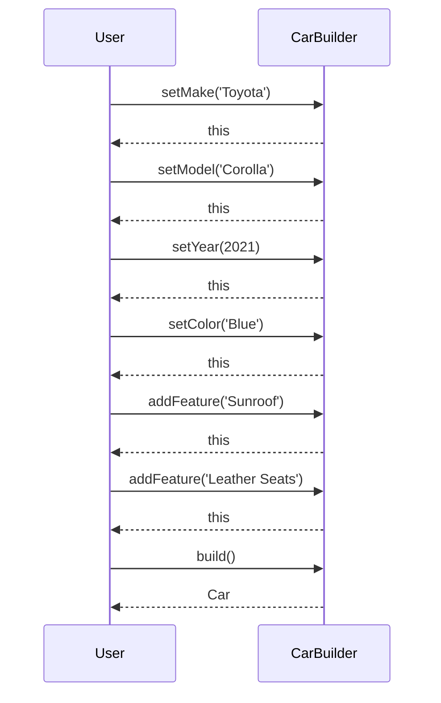

## 4.4.2 Fluent Interfaces

In the realm of software design, fluent interfaces stand out as a powerful technique to enhance code readability and usability. This approach is particularly effective when used in conjunction with the Builder Pattern, a creational design pattern that separates the construction of a complex object from its representation. In this section, we will delve into the concept of fluent interfaces, explore their relationship with the Builder Pattern, and provide detailed guidance on implementing them in TypeScript.

### Understanding Fluent Interfaces

A fluent interface is a method of designing object-oriented APIs that relies on method chaining to create more readable and expressive code. The term "fluent" refers to the smooth flow of method calls, akin to a natural language sentence. This design style is particularly useful in scenarios where a sequence of operations needs to be performed on an object, such as configuring a complex object or setting up a series of operations.

#### Key Characteristics of Fluent Interfaces

- **Method Chaining**: Each method in a fluent interface returns the object itself (`this`), allowing multiple method calls to be chained together in a single statement.
- **Improved Readability**: The chaining of methods creates a more natural and readable flow, making the code easier to understand.
- **Ease of Use**: By reducing the need for intermediate variables and simplifying the syntax, fluent interfaces make APIs more intuitive and user-friendly.

### Fluent Interfaces and the Builder Pattern

The Builder Pattern is a creational pattern that provides a way to construct complex objects step-by-step. It is particularly useful when an object requires numerous configurations or when the construction process involves multiple steps. Fluent interfaces complement the Builder Pattern by enhancing the readability and usability of the builder's API.

#### How Fluent Interfaces Enhance the Builder Pattern

- **Simplified Syntax**: Fluent interfaces allow builders to expose a clean and concise API, reducing boilerplate code and improving clarity.
- **Natural Flow**: The chaining of builder methods creates a natural progression of steps, mirroring the logical sequence of object construction.
- **Flexibility**: Users can easily customize the construction process by chaining different combinations of methods.

### Implementing Fluent Interfaces in TypeScript

To implement fluent interfaces in TypeScript, we need to ensure that each method in our API returns the current instance of the object. This allows for seamless method chaining. Let's explore a practical example to illustrate this concept.

#### Example: Building a Fluent Interface for a Car Builder

Consider a scenario where we need to build a `Car` object with various customizable options. We'll use a builder class with a fluent interface to achieve this.

```typescript
class Car {
  private make: string;
  private model: string;
  private year: number;
  private color: string;
  private features: string[];

  constructor() {
    this.features = [];
  }

  public setMake(make: string): this {
    this.make = make;
    return this;
  }

  public setModel(model: string): this {
    this.model = model;
    return this;
  }

  public setYear(year: number): this {
    this.year = year;
    return this;
  }

  public setColor(color: string): this {
    this.color = color;
    return this;
  }

  public addFeature(feature: string): this {
    this.features.push(feature);
    return this;
  }

  public build(): Car {
    return this;
  }
}

// Usage
const myCar = new Car()
  .setMake('Toyota')
  .setModel('Corolla')
  .setYear(2021)
  .setColor('Blue')
  .addFeature('Sunroof')
  .addFeature('Leather Seats')
  .build();

console.log(myCar);
```

In this example, each method in the `Car` class returns `this`, allowing us to chain method calls together. The `build()` method finalizes the construction process and returns the fully configured `Car` object.

#### Typing Considerations in TypeScript

When implementing fluent interfaces in TypeScript, it's important to ensure that method signatures are correctly typed. Each method should return the current instance type (`this`) to facilitate chaining. This can be achieved using the `this` type annotation, which refers to the type of the current instance.

### Best Practices for Designing Fluent APIs

To design effective fluent APIs, consider the following best practices:

- **Consistent Method Naming**: Use clear and descriptive method names that convey the action being performed. This enhances readability and makes the API more intuitive.
- **Parameter Defaults**: Provide sensible default values for method parameters to simplify usage and reduce the need for explicit configuration.
- **Logical Method Order**: Arrange methods in a logical sequence that mirrors the natural flow of operations. This makes the API easier to understand and use.
- **Error Handling**: Implement robust error handling to ensure that invalid method calls or configurations are gracefully managed.

### Visualizing Fluent Interfaces

To better understand the flow of method calls in a fluent interface, let's visualize the process using a sequence diagram.



This diagram illustrates the sequence of method calls in the `CarBuilder` class, highlighting the return of `this` at each step to enable chaining.

### Try It Yourself

To gain a deeper understanding of fluent interfaces, try modifying the `Car` builder example:

- Add a new method to set the `engineType` of the car.
- Implement a method to remove a feature from the `features` array.
- Experiment with different method orders and observe how the chaining affects the final object configuration.

### References and Further Reading

- [MDN Web Docs: Method Chaining](https://developer.mozilla.org/en-US/docs/Web/JavaScript/Guide/Working_with_Objects#method_chaining)
- [TypeScript Handbook: Classes](https://www.typescriptlang.org/docs/handbook/classes.html)
- [Fluent Interface Pattern](https://martinfowler.com/bliki/FluentInterface.html)

### Knowledge Check

To reinforce your understanding of fluent interfaces, consider the following questions:

- What are the key characteristics of a fluent interface?
- How does method chaining improve code readability?
- Why is it important for each method in a fluent interface to return `this`?
- What are some best practices for designing fluent APIs?

### Embrace the Journey

Remember, mastering fluent interfaces is just one step in your journey as a software engineer. As you continue to explore design patterns and refine your skills, you'll discover new ways to create elegant and efficient code. Keep experimenting, stay curious, and enjoy the process!

## Quiz Time!



### What is a fluent interface?

- [x] A design pattern that relies on method chaining for improved readability.
- [ ] A pattern that focuses on asynchronous programming.
- [ ] A method for optimizing database queries.
- [ ] A technique for managing state in applications.

> **Explanation:** A fluent interface is a design pattern that uses method chaining to create more readable and expressive code.

### How does method chaining enhance code readability?

- [x] By allowing multiple method calls to be combined into a single statement.
- [ ] By reducing the number of classes needed in a program.
- [ ] By eliminating the need for comments in code.
- [ ] By increasing the number of lines of code.

> **Explanation:** Method chaining enhances readability by allowing multiple method calls to be combined into a single, fluid statement, making the code easier to follow.

### What should each method in a fluent interface return?

- [x] The current instance of the object (`this`).
- [ ] A new instance of the object.
- [ ] A boolean indicating success or failure.
- [ ] A string describing the method's action.

> **Explanation:** Each method in a fluent interface should return the current instance (`this`) to enable chaining.

### Which design pattern is commonly associated with fluent interfaces?

- [x] Builder Pattern
- [ ] Singleton Pattern
- [ ] Observer Pattern
- [ ] Factory Pattern

> **Explanation:** Fluent interfaces are commonly associated with the Builder Pattern, as they enhance the readability and usability of the builder's API.

### What is a key benefit of using fluent interfaces?

- [x] Improved code readability and usability.
- [ ] Reduced memory usage.
- [ ] Faster execution times.
- [ ] Simplified error handling.

> **Explanation:** Fluent interfaces improve code readability and usability by creating a more natural and expressive flow of method calls.

### What is a best practice for designing fluent APIs?

- [x] Use clear and descriptive method names.
- [ ] Minimize the number of methods.
- [ ] Avoid using default parameter values.
- [ ] Return different types from each method.

> **Explanation:** Using clear and descriptive method names is a best practice for designing fluent APIs, as it enhances readability and intuitiveness.

### What is the purpose of the `build()` method in a builder with a fluent interface?

- [x] To finalize the construction process and return the fully configured object.
- [ ] To reset the builder to its initial state.
- [ ] To validate the object's configuration.
- [ ] To print the object's details to the console.

> **Explanation:** The `build()` method finalizes the construction process and returns the fully configured object.

### How can you modify the `Car` builder example to include an `engineType`?

- [x] Add a new method `setEngineType(engineType: string): this`.
- [ ] Add a new property `engineType` without a method.
- [ ] Modify the `setMake` method to include engine type.
- [ ] Use a separate class for engine type.

> **Explanation:** Adding a new method `setEngineType(engineType: string): this` allows you to include an `engineType` in the builder.

### What is a common use case for fluent interfaces?

- [x] Configuring complex objects with multiple options.
- [ ] Managing database connections.
- [ ] Handling asynchronous events.
- [ ] Implementing security protocols.

> **Explanation:** Fluent interfaces are commonly used for configuring complex objects with multiple options, as they provide a clear and concise API.

### True or False: Fluent interfaces are only useful in TypeScript.

- [ ] True
- [x] False

> **Explanation:** Fluent interfaces are not limited to TypeScript; they can be implemented in any object-oriented programming language to enhance code readability and usability.


