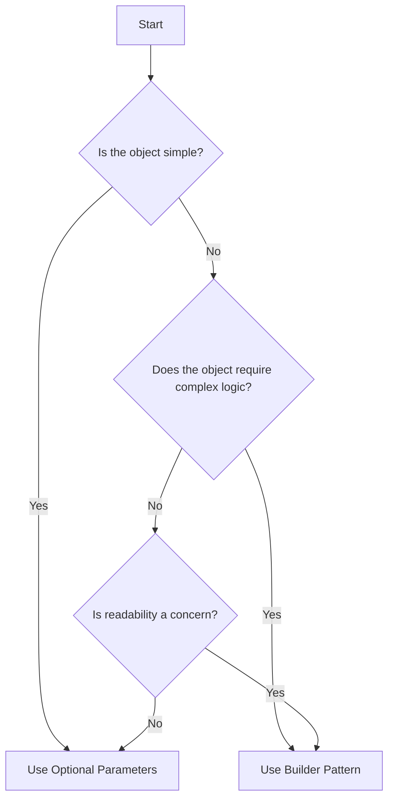

## 4.4.3 Use of Optional Parameters and Default Values

In this section, we delve into the use of optional parameters and default values in TypeScript, a powerful feature that can significantly simplify the process of object construction. By understanding how these features work, we can determine when they might be sufficient for object creation and when the Builder Pattern may still be necessary. Let's explore these concepts in detail.

### Understanding Optional Parameters and Default Values

TypeScript, a superset of JavaScript, introduces static typing and other features that enhance the language's robustness. Among these features are optional parameters and default values, which offer flexibility in function and method definitions.

#### Optional Parameters

Optional parameters allow us to define functions where some parameters are not mandatory. This is achieved by appending a question mark (`?`) to the parameter name in the function signature. When a parameter is optional, it can be omitted when the function is called.

Here's a simple example:

```typescript
function greet(name: string, greeting?: string): string {
    return `${greeting || 'Hello'}, ${name}!`;
}

console.log(greet('Alice')); // Output: Hello, Alice!
console.log(greet('Bob', 'Hi')); // Output: Hi, Bob!
```

In this example, the `greeting` parameter is optional. If it's not provided, the function defaults to using "Hello".

#### Default Values

Default values take the concept of optional parameters a step further by allowing us to specify a default value that will be used if no value is provided. This can simplify function calls by reducing the need for conditional logic inside the function.

Consider the following example:

```typescript
function greet(name: string, greeting: string = 'Hello'): string {
    return `${greeting}, ${name}!`;
}

console.log(greet('Alice')); // Output: Hello, Alice!
console.log(greet('Bob', 'Hi')); // Output: Hi, Bob!
```

Here, the `greeting` parameter has a default value of "Hello". If no greeting is provided, "Hello" is used automatically.

### Constructing Objects with Optional Parameters and Default Values

Using optional parameters and default values, we can construct objects in a more concise and readable manner. This approach is particularly useful for simple objects where the overhead of a Builder Pattern might be unnecessary.

#### Example: Creating a Simple Configuration Object

Let's consider a scenario where we need to create a configuration object for a web application. This object might include properties such as `theme`, `language`, and `showNotifications`.

```typescript
interface AppConfig {
    theme: string;
    language: string;
    showNotifications: boolean;
}

function createConfig(theme: string = 'light', language: string = 'en', showNotifications: boolean = true): AppConfig {
    return { theme, language, showNotifications };
}

const defaultConfig = createConfig();
console.log(defaultConfig); // Output: { theme: 'light', language: 'en', showNotifications: true }

const customConfig = createConfig('dark', 'fr', false);
console.log(customConfig); // Output: { theme: 'dark', language: 'fr', showNotifications: false }
```

In this example, the `createConfig` function uses default values for all parameters, allowing us to easily create a configuration object with default settings or customize it as needed.

### Limitations of Optional Parameters and Default Values

While optional parameters and default values can simplify object construction, they have limitations, especially when dealing with complex objects or configurations.

#### Complexity and Readability

As the number of parameters increases, the function signature can become unwieldy and difficult to read. This is particularly true if the parameters are of the same type, leading to potential confusion about the order in which they should be provided.

#### Lack of Flexibility

Optional parameters and default values work well for simple objects, but they lack the flexibility needed for more complex scenarios. For instance, if an object requires conditional logic during its construction or if the parameters need to be validated or transformed, a more sophisticated approach like the Builder Pattern may be necessary.

### Comparing Optional Parameters and the Builder Pattern

To determine when to use optional parameters and default values versus the Builder Pattern, we must consider the complexity of the object being constructed and the clarity of the resulting code.

#### When to Use Optional Parameters and Default Values

- **Simple Objects**: When constructing simple objects with a limited number of properties, optional parameters and default values can provide a clean and efficient solution.
- **Readability**: If the function signature remains readable and the parameters are intuitive, this approach is preferable.
- **Minimal Logic**: When the object construction does not require complex logic or validation, optional parameters and default values are sufficient.

#### When to Use the Builder Pattern

- **Complex Objects**: For objects with many properties or where the construction process involves complex logic, the Builder Pattern offers a more structured approach.
- **Clarity and Maintainability**: The Builder Pattern can improve code clarity by separating the construction logic from the object itself, making the code easier to maintain.
- **Fluent Interface**: The Builder Pattern often employs a fluent interface, allowing for method chaining and improving the readability of the object construction process.

### Practical Example: Builder Pattern vs. Optional Parameters

Let's compare the two approaches with a practical example. Suppose we need to create a `User` object with properties like `name`, `email`, `age`, and `address`.

#### Using Optional Parameters and Default Values

```typescript
interface User {
    name: string;
    email: string;
    age?: number;
    address?: string;
}

function createUser(name: string, email: string, age?: number, address?: string): User {
    return { name, email, age, address };
}

const user1 = createUser('Alice', 'alice@example.com');
const user2 = createUser('Bob', 'bob@example.com', 30, '123 Main St');
```

This approach works well for straightforward scenarios, but as the number of properties grows, it can become cumbersome.

#### Using the Builder Pattern

```typescript
class UserBuilder {
    private name: string;
    private email: string;
    private age?: number;
    private address?: string;

    constructor(name: string, email: string) {
        this.name = name;
        this.email = email;
    }

    setAge(age: number): UserBuilder {
        this.age = age;
        return this;
    }

    setAddress(address: string): UserBuilder {
        this.address = address;
        return this;
    }

    build(): User {
        return {
            name: this.name,
            email: this.email,
            age: this.age,
            address: this.address
        };
    }
}

const user3 = new UserBuilder('Charlie', 'charlie@example.com').setAge(25).setAddress('456 Elm St').build();
```

The Builder Pattern provides a more flexible and readable way to construct complex objects, especially when optional parameters are insufficient.

### Visualizing the Decision Process

To help visualize when to use optional parameters and default values versus the Builder Pattern, consider the following decision flowchart:



This flowchart guides us through the decision-making process, helping us choose the appropriate approach based on object complexity and readability.

### Try It Yourself

To solidify your understanding of optional parameters and default values, try modifying the examples provided:

1. **Add More Parameters**: Extend the `createUser` function to include additional optional parameters, such as `phoneNumber` or `occupation`.
2. **Implement Validation**: Introduce validation logic within the `createUser` function to ensure that the `email` parameter is a valid email address.
3. **Explore the Builder Pattern**: Create a new builder class for a different object, such as a `Product` with properties like `name`, `price`, `category`, and `stock`.

### Knowledge Check

Before we conclude, let's review some key points:

- **Optional Parameters**: These allow certain parameters to be omitted when calling a function, enhancing flexibility.
- **Default Values**: By specifying default values, we can simplify function calls and reduce conditional logic.
- **Builder Pattern**: This pattern is ideal for constructing complex objects, offering clarity and flexibility through method chaining.

### Conclusion

Optional parameters and default values in TypeScript provide a powerful toolset for simplifying object construction. While they are well-suited for simple objects, the Builder Pattern remains invaluable for more complex scenarios. By understanding the strengths and limitations of each approach, we can make informed decisions that enhance code clarity and maintainability.

## Quiz Time!



### What is an optional parameter in TypeScript?

- [x] A parameter that can be omitted when calling a function
- [ ] A parameter that must be provided when calling a function
- [ ] A parameter that has a default value
- [ ] A parameter that is always required

> **Explanation:** An optional parameter is one that can be omitted when calling a function, indicated by a question mark (`?`) in the function signature.

### How do you specify a default value for a parameter in TypeScript?

- [x] By assigning a value in the function signature
- [ ] By using a question mark (`?`) in the function signature
- [ ] By declaring the parameter as `const`
- [ ] By using the `default` keyword

> **Explanation:** Default values are specified by assigning a value in the function signature, which will be used if no value is provided.

### What is a limitation of using optional parameters for object construction?

- [x] Complexity and readability issues with many parameters
- [ ] Inability to omit any parameters
- [ ] Lack of support for default values
- [ ] Increased memory usage

> **Explanation:** As the number of parameters increases, the function signature can become complex and difficult to read, especially if parameters are of the same type.

### When is it appropriate to use the Builder Pattern?

- [x] For complex objects requiring conditional logic
- [ ] For simple objects with few properties
- [ ] When default values are sufficient
- [ ] When parameters are always required

> **Explanation:** The Builder Pattern is suitable for complex objects that require conditional logic or validation during construction.

### What is a benefit of using default values in TypeScript?

- [x] Simplifies function calls by reducing conditional logic
- [ ] Requires all parameters to be provided
- [ ] Increases the complexity of the function signature
- [ ] Forces the use of the Builder Pattern

> **Explanation:** Default values simplify function calls by providing a fallback value, reducing the need for conditional logic inside the function.

### How can the Builder Pattern improve code clarity?

- [x] By separating construction logic from the object itself
- [ ] By combining all logic into a single function
- [ ] By using default values for all parameters
- [ ] By eliminating the need for optional parameters

> **Explanation:** The Builder Pattern separates construction logic from the object, making the code easier to maintain and understand.

### What is a key difference between optional parameters and default values?

- [x] Optional parameters can be omitted, while default values provide a fallback
- [ ] Both must be provided when calling a function
- [ ] Default values require the use of the Builder Pattern
- [ ] Optional parameters always have a default value

> **Explanation:** Optional parameters can be omitted, while default values provide a fallback if no value is provided.

### Which approach is more suitable for constructing simple objects?

- [x] Optional parameters and default values
- [ ] Builder Pattern
- [ ] Factory Method
- [ ] Abstract Factory

> **Explanation:** Optional parameters and default values are more suitable for constructing simple objects with a limited number of properties.

### What is a potential drawback of using the Builder Pattern?

- [x] Increased complexity for simple objects
- [ ] Lack of flexibility for complex objects
- [ ] Inability to use method chaining
- [ ] Requirement to provide all parameters

> **Explanation:** The Builder Pattern can introduce unnecessary complexity for simple objects that do not require its flexibility.

### True or False: Default values in TypeScript can be used to simplify object construction.

- [x] True
- [ ] False

> **Explanation:** Default values can simplify object construction by reducing the need for conditional logic and providing fallback values.


