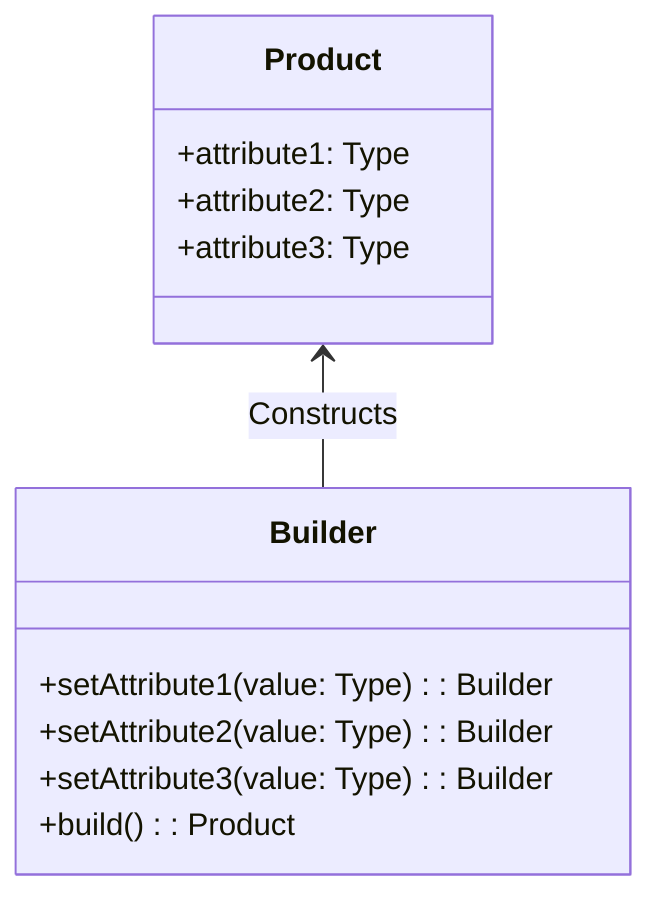

## 4.4.4 Use Cases and Examples

The Builder Pattern is a creational design pattern that provides a flexible solution to constructing complex objects. It is particularly useful when dealing with objects that require numerous parameters or configurations, as it allows for step-by-step construction. In this section, we will explore real-world scenarios where the Builder Pattern is beneficial, such as constructing complex configuration objects, building customizable UI components, and creating entities in game development. We will also discuss the advantages of using the Builder Pattern in terms of code readability, maintenance, and scalability.

### Constructing Complex Configuration Objects

In modern software development, initializing frameworks or libraries often involves configuring a multitude of settings. These configurations can become cumbersome if managed through simple constructors or static factory methods, especially when dealing with optional parameters and default values.

#### Example: Database Connection Configuration

Consider a scenario where you need to configure a database connection. The configuration might include parameters such as host, port, username, password, database name, connection pool size, and timeout settings. Using the Builder Pattern, you can construct this configuration object in a clear and concise manner.

```typescript
// DatabaseConfig.ts
class DatabaseConfig {
    private host: string;
    private port: number;
    private username: string;
    private password: string;
    private database: string;
    private poolSize: number;
    private timeout: number;

    private constructor(builder: DatabaseConfigBuilder) {
        this.host = builder.host;
        this.port = builder.port;
        this.username = builder.username;
        this.password = builder.password;
        this.database = builder.database;
        this.poolSize = builder.poolSize;
        this.timeout = builder.timeout;
    }

    public static get Builder() {
        return new DatabaseConfigBuilder();
    }
}

// DatabaseConfigBuilder.ts
class DatabaseConfigBuilder {
    public host: string = 'localhost';
    public port: number = 5432;
    public username: string = 'root';
    public password: string = '';
    public database: string = 'test';
    public poolSize: number = 10;
    public timeout: number = 3000;

    public setHost(host: string): DatabaseConfigBuilder {
        this.host = host;
        return this;
    }

    public setPort(port: number): DatabaseConfigBuilder {
        this.port = port;
        return this;
    }

    public setUsername(username: string): DatabaseConfigBuilder {
        this.username = username;
        return this;
    }

    public setPassword(password: string): DatabaseConfigBuilder {
        this.password = password;
        return this;
    }

    public setDatabase(database: string): DatabaseConfigBuilder {
        this.database = database;
        return this;
    }

    public setPoolSize(poolSize: number): DatabaseConfigBuilder {
        this.poolSize = poolSize;
        return this;
    }

    public setTimeout(timeout: number): DatabaseConfigBuilder {
        this.timeout = timeout;
        return this;
    }

    public build(): DatabaseConfig {
        return new DatabaseConfig(this);
    }
}

// Usage
const dbConfig = DatabaseConfig.Builder
    .setHost('db.example.com')
    .setPort(3306)
    .setUsername('admin')
    .setPassword('securepassword')
    .setDatabase('production')
    .setPoolSize(20)
    .setTimeout(5000)
    .build();
```

**Benefits**: The Builder Pattern allows for a flexible and readable way to construct complex configuration objects. It avoids the need for constructors with numerous parameters and provides a clear API for setting optional values.

### Building Customizable UI Components

In UI development, components often need to support a wide range of customization options. The Builder Pattern can be used to construct these components in a modular and maintainable way.

#### Example: Customizable Button Component

Imagine creating a button component that can be customized with various properties such as size, color, label, icon, and event handlers.

```typescript
// Button.ts
class Button {
    private size: string;
    private color: string;
    private label: string;
    private icon?: string;
    private onClick?: () => void;

    private constructor(builder: ButtonBuilder) {
        this.size = builder.size;
        this.color = builder.color;
        this.label = builder.label;
        this.icon = builder.icon;
        this.onClick = builder.onClick;
    }

    public static get Builder() {
        return new ButtonBuilder();
    }

    public render(): string {
        // Render logic for the button
        return `<button style="color: ${this.color}; font-size: ${this.size};">${this.icon ? `<i class="${this.icon}"></i>` : ''} ${this.label}</button>`;
    }
}

// ButtonBuilder.ts
class ButtonBuilder {
    public size: string = 'medium';
    public color: string = 'blue';
    public label: string = 'Click Me';
    public icon?: string;
    public onClick?: () => void;

    public setSize(size: string): ButtonBuilder {
        this.size = size;
        return this;
    }

    public setColor(color: string): ButtonBuilder {
        this.color = color;
        return this;
    }

    public setLabel(label: string): ButtonBuilder {
        this.label = label;
        return this;
    }

    public setIcon(icon: string): ButtonBuilder {
        this.icon = icon;
        return this;
    }

    public setOnClick(onClick: () => void): ButtonBuilder {
        this.onClick = onClick;
        return this;
    }

    public build(): Button {
        return new Button(this);
    }
}

// Usage
const button = Button.Builder
    .setSize('large')
    .setColor('red')
    .setLabel('Submit')
    .setIcon('fa-check')
    .setOnClick(() => console.log('Button clicked!'))
    .build();

console.log(button.render());
```

**Benefits**: The Builder Pattern enables the construction of UI components with a clear and fluent API, enhancing code readability and maintainability. It allows developers to easily add or modify component features without altering existing code.

### Creating Entities in Game Development

Game development often involves creating entities with various attributes and behaviors. The Builder Pattern can simplify the creation process by allowing developers to construct entities step-by-step.

#### Example: Game Character Creation

Consider a game where characters have attributes such as name, health, strength, agility, and special abilities. Using the Builder Pattern, you can create characters with different configurations.

```typescript
// Character.ts
class Character {
    private name: string;
    private health: number;
    private strength: number;
    private agility: number;
    private abilities: string[];

    private constructor(builder: CharacterBuilder) {
        this.name = builder.name;
        this.health = builder.health;
        this.strength = builder.strength;
        this.agility = builder.agility;
        this.abilities = builder.abilities;
    }

    public static get Builder() {
        return new CharacterBuilder();
    }

    public displayStats(): void {
        console.log(`Name: ${this.name}, Health: ${this.health}, Strength: ${this.strength}, Agility: ${this.agility}, Abilities: ${this.abilities.join(', ')}`);
    }
}

// CharacterBuilder.ts
class CharacterBuilder {
    public name: string = 'Unnamed';
    public health: number = 100;
    public strength: number = 10;
    public agility: number = 10;
    public abilities: string[] = [];

    public setName(name: string): CharacterBuilder {
        this.name = name;
        return this;
    }

    public setHealth(health: number): CharacterBuilder {
        this.health = health;
        return this;
    }

    public setStrength(strength: number): CharacterBuilder {
        this.strength = strength;
        return this;
    }

    public setAgility(agility: number): CharacterBuilder {
        this.agility = agility;
        return this;
    }

    public addAbility(ability: string): CharacterBuilder {
        this.abilities.push(ability);
        return this;
    }

    public build(): Character {
        return new Character(this);
    }
}

// Usage
const warrior = Character.Builder
    .setName('Warrior')
    .setHealth(150)
    .setStrength(20)
    .setAgility(15)
    .addAbility('Sword Mastery')
    .addAbility('Shield Block')
    .build();

warrior.displayStats();
```

**Benefits**: The Builder Pattern provides a structured approach to creating complex game entities. It allows for easy customization and extension of character attributes and abilities, making the codebase more maintainable and scalable.

### Encouragement to Use the Builder Pattern

When faced with complex object creation that cannot be easily managed with simple constructors or factories, consider using the Builder Pattern. It offers a flexible and readable way to construct objects, especially when dealing with numerous optional parameters or configurations. By using the Builder Pattern, you can improve code readability, maintainability, and scalability, making your software more robust and easier to manage.

### Visualizing the Builder Pattern

To better understand the Builder Pattern, let's visualize the process of constructing a complex object using a class diagram.



**Diagram Explanation**: The diagram illustrates the relationship between the `Builder` and the `Product` class. The `Builder` class provides methods to set attributes of the `Product` and a `build()` method to construct the final object. This separation of construction logic from the product itself is a key aspect of the Builder Pattern.

### Try It Yourself

To deepen your understanding of the Builder Pattern, try modifying the code examples provided. Here are some suggestions:

- **Database Configuration**: Add additional configuration options such as SSL support or connection retries.
- **UI Component**: Create a new UI component, such as a customizable card or modal, using the Builder Pattern.
- **Game Character**: Introduce new attributes or abilities, such as magic power or stealth, and see how the Builder Pattern accommodates these changes.

### References and Links

For further reading on the Builder Pattern and its applications, consider exploring the following resources:

- [MDN Web Docs: Design Patterns](https://developer.mozilla.org/en-US/docs/Web/JavaScript/Guide/Design_Patterns)
- [Refactoring Guru: Builder Pattern](https://refactoring.guru/design-patterns/builder)
- [W3Schools: TypeScript Classes](https://www.w3schools.com/typescript/typescript_classes.php)

### Knowledge Check

Before moving on, reflect on the following questions to reinforce your understanding of the Builder Pattern:

- How does the Builder Pattern improve code readability and maintainability?
- In what scenarios is the Builder Pattern particularly useful?
- How does the Builder Pattern differ from simple constructors or factory methods?

Remember, this is just the beginning. As you progress, you'll build more complex and interactive applications using the Builder Pattern. Keep experimenting, stay curious, and enjoy the journey!

## Quiz Time!



### What is the primary purpose of the Builder Pattern?

- [x] To construct complex objects step-by-step
- [ ] To manage object lifecycles
- [ ] To provide a global point of access to an object
- [ ] To encapsulate a request as an object

> **Explanation:** The Builder Pattern is designed to construct complex objects step-by-step, allowing for more control over the construction process.

### Which of the following is a benefit of using the Builder Pattern?

- [x] Improved code readability
- [ ] Reduced memory usage
- [ ] Faster execution time
- [ ] Simplified inheritance hierarchies

> **Explanation:** The Builder Pattern improves code readability by providing a clear and fluent API for constructing objects.

### In the provided database configuration example, what does the `build()` method do?

- [x] Constructs and returns the final `DatabaseConfig` object
- [ ] Initializes the database connection
- [ ] Validates the configuration parameters
- [ ] Closes the database connection

> **Explanation:** The `build()` method constructs and returns the final `DatabaseConfig` object based on the parameters set in the builder.

### How does the Builder Pattern handle optional parameters?

- [x] By providing methods to set each parameter individually
- [ ] By using default values in the constructor
- [ ] By requiring all parameters to be passed in a specific order
- [ ] By using a configuration file

> **Explanation:** The Builder Pattern provides methods to set each parameter individually, allowing for optional parameters to be set as needed.

### What is a common use case for the Builder Pattern in UI development?

- [x] Constructing customizable UI components
- [ ] Managing event listeners
- [ ] Handling user input validation
- [ ] Optimizing rendering performance

> **Explanation:** The Builder Pattern is commonly used in UI development to construct customizable UI components with various options.

### In game development, what advantage does the Builder Pattern offer when creating entities?

- [x] Easy customization and extension of attributes
- [ ] Improved graphics rendering
- [ ] Faster game loading times
- [ ] Simplified AI behavior

> **Explanation:** The Builder Pattern allows for easy customization and extension of entity attributes, making it ideal for creating complex game characters.

### What is the role of the `Builder` class in the Builder Pattern?

- [x] To provide methods for setting attributes and constructing the final object
- [ ] To manage the lifecycle of the constructed object
- [ ] To enforce singleton behavior
- [ ] To handle database transactions

> **Explanation:** The `Builder` class provides methods for setting attributes and constructing the final object, separating construction logic from the product itself.

### How does the Builder Pattern differ from the Factory Method Pattern?

- [x] The Builder Pattern constructs objects step-by-step, while the Factory Method Pattern creates objects in one step
- [ ] The Builder Pattern is used for creating singletons, while the Factory Method Pattern is not
- [ ] The Builder Pattern requires inheritance, while the Factory Method Pattern does not
- [ ] The Builder Pattern is only applicable to UI components

> **Explanation:** The Builder Pattern constructs objects step-by-step, allowing for more control over the construction process compared to the Factory Method Pattern.

### What is a potential drawback of using the Builder Pattern?

- [x] Increased complexity due to additional classes
- [ ] Reduced code readability
- [ ] Limited flexibility in object construction
- [ ] Difficulty in managing object lifecycles

> **Explanation:** The Builder Pattern can introduce increased complexity due to the additional classes required for the builder.

### True or False: The Builder Pattern is only useful for constructing objects with a large number of parameters.

- [ ] True
- [x] False

> **Explanation:** While the Builder Pattern is particularly useful for objects with a large number of parameters, it can also be beneficial for any complex object construction that requires flexibility and readability.




