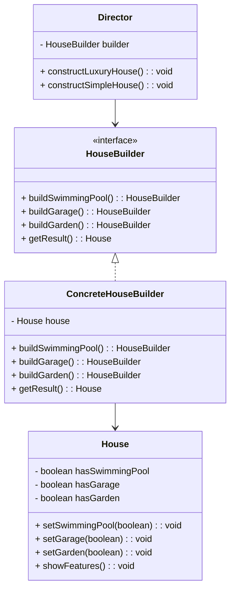

## 4.4 Builder Pattern

In the realm of software engineering, constructing complex objects with numerous configurations can become cumbersome and error-prone. The Builder Pattern emerges as a solution to this problem, offering a structured approach to object creation that enhances code readability and maintainability. In this section, we will delve into the Builder Pattern, its components, and how to implement it in TypeScript.

### Understanding the Builder Pattern

The Builder Pattern is a creational design pattern that separates the construction of a complex object from its representation. This separation allows the same construction process to create different representations of the object. The primary intent of the Builder Pattern is to provide a flexible solution to constructing complex objects step-by-step, especially when these objects require numerous optional parameters or configurations.

#### Problem Addressed by the Builder Pattern

When dealing with objects that have numerous attributes, especially optional ones, the traditional approach of using constructors with multiple parameters can lead to code that is difficult to read and maintain. This is often referred to as the "telescoping constructor" anti-pattern. The Builder Pattern addresses this issue by allowing the construction of an object to be controlled through a series of discrete steps, each of which can be customized.

### Key Participants in the Builder Pattern

To effectively implement the Builder Pattern, it's essential to understand its key participants:

1. **Builder**: This is an interface or abstract class that defines the construction steps for creating a product. It specifies the methods for building the parts of the product.

2. **ConcreteBuilder**: This class implements the Builder interface and provides specific implementations for the construction steps. It maintains the representation of the product being built.

3. **Director**: This class is responsible for constructing the product using the Builder interface. It orchestrates the building process by invoking the appropriate construction steps on the Builder.

4. **Product**: This is the complex object that is being built. It is the final result of the construction process.

### Implementing the Builder Pattern in TypeScript

Let's explore how to implement the Builder Pattern in TypeScript through a practical example. We'll build a `House` object with various optional features such as a swimming pool, garage, and garden.

#### Step 1: Define the Product

First, we define the `House` class, which represents the complex object being built.

```typescript
class House {
    private hasSwimmingPool: boolean = false;
    private hasGarage: boolean = false;
    private hasGarden: boolean = false;

    setSwimmingPool(hasPool: boolean): void {
        this.hasSwimmingPool = hasPool;
    }

    setGarage(hasGarage: boolean): void {
        this.hasGarage = hasGarage;
    }

    setGarden(hasGarden: boolean): void {
        this.hasGarden = hasGarden;
    }

    showFeatures(): void {
        console.log(`House Features: 
            Swimming Pool: ${this.hasSwimmingPool}, 
            Garage: ${this.hasGarage}, 
            Garden: ${this.hasGarden}`);
    }
}
```

#### Step 2: Create the Builder Interface

Next, we define the `HouseBuilder` interface, which outlines the construction steps.

```typescript
interface HouseBuilder {
    buildSwimmingPool(): HouseBuilder;
    buildGarage(): HouseBuilder;
    buildGarden(): HouseBuilder;
    getResult(): House;
}
```

#### Step 3: Implement the ConcreteBuilder

We then implement the `ConcreteHouseBuilder` class, which provides specific implementations for the construction steps.

```typescript
class ConcreteHouseBuilder implements HouseBuilder {
    private house: House;

    constructor() {
        this.house = new House();
    }

    buildSwimmingPool(): HouseBuilder {
        this.house.setSwimmingPool(true);
        return this;
    }

    buildGarage(): HouseBuilder {
        this.house.setGarage(true);
        return this;
    }

    buildGarden(): HouseBuilder {
        this.house.setGarden(true);
        return this;
    }

    getResult(): House {
        return this.house;
    }
}
```

#### Step 4: Implement the Director

Finally, we implement the `Director` class, which constructs the `House` using the `HouseBuilder` interface.

```typescript
class Director {
    private builder: HouseBuilder;

    constructor(builder: HouseBuilder) {
        this.builder = builder;
    }

    constructLuxuryHouse(): void {
        this.builder.buildSwimmingPool().buildGarage().buildGarden();
    }

    constructSimpleHouse(): void {
        this.builder.buildGarage();
    }
}
```

### Visualizing the Builder Pattern

To better understand the relationships between the components of the Builder Pattern, let's visualize it using a class diagram.



### Promoting Step-by-Step Construction

The Builder Pattern promotes step-by-step construction, allowing developers to create complex objects in a controlled manner. This approach improves code readability by clearly defining each construction step and its purpose. It also enhances maintainability, as changes to the construction process can be made in the builder without affecting the client code.

### Try It Yourself

To solidify your understanding of the Builder Pattern, try modifying the code examples above. For instance, you could add new features to the `House` class, such as a `fireplace` or `solar panels`, and update the `ConcreteHouseBuilder` to include methods for these features. Experiment with creating different types of houses by altering the `Director` class.

### Benefits of the Builder Pattern

The Builder Pattern offers several benefits:

- **Flexibility**: It allows for the construction of complex objects with varying configurations.
- **Readability**: By separating the construction process into discrete steps, the code becomes more readable and easier to understand.
- **Maintainability**: Changes to the construction process can be made in the builder without affecting the client code.
- **Reusability**: The same builder can be used to create different representations of the product.

### Knowledge Check

Before we conclude, let's pose a few questions to test your understanding of the Builder Pattern:

- What problem does the Builder Pattern solve?
- How does the Builder Pattern improve code readability and maintainability?
- What are the key participants in the Builder Pattern?

### Conclusion

The Builder Pattern is a powerful tool for constructing complex objects in a flexible and maintainable manner. By separating the construction process from the representation, it allows developers to create objects with varying configurations without sacrificing readability or maintainability. As you continue your journey in software development, consider incorporating the Builder Pattern into your toolkit to tackle complex object construction challenges.

### Further Reading

For more information on the Builder Pattern and other design patterns, consider exploring the following resources:

- [Design Patterns: Elements of Reusable Object-Oriented Software](https://en.wikipedia.org/wiki/Design_Patterns)
- [MDN Web Docs on Design Patterns](https://developer.mozilla.org/en-US/docs/Web/JavaScript/Guide/Design_Patterns)

## Quiz Time!



### What is the primary intent of the Builder Pattern?

- [x] To separate the construction of a complex object from its representation
- [ ] To provide a global point of access to a single instance
- [ ] To allow incompatible interfaces to work together
- [ ] To define a family of algorithms and make them interchangeable

> **Explanation:** The Builder Pattern's primary intent is to separate the construction of a complex object from its representation, allowing the same construction process to create different representations.

### Which of the following is NOT a participant in the Builder Pattern?

- [ ] Builder
- [ ] ConcreteBuilder
- [ ] Director
- [x] Adapter

> **Explanation:** The Adapter is not a participant in the Builder Pattern. The key participants are Builder, ConcreteBuilder, Director, and Product.

### How does the Builder Pattern improve code readability?

- [x] By separating the construction process into discrete steps
- [ ] By using inheritance to share code
- [ ] By encapsulating object creation in a single method
- [ ] By using a single constructor with multiple parameters

> **Explanation:** The Builder Pattern improves code readability by separating the construction process into discrete steps, making it easier to understand and maintain.

### What is the role of the Director in the Builder Pattern?

- [ ] To define the construction steps
- [x] To construct the product using the Builder interface
- [ ] To implement the construction steps
- [ ] To represent the complex object being built

> **Explanation:** The Director's role is to construct the product using the Builder interface, orchestrating the building process by invoking the appropriate construction steps.

### True or False: The Builder Pattern is useful for constructing objects with numerous optional parameters.

- [x] True
- [ ] False

> **Explanation:** True. The Builder Pattern is particularly useful for constructing objects with numerous optional parameters or configurations.

### What does the ConcreteBuilder do in the Builder Pattern?

- [ ] It defines the construction steps
- [x] It implements the construction steps
- [ ] It constructs the product using the Builder interface
- [ ] It represents the complex object being built

> **Explanation:** The ConcreteBuilder implements the construction steps defined by the Builder interface and maintains the representation of the product being built.

### Which method in the Builder interface returns the final product?

- [ ] build()
- [ ] construct()
- [x] getResult()
- [ ] create()

> **Explanation:** The `getResult()` method in the Builder interface returns the final product after the construction process is complete.

### What is a common problem that the Builder Pattern addresses?

- [x] Telescoping constructor anti-pattern
- [ ] Overuse of inheritance
- [ ] Lack of encapsulation
- [ ] Poor performance due to object creation

> **Explanation:** The Builder Pattern addresses the telescoping constructor anti-pattern, which occurs when constructors with multiple parameters become difficult to read and maintain.

### In the Builder Pattern, what is the Product?

- [ ] The interface defining construction steps
- [ ] The class implementing the construction steps
- [ ] The class orchestrating the building process
- [x] The complex object being built

> **Explanation:** In the Builder Pattern, the Product is the complex object being built as a result of the construction process.

### Which of the following is a benefit of the Builder Pattern?

- [x] Flexibility in constructing complex objects
- [ ] Reducing memory usage
- [ ] Simplifying interface design
- [ ] Providing a global point of access

> **Explanation:** The Builder Pattern provides flexibility in constructing complex objects with varying configurations, improving code readability and maintainability.


