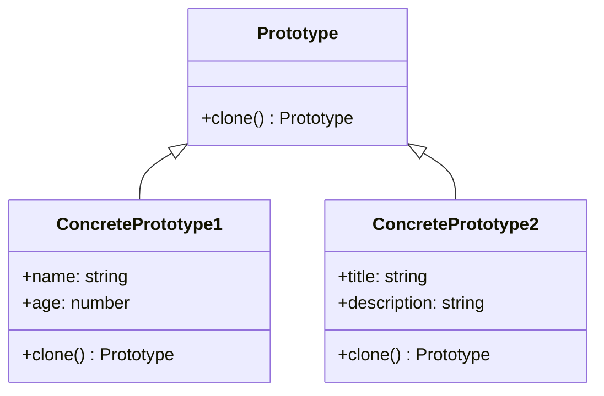

## 4.5.1 Implementing Prototype in TypeScript

The Prototype Pattern is a creational design pattern that allows you to create new objects by copying an existing object, known as the prototype. This pattern is particularly useful when the cost of creating a new instance of a class is more expensive than copying an existing instance. In this section, we will explore how to implement the Prototype Pattern in TypeScript, leveraging object cloning techniques and the spread operator.

### Understanding the Prototype Pattern

The Prototype Pattern is based on the concept of cloning. Instead of instantiating a new object directly, you clone an existing object. This approach can be beneficial in scenarios where object creation is costly, or when you want to avoid the complexities of constructors.

#### Key Concepts

- **Prototype Interface**: Defines a method for cloning itself.
- **Concrete Prototype**: Implements the cloning method to create a copy of itself.
- **Client**: Uses the prototype to create new objects.

### Implementing the Prototype Interface

Let's start by defining a `Prototype` interface with a `clone` method. This method will be responsible for creating a copy of the object.

```typescript
interface Prototype {
  clone(): Prototype;
}
```

The `clone` method returns a new instance of the `Prototype`. This interface will be implemented by concrete classes that need to provide their own cloning logic.

### Creating Concrete Prototype Classes

Concrete prototypes are classes that implement the `Prototype` interface. Each concrete prototype must provide its own implementation of the `clone` method.

```typescript
class ConcretePrototype1 implements Prototype {
  constructor(public name: string, public age: number) {}

  clone(): Prototype {
    return new ConcretePrototype1(this.name, this.age);
  }
}

class ConcretePrototype2 implements Prototype {
  constructor(public title: string, public description: string) {}

  clone(): Prototype {
    return new ConcretePrototype2(this.title, this.description);
  }
}
```

In these examples, `ConcretePrototype1` and `ConcretePrototype2` each implement the `clone` method, which returns a new instance of the respective class with the same properties.

### Using TypeScript's Object Spread Syntax for Shallow Copies

TypeScript provides a convenient way to create shallow copies of objects using the spread operator `{ ...obj }`. This operator copies all enumerable properties from the source object to a new object.

```typescript
class ShallowCopyPrototype implements Prototype {
  constructor(public data: { [key: string]: any }) {}

  clone(): Prototype {
    return new ShallowCopyPrototype({ ...this.data });
  }
}
```

In this example, the `ShallowCopyPrototype` class uses the spread operator to create a shallow copy of its `data` property. This is suitable for objects with primitive types or flat structures.

### Handling Nested Properties and Methods

When dealing with objects that have nested properties or methods, a shallow copy may not suffice. In such cases, you need to implement custom cloning logic to ensure that nested objects are also cloned.

```typescript
class DeepCopyPrototype implements Prototype {
  constructor(public data: { [key: string]: any }) {}

  clone(): Prototype {
    const clonedData = JSON.parse(JSON.stringify(this.data));
    return new DeepCopyPrototype(clonedData);
  }
}
```

Here, we use `JSON.parse(JSON.stringify(this.data))` to create a deep copy of the `data` object. This approach works well for simple objects but may not handle functions or non-serializable properties.

### Custom Cloning Logic for Complex Objects

For complex objects that contain methods, functions, or non-serializable properties, you need to implement custom cloning logic. This involves manually copying each property and ensuring that methods are correctly bound.

```typescript
class ComplexPrototype implements Prototype {
  constructor(public data: { [key: string]: any }, public method: () => void) {}

  clone(): Prototype {
    const clonedData = { ...this.data };
    const clonedMethod = this.method.bind(this);
    return new ComplexPrototype(clonedData, clonedMethod);
  }
}
```

In this example, the `ComplexPrototype` class manually clones its `data` property and binds its `method` to ensure that the cloned object behaves as expected.

### TypeScript-Specific Features and Considerations

TypeScript offers several features that can aid in implementing the Prototype Pattern:

- **Utility Types**: Use utility types like `Readonly` to create immutable clones.
- **Type Guards**: Implement type guards to ensure that cloned objects meet specific criteria.
- **JSON Serialization**: Use JSON serialization for deep copying simple objects, but be aware of its limitations.

### Try It Yourself

To better understand the Prototype Pattern, try modifying the code examples:

- Add new properties to the `ConcretePrototype` classes and update the `clone` method accordingly.
- Experiment with different cloning techniques, such as using utility libraries for deep copying.
- Implement a prototype registry that stores and retrieves prototypes for cloning.

### Visualizing the Prototype Pattern

Below is a class diagram illustrating the relationships between the `Prototype`, `ConcretePrototype`, and `Client`.



This diagram shows how the `ConcretePrototype1` and `ConcretePrototype2` classes implement the `Prototype` interface, providing their own cloning logic.

### References and Links

For further reading on the Prototype Pattern and TypeScript, consider the following resources:

- [MDN Web Docs: Object Cloning](https://developer.mozilla.org/en-US/docs/Web/JavaScript/Guide/Working_with_Objects#cloning_an_object)
- [TypeScript Handbook](https://www.typescriptlang.org/docs/handbook/intro.html)
- [JavaScript Design Patterns](https://www.patterns.dev/posts/prototype-pattern/)

### Knowledge Check

To reinforce your understanding of the Prototype Pattern, consider the following questions:

1. What is the primary purpose of the Prototype Pattern?
2. How does the spread operator differ from JSON serialization in cloning objects?
3. Why might you need custom cloning logic for certain objects?
4. What are some limitations of using JSON serialization for deep copying?

### Embrace the Journey

Remember, mastering design patterns is a journey. As you explore the Prototype Pattern, consider how it can be applied to your projects. Experiment with different cloning techniques and discover the best approach for your needs. Keep learning, stay curious, and enjoy the process!

## Quiz Time!



### What is the primary purpose of the Prototype Pattern?

- [x] To create new objects by copying existing ones.
- [ ] To define a family of algorithms.
- [ ] To separate the construction of a complex object from its representation.
- [ ] To provide a simplified interface to a complex subsystem.

> **Explanation:** The Prototype Pattern is used to create new objects by copying existing ones, which can be more efficient than creating new instances from scratch.

### Which method is used to create a deep copy of an object in TypeScript?

- [ ] Using the spread operator `{ ...obj }`.
- [ ] Using `Object.assign()`.
- [x] Using `JSON.parse(JSON.stringify(obj))`.
- [ ] Using `Object.create()`.

> **Explanation:** `JSON.parse(JSON.stringify(obj))` is a common method for creating deep copies of objects, although it has limitations with non-serializable properties.

### Why might you need custom cloning logic for certain objects?

- [x] Because some objects contain methods or non-serializable properties.
- [ ] Because shallow copies are always sufficient.
- [ ] Because JSON serialization is always the best option.
- [ ] Because TypeScript does not support cloning.

> **Explanation:** Custom cloning logic is necessary for objects with methods or non-serializable properties, as standard cloning techniques may not handle these correctly.

### What is a limitation of using JSON serialization for deep copying?

- [x] It cannot handle functions or non-serializable properties.
- [ ] It is the fastest method for cloning.
- [ ] It always creates shallow copies.
- [ ] It is specific to TypeScript.

> **Explanation:** JSON serialization cannot handle functions or non-serializable properties, making it unsuitable for objects with such characteristics.

### What TypeScript feature can help create immutable clones?

- [ ] Type Guards
- [ ] JSON Serialization
- [x] Utility Types like `Readonly`
- [ ] Spread Operator

> **Explanation:** Utility types like `Readonly` can be used to create immutable clones, ensuring that the cloned object cannot be modified.

### How does the spread operator `{ ...obj }` work in TypeScript?

- [x] It creates a shallow copy of an object.
- [ ] It creates a deep copy of an object.
- [ ] It serializes an object to JSON.
- [ ] It binds methods to an object.

> **Explanation:** The spread operator `{ ...obj }` creates a shallow copy of an object, copying only the top-level properties.

### What is the role of the `clone` method in the Prototype Pattern?

- [x] To create a copy of the object implementing the method.
- [ ] To initialize a new object from scratch.
- [ ] To serialize the object to a string.
- [ ] To bind methods to the object.

> **Explanation:** The `clone` method is responsible for creating a copy of the object that implements it, following the Prototype Pattern.

### Which of the following is a benefit of using the Prototype Pattern?

- [x] It reduces the cost of creating new instances.
- [ ] It simplifies the interface to a complex subsystem.
- [ ] It defines a family of interchangeable algorithms.
- [ ] It separates the construction of a complex object from its representation.

> **Explanation:** The Prototype Pattern reduces the cost of creating new instances by cloning existing ones, which can be more efficient.

### True or False: The Prototype Pattern is only useful for objects with simple structures.

- [ ] True
- [x] False

> **Explanation:** The Prototype Pattern can be used for objects with both simple and complex structures, although complex objects may require custom cloning logic.

### What is a common use case for the Prototype Pattern?

- [x] Creating copies of objects with expensive initialization.
- [ ] Defining a set of algorithms.
- [ ] Providing a simplified interface to a subsystem.
- [ ] Managing state transitions in an object.

> **Explanation:** The Prototype Pattern is commonly used for creating copies of objects with expensive initialization, as it can be more efficient than creating new instances.


