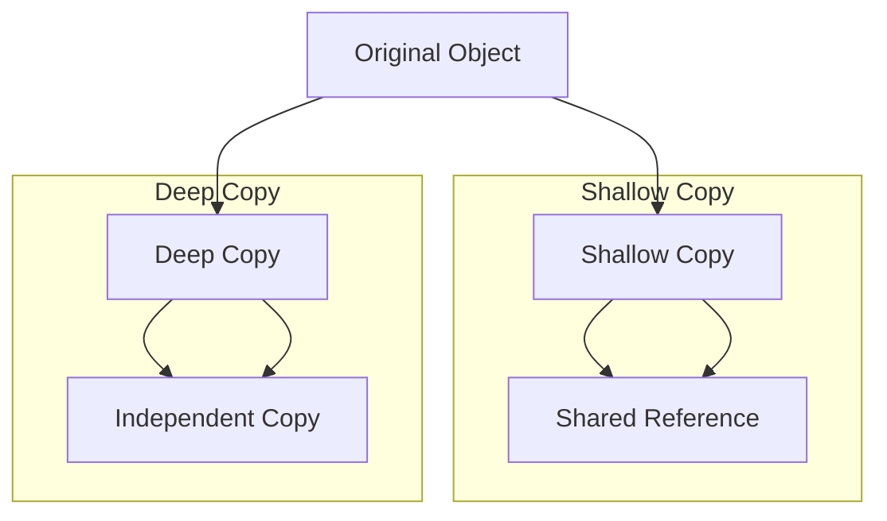

## 4.5.2 Deep vs. Shallow Copy

In the realm of software engineering, particularly when dealing with object-oriented programming, understanding how to copy objects is crucial. This knowledge becomes especially significant when implementing the Prototype Pattern, a creational design pattern that involves creating new objects by copying existing ones. In this section, we will delve into the concepts of deep and shallow copying, explore their differences, and examine their implications in TypeScript.

### Understanding Shallow Copy

A shallow copy of an object is a new object that is a copy of the original object, but it only copies the top-level properties. If the original object contains references to other objects, the shallow copy will only copy the references, not the actual objects. This means that changes to nested objects in the original will reflect in the shallow copy and vice versa.

#### Example of Shallow Copy in TypeScript

Let's consider an example to illustrate shallow copying in TypeScript:

```typescript
interface Address {
  street: string;
  city: string;
}

interface Person {
  name: string;
  age: number;
  address: Address;
}

const originalPerson: Person = {
  name: "Alice",
  age: 30,
  address: {
    street: "123 Main St",
    city: "Wonderland"
  }
};

// Shallow copy using Object.assign
const shallowCopyPerson = Object.assign({}, originalPerson);

// Modifying the address in the shallow copy
shallowCopyPerson.address.street = "456 Elm St";

console.log(originalPerson.address.street); // Output: "456 Elm St"
```

In this example, `Object.assign()` creates a shallow copy of `originalPerson`. When we modify the `street` property of `address` in `shallowCopyPerson`, the change is reflected in `originalPerson` as well. This is because both objects share the same reference to the `address` object.

### Understanding Deep Copy

A deep copy, on the other hand, involves creating a new object and recursively copying all properties from the original object, including nested objects. This ensures that the copied object is entirely independent of the original, with no shared references.

#### Example of Deep Copy in TypeScript

To achieve a deep copy in TypeScript, one can use recursive functions or leverage libraries like `lodash`. Here's how you can implement a deep copy using recursion:

```typescript
function deepCopy<T>(obj: T): T {
  if (obj === null || typeof obj !== "object") {
    return obj;
  }

  if (Array.isArray(obj)) {
    const copy: any[] = [];
    for (const item of obj) {
      copy.push(deepCopy(item));
    }
    return copy as unknown as T;
  }

  const copy: { [key: string]: any } = {};
  for (const key in obj) {
    if (obj.hasOwnProperty(key)) {
      copy[key] = deepCopy(obj[key]);
    }
  }
  return copy as T;
}

const deepCopyPerson = deepCopy(originalPerson);

// Modifying the address in the deep copy
deepCopyPerson.address.street = "789 Oak St";

console.log(originalPerson.address.street); // Output: "456 Elm St"
```

In this example, the `deepCopy` function recursively copies each property, ensuring that nested objects are also duplicated. As a result, changes to `deepCopyPerson` do not affect `originalPerson`.

### Implications of Using Shallow Copies

Shallow copying is efficient and fast, but it can lead to unintended side effects when objects contain references to other objects. If the copied object is modified, the original object might also be affected, leading to bugs that are difficult to trace.

#### Example Scenario

Consider a scenario where you have a configuration object that is shared across multiple components in an application. If a component modifies a nested property in a shallow copy of this configuration, other components may inadvertently see these changes, potentially causing inconsistent behavior.

### Deep Copying to Prevent Unintended Side Effects

Deep copying is essential when you need to ensure that changes to a copied object do not affect the original object. This is particularly important in scenarios where objects are shared across different parts of an application, such as in state management or when implementing the Prototype Pattern.

#### Methods for Deep Copying in TypeScript

1. **Recursive Cloning**: As demonstrated earlier, recursive cloning is a straightforward approach to deep copying. However, it can be challenging to implement correctly for complex objects with circular references.

2. **Using Libraries**: Libraries like `lodash` provide utility functions for deep copying. The `_.cloneDeep` function from `lodash` is a popular choice:

   ```typescript
   import _ from 'lodash';

   const lodashDeepCopyPerson = _.cloneDeep(originalPerson);

   // Modifying the address in the lodash deep copy
   lodashDeepCopyPerson.address.street = "101 Pine St";

   console.log(originalPerson.address.street); // Output: "456 Elm St"
   ```

   `lodash` handles complex objects and circular references gracefully, making it a robust choice for deep copying.

### Performance Considerations

While deep copying ensures independence between objects, it can be more resource-intensive than shallow copying. The performance impact depends on the size and complexity of the objects being copied. Recursive deep copying can be slow for large objects, and using libraries like `lodash` can introduce additional overhead.

#### Strategies for Performance Optimization

- **Selective Deep Copying**: Only deep copy parts of the object that require independence. This reduces the overhead associated with copying large objects.

- **Immutable Data Structures**: Consider using immutable data structures, which inherently avoid the need for deep copying by ensuring that objects cannot be modified after creation.

- **Profiling and Benchmarking**: Use profiling tools to measure the performance impact of deep copying in your application. This can help identify bottlenecks and guide optimization efforts.

### Visualizing Deep vs. Shallow Copy

To better understand the differences between deep and shallow copying, let's visualize the process using a diagram:



**Diagram Explanation**: In the shallow copy, the copied object shares references with the original object, leading to potential side effects. In the deep copy, all properties are independently copied, ensuring no shared references.

### Try It Yourself

To solidify your understanding of deep and shallow copying, try modifying the code examples provided:

- **Experiment with Different Data Structures**: Try copying arrays, nested objects, and objects with circular references.
- **Use Different Copying Methods**: Implement deep copying using both recursive functions and `lodash`.
- **Measure Performance**: Use the `console.time()` and `console.timeEnd()` methods in TypeScript to measure the time taken for shallow and deep copying operations.

### Knowledge Check

- **What is the main difference between deep and shallow copying?**
- **Why might shallow copying lead to unintended side effects?**
- **How can deep copying prevent shared references between objects?**
- **What are some performance considerations when performing deep copies?**

### Summary

In this section, we've explored the concepts of deep and shallow copying, their differences, and their implications in TypeScript. We've seen how shallow copying can lead to shared references and unintended side effects, while deep copying ensures complete independence between objects. By understanding these concepts and using the appropriate copying techniques, we can implement the Prototype Pattern effectively and avoid common pitfalls in object-oriented programming.

## Quiz Time!



### What is a shallow copy?

- [x] A copy that duplicates only the top-level properties of an object.
- [ ] A copy that duplicates all nested objects within an object.
- [ ] A copy that duplicates only primitive properties.
- [ ] A copy that duplicates all properties and methods of an object.

> **Explanation:** A shallow copy duplicates only the top-level properties of an object, not the nested objects.

### What is a deep copy?

- [x] A copy that duplicates all properties, including nested objects.
- [ ] A copy that duplicates only the top-level properties of an object.
- [ ] A copy that duplicates only primitive properties.
- [ ] A copy that duplicates only methods of an object.

> **Explanation:** A deep copy duplicates all properties, including nested objects, ensuring no shared references.

### Which method creates a shallow copy in TypeScript?

- [x] `Object.assign()`
- [ ] `JSON.stringify()`
- [ ] `_.cloneDeep()`
- [ ] `Array.prototype.slice()`

> **Explanation:** `Object.assign()` creates a shallow copy by copying only the top-level properties.

### Which library provides a utility for deep copying objects?

- [x] `lodash`
- [ ] `jQuery`
- [ ] `React`
- [ ] `Angular`

> **Explanation:** `lodash` provides the `_.cloneDeep()` function for deep copying objects.

### What is a potential downside of deep copying?

- [x] It can be resource-intensive for large objects.
- [ ] It always leads to shared references.
- [ ] It cannot handle primitive properties.
- [ ] It is slower than shallow copying for small objects.

> **Explanation:** Deep copying can be resource-intensive, especially for large or complex objects.

### How can you optimize performance when deep copying?

- [x] Selectively deep copy only necessary parts of an object.
- [ ] Always use shallow copying instead.
- [ ] Avoid using libraries like `lodash`.
- [ ] Use deep copying for all objects, regardless of size.

> **Explanation:** Selectively deep copying only necessary parts of an object can reduce overhead.

### What does `_.cloneDeep()` do?

- [x] Creates a deep copy of an object, including nested objects.
- [ ] Creates a shallow copy of an object.
- [ ] Converts an object to a JSON string.
- [ ] Merges two objects into one.

> **Explanation:** `_.cloneDeep()` creates a deep copy of an object, ensuring no shared references.

### Why might you use immutable data structures instead of deep copying?

- [x] They inherently avoid the need for deep copying by ensuring immutability.
- [ ] They are always faster than deep copying.
- [ ] They allow for shared references between objects.
- [ ] They are easier to implement than deep copying.

> **Explanation:** Immutable data structures avoid the need for deep copying by ensuring objects cannot be modified after creation.

### What is a shared reference?

- [x] A reference that is shared between two objects, leading to potential side effects.
- [ ] A reference that is unique to each object.
- [ ] A reference that points to a primitive value.
- [ ] A reference that is always copied during deep copying.

> **Explanation:** A shared reference is a reference that is shared between two objects, leading to potential side effects when one object is modified.

### True or False: Deep copying always ensures no shared references between objects.

- [x] True
- [ ] False

> **Explanation:** Deep copying duplicates all properties, including nested objects, ensuring no shared references between objects.


