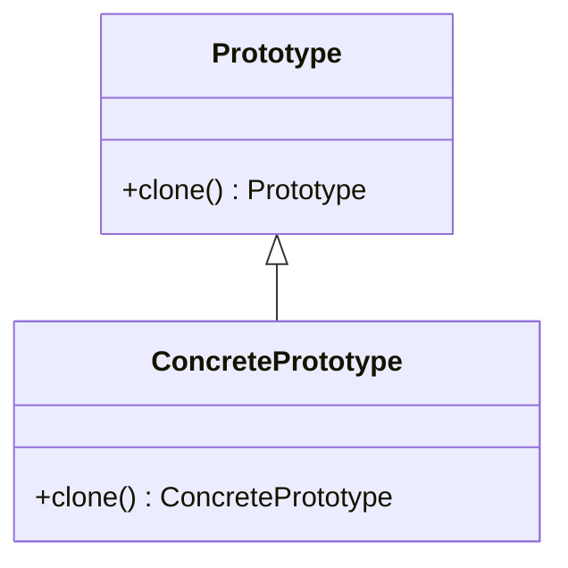

## 4.5.3 Use Cases and Examples

The Prototype Pattern is a creational design pattern that allows you to create new objects by copying an existing object, known as the prototype. This pattern is particularly useful when the cost of creating a new instance of an object is more expensive than copying an existing one. In this section, we'll explore practical scenarios where the Prototype Pattern is advantageous, provide detailed examples, and discuss the benefits and limitations of using this pattern in TypeScript.

### Understanding the Prototype Pattern

Before diving into use cases, let's briefly revisit the Prototype Pattern. The core idea is to create new objects by copying a prototype rather than creating instances from scratch. This approach can be beneficial when dealing with complex objects that require significant resources to initialize.

#### Key Concepts

- **Prototype**: The original object that serves as a template for creating new objects.
- **Cloning**: The process of creating a copy of the prototype object.
- **Shallow vs. Deep Copy**: A shallow copy duplicates the object's structure but not the objects it references, while a deep copy duplicates everything.

### Use Cases for the Prototype Pattern

The Prototype Pattern is particularly useful in scenarios where object creation is resource-intensive or when you need to create multiple instances with slight variations. Let's explore some common use cases.

#### 1. Creating Multiple Instances of a Complex Object

In applications where objects are complex and expensive to create, such as those involving intricate initialization logic or resource-intensive operations, the Prototype Pattern can be a lifesaver. By cloning an existing object, you can bypass the costly initialization process.

**Example Scenario**: Consider a graphical application where you need to create multiple instances of a complex 3D model. Each model might have slight variations, such as different textures or colors. Instead of initializing each model from scratch, you can clone a prototype and apply the variations.

```typescript
class 3DModel {
    constructor(public vertices: number[], public texture: string) {}

    clone(): 3DModel {
        return new 3DModel([...this.vertices], this.texture);
    }
}

// Prototype model
const prototypeModel = new 3DModel([0, 1, 2, 3], 'defaultTexture');

// Create a new model by cloning the prototype
const newModel = prototypeModel.clone();
newModel.texture = 'customTexture';

console.log(newModel);
```

In this example, the `3DModel` class has a `clone` method that creates a new instance by copying the prototype's vertices and texture. This approach is efficient because it avoids re-initializing the vertices, which can be a costly operation.

#### 2. Copying User Preferences or Settings

Another common use case for the Prototype Pattern is copying user preferences or settings to create new profiles. This is particularly useful in applications where users can customize their settings, and you need to create new profiles based on existing ones.

**Example Scenario**: Imagine a web application where users can customize their dashboard layout. When a user wants to create a new dashboard with similar settings, you can clone the existing dashboard configuration.

```typescript
interface UserSettings {
    theme: string;
    layout: string;
    notificationsEnabled: boolean;
}

class UserProfile {
    constructor(public settings: UserSettings) {}

    clone(): UserProfile {
        return new UserProfile({ ...this.settings });
    }
}

// Prototype user profile
const prototypeProfile = new UserProfile({
    theme: 'dark',
    layout: 'grid',
    notificationsEnabled: true,
});

// Create a new profile by cloning the prototype
const newProfile = prototypeProfile.clone();
newProfile.settings.theme = 'light';

console.log(newProfile);
```

In this example, the `UserProfile` class has a `clone` method that creates a new instance by copying the prototype's settings. This allows for easy duplication of user profiles with slight modifications.

#### 3. Duplicating Objects in Games or Simulations

In games or simulations, creating multiple instances of objects can be resource-intensive, especially when dealing with complex entities like characters or environments. The Prototype Pattern can help by allowing you to clone existing objects instead of creating new ones from scratch.

**Example Scenario**: Consider a game where you need to create multiple instances of enemy characters with similar attributes. Instead of initializing each enemy character individually, you can clone a prototype character.

```typescript
class EnemyCharacter {
    constructor(public health: number, public attackPower: number) {}

    clone(): EnemyCharacter {
        return new EnemyCharacter(this.health, this.attackPower);
    }
}

// Prototype enemy character
const prototypeEnemy = new EnemyCharacter(100, 20);

// Create a new enemy by cloning the prototype
const newEnemy = prototypeEnemy.clone();
newEnemy.attackPower = 25;

console.log(newEnemy);
```

In this example, the `EnemyCharacter` class has a `clone` method that creates a new instance by copying the prototype's health and attack power. This approach is efficient for creating multiple enemy characters with similar attributes.

### Performance Benefits of the Prototype Pattern

The Prototype Pattern provides several performance benefits, particularly in scenarios where object creation is resource-intensive:

- **Reduced Initialization Overhead**: By cloning an existing object, you can avoid the costly initialization process, which can be beneficial for complex objects.
- **Efficient Resource Utilization**: Cloning allows you to reuse existing resources, such as memory and processing power, which can improve application performance.
- **Faster Object Creation**: Cloning is generally faster than creating new instances from scratch, especially for complex objects with intricate initialization logic.

### Limitations and Considerations

While the Prototype Pattern offers several benefits, there are also some limitations and considerations to keep in mind:

- **Complexity of Clone Operation**: The complexity of the clone operation can vary depending on the object's structure. For objects with nested references, implementing a deep copy can be challenging.
- **Memory Usage**: Cloning can increase memory usage, especially if the prototype object is large or contains many references.
- **Potential for Errors**: If not implemented correctly, the clone operation can lead to errors, such as unintended sharing of references between objects.

### Encouragement to Use the Prototype Pattern

The Prototype Pattern is a powerful tool for creating copies of existing objects efficiently. When faced with scenarios where object creation is resource-intensive or when you need to create multiple instances with slight variations, consider using the Prototype Pattern to improve performance and resource utilization.

### Try It Yourself

To deepen your understanding of the Prototype Pattern, try modifying the code examples provided. Experiment with different object structures, such as adding nested references, and implement both shallow and deep copy methods. Observe how the pattern behaves in various scenarios and consider the trade-offs between performance and complexity.

### Visualizing the Prototype Pattern

To further enhance your understanding, let's visualize the Prototype Pattern using a class diagram. This diagram illustrates the relationship between the prototype object and its clones.



In this diagram, the `Prototype` class defines the `clone` method, which is implemented by the `ConcretePrototype` class. This structure allows for the creation of new objects by cloning an existing prototype.

### Knowledge Check

To reinforce your understanding of the Prototype Pattern, consider the following questions:

- What are the key benefits of using the Prototype Pattern?
- How does the Prototype Pattern improve performance in resource-intensive scenarios?
- What are the potential limitations of the Prototype Pattern, and how can they be addressed?

### Conclusion

The Prototype Pattern is a valuable design pattern for creating copies of existing objects efficiently. By understanding its use cases, benefits, and limitations, you can make informed decisions about when to apply this pattern in your TypeScript applications. Remember, the key to mastering design patterns is practice and experimentation. Keep exploring, stay curious, and enjoy the journey!

## Quiz Time!



### What is the primary advantage of using the Prototype Pattern?

- [x] It reduces the overhead of object creation.
- [ ] It simplifies the initialization logic.
- [ ] It allows for more complex object structures.
- [ ] It eliminates the need for constructors.

> **Explanation:** The Prototype Pattern reduces the overhead of object creation by allowing objects to be cloned from a prototype rather than being created from scratch.

### In which scenario is the Prototype Pattern particularly useful?

- [x] When creating multiple instances of a complex object with slight variations.
- [ ] When initializing simple objects.
- [ ] When objects do not require any initialization.
- [ ] When objects are immutable.

> **Explanation:** The Prototype Pattern is useful when creating multiple instances of a complex object with slight variations, as it allows for efficient cloning of existing objects.

### What is a potential limitation of the Prototype Pattern?

- [x] Complexity of the clone operation for certain objects.
- [ ] Inability to create new objects.
- [ ] Increased initialization time.
- [ ] Reduced memory usage.

> **Explanation:** The complexity of the clone operation can be a limitation, especially for objects with nested references that require deep copying.

### How does the Prototype Pattern improve performance?

- [x] By reducing the initialization overhead of creating new objects.
- [ ] By increasing the complexity of object structures.
- [ ] By eliminating the need for constructors.
- [ ] By simplifying the object's interface.

> **Explanation:** The Prototype Pattern improves performance by reducing the initialization overhead of creating new objects, making it more efficient to clone existing ones.

### What is the difference between a shallow copy and a deep copy?

- [x] A shallow copy duplicates the object's structure but not the objects it references, while a deep copy duplicates everything.
- [ ] A shallow copy duplicates everything, while a deep copy duplicates only the object's structure.
- [ ] A shallow copy is faster than a deep copy.
- [ ] A deep copy is always preferred over a shallow copy.

> **Explanation:** A shallow copy duplicates the object's structure but not the objects it references, whereas a deep copy duplicates everything, including referenced objects.

### Which method is typically used to clone an object in the Prototype Pattern?

- [x] clone()
- [ ] copy()
- [ ] duplicate()
- [ ] replicate()

> **Explanation:** The `clone()` method is typically used to create a copy of an object in the Prototype Pattern.

### What is a common use case for the Prototype Pattern in games or simulations?

- [x] Duplicating objects where initialization is resource-intensive.
- [ ] Simplifying game logic.
- [ ] Creating immutable objects.
- [ ] Reducing the number of game entities.

> **Explanation:** In games or simulations, the Prototype Pattern is commonly used to duplicate objects where initialization is resource-intensive, such as characters or environments.

### How can the Prototype Pattern be used in user profile management?

- [x] By copying user preferences or settings to create new profiles.
- [ ] By simplifying the user interface.
- [ ] By eliminating the need for user settings.
- [ ] By reducing the number of user profiles.

> **Explanation:** The Prototype Pattern can be used to copy user preferences or settings to create new profiles, allowing for easy duplication and modification.

### What should you consider when implementing the Prototype Pattern?

- [x] The complexity of the clone operation and potential memory usage.
- [ ] The simplicity of object structures.
- [ ] The elimination of constructors.
- [ ] The reduction of object interfaces.

> **Explanation:** When implementing the Prototype Pattern, consider the complexity of the clone operation and potential memory usage, especially for objects with nested references.

### True or False: The Prototype Pattern eliminates the need for constructors.

- [ ] True
- [x] False

> **Explanation:** False. The Prototype Pattern does not eliminate the need for constructors; it provides an alternative way to create objects by cloning a prototype.


