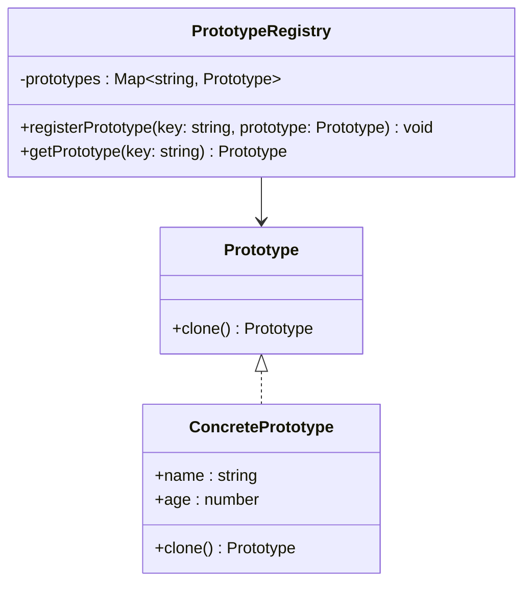

## 4.5 Prototype Pattern

The Prototype Pattern is a creational design pattern that enables the creation of new objects by copying an existing object, known as a prototype. This pattern is particularly useful when the cost of creating objects from scratch is high or when complex object initialization is involved. In this section, we will delve into the Prototype Pattern, its intent, the problems it solves, and how to implement it in TypeScript.

### Understanding the Prototype Pattern

The Prototype Pattern is based on the concept of cloning. Instead of creating an object directly, you start with a prototype and create new objects by copying this prototype. This approach can be more efficient than creating new instances from scratch, especially when the initialization of objects is costly or complex.

#### Intent of the Prototype Pattern

The primary intent of the Prototype Pattern is to:

- **Reduce the cost of creating objects**: By cloning existing objects, we avoid the overhead of initializing new objects from scratch.
- **Simplify object creation**: Complex objects can be created more easily by copying an existing prototype.
- **Support dynamic addition and removal of products**: New types of objects can be added or removed at runtime by changing the prototype.

### Problems Solved by the Prototype Pattern

The Prototype Pattern addresses several key issues in software development:

1. **Costly Object Creation**: When creating a new object involves significant resources, such as memory or processing time, cloning an existing object can be more efficient.

2. **Complex Initialization**: Some objects require complex initialization logic. By using a prototype, you can encapsulate this complexity in a single object and clone it as needed.

3. **Dynamic System Requirements**: In systems where the types of objects required can change at runtime, the Prototype Pattern allows for flexibility by enabling the dynamic addition and removal of prototypes.

### Key Participants in the Prototype Pattern

The Prototype Pattern involves two main participants:

#### 1. Prototype

The Prototype is an interface that defines a method for cloning itself. This method is responsible for creating a copy of the object.

```typescript
// Prototype interface
interface Prototype {
  clone(): Prototype;
}
```

#### 2. ConcretePrototype

The ConcretePrototype class implements the Prototype interface. It provides the logic for cloning itself, which typically involves creating a new instance of the class and copying the values of its fields.

```typescript
// ConcretePrototype class
class ConcretePrototype implements Prototype {
  constructor(public name: string, public age: number) {}

  clone(): Prototype {
    return new ConcretePrototype(this.name, this.age);
  }
}
```

### Cloning in the Prototype Pattern

Cloning is a central concept in the Prototype Pattern. It involves creating a new object that is a copy of an existing object. In TypeScript, cloning can be implemented using various techniques, such as shallow copying or deep copying.

#### Shallow Copy vs. Deep Copy

- **Shallow Copy**: A shallow copy duplicates the object's top-level properties but does not clone nested objects. Changes to nested objects in the clone will affect the original object.

- **Deep Copy**: A deep copy duplicates the object and all objects it references, creating a completely independent copy. Changes to nested objects in the clone do not affect the original object.

In TypeScript, shallow copying can be achieved using the spread operator or `Object.assign()`, while deep copying typically requires a custom implementation or the use of libraries.

### Implementing the Prototype Pattern in TypeScript

Let's explore how to implement the Prototype Pattern in TypeScript with both shallow and deep copying techniques.

#### Shallow Copy Implementation

```typescript
// Prototype interface
interface Prototype {
  clone(): Prototype;
}

// ConcretePrototype class with shallow copy
class ConcretePrototype implements Prototype {
  constructor(public name: string, public age: number, public address: { city: string }) {}

  clone(): Prototype {
    // Shallow copy using Object.assign
    return Object.assign(Object.create(Object.getPrototypeOf(this)), this);
  }
}

// Usage
const original = new ConcretePrototype("Alice", 30, { city: "New York" });
const clone = original.clone() as ConcretePrototype;
clone.name = "Bob";
clone.address.city = "Los Angeles";

console.log(original); // Output: ConcretePrototype { name: 'Alice', age: 30, address: { city: 'Los Angeles' } }
console.log(clone);    // Output: ConcretePrototype { name: 'Bob', age: 30, address: { city: 'Los Angeles' } }
```

In this example, the `clone()` method uses `Object.assign()` to create a shallow copy of the object. Notice that changes to the `address` property in the clone also affect the original object, demonstrating the shallow copy behavior.

#### Deep Copy Implementation

```typescript
// Prototype interface
interface Prototype {
  clone(): Prototype;
}

// ConcretePrototype class with deep copy
class ConcretePrototype implements Prototype {
  constructor(public name: string, public age: number, public address: { city: string }) {}

  clone(): Prototype {
    // Deep copy using JSON methods
    const cloneObj = JSON.parse(JSON.stringify(this));
    return new ConcretePrototype(cloneObj.name, cloneObj.age, cloneObj.address);
  }
}

// Usage
const original = new ConcretePrototype("Alice", 30, { city: "New York" });
const clone = original.clone() as ConcretePrototype;
clone.name = "Bob";
clone.address.city = "Los Angeles";

console.log(original); // Output: ConcretePrototype { name: 'Alice', age: 30, address: { city: 'New York' } }
console.log(clone);    // Output: ConcretePrototype { name: 'Bob', age: 30, address: { city: 'Los Angeles' } }
```

In this deep copy example, the `clone()` method uses `JSON.parse()` and `JSON.stringify()` to create a deep copy of the object. Changes to the `address` property in the clone do not affect the original object, demonstrating the deep copy behavior.

### Supporting Dynamic Addition and Removal of Products

The Prototype Pattern supports the dynamic addition and removal of products by allowing prototypes to be registered and cloned at runtime. This flexibility is particularly useful in systems where the types of objects required can change dynamically.

#### Example: Prototype Registry

A prototype registry can be used to manage prototypes and create new objects by cloning them.

```typescript
// Prototype interface
interface Prototype {
  clone(): Prototype;
}

// ConcretePrototype class
class ConcretePrototype implements Prototype {
  constructor(public name: string, public age: number) {}

  clone(): Prototype {
    return new ConcretePrototype(this.name, this.age);
  }
}

// PrototypeRegistry class
class PrototypeRegistry {
  private prototypes: { [key: string]: Prototype } = {};

  registerPrototype(key: string, prototype: Prototype): void {
    this.prototypes[key] = prototype;
  }

  getPrototype(key: string): Prototype {
    const prototype = this.prototypes[key];
    return prototype ? prototype.clone() : null;
  }
}

// Usage
const registry = new PrototypeRegistry();
const prototype1 = new ConcretePrototype("Alice", 30);
registry.registerPrototype("prototype1", prototype1);

const clone1 = registry.getPrototype("prototype1") as ConcretePrototype;
clone1.name = "Bob";

console.log(prototype1); // Output: ConcretePrototype { name: 'Alice', age: 30 }
console.log(clone1);     // Output: ConcretePrototype { name: 'Bob', age: 30 }
```

In this example, the `PrototypeRegistry` class manages a collection of prototypes. New objects can be created by cloning the registered prototypes, allowing for dynamic addition and removal of products.

### Considerations for Implementing the Prototype Pattern in TypeScript

When implementing the Prototype Pattern in TypeScript, consider the following:

- **Cloning Complexity**: Implementing deep cloning can be complex, especially for objects with circular references or non-serializable properties. Consider using libraries like `lodash` for deep cloning if necessary.

- **Prototype Management**: Ensure that prototypes are managed effectively, especially in systems where prototypes can be added or removed dynamically.

- **Performance**: While cloning can be more efficient than creating objects from scratch, it may still incur performance overhead. Evaluate the trade-offs based on your specific use case.

- **Type Safety**: TypeScript's type system can help ensure that clones are created with the correct types. Use interfaces and type annotations to enforce type safety.

### Visualizing the Prototype Pattern

To better understand the Prototype Pattern, let's visualize the process of cloning objects using a class diagram.



**Diagram Description**: The class diagram above illustrates the relationship between the `Prototype` interface, the `ConcretePrototype` class, and the `PrototypeRegistry` class. The `ConcretePrototype` class implements the `Prototype` interface, providing the logic for cloning itself. The `PrototypeRegistry` class manages a collection of prototypes and allows for the dynamic addition and removal of prototypes.

### Try It Yourself

Experiment with the Prototype Pattern by modifying the code examples provided:

- **Add New Properties**: Extend the `ConcretePrototype` class with additional properties and update the `clone()` method to handle them.
- **Implement Custom Cloning Logic**: Modify the `clone()` method to implement custom cloning logic, such as handling circular references or non-serializable properties.
- **Create a Prototype Factory**: Implement a factory class that creates prototypes based on specific criteria and registers them with the `PrototypeRegistry`.

### Knowledge Check

To reinforce your understanding of the Prototype Pattern, consider the following questions:

- What are the key benefits of using the Prototype Pattern?
- How does the Prototype Pattern support dynamic addition and removal of products?
- What are the differences between shallow and deep copying in the context of the Prototype Pattern?

### Embrace the Journey

Remember, mastering design patterns like the Prototype Pattern is a journey. As you progress, you'll build more complex and efficient systems. Keep experimenting, stay curious, and enjoy the process of learning and applying design patterns in your software development projects.

## Quiz Time!



### What is the primary intent of the Prototype Pattern?

- [x] To create new objects by copying existing ones
- [ ] To define a family of algorithms
- [ ] To separate the construction of a complex object from its representation
- [ ] To provide a simplified interface to a complex subsystem

> **Explanation:** The primary intent of the Prototype Pattern is to create new objects by copying existing ones, which can be more efficient than creating objects from scratch.

### Which method is used to clone an object in the Prototype Pattern?

- [x] clone()
- [ ] create()
- [ ] copy()
- [ ] duplicate()

> **Explanation:** The `clone()` method is used to create a copy of an object in the Prototype Pattern.

### What is the difference between shallow and deep copying?

- [x] Shallow copy duplicates top-level properties, while deep copy duplicates all nested objects
- [ ] Shallow copy duplicates all nested objects, while deep copy duplicates top-level properties
- [ ] Shallow copy is faster than deep copy
- [ ] Deep copy is faster than shallow copy

> **Explanation:** Shallow copy duplicates only the top-level properties, while deep copy duplicates all nested objects, creating a completely independent copy.

### How can deep copying be achieved in TypeScript?

- [x] Using JSON.parse() and JSON.stringify()
- [ ] Using the spread operator
- [ ] Using Object.assign()
- [ ] Using a for loop

> **Explanation:** Deep copying can be achieved using `JSON.parse()` and `JSON.stringify()`, which create a completely independent copy of the object.

### What is a potential drawback of using JSON methods for deep copying?

- [x] They cannot handle circular references
- [ ] They are the fastest method for deep copying
- [ ] They preserve functions and methods
- [ ] They are the most memory-efficient method

> **Explanation:** JSON methods cannot handle circular references, which can lead to errors if the object being copied contains such references.

### How does the Prototype Pattern support dynamic addition and removal of products?

- [x] By allowing prototypes to be registered and cloned at runtime
- [ ] By defining a family of algorithms
- [ ] By separating the construction of a complex object from its representation
- [ ] By providing a simplified interface to a complex subsystem

> **Explanation:** The Prototype Pattern supports dynamic addition and removal of products by allowing prototypes to be registered and cloned at runtime.

### What is the role of the PrototypeRegistry class in the Prototype Pattern?

- [x] To manage a collection of prototypes and allow for dynamic addition and removal
- [ ] To define a family of algorithms
- [ ] To separate the construction of a complex object from its representation
- [ ] To provide a simplified interface to a complex subsystem

> **Explanation:** The `PrototypeRegistry` class manages a collection of prototypes and allows for the dynamic addition and removal of prototypes.

### What is a key consideration when implementing the Prototype Pattern in TypeScript?

- [x] Cloning complexity, especially for objects with circular references
- [ ] Defining a family of algorithms
- [ ] Separating the construction of a complex object from its representation
- [ ] Providing a simplified interface to a complex subsystem

> **Explanation:** Cloning complexity, especially for objects with circular references, is a key consideration when implementing the Prototype Pattern in TypeScript.

### Which of the following is a benefit of using the Prototype Pattern?

- [x] It reduces the cost of creating objects
- [ ] It defines a family of algorithms
- [ ] It separates the construction of a complex object from its representation
- [ ] It provides a simplified interface to a complex subsystem

> **Explanation:** One of the benefits of using the Prototype Pattern is that it reduces the cost of creating objects by cloning existing ones.

### True or False: The Prototype Pattern is a structural design pattern.

- [ ] True
- [x] False

> **Explanation:** False. The Prototype Pattern is a creational design pattern, not a structural one.


