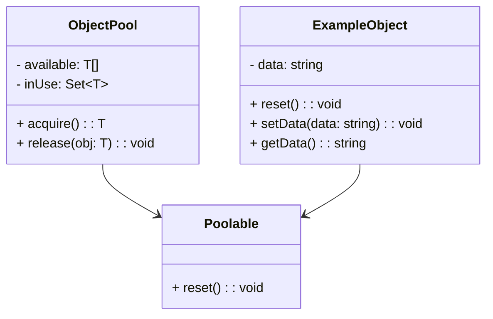

## 4.6.1 Implementing Object Pool in TypeScript

The Object Pool pattern is a creational design pattern that provides a way to manage a set of reusable objects. This pattern is particularly useful when the cost of initializing a class instance is high, and you need to frequently create and destroy instances. By reusing objects, you can improve performance and resource utilization.

In this section, we will guide you through implementing an Object Pool in TypeScript. We will cover the core concepts, provide a step-by-step example, and discuss considerations such as pool expansion and thread safety.

### Understanding the Object Pool Pattern

The Object Pool pattern involves maintaining a pool of objects that can be reused rather than creating new instances each time one is needed. This is particularly beneficial in scenarios where object creation is expensive, such as database connections or large object graphs.

**Key Components of the Object Pool Pattern:**

1. **Pool Manager**: Manages the pool of objects, keeping track of available and in-use objects.
2. **Reusable Objects**: Objects that are stored in the pool and can be reused.
3. **Acquire and Release Methods**: Methods to obtain an object from the pool and return it when done.

### Implementing an Object Pool in TypeScript

Let's dive into a step-by-step implementation of an `ObjectPool` class in TypeScript.

#### Step 1: Define the Object Interface

First, we define an interface for the objects that will be managed by the pool. This ensures that all objects in the pool adhere to a specific contract.

```typescript
interface Poolable {
  reset(): void; // Method to reset the object state
}
```

#### Step 2: Create the Object Pool Class

Next, we implement the `ObjectPool` class. This class will manage the pool of objects, including acquiring and releasing them.

```typescript
class ObjectPool<T extends Poolable> {
  private available: T[] = [];
  private inUse: Set<T> = new Set();

  constructor(private create: () => T, private maxSize: number = 10) {}

  acquire(): T {
    let obj: T;
    if (this.available.length > 0) {
      obj = this.available.pop()!;
    } else if (this.inUse.size < this.maxSize) {
      obj = this.create();
    } else {
      throw new Error("No objects available in the pool");
    }
    this.inUse.add(obj);
    return obj;
  }

  release(obj: T): void {
    if (this.inUse.delete(obj)) {
      obj.reset();
      this.available.push(obj);
    } else {
      throw new Error("Object not found in the pool");
    }
  }
}
```

**Explanation:**

- **Constructor**: Takes a `create` function to generate new objects and an optional `maxSize` to limit the pool size.
- **`acquire()` Method**: Retrieves an object from the pool or creates a new one if the pool is not full.
- **`release()` Method**: Returns an object to the pool after resetting its state.

#### Step 3: Implement a Poolable Object

Let's create a simple class that implements the `Poolable` interface.

```typescript
class ExampleObject implements Poolable {
  private data: string;

  constructor() {
    this.data = "default";
  }

  reset(): void {
    this.data = "default"; // Resetting the object state
  }

  setData(data: string): void {
    this.data = data;
  }

  getData(): string {
    return this.data;
  }
}
```

#### Step 4: Using the Object Pool

Now, let's see how to use the `ObjectPool` with our `ExampleObject`.

```typescript
const pool = new ObjectPool<ExampleObject>(() => new ExampleObject(), 5);

try {
  const obj1 = pool.acquire();
  obj1.setData("Hello, World!");

  console.log(obj1.getData()); // Output: Hello, World!

  pool.release(obj1);

  const obj2 = pool.acquire();
  console.log(obj2.getData()); // Output: default

} catch (error) {
  console.error(error.message);
}
```

**Explanation:**

- We create an `ObjectPool` with a maximum size of 5.
- We acquire an object, modify it, and release it back to the pool.
- When we acquire another object, it is reset to its default state.

### Handling Pool Expansion

In some scenarios, you might need to expand the pool dynamically. This can be achieved by modifying the `acquire` method to increase the `maxSize` or by implementing a strategy to handle such cases.

```typescript
acquire(): T {
  let obj: T;
  if (this.available.length > 0) {
    obj = this.available.pop()!;
  } else if (this.inUse.size < this.maxSize) {
    obj = this.create();
  } else {
    // Expand the pool size
    this.maxSize++;
    obj = this.create();
  }
  this.inUse.add(obj);
  return obj;
}
```

### Thread Safety Considerations

Although JavaScript is single-threaded, environments like Node.js may involve asynchronous operations that require careful management of shared resources. While TypeScript itself does not provide built-in concurrency control, you can use locks or semaphores in environments that support them.

### Leveraging TypeScript's Type System

TypeScript's type system helps enforce the correct usage of the pool. By defining interfaces and using generics, we ensure that only compatible objects are managed by the pool. This reduces runtime errors and improves code maintainability.

### Visualizing the Object Pool Pattern

To better understand the flow of the Object Pool pattern, let's visualize it using a Mermaid.js diagram.



**Diagram Explanation:**

- **ObjectPool**: Manages the pool of objects.
- **Poolable**: Interface for objects that can be pooled.
- **ExampleObject**: Implements the `Poolable` interface.

### Try It Yourself

Experiment with the Object Pool pattern by modifying the code examples:

- **Change the Pool Size**: Adjust the `maxSize` parameter and observe how the pool behaves.
- **Implement a Different Poolable Object**: Create another class that implements `Poolable` and use it with the pool.
- **Add Logging**: Include console logs in the `acquire` and `release` methods to track object usage.

### References and Further Reading

- [MDN Web Docs: JavaScript Guide](https://developer.mozilla.org/en-US/docs/Web/JavaScript/Guide)
- [TypeScript Handbook](https://www.typescriptlang.org/docs/handbook/intro.html)
- [Design Patterns: Elements of Reusable Object-Oriented Software](https://en.wikipedia.org/wiki/Design_Patterns)

### Knowledge Check

- What are the benefits of using an Object Pool?
- How does TypeScript's type system enhance the Object Pool pattern?
- What are potential challenges when expanding the pool size?

### Embrace the Journey

Remember, implementing design patterns is a journey. As you gain experience, you'll discover new ways to optimize and adapt patterns to your specific needs. Keep experimenting, stay curious, and enjoy the process!

## Quiz Time!



### What is the primary purpose of the Object Pool pattern?

- [x] To manage a set of reusable objects efficiently
- [ ] To create new objects for every request
- [ ] To enforce strict type checking
- [ ] To simplify object creation logic

> **Explanation:** The Object Pool pattern is designed to manage a set of reusable objects, reducing the overhead of creating and destroying objects frequently.

### Which method in the ObjectPool class is responsible for returning an object to the pool?

- [ ] acquire()
- [x] release()
- [ ] create()
- [ ] reset()

> **Explanation:** The `release()` method is responsible for returning an object to the pool and resetting its state.

### How does TypeScript's type system help in implementing the Object Pool pattern?

- [x] By enforcing the correct usage of pooled objects through interfaces and generics
- [ ] By providing built-in concurrency control
- [ ] By automatically expanding the pool size
- [ ] By generating object instances

> **Explanation:** TypeScript's type system helps enforce the correct usage of pooled objects by using interfaces and generics to ensure compatibility.

### What is a potential benefit of expanding the pool size dynamically?

- [x] It allows handling more concurrent requests without errors
- [ ] It reduces the memory footprint of the application
- [ ] It simplifies the object creation process
- [ ] It eliminates the need for the release method

> **Explanation:** Expanding the pool size dynamically allows the system to handle more concurrent requests without running out of available objects.

### In a Node.js environment, why might thread safety be a consideration for an Object Pool?

- [x] Because asynchronous operations can lead to shared resource conflicts
- [ ] Because JavaScript is inherently multi-threaded
- [ ] Because TypeScript provides built-in thread safety
- [ ] Because it simplifies the codebase

> **Explanation:** In Node.js, asynchronous operations can lead to shared resource conflicts, making thread safety a consideration even in a single-threaded environment.

### What is the role of the `Poolable` interface in the Object Pool pattern?

- [x] To define the contract for objects that can be pooled
- [ ] To manage the pool of objects
- [ ] To create new instances of objects
- [ ] To handle concurrency issues

> **Explanation:** The `Poolable` interface defines the contract for objects that can be pooled, ensuring they have a `reset` method.

### Which of the following is a correct way to handle pool expansion?

- [x] Increase the `maxSize` and create a new object
- [ ] Decrease the `maxSize` and release objects
- [ ] Create a new pool instance
- [ ] Ignore the pool size limit

> **Explanation:** Increasing the `maxSize` and creating a new object is a correct way to handle pool expansion when needed.

### What is the purpose of the `reset()` method in a `Poolable` object?

- [x] To reset the object's state before returning it to the pool
- [ ] To acquire a new object from the pool
- [ ] To release an object back to the pool
- [ ] To initialize a new object

> **Explanation:** The `reset()` method resets the object's state before it is returned to the pool, ensuring it is ready for reuse.

### How can you visualize the Object Pool pattern effectively?

- [x] Using a class diagram with Mermaid.js
- [ ] By writing extensive documentation
- [ ] By creating a flowchart of object creation
- [ ] By listing all methods in the pool class

> **Explanation:** A class diagram with Mermaid.js effectively visualizes the Object Pool pattern, showing the relationships between classes.

### True or False: The Object Pool pattern is only useful in multi-threaded environments.

- [ ] True
- [x] False

> **Explanation:** False. The Object Pool pattern is useful in both single-threaded and multi-threaded environments, especially when object creation is expensive.


