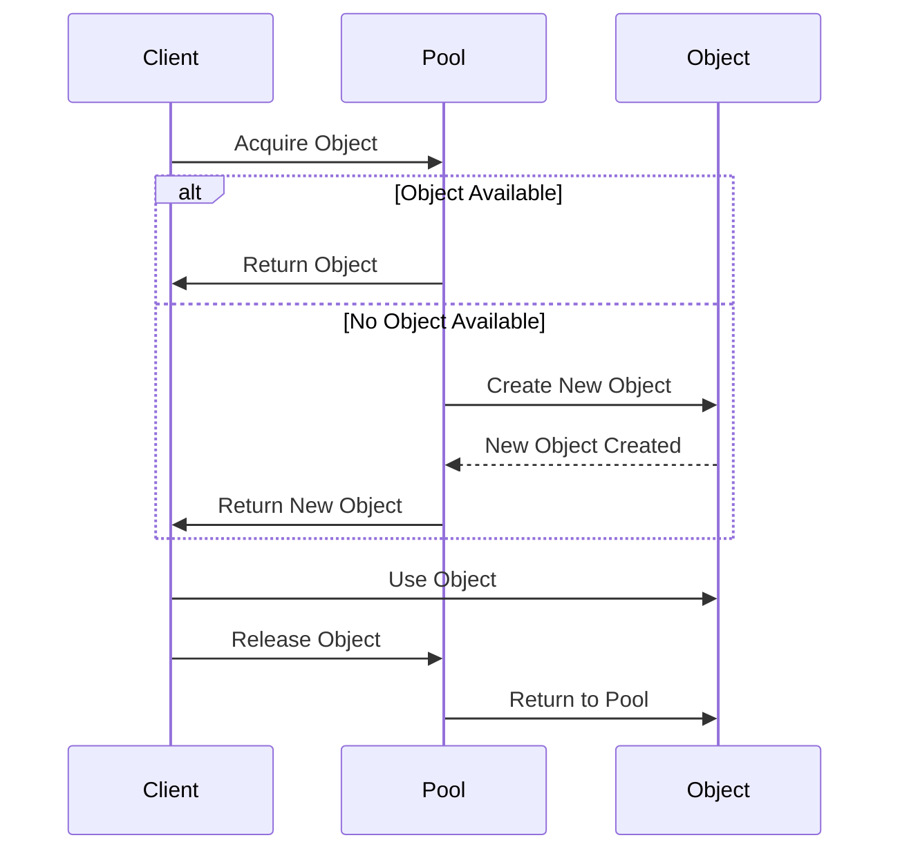

## 4.6.2 Resource Management

In high-load environments, efficient resource management is crucial for maintaining performance and reducing latency. The Object Pool Pattern is a creational design pattern that addresses this need by reusing objects that are expensive to create. This section delves into how the Object Pool Pattern optimizes resource management, the types of resources that benefit from pooling, strategies for managing pool size, and best practices for maintaining object pools over time.

### Understanding the Object Pool Pattern

The Object Pool Pattern is a design pattern that allows for the reuse of objects, which are costly to instantiate, by maintaining a pool of pre-initialized objects. When a client requests an object, it is fetched from the pool rather than being created anew. Once the client is done using the object, it is returned to the pool for future use.

#### Benefits of Object Pooling

1. **Reduced Overhead**: By reusing objects, the pattern minimizes the overhead associated with frequent object creation and destruction, which can be resource-intensive.
2. **Improved Performance**: Object pooling can significantly enhance performance in applications where object instantiation is costly, such as in database connections or complex data structures.
3. **Controlled Resource Usage**: By managing the number of objects in the pool, developers can balance performance with memory usage, ensuring that resources are not over-allocated.

### Code Example: Implementing an Object Pool in TypeScript

Let's explore a basic implementation of an Object Pool Pattern in TypeScript. We'll create a pool for database connections, a common use case where object pooling is beneficial.

```typescript
class DatabaseConnection {
    private static idCounter = 0;
    private id: number;

    constructor() {
        this.id = DatabaseConnection.idCounter++;
        console.log(`Connection ${this.id} created.`);
    }

    query(sql: string): void {
        console.log(`Executing query on connection ${this.id}: ${sql}`);
    }
}

class ConnectionPool {
    private availableConnections: DatabaseConnection[] = [];
    private usedConnections: Set<DatabaseConnection> = new Set();
    private readonly maxPoolSize: number;

    constructor(maxPoolSize: number) {
        this.maxPoolSize = maxPoolSize;
    }

    acquire(): DatabaseConnection {
        if (this.availableConnections.length > 0) {
            const connection = this.availableConnections.pop()!;
            this.usedConnections.add(connection);
            return connection;
        } else if (this.usedConnections.size < this.maxPoolSize) {
            const newConnection = new DatabaseConnection();
            this.usedConnections.add(newConnection);
            return newConnection;
        } else {
            throw new Error("No available connections.");
        }
    }

    release(connection: DatabaseConnection): void {
        if (this.usedConnections.delete(connection)) {
            this.availableConnections.push(connection);
        } else {
            throw new Error("Connection not recognized.");
        }
    }
}

// Usage
const pool = new ConnectionPool(2);
const conn1 = pool.acquire();
conn1.query("SELECT * FROM users");
pool.release(conn1);

const conn2 = pool.acquire();
conn2.query("SELECT * FROM orders");
pool.release(conn2);
```

### Resources Benefiting from Pooling

1. **Database Connections**: Establishing a new database connection can be time-consuming. Pooling connections reduces the overhead of repeatedly opening and closing connections.
2. **Thread Pools**: In multi-threaded applications, creating and destroying threads can be expensive. Thread pools allow for the reuse of threads, improving performance.
3. **Complex Data Structures**: Objects that require significant computation to initialize, such as large graphs or trees, can benefit from pooling.
4. **Network Sockets**: Similar to database connections, network sockets can be pooled to reduce the cost of repeatedly opening and closing connections.

### Strategies for Managing Pool Size

Managing the size of the object pool is critical to balancing performance and memory usage. Here are some strategies:

1. **Fixed Size Pools**: Set a fixed number of objects in the pool. This approach is simple and ensures that memory usage is predictable.
2. **Dynamic Pools**: Allow the pool to grow and shrink based on demand. This approach can be more efficient but requires careful management to avoid excessive memory usage.
3. **Idle Object Timeout**: Remove objects from the pool that have been idle for too long. This helps free up resources that are no longer needed.
4. **Pre-warming**: Initialize a certain number of objects in advance to handle sudden spikes in demand without delay.

### Mitigating Resource Contention

Resource contention occurs when multiple clients attempt to acquire objects from the pool simultaneously, leading to potential bottlenecks. Here are some ways to mitigate this:

1. **Synchronization**: Use synchronization mechanisms, such as locks or semaphores, to manage concurrent access to the pool.
2. **Fairness Policies**: Implement fairness policies to ensure that all clients have equal access to the pool, preventing starvation.
3. **Priority Queues**: Use priority queues to manage requests, allowing higher-priority tasks to acquire resources first.

### Best Practices for Monitoring and Maintaining Object Pools

1. **Regular Monitoring**: Continuously monitor the pool's performance and adjust its size based on usage patterns.
2. **Logging and Alerts**: Implement logging and alerts to detect and respond to issues, such as resource leaks or contention.
3. **Testing Under Load**: Test the pool under realistic load conditions to ensure it can handle peak demand without degradation.
4. **Graceful Degradation**: Design the system to degrade gracefully if the pool is exhausted, such as by queuing requests or providing informative error messages.

### Visualizing Object Pooling

To better understand the flow of object pooling, let's visualize the process using a sequence diagram.



### Try It Yourself

Experiment with the code example provided by modifying the pool size or adding additional methods to the `ConnectionPool` class. Consider implementing a timeout mechanism for idle connections or a priority queue for managing requests.

### Knowledge Check

- What are the key benefits of using the Object Pool Pattern?
- How does object pooling improve performance in high-load environments?
- What strategies can be used to manage the size of an object pool?
- How can resource contention be mitigated in an object pool?
- What are some best practices for maintaining an object pool over time?

### Embrace the Journey

Remember, mastering design patterns like the Object Pool Pattern is an ongoing journey. As you continue to apply these concepts in your projects, you'll gain deeper insights into optimizing resource management and enhancing application performance. Keep experimenting, stay curious, and enjoy the process!

## Quiz Time!



### What is the primary benefit of the Object Pool Pattern?

- [x] Reduces the overhead of frequent object creation and destruction.
- [ ] Increases the complexity of code.
- [ ] Decreases application performance.
- [ ] Limits the number of objects that can be created.

> **Explanation:** The Object Pool Pattern reduces the overhead associated with frequent object creation and destruction, improving performance.

### Which resource is commonly pooled to improve performance?

- [x] Database connections
- [ ] Simple data structures
- [ ] Static variables
- [ ] Primitive data types

> **Explanation:** Database connections are commonly pooled because establishing a new connection can be time-consuming and resource-intensive.

### What is a potential risk of using object pools?

- [ ] Increased memory usage
- [x] Resource contention
- [ ] Simplified code
- [ ] Reduced performance

> **Explanation:** Resource contention can occur when multiple clients attempt to acquire objects from the pool simultaneously, leading to potential bottlenecks.

### How can resource contention be mitigated in an object pool?

- [x] Use synchronization mechanisms
- [ ] Increase the number of objects indefinitely
- [ ] Reduce the pool size
- [ ] Avoid using locks

> **Explanation:** Synchronization mechanisms, such as locks or semaphores, can help manage concurrent access to the pool, mitigating resource contention.

### What is a strategy for managing the size of an object pool?

- [x] Fixed size pools
- [ ] Unlimited growth
- [ ] Random allocation
- [ ] Manual resizing

> **Explanation:** Fixed size pools set a predetermined number of objects in the pool, ensuring predictable memory usage.

### What is the purpose of idle object timeout in object pools?

- [x] Remove objects that have been idle for too long
- [ ] Increase the number of objects in the pool
- [ ] Decrease object creation time
- [ ] Improve object initialization

> **Explanation:** Idle object timeout helps free up resources by removing objects that have been idle for too long.

### Which of the following is a best practice for maintaining object pools?

- [x] Regular monitoring
- [ ] Ignoring performance metrics
- [ ] Avoiding logging
- [ ] Disabling alerts

> **Explanation:** Regular monitoring allows developers to continuously assess the pool's performance and make necessary adjustments.

### What is a common use case for object pooling?

- [x] Thread pools
- [ ] Primitive data types
- [ ] Static variables
- [ ] Constant values

> **Explanation:** Thread pools are a common use case for object pooling, as creating and destroying threads can be expensive.

### What is a benefit of pre-warming an object pool?

- [x] Handle sudden spikes in demand without delay
- [ ] Increase memory usage
- [ ] Reduce object reuse
- [ ] Simplify code

> **Explanation:** Pre-warming initializes a certain number of objects in advance, allowing the system to handle sudden spikes in demand without delay.

### True or False: Object pooling can help balance performance and memory usage.

- [x] True
- [ ] False

> **Explanation:** True. Object pooling helps balance performance and memory usage by reusing objects and controlling the number of objects in the pool.


