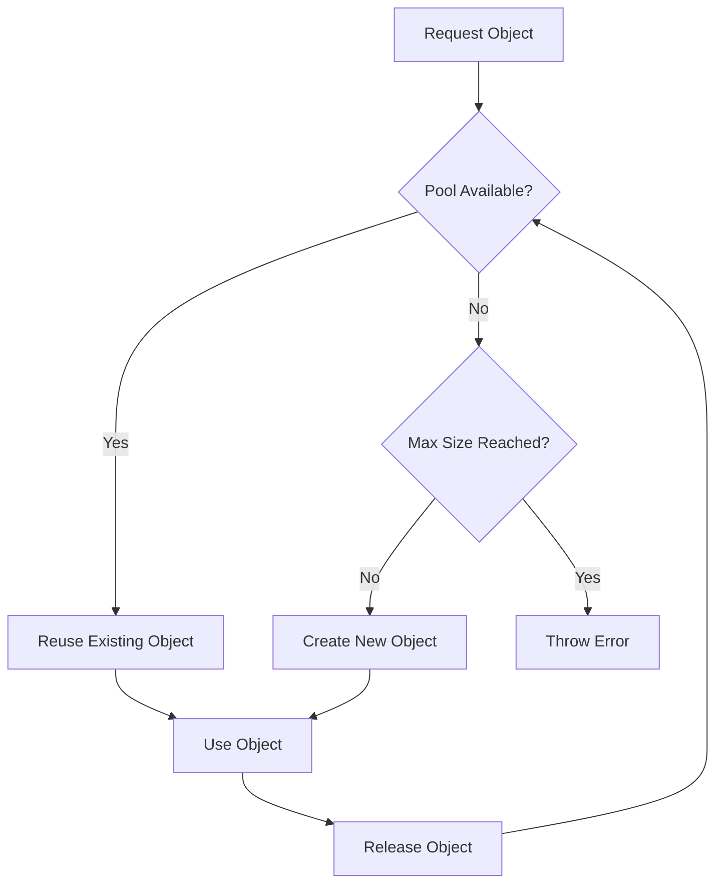

## 4.6.3 Use Cases and Examples

The Object Pool Pattern is a creational design pattern that is particularly useful in scenarios where the cost of creating and destroying objects is high. By reusing objects from a pool rather than creating new ones, we can significantly improve performance and resource utilization. In this section, we will explore several practical use cases of the Object Pool Pattern, including database connection pools, worker threads, and graphics rendering in game development. We will also discuss the considerations specific to TypeScript and JavaScript environments, such as the event loop and asynchronous operations.

### Database Connection Pools

One of the most common applications of the Object Pool Pattern is in managing database connections. Database connections are expensive to create and destroy, and a typical application may require multiple connections to handle concurrent requests. By using a connection pool, we can limit the number of active connections and reuse them across different requests, thereby optimizing resource usage and improving application performance.

#### Implementing a Database Connection Pool in TypeScript

Let's consider an example of a simple database connection pool implemented in TypeScript. We'll use a mock database connection class to illustrate the concept.

```typescript
class DatabaseConnection {
    private static idCounter = 0;
    public id: number;

    constructor() {
        this.id = DatabaseConnection.idCounter++;
        console.log(`Connection ${this.id} created.`);
    }

    query(sql: string) {
        console.log(`Executing query on connection ${this.id}: ${sql}`);
    }

    close() {
        console.log(`Connection ${this.id} closed.`);
    }
}

class ConnectionPool {
    private pool: DatabaseConnection[] = [];
    private maxSize: number;

    constructor(maxSize: number) {
        this.maxSize = maxSize;
    }

    acquire(): DatabaseConnection {
        if (this.pool.length > 0) {
            console.log('Reusing existing connection.');
            return this.pool.pop()!;
        } else if (DatabaseConnection.idCounter < this.maxSize) {
            console.log('Creating new connection.');
            return new DatabaseConnection();
        } else {
            throw new Error('No available connections.');
        }
    }

    release(connection: DatabaseConnection) {
        console.log(`Releasing connection ${connection.id}.`);
        this.pool.push(connection);
    }
}

// Usage
const pool = new ConnectionPool(2);
const conn1 = pool.acquire();
conn1.query('SELECT * FROM users');
pool.release(conn1);

const conn2 = pool.acquire();
conn2.query('SELECT * FROM orders');
pool.release(conn2);

try {
    const conn3 = pool.acquire();
    conn3.query('SELECT * FROM products');
    pool.release(conn3);
} catch (error) {
    console.error(error.message);
}
```

**Explanation:**

- **Connection Creation:** We simulate the creation of a database connection with a unique ID.
- **Pool Management:** The `ConnectionPool` class manages a pool of connections, allowing reuse of existing connections or creating new ones if the pool is not full.
- **Resource Optimization:** By reusing connections, we minimize the overhead of creating and destroying connections, thus improving performance.

### Thread Pools

In environments that support threading, such as Node.js with worker threads, the Object Pool Pattern can be used to manage a pool of threads. Although JavaScript itself does not support true multithreading, Node.js provides worker threads that can be used for parallel execution of tasks.

#### Conceptual Implementation of a Thread Pool

Let's explore a conceptual implementation of a thread pool using Node.js worker threads. Note that this example is more conceptual since JavaScript's single-threaded nature limits true parallelism.

```typescript
import { Worker, isMainThread, parentPort } from 'worker_threads';

if (isMainThread) {
    class WorkerPool {
        private workers: Worker[] = [];
        private maxSize: number;

        constructor(maxSize: number) {
            this.maxSize = maxSize;
            for (let i = 0; i < maxSize; i++) {
                this.workers.push(new Worker(__filename));
            }
        }

        executeTask(task: string) {
            if (this.workers.length > 0) {
                const worker = this.workers.pop()!;
                worker.once('message', (result) => {
                    console.log(`Result from worker: ${result}`);
                    this.workers.push(worker);
                });
                worker.postMessage(task);
            } else {
                console.error('No available workers.');
            }
        }
    }

    const pool = new WorkerPool(2);
    pool.executeTask('Task 1');
    pool.executeTask('Task 2');
    pool.executeTask('Task 3');
} else {
    parentPort!.on('message', (task) => {
        console.log(`Worker processing: ${task}`);
        parentPort!.postMessage(`Completed ${task}`);
    });
}
```

**Explanation:**

- **Worker Threads:** We create a pool of worker threads to execute tasks in parallel.
- **Task Execution:** Tasks are distributed to available workers, and results are returned to the main thread.
- **Resource Management:** By reusing worker threads, we avoid the overhead of creating and destroying threads for each task.

### Graphics Rendering in Game Development

In graphics rendering or game development, objects such as sprites, textures, and meshes can be expensive to create and destroy. The Object Pool Pattern can be used to manage these objects efficiently, improving performance and reducing memory usage.

#### Implementing an Object Pool for Sprites

Let's consider an example of an object pool for managing sprite objects in a game.

```typescript
class Sprite {
    private static idCounter = 0;
    public id: number;

    constructor() {
        this.id = Sprite.idCounter++;
        console.log(`Sprite ${this.id} created.`);
    }

    render() {
        console.log(`Rendering sprite ${this.id}.`);
    }
}

class SpritePool {
    private pool: Sprite[] = [];
    private maxSize: number;

    constructor(maxSize: number) {
        this.maxSize = maxSize;
    }

    acquire(): Sprite {
        if (this.pool.length > 0) {
            console.log('Reusing existing sprite.');
            return this.pool.pop()!;
        } else if (Sprite.idCounter < this.maxSize) {
            console.log('Creating new sprite.');
            return new Sprite();
        } else {
            throw new Error('No available sprites.');
        }
    }

    release(sprite: Sprite) {
        console.log(`Releasing sprite ${sprite.id}.`);
        this.pool.push(sprite);
    }
}

// Usage
const spritePool = new SpritePool(3);
const sprite1 = spritePool.acquire();
sprite1.render();
spritePool.release(sprite1);

const sprite2 = spritePool.acquire();
sprite2.render();
spritePool.release(sprite2);

try {
    const sprite3 = spritePool.acquire();
    sprite3.render();
    spritePool.release(sprite3);
} catch (error) {
    console.error(error.message);
}
```

**Explanation:**

- **Sprite Management:** We manage a pool of sprite objects, allowing reuse of existing sprites or creation of new ones if the pool is not full.
- **Performance Improvement:** By reusing sprites, we reduce the overhead of creating and destroying sprite objects, improving rendering performance.

### Considerations for TypeScript and JavaScript Environments

When implementing the Object Pool Pattern in TypeScript and JavaScript environments, there are several considerations to keep in mind:

- **Event Loop and Asynchronous Operations:** JavaScript's single-threaded nature means that asynchronous operations are often used to handle concurrent tasks. The Object Pool Pattern can be used to manage resources in asynchronous environments, such as managing a pool of database connections or worker threads.
- **Memory Management:** JavaScript's garbage collector automatically manages memory, but the Object Pool Pattern can help reduce the frequency of garbage collection by reusing objects rather than creating and destroying them frequently.
- **Concurrency:** While JavaScript does not support true multithreading, Node.js provides worker threads that can be used for parallel execution of tasks. The Object Pool Pattern can be used to manage a pool of worker threads, improving resource utilization and performance.

### Encouragement to Use the Object Pool Pattern

When dealing with high-frequency creation and disposal of expensive objects, consider using the Object Pool Pattern to optimize resource usage and improve performance. Whether you're managing database connections, worker threads, or graphics objects, the Object Pool Pattern can help you achieve better performance and resource utilization.

### Try It Yourself

To deepen your understanding of the Object Pool Pattern, try modifying the code examples provided in this section. Consider the following challenges:

- **Modify the Connection Pool:** Increase the maximum size of the connection pool and observe how it affects the behavior of the pool.
- **Extend the Worker Pool:** Add functionality to handle task prioritization or task cancellation in the worker pool example.
- **Enhance the Sprite Pool:** Implement additional features such as sprite animation or collision detection in the sprite pool example.

By experimenting with these examples, you'll gain a deeper understanding of how the Object Pool Pattern can be applied in different scenarios.

## Visualizing the Object Pool Pattern

To better understand the Object Pool Pattern, let's visualize the concept using a diagram. The following Mermaid.js diagram illustrates the flow of acquiring and releasing objects from a pool.



**Diagram Explanation:**

- **Request Object:** A request is made to acquire an object from the pool.
- **Pool Available?:** The pool checks if there are available objects to reuse.
- **Reuse Existing Object:** If an object is available, it is reused.
- **Max Size Reached?:** If no objects are available, the pool checks if the maximum size has been reached.
- **Create New Object:** If the maximum size has not been reached, a new object is created.
- **Throw Error:** If the maximum size has been reached, an error is thrown.
- **Use Object:** The acquired object is used for the requested task.
- **Release Object:** After use, the object is released back to the pool for future reuse.

## Quiz Time!



### What is the primary benefit of using the Object Pool Pattern?

- [x] Improved performance and resource utilization
- [ ] Simplified code structure
- [ ] Enhanced security
- [ ] Better error handling

> **Explanation:** The Object Pool Pattern improves performance and resource utilization by reusing objects instead of creating and destroying them frequently.

### In the context of the Object Pool Pattern, what is a common use case in web applications?

- [x] Database connection pooling
- [ ] User interface rendering
- [ ] Logging
- [ ] Authentication

> **Explanation:** Database connection pooling is a common use case for the Object Pool Pattern in web applications, as it optimizes the management of expensive database connections.

### How does the Object Pool Pattern help in graphics rendering?

- [x] By reusing expensive objects like sprites and textures
- [ ] By simplifying the rendering pipeline
- [ ] By reducing the number of rendering passes
- [ ] By improving color accuracy

> **Explanation:** The Object Pool Pattern helps in graphics rendering by reusing expensive objects like sprites and textures, reducing the overhead of creating and destroying these objects.

### What is a key consideration when implementing the Object Pool Pattern in JavaScript?

- [x] Managing asynchronous operations and the event loop
- [ ] Ensuring strict type safety
- [ ] Optimizing for multithreading
- [ ] Enhancing security features

> **Explanation:** In JavaScript, managing asynchronous operations and the event loop is a key consideration when implementing the Object Pool Pattern, as JavaScript is single-threaded.

### What is the role of the `release` method in an object pool?

- [x] To return an object to the pool for future reuse
- [ ] To destroy an object
- [ ] To create a new object
- [ ] To log object usage

> **Explanation:** The `release` method returns an object to the pool for future reuse, allowing the pool to manage resources efficiently.

### Which of the following is NOT a typical use case for the Object Pool Pattern?

- [ ] Database connections
- [ ] Worker threads
- [ ] Graphics rendering
- [x] Static configuration data

> **Explanation:** Static configuration data is not a typical use case for the Object Pool Pattern, as it does not involve frequent creation and disposal of objects.

### How does the Object Pool Pattern affect garbage collection in JavaScript?

- [x] It reduces the frequency of garbage collection by reusing objects
- [ ] It increases the frequency of garbage collection
- [ ] It has no effect on garbage collection
- [ ] It disables garbage collection

> **Explanation:** The Object Pool Pattern reduces the frequency of garbage collection by reusing objects, which minimizes the creation and destruction of objects.

### What happens if the maximum size of an object pool is reached?

- [x] An error is thrown
- [ ] A new object is created
- [ ] The pool expands automatically
- [ ] Existing objects are destroyed

> **Explanation:** If the maximum size of an object pool is reached, an error is typically thrown to indicate that no more objects can be created.

### Why is the Object Pool Pattern useful in environments with limited resources?

- [x] It optimizes resource usage by reusing objects
- [ ] It simplifies code structure
- [ ] It enhances security
- [ ] It improves user interface design

> **Explanation:** The Object Pool Pattern is useful in environments with limited resources because it optimizes resource usage by reusing objects, reducing the need for frequent creation and destruction.

### True or False: The Object Pool Pattern is only applicable in multithreaded environments.

- [ ] True
- [x] False

> **Explanation:** False. The Object Pool Pattern is applicable in both single-threaded and multithreaded environments, as it focuses on optimizing resource usage rather than threading.



Remember, this is just the beginning. As you progress, you'll build more complex and interactive systems using the Object Pool Pattern. Keep experimenting, stay curious, and enjoy the journey!
