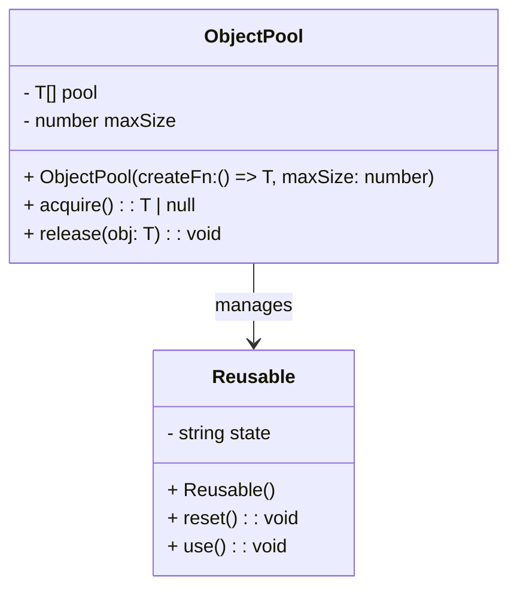

## 4.6 Object Pool Pattern

In the world of software engineering, efficiency and resource management are paramount, especially when dealing with objects that are expensive to create. The Object Pool Pattern is a creational design pattern that addresses this challenge by reusing objects, thereby reducing memory and processing overhead. In this section, we will delve into the Object Pool Pattern, its components, and its implementation in TypeScript.

### Understanding the Object Pool Pattern

The Object Pool Pattern is designed to manage a pool of reusable objects. Instead of creating and destroying objects repeatedly, which can be resource-intensive, the pattern maintains a set of initialized objects that are ready for use. When an object is needed, it is retrieved from the pool, and when it is no longer needed, it is returned to the pool for future reuse.

#### Intent of the Object Pool Pattern

- **Optimize Performance**: By reusing objects, the Object Pool Pattern minimizes the overhead associated with object creation and destruction.
- **Efficient Resource Utilization**: It ensures that a limited number of objects are in use at any given time, thus conserving system resources.
- **Improved Response Time**: By having pre-initialized objects ready for use, the pattern can significantly reduce the time required to obtain an object.

### Problems Solved by the Object Pool Pattern

Creating and destroying objects, particularly those that are resource-intensive, can lead to performance bottlenecks. The Object Pool Pattern addresses several key issues:

- **Memory Overhead**: Frequent object creation can lead to increased memory usage and potential memory leaks.
- **Processing Overhead**: The initialization of complex objects can be time-consuming, affecting application performance.
- **Resource Contention**: In environments with limited resources, such as mobile devices or embedded systems, efficient resource management is crucial.

### Key Components of the Object Pool Pattern

The Object Pool Pattern consists of two primary components:

1. **ObjectPool**: This is the manager that handles the pooling logic. It maintains a collection of reusable objects and provides methods to acquire and release them.

2. **Reusable**: These are the objects that are being pooled. They must be designed to be resettable or reinitializable so that they can be reused without issues.

Let's explore these components in detail.

#### The ObjectPool Class

The `ObjectPool` class is responsible for managing the lifecycle of pooled objects. It should provide methods to:

- **Acquire an Object**: Retrieve an available object from the pool.
- **Release an Object**: Return an object to the pool for future use.
- **Initialize the Pool**: Preload the pool with a set number of objects.

Here's a basic implementation of an `ObjectPool` in TypeScript:

```typescript
class ObjectPool<T> {
    private pool: T[] = [];
    private maxSize: number;

    constructor(private createFn: () => T, maxSize: number) {
        this.maxSize = maxSize;
        this.initializePool();
    }

    private initializePool(): void {
        for (let i = 0; i < this.maxSize; i++) {
            this.pool.push(this.createFn());
        }
    }

    acquire(): T | null {
        if (this.pool.length > 0) {
            return this.pool.pop()!;
        }
        return null;
    }

    release(obj: T): void {
        if (this.pool.length < this.maxSize) {
            this.pool.push(obj);
        }
    }
}
```

In this implementation, the `ObjectPool` class uses a factory function `createFn` to initialize the pool with a specified number of objects (`maxSize`). The `acquire` method retrieves an object from the pool, while the `release` method returns an object to the pool.

#### The Reusable Object

A `Reusable` object is any object that can be reset and reused. It should implement a method to reset its state, ensuring that it is ready for the next use.

Here's an example of a simple `Reusable` object:

```typescript
class Reusable {
    private state: string;

    constructor() {
        this.state = "initial";
    }

    reset(): void {
        this.state = "initial";
    }

    use(): void {
        this.state = "in use";
        console.log("Using object with state:", this.state);
    }
}
```

In this example, the `Reusable` class has a `reset` method that returns the object to its initial state. This is crucial for ensuring that objects can be reused without unintended side effects.

### Scenarios Justifying the Use of an Object Pool

The Object Pool Pattern is particularly useful in scenarios where object creation is costly, such as:

- **Database Connections**: Establishing a database connection can be resource-intensive. Using a pool of connections can significantly improve performance.
- **Thread Management**: In multithreaded applications, creating and destroying threads can be expensive. A thread pool can manage threads efficiently.
- **Graphics Rendering**: In graphics-intensive applications, reusing objects like textures or sprites can reduce the load on the graphics processing unit (GPU).

### Visualizing the Object Pool Pattern

To better understand the Object Pool Pattern, let's visualize its components and workflow using a class diagram.



**Diagram Description**: The class diagram illustrates the relationship between the `ObjectPool` and `Reusable` classes. The `ObjectPool` manages a collection of `Reusable` objects, providing methods to acquire and release them.

### Implementing the Object Pool Pattern in TypeScript

Let's implement a complete example of the Object Pool Pattern in TypeScript, focusing on a scenario where database connections are pooled.

```typescript
// Simulating a database connection
class DatabaseConnection {
    private connectionId: number;

    constructor(id: number) {
        this.connectionId = id;
    }

    connect(): void {
        console.log(`Connecting to database with ID: ${this.connectionId}`);
    }

    disconnect(): void {
        console.log(`Disconnecting from database with ID: ${this.connectionId}`);
    }

    reset(): void {
        console.log(`Resetting connection with ID: ${this.connectionId}`);
    }
}

// DatabaseConnectionPool manages a pool of DatabaseConnection objects
class DatabaseConnectionPool {
    private pool: DatabaseConnection[] = [];
    private maxSize: number;
    private currentId: number = 0;

    constructor(maxSize: number) {
        this.maxSize = maxSize;
        this.initializePool();
    }

    private initializePool(): void {
        for (let i = 0; i < this.maxSize; i++) {
            this.pool.push(new DatabaseConnection(this.currentId++));
        }
    }

    acquire(): DatabaseConnection | null {
        if (this.pool.length > 0) {
            const connection = this.pool.pop()!;
            connection.connect();
            return connection;
        }
        console.log("No available connections.");
        return null;
    }

    release(connection: DatabaseConnection): void {
        connection.disconnect();
        connection.reset();
        if (this.pool.length < this.maxSize) {
            this.pool.push(connection);
        }
    }
}

// Usage example
const pool = new DatabaseConnectionPool(3);

const conn1 = pool.acquire();
const conn2 = pool.acquire();
const conn3 = pool.acquire();
const conn4 = pool.acquire(); // No available connections

if (conn1) pool.release(conn1);
if (conn2) pool.release(conn2);
if (conn3) pool.release(conn3);
```

In this example, the `DatabaseConnectionPool` manages a pool of `DatabaseConnection` objects. The `acquire` method retrieves a connection from the pool, while the `release` method returns it to the pool after disconnecting and resetting it.

### Try It Yourself

Experiment with the code by modifying the `maxSize` of the pool or adding additional methods to the `DatabaseConnection` class. Observe how the pool manages connections and how changes affect the overall performance.

### Knowledge Check

- **Question**: What are the primary benefits of using the Object Pool Pattern?
- **Challenge**: Implement an object pool for a different type of resource, such as a thread or a network socket.

### Key Takeaways

- The Object Pool Pattern is a creational design pattern that optimizes performance by reusing objects that are expensive to create.
- It consists of an `ObjectPool` class that manages the pooling logic and `Reusable` objects that are resettable and reusable.
- This pattern is particularly useful in scenarios where object creation is costly, such as database connections, thread management, and graphics rendering.

### Conclusion

The Object Pool Pattern is a powerful tool for managing resources efficiently in software applications. By reusing objects, it reduces memory and processing overhead, leading to improved performance and resource utilization. As you continue to explore design patterns, consider how the Object Pool Pattern can be applied to optimize your applications.

## Quiz Time!



### What is the primary purpose of the Object Pool Pattern?

- [x] To reuse objects that are expensive to create
- [ ] To create new objects on demand
- [ ] To simplify object creation logic
- [ ] To manage object destruction

> **Explanation:** The Object Pool Pattern is designed to reuse objects that are costly to create, thereby optimizing performance and resource utilization.

### Which component of the Object Pool Pattern manages the pooling logic?

- [x] ObjectPool
- [ ] Reusable
- [ ] Factory
- [ ] Singleton

> **Explanation:** The `ObjectPool` class is responsible for managing the lifecycle of pooled objects, including acquiring and releasing them.

### What method should a Reusable object implement to be resettable?

- [x] reset()
- [ ] initialize()
- [ ] destroy()
- [ ] configure()

> **Explanation:** A `Reusable` object should implement a `reset()` method to return it to its initial state, ensuring it can be reused without issues.

### In which scenario is the Object Pool Pattern particularly useful?

- [x] When object creation is costly
- [ ] When objects are simple and lightweight
- [ ] When objects are rarely used
- [ ] When objects do not require initialization

> **Explanation:** The Object Pool Pattern is beneficial when object creation is resource-intensive, such as database connections or thread management.

### What does the acquire() method in the ObjectPool class do?

- [x] Retrieves an available object from the pool
- [ ] Creates a new object
- [ ] Destroys an object
- [ ] Initializes the pool

> **Explanation:** The `acquire()` method retrieves an available object from the pool for use.

### What is a potential drawback of using the Object Pool Pattern?

- [x] Increased complexity in managing object states
- [ ] Reduced performance due to object reuse
- [ ] Increased memory usage
- [ ] Simplified object creation

> **Explanation:** Managing object states can become complex, as objects must be properly reset before being reused.

### How does the Object Pool Pattern improve response time?

- [x] By having pre-initialized objects ready for use
- [ ] By creating objects on demand
- [ ] By destroying unused objects
- [ ] By simplifying object creation logic

> **Explanation:** Pre-initialized objects reduce the time required to obtain an object, improving response time.

### What is the role of the release() method in the ObjectPool class?

- [x] Returns an object to the pool for future use
- [ ] Acquires a new object
- [ ] Destroys an object
- [ ] Initializes the pool

> **Explanation:** The `release()` method returns an object to the pool, making it available for future use.

### True or False: The Object Pool Pattern is only useful for database connections.

- [ ] True
- [x] False

> **Explanation:** While the Object Pool Pattern is beneficial for database connections, it can be applied to any scenario where object creation is costly.

### What should you consider when implementing an Object Pool?

- [x] The maximum size of the pool
- [x] The reset logic for reusable objects
- [ ] The destruction logic for objects
- [ ] The creation logic for new objects

> **Explanation:** When implementing an Object Pool, consider the maximum size of the pool and how reusable objects will be reset for reuse.



Remember, this is just the beginning. As you progress, you'll build more complex and interactive applications. Keep experimenting, stay curious, and enjoy the journey!
