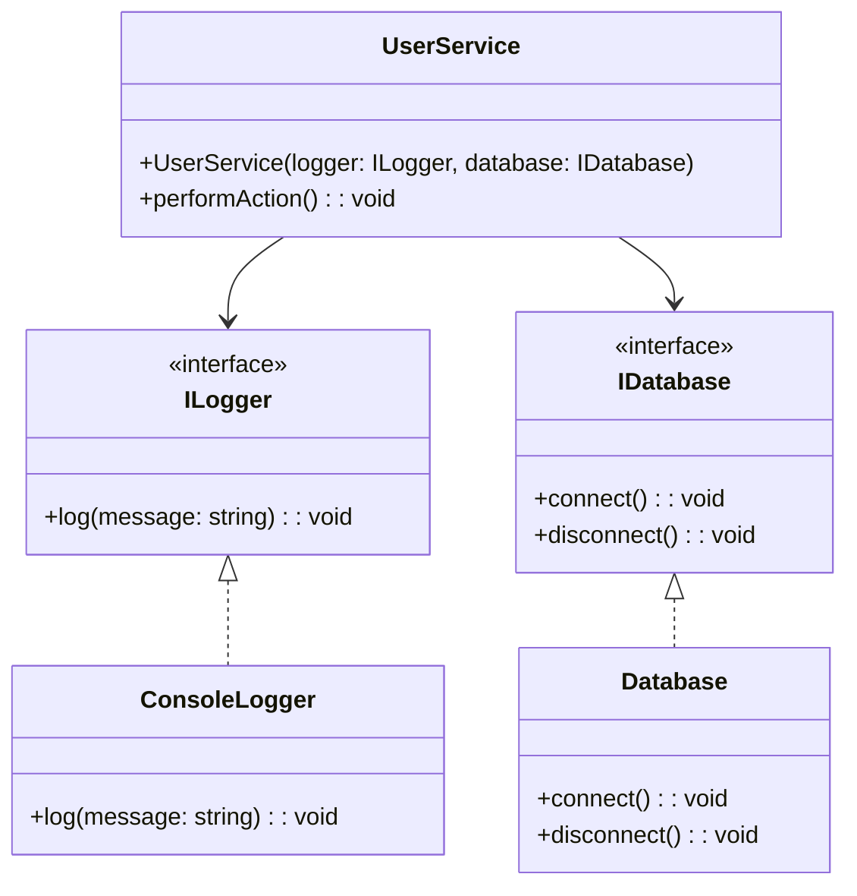

## 4.7.1 Implementing Dependency Injection in TypeScript

Dependency Injection (DI) is a powerful design pattern that promotes loose coupling and enhances the modularity and testability of your code. In this section, we will delve into how to implement Dependency Injection in TypeScript, leveraging its robust type system and modern features. We will explore how to use interfaces and constructor injection to decouple classes from their dependencies, making your code more flexible and easier to test.

### Understanding Dependency Injection

Dependency Injection is a technique where an object receives its dependencies from an external source rather than creating them internally. This approach allows for greater flexibility as it separates the creation of dependencies from their usage.

#### Key Concepts

- **Inversion of Control (IoC):** A principle where the control of object creation and management is inverted, allowing for more flexible and reusable code.
- **Dependency Injection Container (DIC):** A framework that automatically provides dependencies to classes, managing their lifecycle and configuration.

### Why Use Dependency Injection?

- **Decoupling:** By injecting dependencies, classes are not tightly bound to specific implementations, allowing for easier changes and enhancements.
- **Testability:** DI facilitates unit testing by allowing mock implementations to be easily substituted for real dependencies.
- **Maintainability:** With DI, the code becomes more modular, making it easier to maintain and extend.

### Implementing Dependency Injection in TypeScript

Let's explore how to implement Dependency Injection in TypeScript using interfaces and constructor injection.

#### Step 1: Define Interfaces for Dependencies

To decouple classes from specific implementations, we start by defining interfaces for the dependencies.

```typescript
// Define an interface for a Logger
interface ILogger {
  log(message: string): void;
}

// Define an interface for a Database
interface IDatabase {
  connect(): void;
  disconnect(): void;
}
```

#### Step 2: Implement Concrete Classes

Next, we implement concrete classes that adhere to these interfaces.

```typescript
// Implement a ConsoleLogger that adheres to ILogger
class ConsoleLogger implements ILogger {
  log(message: string): void {
    console.log(`ConsoleLogger: ${message}`);
  }
}

// Implement a Database class that adheres to IDatabase
class Database implements IDatabase {
  connect(): void {
    console.log('Database connected');
  }
  
  disconnect(): void {
    console.log('Database disconnected');
  }
}
```

#### Step 3: Inject Dependencies via Constructor

We create a class that requires these dependencies and inject them through its constructor.

```typescript
// A service that requires a logger and a database
class UserService {
  constructor(private logger: ILogger, private database: IDatabase) {}

  performAction(): void {
    this.logger.log('Performing an action');
    this.database.connect();
    // Perform some operations
    this.database.disconnect();
    this.logger.log('Action completed');
  }
}
```

#### Step 4: Instantiate and Use the Service

Finally, we instantiate the concrete classes and inject them into the `UserService`.

```typescript
// Instantiate the dependencies
const logger = new ConsoleLogger();
const database = new Database();

// Inject dependencies into the UserService
const userService = new UserService(logger, database);

// Use the service
userService.performAction();
```

### Benefits of Constructor Injection

- **Type Safety:** TypeScript's type system ensures that the injected dependencies conform to the expected interfaces.
- **Flexibility:** Allows for easy substitution of different implementations, such as mock objects for testing.
- **Clarity:** The constructor clearly indicates the dependencies required by the class.

### Testing with Dependency Injection

One of the significant advantages of using Dependency Injection is the ease of testing. By injecting mock implementations, we can isolate the class under test and verify its behavior independently.

#### Example: Testing `UserService`

Let's create a mock implementation of `ILogger` for testing purposes.

```typescript
// Mock implementation of ILogger
class MockLogger implements ILogger {
  log(message: string): void {
    // Mock logging behavior
  }
}

// Test case for UserService
function testUserService() {
  const mockLogger = new MockLogger();
  const mockDatabase = new Database(); // You can also mock the database

  const userService = new UserService(mockLogger, mockDatabase);

  userService.performAction();

  // Assert expected behavior
  console.log('Test passed');
}

testUserService();
```

### TypeScript Features Facilitating Dependency Injection

TypeScript offers several features that enhance the implementation of Dependency Injection:

- **Interfaces:** Provide a way to define contracts for dependencies, ensuring that classes adhere to expected behaviors.
- **Decorators:** Although experimental, decorators can be used to annotate classes and methods for dependency injection frameworks.
- **Type Annotations:** Ensure that injected dependencies match the expected types, providing compile-time safety.

### Visualizing Dependency Injection

To better understand the flow of Dependency Injection, let's visualize the process using a class diagram.



**Diagram Description:** This class diagram illustrates the relationships between interfaces, concrete implementations, and the `UserService` class that uses Dependency Injection.

### Advanced Dependency Injection Techniques

While constructor injection is the most common form of DI, there are other techniques and patterns that can be employed to enhance flexibility and maintainability.

#### Property Injection

In property injection, dependencies are set directly on the properties of a class rather than through the constructor. This can be useful when the dependencies are optional or when using frameworks that support this pattern.

```typescript
class AnotherService {
  private logger!: ILogger; // Dependency to be injected
  private database!: IDatabase; // Dependency to be injected

  setLogger(logger: ILogger): void {
    this.logger = logger;
  }

  setDatabase(database: IDatabase): void {
    this.database = database;
  }

  performAction(): void {
    this.logger.log('Performing an action with property injection');
    this.database.connect();
    // Perform some operations
    this.database.disconnect();
    this.logger.log('Action completed');
  }
}

// Usage
const anotherService = new AnotherService();
anotherService.setLogger(new ConsoleLogger());
anotherService.setDatabase(new Database());
anotherService.performAction();
```

#### Method Injection

Method injection involves passing dependencies as parameters to specific methods. This approach is less common but can be useful when the dependency is only needed for a particular operation.

```typescript
class YetAnotherService {
  performAction(logger: ILogger, database: IDatabase): void {
    logger.log('Performing an action with method injection');
    database.connect();
    // Perform some operations
    database.disconnect();
    logger.log('Action completed');
  }
}

// Usage
const yetAnotherService = new YetAnotherService();
yetAnotherService.performAction(new ConsoleLogger(), new Database());
```

### Using Dependency Injection Containers

For larger applications, manually managing dependencies can become cumbersome. Dependency Injection Containers (DIC) automate this process, providing a centralized way to configure and manage dependencies.

#### Example: Using InversifyJS

InversifyJS is a popular DI container for TypeScript that supports decorators and provides a robust framework for managing dependencies.

1. **Install InversifyJS:**

   ```bash
   npm install inversify reflect-metadata
   ```

2. **Configure InversifyJS:**

   ```typescript
   import 'reflect-metadata';
   import { Container, injectable, inject } from 'inversify';

   // Define identifiers for dependencies
   const TYPES = {
     ILogger: Symbol.for('ILogger'),
     IDatabase: Symbol.for('IDatabase'),
   };

   // Annotate classes with @injectable
   @injectable()
   class ConsoleLogger implements ILogger {
     log(message: string): void {
       console.log(`ConsoleLogger: ${message}`);
     }
   }

   @injectable()
   class Database implements IDatabase {
     connect(): void {
       console.log('Database connected');
     }

     disconnect(): void {
       console.log('Database disconnected');
     }
   }

   // Annotate UserService with @injectable and inject dependencies
   @injectable()
   class UserService {
     constructor(
       @inject(TYPES.ILogger) private logger: ILogger,
       @inject(TYPES.IDatabase) private database: IDatabase
     ) {}

     performAction(): void {
       this.logger.log('Performing an action with InversifyJS');
       this.database.connect();
       // Perform some operations
       this.database.disconnect();
       this.logger.log('Action completed');
     }
   }

   // Create and configure the container
   const container = new Container();
   container.bind<ILogger>(TYPES.ILogger).to(ConsoleLogger);
   container.bind<IDatabase>(TYPES.IDatabase).to(Database);
   container.bind<UserService>(UserService).toSelf();

   // Resolve dependencies and use the service
   const userService = container.get<UserService>(UserService);
   userService.performAction();
   ```

### Try It Yourself

Experiment with the code examples provided:

- **Modify the `ConsoleLogger`** to add timestamps to the log messages.
- **Create a new implementation of `IDatabase`** that simulates a different type of database connection.
- **Use property injection** to inject dependencies into `UserService` and observe how it changes the code structure.

### Knowledge Check

- **What are the benefits of using Dependency Injection?**
- **How does TypeScript's type system enhance Dependency Injection?**
- **What is the difference between constructor injection, property injection, and method injection?**

### Embrace the Journey

Remember, implementing Dependency Injection is just the beginning. As you progress, you'll discover more patterns and techniques that will help you build robust and maintainable applications. Keep experimenting, stay curious, and enjoy the journey!

## Quiz Time!



### What is the primary benefit of using Dependency Injection?

- [x] Decoupling classes from their dependencies
- [ ] Increasing runtime performance
- [ ] Reducing code size
- [ ] Enhancing UI design

> **Explanation:** Dependency Injection primarily aims to decouple classes from their dependencies, making the code more modular and easier to test.

### Which TypeScript feature is crucial for enforcing contracts between classes and their dependencies?

- [x] Interfaces
- [ ] Enums
- [ ] Type Aliases
- [ ] Decorators

> **Explanation:** Interfaces in TypeScript are used to define contracts, ensuring that classes adhere to expected behaviors and types.

### What is constructor injection?

- [x] Passing dependencies through a class constructor
- [ ] Setting dependencies directly on class properties
- [ ] Passing dependencies as method parameters
- [ ] Using decorators to inject dependencies

> **Explanation:** Constructor injection involves passing dependencies to a class through its constructor, making them available throughout the class.

### How does Dependency Injection improve testability?

- [x] By allowing mock implementations to be easily substituted
- [ ] By reducing the number of test cases
- [ ] By eliminating the need for testing
- [ ] By automating test generation

> **Explanation:** Dependency Injection allows for mock implementations to be substituted for real dependencies, making it easier to isolate and test classes.

### What is the role of a Dependency Injection Container?

- [x] To manage the lifecycle and configuration of dependencies
- [ ] To compile TypeScript code
- [ ] To store application data
- [ ] To handle user authentication

> **Explanation:** A Dependency Injection Container manages the lifecycle and configuration of dependencies, automating their injection into classes.

### Which library is commonly used for Dependency Injection in TypeScript?

- [x] InversifyJS
- [ ] Lodash
- [ ] Axios
- [ ] Express

> **Explanation:** InversifyJS is a popular library for implementing Dependency Injection in TypeScript applications.

### What is property injection?

- [x] Setting dependencies directly on class properties
- [ ] Passing dependencies through a class constructor
- [ ] Passing dependencies as method parameters
- [ ] Using decorators to inject dependencies

> **Explanation:** Property injection involves setting dependencies directly on the properties of a class, often used when dependencies are optional.

### Which of the following is an example of method injection?

- [x] Passing dependencies as parameters to specific methods
- [ ] Using decorators to inject dependencies
- [ ] Passing dependencies through a class constructor
- [ ] Setting dependencies directly on class properties

> **Explanation:** Method injection involves passing dependencies as parameters to specific methods, used when dependencies are only needed for certain operations.

### What is the purpose of using interfaces in Dependency Injection?

- [x] To define contracts for dependencies
- [ ] To increase code execution speed
- [ ] To reduce memory usage
- [ ] To improve UI design

> **Explanation:** Interfaces are used to define contracts for dependencies, ensuring that classes adhere to expected behaviors and types.

### True or False: Dependency Injection can only be implemented using constructor injection.

- [ ] True
- [x] False

> **Explanation:** Dependency Injection can be implemented using constructor injection, property injection, and method injection, each suited for different scenarios.


