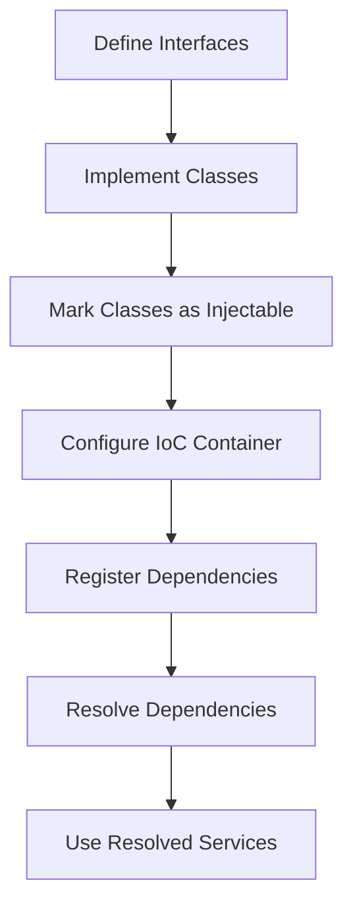

## 4.7.2 Inversion of Control Containers

In the realm of software engineering, managing dependencies effectively is crucial for building scalable and maintainable applications. Inversion of Control (IoC) containers play a pivotal role in this process by automating dependency injection and reducing the coupling between components. In this section, we will delve into the concept of IoC containers, explore their implementation in TypeScript using popular libraries like InversifyJS, and discuss the benefits and considerations of using IoC containers in your projects.

### Understanding Inversion of Control (IoC)

Inversion of Control is a design principle in which the control of object creation and dependency management is transferred from the application code to a container or framework. This principle is often implemented using Dependency Injection (DI), where dependencies are provided to a class rather than being created by the class itself. IoC containers facilitate this process by managing the lifecycle and resolution of dependencies automatically.

### What is an IoC Container?

An IoC container is a framework that provides a centralized mechanism for managing object creation and dependency injection. It allows developers to define how objects should be constructed and how their dependencies should be resolved. The container takes care of instantiating objects and injecting the required dependencies, thereby promoting loose coupling and enhancing testability.

#### Key Features of IoC Containers

- **Dependency Resolution**: Automatically resolves and injects dependencies into objects.
- **Lifecycle Management**: Manages the lifecycle of objects, such as singleton or transient instances.
- **Centralized Configuration**: Provides a single place to configure dependencies, making it easier to manage and update.
- **Scalability**: Supports large-scale applications by organizing dependencies efficiently.

### Popular IoC Containers for TypeScript

Several IoC containers are available for TypeScript, each offering unique features and capabilities. Here, we'll focus on InversifyJS, a widely-used IoC container that integrates seamlessly with TypeScript.

#### InversifyJS

InversifyJS is a powerful and flexible IoC container designed specifically for TypeScript and JavaScript applications. It leverages TypeScript's decorators and metadata capabilities to provide a robust dependency injection framework.

##### Key Features of InversifyJS

- **Type Safety**: Utilizes TypeScript's type system to ensure type safety.
- **Decorators**: Supports decorators for defining injectable classes and dependencies.
- **Modular Architecture**: Encourages a modular approach to application design.
- **Integration**: Easily integrates with other libraries and frameworks.

### Setting Up an IoC Container in TypeScript

Let's walk through the process of setting up and configuring an IoC container using InversifyJS in a TypeScript project.

#### Step 1: Install InversifyJS

First, install InversifyJS and its dependencies using npm:

```bash
npm install inversify reflect-metadata
```

The `reflect-metadata` package is required for using decorators in TypeScript.

#### Step 2: Configure TypeScript

Ensure that your `tsconfig.json` file is configured to support decorators and metadata reflection:

```json
{
  "compilerOptions": {
    "target": "ES6",
    "module": "commonjs",
    "experimentalDecorators": true,
    "emitDecoratorMetadata": true
  }
}
```

#### Step 3: Define Interfaces and Classes

Define interfaces and classes that represent the components and services in your application. Use decorators to mark classes as injectable.

```typescript
import { injectable, inject } from "inversify";

// Define an interface for a service
interface ILogger {
  log(message: string): void;
}

// Implement the service
@injectable()
class ConsoleLogger implements ILogger {
  log(message: string): void {
    console.log(message);
  }
}

// Define another service that depends on ILogger
interface IAppService {
  run(): void;
}

@injectable()
class AppService implements IAppService {
  private logger: ILogger;

  constructor(@inject("ILogger") logger: ILogger) {
    this.logger = logger;
  }

  run(): void {
    this.logger.log("AppService is running.");
  }
}
```

#### Step 4: Set Up the IoC Container

Create and configure an IoC container to manage the dependencies.

```typescript
import { Container } from "inversify";

// Create a new IoC container
const container = new Container();

// Bind interfaces to their implementations
container.bind<ILogger>("ILogger").to(ConsoleLogger);
container.bind<IAppService>("IAppService").to(AppService);
```

#### Step 5: Resolve Dependencies

Resolve dependencies from the container and use them in your application.

```typescript
// Resolve the IAppService from the container
const appService = container.get<IAppService>("IAppService");

// Use the resolved service
appService.run();
```

### Benefits of Using IoC Containers

Implementing an IoC container in your TypeScript application offers several advantages:

- **Centralized Configuration**: All dependencies are configured in one place, making it easier to manage and update them.
- **Improved Scalability**: IoC containers support large-scale applications by organizing dependencies efficiently.
- **Enhanced Testability**: Dependencies can be easily mocked or replaced during testing, facilitating unit testing.
- **Loose Coupling**: Classes are decoupled from their dependencies, promoting a modular architecture.

### Considerations and Challenges

While IoC containers provide numerous benefits, there are some considerations to keep in mind:

- **Performance Overhead**: IoC containers introduce a slight performance overhead due to the additional layer of abstraction.
- **Complexity**: The use of IoC containers can add complexity to the project, especially for smaller applications.
- **Learning Curve**: Developers need to familiarize themselves with the IoC container's API and configuration.

### Visualizing IoC Container Workflow

To better understand how IoC containers work, let's visualize the process of dependency resolution and injection using a flowchart.



**Caption**: This flowchart illustrates the steps involved in setting up and using an IoC container in a TypeScript application.

### Try It Yourself

To get hands-on experience with IoC containers, try modifying the code examples provided:

- **Add a New Service**: Create a new service that depends on `IAppService` and register it with the container.
- **Change Implementations**: Swap out `ConsoleLogger` for a different logger implementation and observe the changes.
- **Experiment with Scopes**: Explore different scopes (singleton, transient) for your services and see how they affect the application's behavior.

### References and Further Reading

For more information on IoC containers and dependency injection in TypeScript, consider exploring the following resources:

- [InversifyJS Documentation](https://inversify.io/)
- [TypeScript Handbook - Decorators](https://www.typescriptlang.org/docs/handbook/decorators.html)
- [Reflect Metadata](https://rbuckton.github.io/reflect-metadata/)

### Knowledge Check

Before we conclude, let's reinforce our understanding of IoC containers with a few questions:

- What is the primary role of an IoC container in a TypeScript application?
- How does InversifyJS leverage TypeScript's type system and decorators?
- What are the benefits of using an IoC container for dependency management?
- What considerations should be taken into account when using IoC containers?

Remember, mastering IoC containers is just one step in building robust and scalable TypeScript applications. Keep experimenting, stay curious, and enjoy the journey!

## Quiz Time!



### What is the primary role of an IoC container?

- [x] To manage object creation and dependency injection automatically
- [ ] To store application configuration settings
- [ ] To handle HTTP requests and responses
- [ ] To manage database connections

> **Explanation:** An IoC container's primary role is to manage object creation and dependency injection automatically, promoting loose coupling and enhancing testability.

### Which of the following is a popular IoC container for TypeScript?

- [x] InversifyJS
- [ ] AngularJS
- [ ] ReactJS
- [ ] NodeJS

> **Explanation:** InversifyJS is a popular IoC container for TypeScript, designed to manage dependencies and support dependency injection.

### What is the purpose of the `reflect-metadata` package in TypeScript?

- [x] To enable the use of decorators and metadata reflection
- [ ] To provide additional type-checking capabilities
- [ ] To enhance performance of TypeScript applications
- [ ] To manage application state

> **Explanation:** The `reflect-metadata` package is used to enable the use of decorators and metadata reflection in TypeScript applications.

### How do you mark a class as injectable in InversifyJS?

- [x] By using the `@injectable()` decorator
- [ ] By implementing an interface
- [ ] By extending a base class
- [ ] By using the `@inject()` decorator

> **Explanation:** In InversifyJS, a class is marked as injectable by using the `@injectable()` decorator.

### What is a potential drawback of using IoC containers?

- [x] Performance overhead
- [ ] Improved scalability
- [ ] Enhanced testability
- [ ] Centralized configuration

> **Explanation:** A potential drawback of using IoC containers is the performance overhead introduced by the additional layer of abstraction.

### What is the benefit of centralized configuration in IoC containers?

- [x] Easier management and updating of dependencies
- [ ] Increased complexity
- [ ] Reduced testability
- [ ] Decreased scalability

> **Explanation:** Centralized configuration in IoC containers makes it easier to manage and update dependencies, improving maintainability.

### How does an IoC container improve testability?

- [x] By allowing dependencies to be easily mocked or replaced
- [ ] By reducing the need for unit tests
- [ ] By increasing the complexity of the code
- [ ] By making classes tightly coupled

> **Explanation:** An IoC container improves testability by allowing dependencies to be easily mocked or replaced, facilitating unit testing.

### What is the role of decorators in InversifyJS?

- [x] To define injectable classes and dependencies
- [ ] To enhance application performance
- [ ] To manage application state
- [ ] To handle HTTP requests

> **Explanation:** In InversifyJS, decorators are used to define injectable classes and dependencies, leveraging TypeScript's metadata capabilities.

### What is the advantage of using TypeScript with IoC containers?

- [x] Type safety and better integration with decorators
- [ ] Faster execution speed
- [ ] Simplified syntax
- [ ] Reduced code size

> **Explanation:** Using TypeScript with IoC containers provides type safety and better integration with decorators, enhancing the development experience.

### True or False: IoC containers are only beneficial for large-scale applications.

- [ ] True
- [x] False

> **Explanation:** IoC containers are beneficial for applications of all sizes, as they promote loose coupling, enhance testability, and provide centralized configuration.


