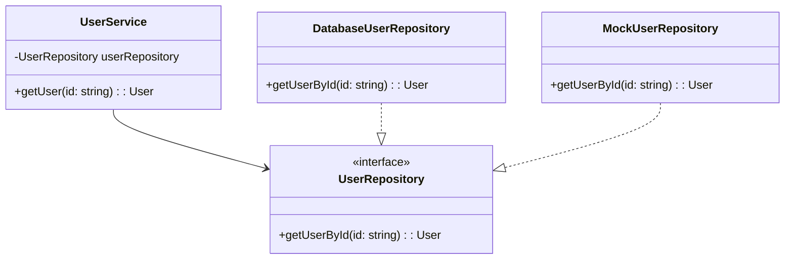

## 4.7.3 Use Cases and Examples

In this section, we delve into the practical applications of the Dependency Injection (DI) pattern in TypeScript. We'll explore how DI enhances testability and flexibility in software design, providing you with real-world examples and scenarios. By the end of this guide, you'll understand how to leverage DI to improve your application's architecture, making it more maintainable and adaptable to change.

### Introduction to Dependency Injection

Dependency Injection is a design pattern that allows for the decoupling of components by injecting dependencies into a class, rather than having the class instantiate them directly. This pattern is crucial for creating flexible and testable code. By abstracting the creation of dependencies, you can easily swap out implementations, making your codebase more adaptable to change.

### Benefits of Dependency Injection

Before diving into specific use cases, let's briefly discuss the benefits of using Dependency Injection:

- **Testability**: DI allows for the injection of mock dependencies, making unit testing more straightforward.
- **Flexibility**: Easily swap out components without altering the dependent class.
- **Maintainability**: Simplifies the addition of new features and reduces code duplication.
- **Separation of Concerns**: Encourages a clean separation between the creation and use of dependencies.

### Use Case 1: Swapping Out Data Repositories

One of the most common use cases for Dependency Injection is swapping out data repositories in a service. This is particularly useful in testing scenarios where you might want to replace a real database connection with a mock or in-memory database.

#### Example: Data Repository Injection

Let's consider a simple example where we have a `UserService` that depends on a `UserRepository` to fetch user data.

```typescript
// Define the UserRepository interface
interface UserRepository {
    getUserById(id: string): Promise<User>;
}

// Implement a concrete UserRepository
class DatabaseUserRepository implements UserRepository {
    async getUserById(id: string): Promise<User> {
        // Logic to fetch user from a database
    }
}

// Implement a mock UserRepository for testing
class MockUserRepository implements UserRepository {
    async getUserById(id: string): Promise<User> {
        // Return a mock user
        return { id, name: "Mock User" };
    }
}

// UserService depends on UserRepository
class UserService {
    constructor(private userRepository: UserRepository) {}

    async getUser(id: string): Promise<User> {
        return this.userRepository.getUserById(id);
    }
}

// Usage
const userRepository = new DatabaseUserRepository();
const userService = new UserService(userRepository);

// For testing
const mockRepository = new MockUserRepository();
const testUserService = new UserService(mockRepository);
```

In this example, the `UserService` class depends on the `UserRepository` interface. By injecting the dependency, we can easily swap out the `DatabaseUserRepository` with a `MockUserRepository` during testing, allowing us to test the `UserService` in isolation.

### Use Case 2: Injecting Different Logging Mechanisms

Another practical application of Dependency Injection is injecting different logging mechanisms based on the environment. This allows for more flexible logging strategies, such as using a console logger in development and a file or remote logger in production.

#### Example: Logging Mechanism Injection

Consider a scenario where we have a `Logger` interface and different implementations for development and production environments.

```typescript
// Define the Logger interface
interface Logger {
    log(message: string): void;
}

// Implement a console logger for development
class ConsoleLogger implements Logger {
    log(message: string): void {
        console.log(`ConsoleLogger: ${message}`);
    }
}

// Implement a file logger for production
class FileLogger implements Logger {
    log(message: string): void {
        // Logic to write the message to a file
    }
}

// Application class that uses Logger
class Application {
    constructor(private logger: Logger) {}

    run(): void {
        this.logger.log("Application is running");
    }
}

// Usage
const logger: Logger = process.env.NODE_ENV === 'production' ? new FileLogger() : new ConsoleLogger();
const app = new Application(logger);
app.run();
```

In this example, the `Application` class depends on the `Logger` interface. By injecting the appropriate logger implementation based on the environment, we can ensure that the application logs messages correctly in both development and production.

### Use Case 3: Implementing Plugins or Modular Architectures

Dependency Injection is also instrumental in implementing plugins or modular architectures where components can be easily exchanged. This approach is common in applications that require extensibility and modularity.

#### Example: Plugin Architecture

Let's explore a scenario where we have a `PaymentProcessor` interface and different implementations for various payment gateways.

```typescript
// Define the PaymentProcessor interface
interface PaymentProcessor {
    processPayment(amount: number): void;
}

// Implement a PayPal payment processor
class PayPalProcessor implements PaymentProcessor {
    processPayment(amount: number): void {
        console.log(`Processing payment of $${amount} through PayPal`);
    }
}

// Implement a Stripe payment processor
class StripeProcessor implements PaymentProcessor {
    processPayment(amount: number): void {
        console.log(`Processing payment of $${amount} through Stripe`);
    }
}

// E-commerce application class
class ECommerceApp {
    constructor(private paymentProcessor: PaymentProcessor) {}

    checkout(amount: number): void {
        this.paymentProcessor.processPayment(amount);
    }
}

// Usage
const paymentProcessor: PaymentProcessor = new PayPalProcessor();
const app = new ECommerceApp(paymentProcessor);
app.checkout(100);

// Switching to Stripe
const stripeProcessor: PaymentProcessor = new StripeProcessor();
const stripeApp = new ECommerceApp(stripeProcessor);
stripeApp.checkout(200);
```

In this example, the `ECommerceApp` class depends on the `PaymentProcessor` interface. By injecting different payment processor implementations, we can easily switch between PayPal and Stripe without altering the application's core logic.

### How DI Enhances Unit Testing

One of the most significant advantages of Dependency Injection is its impact on unit testing. By allowing for the injection of mock dependencies, DI makes it easier to test classes in isolation.

#### Example: Unit Testing with Mock Dependencies

Consider the `UserService` example from earlier. We can write unit tests for the `UserService` by injecting a mock `UserRepository`.

```typescript
import { expect } from 'chai';
import { describe, it } from 'mocha';

// Mock implementation of UserRepository
class MockUserRepository implements UserRepository {
    async getUserById(id: string): Promise<User> {
        return { id, name: "Mock User" };
    }
}

describe('UserService', () => {
    it('should return a user', async () => {
        const mockRepository = new MockUserRepository();
        const userService = new UserService(mockRepository);

        const user = await userService.getUser('123');
        expect(user.name).to.equal('Mock User');
    });
});
```

In this test, we inject a `MockUserRepository` into the `UserService`, allowing us to verify the behavior of the `getUser` method without relying on a real database.

### Impact on Code Maintainability

Dependency Injection significantly improves code maintainability by promoting a clean separation of concerns. By decoupling the creation and use of dependencies, DI makes it easier to modify and extend the application without affecting existing components.

#### Example: Adding New Features

Let's revisit the `ECommerceApp` example. Suppose we want to add a new payment processor, such as `SquareProcessor`. With DI, this is as simple as implementing the `PaymentProcessor` interface and injecting the new implementation.

```typescript
// Implement a Square payment processor
class SquareProcessor implements PaymentProcessor {
    processPayment(amount: number): void {
        console.log(`Processing payment of $${amount} through Square`);
    }
}

// Usage
const squareProcessor: PaymentProcessor = new SquareProcessor();
const squareApp = new ECommerceApp(squareProcessor);
squareApp.checkout(300);
```

By adhering to the DI pattern, we can add new features like the `SquareProcessor` without modifying the existing `ECommerceApp` logic, thus enhancing maintainability.

### Encouraging DI Adoption

Adopting Dependency Injection principles can significantly improve the design and flexibility of your applications. Here are some tips to encourage DI adoption:

- **Start Small**: Begin by applying DI to a small part of your application, such as a single service or component.
- **Use Interfaces**: Define interfaces for your dependencies to facilitate easy swapping and testing.
- **Leverage DI Frameworks**: Consider using DI frameworks like InversifyJS to manage dependencies more efficiently.
- **Educate Your Team**: Share the benefits of DI with your team and encourage them to adopt DI practices in their code.

### Try It Yourself

To solidify your understanding of Dependency Injection, try modifying the examples provided:

- **Experiment with Different Repositories**: Create additional repository implementations and inject them into the `UserService`.
- **Implement Additional Loggers**: Add new logging mechanisms, such as a remote logger, and inject them into the `Application`.
- **Extend the Plugin Architecture**: Implement additional payment processors and inject them into the `ECommerceApp`.

### Visualizing Dependency Injection

To better understand how Dependency Injection works, let's visualize the process using a class diagram.



This diagram illustrates the relationship between the `UserService`, `UserRepository`, and its implementations. The `UserService` depends on the `UserRepository` interface, allowing for different implementations to be injected.

### Conclusion

Dependency Injection is a powerful design pattern that enhances testability, flexibility, and maintainability in TypeScript applications. By decoupling the creation and use of dependencies, DI allows for easy swapping of components, making your codebase more adaptable to change. As you continue to explore and implement DI in your projects, you'll discover its potential to improve your application's architecture and design.

## Quiz Time!



### What is a primary benefit of using Dependency Injection in TypeScript?

- [x] It enhances testability by allowing for the injection of mock dependencies.
- [ ] It increases the complexity of the codebase.
- [ ] It reduces the need for interfaces.
- [ ] It eliminates the need for unit testing.

> **Explanation:** Dependency Injection enhances testability by allowing for the injection of mock dependencies, making it easier to test classes in isolation.

### How does Dependency Injection improve code maintainability?

- [x] By promoting a clean separation of concerns.
- [ ] By increasing the number of dependencies.
- [ ] By removing the need for interfaces.
- [ ] By making code less modular.

> **Explanation:** Dependency Injection improves code maintainability by promoting a clean separation of concerns, making it easier to modify and extend the application without affecting existing components.

### Which of the following is a use case for Dependency Injection?

- [x] Swapping out data repositories for testing purposes.
- [ ] Hardcoding dependencies within classes.
- [ ] Reducing the number of classes in an application.
- [ ] Eliminating the need for interfaces.

> **Explanation:** Dependency Injection is commonly used for swapping out data repositories for testing purposes, allowing for easy testing of classes in isolation.

### What is the role of interfaces in Dependency Injection?

- [x] They define contracts for dependencies, facilitating easy swapping and testing.
- [ ] They increase the complexity of the codebase.
- [ ] They eliminate the need for Dependency Injection.
- [ ] They are not used in Dependency Injection.

> **Explanation:** Interfaces define contracts for dependencies, facilitating easy swapping and testing, which is a key aspect of Dependency Injection.

### How can Dependency Injection be used to inject different logging mechanisms?

- [x] By defining a Logger interface and injecting different implementations based on the environment.
- [ ] By hardcoding the logging mechanism within the class.
- [ ] By using global variables for logging.
- [ ] By eliminating the need for logging.

> **Explanation:** Dependency Injection allows for the injection of different logging mechanisms by defining a Logger interface and injecting different implementations based on the environment.

### Which of the following frameworks can be used to manage dependencies in TypeScript?

- [x] InversifyJS
- [ ] jQuery
- [ ] Bootstrap
- [ ] AngularJS

> **Explanation:** InversifyJS is a framework that can be used to manage dependencies in TypeScript applications.

### What is the impact of Dependency Injection on unit testing?

- [x] It makes unit testing easier by allowing for the injection of mock dependencies.
- [ ] It makes unit testing more difficult.
- [ ] It eliminates the need for unit testing.
- [ ] It has no impact on unit testing.

> **Explanation:** Dependency Injection makes unit testing easier by allowing for the injection of mock dependencies, enabling testing of classes in isolation.

### How does Dependency Injection facilitate the addition of new features?

- [x] By allowing new implementations to be injected without modifying existing code.
- [ ] By requiring modifications to all existing classes.
- [ ] By eliminating the need for new features.
- [ ] By increasing the complexity of adding new features.

> **Explanation:** Dependency Injection facilitates the addition of new features by allowing new implementations to be injected without modifying existing code, enhancing maintainability.

### What is a common use case for Dependency Injection in modular architectures?

- [x] Implementing plugins where components can be easily exchanged.
- [ ] Hardcoding dependencies within modules.
- [ ] Reducing the number of modules in an application.
- [ ] Eliminating the need for modularity.

> **Explanation:** Dependency Injection is commonly used in modular architectures to implement plugins where components can be easily exchanged, enhancing flexibility.

### True or False: Dependency Injection eliminates the need for interfaces in TypeScript.

- [ ] True
- [x] False

> **Explanation:** False. Dependency Injection relies on interfaces to define contracts for dependencies, facilitating easy swapping and testing.


