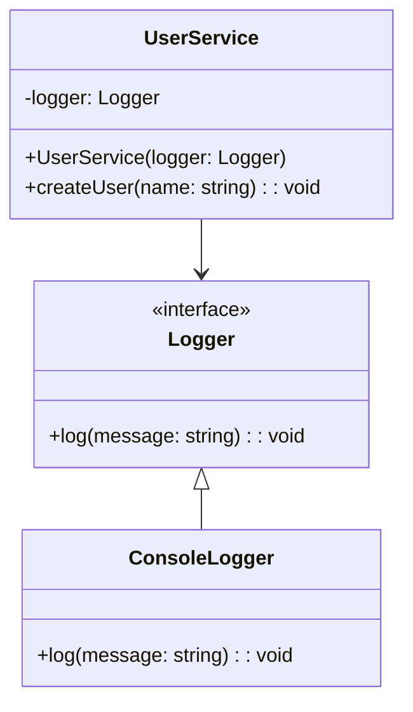

## 4.7 Dependency Injection Pattern

### Introduction

In the world of software engineering, creating maintainable and scalable applications is a primary goal. One of the key techniques to achieve this is through the use of design patterns, which provide reusable solutions to common problems. The Dependency Injection (DI) pattern is a powerful tool in this arsenal, enabling developers to write code that is flexible, testable, and adheres to the principles of good software design. In this section, we'll delve into the Dependency Injection pattern, exploring its purpose, benefits, and implementation in TypeScript.

### What is Dependency Injection?

Dependency Injection is a design pattern used to implement Inversion of Control (IoC) between classes and their dependencies. Instead of a class creating its own dependencies, these dependencies are provided to the class, typically through its constructor, methods, or properties. This approach decouples the class from its dependencies, making the system more flexible and easier to test.

#### Purpose of Dependency Injection

The primary purpose of Dependency Injection is to achieve loose coupling between classes. By decoupling dependencies, we can easily swap out implementations, facilitate unit testing, and adhere to the Dependency Inversion Principle (DIP), which states that high-level modules should not depend on low-level modules but on abstractions.

### Problems Solved by Dependency Injection

#### Tight Coupling

In tightly coupled systems, classes are directly dependent on specific implementations of their dependencies. This makes the system rigid and difficult to modify. For instance, if a class directly instantiates its dependencies, changing the implementation requires modifying the class itself.

#### Difficulty in Testing

Tightly coupled systems are challenging to test because dependencies are hard-coded. This makes it difficult to isolate the class under test and mock its dependencies. Dependency Injection allows us to inject mock dependencies, making unit testing straightforward.

### Types of Dependency Injection

There are three main types of Dependency Injection: Constructor Injection, Setter Injection, and Interface Injection. Each has its own use cases and benefits.

#### Constructor Injection

Constructor Injection involves providing dependencies through a class's constructor. This is the most common form of DI and is preferred for mandatory dependencies.

```typescript
// Define an interface for a service
interface Logger {
    log(message: string): void;
}

// Implement the interface
class ConsoleLogger implements Logger {
    log(message: string): void {
        console.log(message);
    }
}

// Class that depends on Logger
class UserService {
    private logger: Logger;

    // Constructor Injection
    constructor(logger: Logger) {
        this.logger = logger;
    }

    createUser(name: string): void {
        this.logger.log(`User ${name} created.`);
    }
}

// Usage
const logger = new ConsoleLogger();
const userService = new UserService(logger);
userService.createUser("Alice");
```

In this example, `UserService` depends on a `Logger`. By injecting the `Logger` through the constructor, we can easily swap out the `ConsoleLogger` for another implementation, such as a `FileLogger`.

#### Setter Injection

Setter Injection involves providing dependencies through setter methods. This is useful for optional dependencies or when you want to change dependencies at runtime.

```typescript
class UserServiceWithSetter {
    private logger: Logger;

    // Setter Injection
    setLogger(logger: Logger): void {
        this.logger = logger;
    }

    createUser(name: string): void {
        if (this.logger) {
            this.logger.log(`User ${name} created.`);
        } else {
            console.log(`Logger not set. User ${name} created.`);
        }
    }
}

// Usage
const userServiceWithSetter = new UserServiceWithSetter();
userServiceWithSetter.setLogger(new ConsoleLogger());
userServiceWithSetter.createUser("Bob");
```

Here, `UserServiceWithSetter` allows setting the `Logger` dependency via a setter method. This provides flexibility in changing the logger implementation after the object is created.

#### Interface Injection

Interface Injection is less common and involves the dependency providing an injector method that the client must call to inject the dependency. This approach is not natively supported in TypeScript but can be simulated.

```typescript
interface LoggerInjector {
    injectLogger(logger: Logger): void;
}

class UserServiceWithInterface implements LoggerInjector {
    private logger: Logger;

    // Interface Injection
    injectLogger(logger: Logger): void {
        this.logger = logger;
    }

    createUser(name: string): void {
        this.logger.log(`User ${name} created.`);
    }
}

// Usage
const userServiceWithInterface = new UserServiceWithInterface();
userServiceWithInterface.injectLogger(new ConsoleLogger());
userServiceWithInterface.createUser("Charlie");
```

In this example, `UserServiceWithInterface` implements the `LoggerInjector` interface, which defines a method for injecting the logger dependency.

### Supporting the Dependency Inversion Principle

The Dependency Inversion Principle (DIP) is one of the SOLID principles of object-oriented design. It states that:

1. High-level modules should not depend on low-level modules. Both should depend on abstractions.
2. Abstractions should not depend on details. Details should depend on abstractions.

Dependency Injection supports DIP by ensuring that classes depend on interfaces (abstractions) rather than concrete implementations. This allows high-level modules to remain unchanged even when low-level modules (implementations) change.

### Implementing Dependency Injection in TypeScript

To implement Dependency Injection in TypeScript, we can use interfaces to define the contracts for dependencies and inject these interfaces into classes. This approach allows for flexibility and ease of testing.

#### Using Interfaces for Abstractions

By defining interfaces for dependencies, we can ensure that classes depend on abstractions rather than concrete implementations.

```typescript
interface Database {
    connect(): void;
    disconnect(): void;
}

class MySQLDatabase implements Database {
    connect(): void {
        console.log("Connected to MySQL database.");
    }

    disconnect(): void {
        console.log("Disconnected from MySQL database.");
    }
}

class Application {
    private database: Database;

    constructor(database: Database) {
        this.database = database;
    }

    start(): void {
        this.database.connect();
        console.log("Application started.");
    }

    stop(): void {
        this.database.disconnect();
        console.log("Application stopped.");
    }
}

// Usage
const mySQLDatabase = new MySQLDatabase();
const app = new Application(mySQLDatabase);
app.start();
app.stop();
```

In this example, `Application` depends on the `Database` interface, allowing us to easily swap out `MySQLDatabase` for another implementation, such as `PostgreSQLDatabase`.

#### Testing with Dependency Injection

Dependency Injection makes testing easier by allowing us to inject mock dependencies. This enables us to isolate the class under test and focus on its behavior.

```typescript
class MockDatabase implements Database {
    connect(): void {
        console.log("Mock database connected.");
    }

    disconnect(): void {
        console.log("Mock database disconnected.");
    }
}

// Test
const mockDatabase = new MockDatabase();
const testApp = new Application(mockDatabase);
testApp.start();
testApp.stop();
```

By injecting `MockDatabase`, we can test `Application` without relying on a real database connection.

### Visualizing Dependency Injection

To better understand how Dependency Injection works, let's visualize the relationships between classes and their dependencies.



In this diagram, `UserService` depends on the `Logger` interface, and `ConsoleLogger` implements this interface. The dependency is injected into `UserService`, allowing for flexibility in changing the logger implementation.

### Try It Yourself

To deepen your understanding of Dependency Injection, try modifying the code examples provided:

1. **Create a new logger implementation** that writes logs to a file. Inject this logger into `UserService` and observe the behavior.
2. **Experiment with different types of injection** (constructor, setter, interface) and see how they affect the flexibility and testability of the code.
3. **Write unit tests** for `UserService` using different mock implementations of `Logger`.

### References and Further Reading

- [MDN Web Docs: Dependency Injection](https://developer.mozilla.org/en-US/docs/Web/JavaScript/Guide/Dependency_Injection)
- [Martin Fowler: Inversion of Control Containers and the Dependency Injection pattern](https://martinfowler.com/articles/injection.html)
- [TypeScript Handbook: Interfaces](https://www.typescriptlang.org/docs/handbook/interfaces.html)

### Knowledge Check

- What is Dependency Injection, and why is it important?
- How does Dependency Injection support the Dependency Inversion Principle?
- What are the different types of Dependency Injection, and when should each be used?
- How can Dependency Injection improve the testability of a system?

### Summary

Dependency Injection is a crucial design pattern for creating flexible, testable, and maintainable software systems. By decoupling classes from their dependencies, we can easily swap out implementations, facilitate unit testing, and adhere to the principles of good software design. As you continue to explore design patterns in TypeScript, remember that Dependency Injection is a powerful tool in your toolkit, enabling you to build robust and scalable applications.

## Quiz Time!



### What is the primary purpose of Dependency Injection?

- [x] To achieve loose coupling between classes
- [ ] To increase the complexity of code
- [ ] To make code execution faster
- [ ] To reduce the number of classes in a system

> **Explanation:** Dependency Injection aims to decouple classes from their dependencies, promoting flexibility and testability.

### Which type of Dependency Injection is most commonly used for mandatory dependencies?

- [x] Constructor Injection
- [ ] Setter Injection
- [ ] Interface Injection
- [ ] Property Injection

> **Explanation:** Constructor Injection is preferred for mandatory dependencies as it ensures that the dependency is provided at the time of object creation.

### How does Dependency Injection support the Dependency Inversion Principle?

- [x] By ensuring classes depend on abstractions rather than concrete implementations
- [ ] By making classes depend on concrete implementations
- [ ] By removing the need for interfaces
- [ ] By increasing the number of dependencies

> **Explanation:** Dependency Injection supports DIP by allowing classes to depend on interfaces (abstractions) rather than specific implementations.

### What is a key benefit of using Dependency Injection in testing?

- [x] It allows for easy injection of mock dependencies
- [ ] It makes tests run faster
- [ ] It eliminates the need for tests
- [ ] It reduces the number of test cases

> **Explanation:** Dependency Injection enables the injection of mock dependencies, making it easier to isolate and test the class under test.

### Which of the following is NOT a type of Dependency Injection?

- [ ] Constructor Injection
- [ ] Setter Injection
- [ ] Interface Injection
- [x] Method Injection

> **Explanation:** Method Injection is not a recognized type of Dependency Injection. The main types are Constructor, Setter, and Interface Injection.

### What is the role of interfaces in Dependency Injection?

- [x] To define contracts for dependencies
- [ ] To increase the number of classes
- [ ] To make code execution faster
- [ ] To reduce code readability

> **Explanation:** Interfaces define contracts for dependencies, allowing classes to depend on abstractions rather than concrete implementations.

### What problem does Dependency Injection solve in tightly coupled systems?

- [x] It decouples classes from their dependencies
- [ ] It increases the number of dependencies
- [ ] It makes code execution slower
- [ ] It reduces the number of classes

> **Explanation:** Dependency Injection solves the problem of tight coupling by decoupling classes from their dependencies, making the system more flexible.

### How can Dependency Injection improve the flexibility of a system?

- [x] By allowing easy swapping of dependency implementations
- [ ] By reducing the number of classes
- [ ] By making code execution faster
- [ ] By increasing the complexity of code

> **Explanation:** Dependency Injection improves flexibility by allowing different implementations of a dependency to be easily swapped in and out.

### What is the main advantage of using Setter Injection?

- [x] It allows for optional dependencies
- [ ] It ensures dependencies are provided at object creation
- [ ] It reduces the number of dependencies
- [ ] It makes code execution faster

> **Explanation:** Setter Injection is useful for optional dependencies or when dependencies need to be changed at runtime.

### Dependency Injection is a pattern used to implement which principle?

- [x] Inversion of Control (IoC)
- [ ] Single Responsibility Principle (SRP)
- [ ] Open/Closed Principle (OCP)
- [ ] Liskov Substitution Principle (LSP)

> **Explanation:** Dependency Injection is a pattern used to implement Inversion of Control (IoC), which decouples classes from their dependencies.


