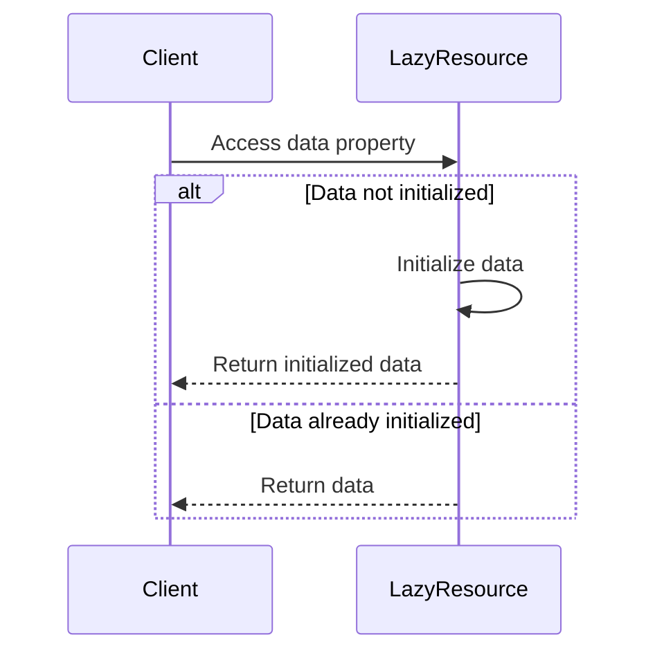

## 4.8.1 Implementing Lazy Initialization in TypeScript

Lazy initialization is a powerful design pattern that defers the creation of an object, the calculation of a value, or some other expensive process until the first time it is needed. This pattern can significantly improve the performance of applications by avoiding unnecessary computations and resource allocations. In this section, we will explore how to implement lazy initialization in TypeScript using closures and property getters, and discuss the nuances and considerations of this approach.

### Understanding Lazy Initialization

Lazy initialization is a technique used to delay the instantiation of an object or the execution of a computation until it is actually needed. This can be particularly useful in scenarios where the initialization process is resource-intensive or when the object may not be used at all during the program's execution.

#### Benefits of Lazy Initialization

- **Performance Optimization**: By deferring resource-intensive operations, lazy initialization can reduce the startup time of applications and improve overall performance.
- **Resource Management**: It helps in managing resources efficiently, especially in environments with limited resources.
- **Improved Responsiveness**: Applications can remain responsive by avoiding unnecessary processing during critical operations.

### Implementing Lazy Initialization with Property Getters

TypeScript provides a convenient way to implement lazy initialization through property getters. Property getters allow you to define a method that is executed when a property is accessed. This feature can be leveraged to initialize a property only when it is first accessed.

#### Example: Lazy Initialization with Property Getters

Let's consider a simple example where we have a class `ExpensiveResource` that simulates a resource-intensive initialization process.

```typescript
class ExpensiveResource {
    private _data: string | null = null;

    // Property getter for lazy initialization
    public get data(): string {
        if (this._data === null) {
            console.log("Initializing resource...");
            this._data = "Resource Data";
        }
        return this._data;
    }
}

// Usage
const resource = new ExpensiveResource();
console.log(resource.data); // Output: Initializing resource... Resource Data
console.log(resource.data); // Output: Resource Data
```

**Explanation**: In this example, the `data` property is initialized only when it is accessed for the first time. The subsequent accesses do not trigger re-initialization, ensuring efficient resource usage.

### Using Closures for Lazy Initialization

Closures in TypeScript provide another mechanism to implement lazy initialization. A closure is a function that retains access to its lexical scope, even when the function is executed outside that scope. This feature can be used to encapsulate the lazy initialization logic.

#### Example: Lazy Initialization with Closures

Consider a scenario where we want to initialize a complex object only when it is required.

```typescript
function createLazyResource() {
    let resource: string | null = null;

    return function getResource() {
        if (resource === null) {
            console.log("Creating resource...");
            resource = "Complex Resource";
        }
        return resource;
    };
}

// Usage
const getResource = createLazyResource();
console.log(getResource()); // Output: Creating resource... Complex Resource
console.log(getResource()); // Output: Complex Resource
```

**Explanation**: The `createLazyResource` function returns a closure `getResource` that initializes the `resource` variable only on its first invocation.

### Handling Thread Safety

In environments where multiple threads may access the same resources, thread safety becomes a concern. While JavaScript and TypeScript typically run in a single-threaded environment, web workers or server-side applications using Node.js may introduce concurrency.

#### Ensuring Thread Safety

To handle thread safety, you can use synchronization mechanisms such as locks or mutexes. However, these are not natively available in JavaScript/TypeScript. Instead, you can use atomic operations or design patterns that avoid shared mutable state.

### Potential Pitfalls and Considerations

- **Re-initialization**: Ensure that the lazy-initialized property is not re-initialized on subsequent accesses. This can be achieved by checking if the property is already initialized before performing the initialization logic.
- **Error Handling**: Consider how errors during initialization should be handled. You may want to cache exceptions or retry initialization.
- **Memory Leaks**: Be cautious of memory leaks, especially when closures are used, as they may inadvertently capture and retain references to large objects.

### TypeScript-Specific Features

TypeScript's static typing and interfaces can enhance the implementation of lazy initialization by providing clear contracts and ensuring type safety.

#### Example: Using Interfaces with Lazy Initialization

```typescript
interface Resource {
    data: string;
}

class LazyResource implements Resource {
    private _data: string | null = null;

    public get data(): string {
        if (this._data === null) {
            console.log("Initializing resource...");
            this._data = "Resource Data";
        }
        return this._data;
    }
}

// Usage
const resource: Resource = new LazyResource();
console.log(resource.data); // Output: Initializing resource... Resource Data
```

**Explanation**: By using an interface, we define a contract for the `Resource` type, ensuring that any implementation, such as `LazyResource`, adheres to the expected structure.

### Visualizing Lazy Initialization

To better understand the flow of lazy initialization, let's visualize the process using a sequence diagram.



**Description**: This diagram illustrates the decision-making process when accessing a lazy-initialized property. If the data is not initialized, it is created and returned. Otherwise, the existing data is returned.

### Try It Yourself

Experiment with the provided examples by modifying the initialization logic or the conditions under which initialization occurs. Consider implementing lazy initialization for different types of resources, such as network requests or file I/O operations.

### Conclusion

Lazy initialization is a valuable pattern for optimizing resource usage and improving application performance. By leveraging TypeScript's property getters and closures, you can implement this pattern effectively. Remember to consider thread safety and potential pitfalls when designing your lazy initialization logic.

## Quiz Time!



### What is the primary benefit of lazy initialization?

- [x] Delaying resource-intensive operations until necessary
- [ ] Ensuring thread safety
- [ ] Increasing code complexity
- [ ] Reducing code readability

> **Explanation:** Lazy initialization defers resource-intensive operations, improving performance and resource management.


### Which TypeScript feature is commonly used for lazy initialization?

- [x] Property getters
- [ ] Interfaces
- [ ] Enums
- [ ] Type aliases

> **Explanation:** Property getters allow for lazy initialization by executing logic when a property is accessed.


### How can closures be used in lazy initialization?

- [x] By encapsulating initialization logic within a function
- [ ] By creating multiple instances of a resource
- [ ] By increasing memory usage
- [ ] By reducing code readability

> **Explanation:** Closures encapsulate initialization logic, allowing it to be executed only when needed.


### What is a potential pitfall of lazy initialization?

- [x] Re-initialization of properties
- [ ] Improved performance
- [ ] Reduced resource usage
- [ ] Simplified code

> **Explanation:** Re-initialization can occur if the logic does not properly check if the property is already initialized.


### How can thread safety be ensured in lazy initialization?

- [x] Avoid shared mutable state
- [ ] Use TypeScript interfaces
- [ ] Increase code complexity
- [ ] Reduce code readability

> **Explanation:** Avoiding shared mutable state helps ensure thread safety in environments with concurrency.


### What is a common use case for lazy initialization?

- [x] Delaying network requests until needed
- [ ] Increasing memory usage
- [ ] Simplifying code
- [ ] Reducing code readability

> **Explanation:** Lazy initialization can delay network requests, optimizing performance and resource usage.


### Which diagram type is used to visualize lazy initialization?

- [x] Sequence diagram
- [ ] Class diagram
- [ ] Flowchart
- [ ] Pie chart

> **Explanation:** Sequence diagrams illustrate the flow of operations, such as lazy initialization logic.


### What should be considered when using closures for lazy initialization?

- [x] Avoiding memory leaks
- [ ] Increasing code complexity
- [ ] Reducing code readability
- [ ] Ensuring re-initialization

> **Explanation:** Closures can inadvertently capture references, leading to memory leaks if not managed properly.


### How can TypeScript interfaces enhance lazy initialization?

- [x] By providing clear contracts and ensuring type safety
- [ ] By increasing code complexity
- [ ] By reducing code readability
- [ ] By ensuring re-initialization

> **Explanation:** Interfaces define clear contracts, ensuring implementations adhere to expected structures.


### True or False: Lazy initialization always improves performance.

- [ ] True
- [x] False

> **Explanation:** While lazy initialization can improve performance by deferring operations, it may introduce complexity or overhead in some scenarios.


