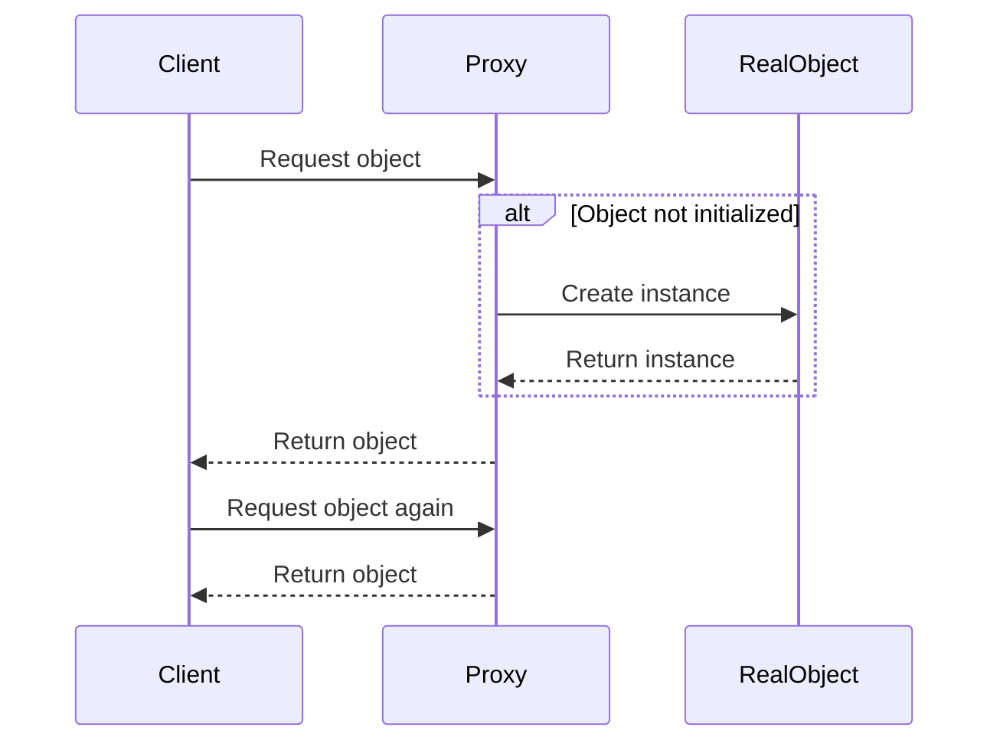

## 4.8.2 Use Cases and Examples

Lazy Initialization is a design pattern that defers the creation of an object, the calculation of a value, or some other expensive process until the first time it is needed. This pattern is particularly useful in scenarios where the cost of creating an object is high, and the object is not always required. Let's delve into practical use cases and examples where lazy initialization can significantly enhance performance and resource efficiency in TypeScript applications.

### Delaying Configuration Data Loading

In many applications, configuration data is essential for setting up the environment, but it may not be needed immediately upon startup. By deferring the loading of configuration data until it's actually required, we can reduce the initial load time and resource consumption.

#### Example: Lazy Loading Configuration

Consider an application that requires a large configuration file to be loaded. Instead of loading this file at startup, we can use lazy initialization to load it only when it's needed.

```typescript
class Config {
    private static instance: Config;
    private data: Record<string, any> | null = null;

    private constructor() {}

    static getInstance(): Config {
        if (!Config.instance) {
            Config.instance = new Config();
        }
        return Config.instance;
    }

    getConfigData(): Record<string, any> {
        if (!this.data) {
            console.log("Loading configuration data...");
            this.data = this.loadConfig();
        }
        return this.data;
    }

    private loadConfig(): Record<string, any> {
        // Simulate loading configuration data
        return {
            apiEndpoint: "https://api.example.com",
            timeout: 5000,
            retries: 3
        };
    }
}

// Usage
const config = Config.getInstance();
console.log(config.getConfigData());
```

**Benefits**: This approach reduces the startup time and memory usage since the configuration data is only loaded when needed.

**Trade-offs**: The first access to the configuration data will incur a delay as the data is loaded.

### Postponing Creation of Heavyweight Objects

In resource-constrained environments, such as mobile devices or embedded systems, creating heavyweight objects can be costly. Lazy initialization can help by postponing the creation of these objects until they are absolutely necessary.

#### Example: Lazy Initialization of a Database Connection

Imagine an application that connects to a database. Establishing a database connection is resource-intensive, so we can defer this process until the connection is actually needed.

```typescript
class DatabaseConnection {
    private static instance: DatabaseConnection;
    private connection: any | null = null;

    private constructor() {}

    static getInstance(): DatabaseConnection {
        if (!DatabaseConnection.instance) {
            DatabaseConnection.instance = new DatabaseConnection();
        }
        return DatabaseConnection.instance;
    }

    getConnection(): any {
        if (!this.connection) {
            console.log("Establishing database connection...");
            this.connection = this.connectToDatabase();
        }
        return this.connection;
    }

    private connectToDatabase(): any {
        // Simulate a database connection
        return { connected: true };
    }
}

// Usage
const dbConnection = DatabaseConnection.getInstance();
console.log(dbConnection.getConnection());
```

**Benefits**: This method optimizes resource usage by delaying the creation of the database connection until it is needed, which is especially beneficial in environments with limited resources.

**Trade-offs**: There is a potential delay the first time the connection is accessed, which could impact performance if not managed properly.

### Implementing Virtual Proxies

Virtual proxies are a common use case for lazy initialization. They act as placeholders for objects that are expensive to create, loading the real object only when it is accessed.

#### Example: Virtual Proxy for Image Loading

Consider a scenario where an application displays images. Loading all images at once can be resource-intensive, so we can use a virtual proxy to load images on demand.

```typescript
interface Image {
    display(): void;
}

class RealImage implements Image {
    private filename: string;

    constructor(filename: string) {
        this.filename = filename;
        this.loadFromDisk();
    }

    private loadFromDisk(): void {
        console.log(`Loading ${this.filename} from disk...`);
    }

    display(): void {
        console.log(`Displaying ${this.filename}`);
    }
}

class ProxyImage implements Image {
    private realImage: RealImage | null = null;
    private filename: string;

    constructor(filename: string) {
        this.filename = filename;
    }

    display(): void {
        if (!this.realImage) {
            this.realImage = new RealImage(this.filename);
        }
        this.realImage.display();
    }
}

// Usage
const image = new ProxyImage("test.jpg");
image.display();  // Loads and displays the image
image.display();  // Displays the image without loading
```

**Benefits**: Virtual proxies reduce memory usage and improve performance by loading resources only when necessary.

**Trade-offs**: The initial access to the resource will be slower due to the loading process.

### Performance Gains and Resource Efficiency

Lazy initialization can lead to significant performance improvements and resource savings, especially in applications where resources are limited or where certain objects are rarely used. By deferring the creation of objects, we can ensure that resources are allocated only when necessary, leading to more efficient applications.

#### Benefits of Lazy Initialization

- **Reduced Memory Usage**: By creating objects only when needed, we can minimize memory consumption.
- **Improved Startup Time**: Applications can start faster by deferring the initialization of non-essential objects.
- **Resource Optimization**: In environments with limited resources, lazy initialization ensures that resources are used efficiently.

#### Trade-offs and Considerations

While lazy initialization offers many benefits, it also introduces some trade-offs:

- **Complexity**: Implementing lazy initialization can add complexity to the code, making it harder to maintain.
- **Delayed Access**: The first access to a lazily initialized object may be slower, which can impact performance if not managed properly.
- **Thread Safety**: In multi-threaded environments, care must be taken to ensure that lazy initialization is thread-safe to avoid race conditions.

### Encouraging Lazy Initialization for Optimization

When optimizing application performance, consider using lazy initialization in scenarios where objects are expensive to create and not always needed. This pattern is particularly useful in applications with complex configurations, resource-intensive operations, or when working with large datasets.

### Visualizing Lazy Initialization

To better understand the lazy initialization process, let's visualize the flow of control when accessing a lazily initialized object.



**Diagram Description**: This sequence diagram illustrates the lazy initialization process. When the client requests an object, the proxy checks if the real object is initialized. If not, it creates the instance and returns it to the client. Subsequent requests return the already initialized object.

### Try It Yourself

Experiment with the code examples provided by modifying them to suit different scenarios. For instance, try implementing lazy initialization for a caching mechanism where data is loaded from an external source only when needed. Consider the following questions as you experiment:

- How does lazy initialization impact the performance of your application?
- What are the trade-offs in terms of complexity and delayed access?
- How can you ensure thread safety in a multi-threaded environment?

### References and Further Reading

- [MDN Web Docs: Lazy Initialization](https://developer.mozilla.org/en-US/docs/Web/JavaScript/Reference/Global_Objects/Promise)
- [W3Schools: JavaScript Lazy Loading](https://www.w3schools.com/js/js_lazy_loading.asp)

### Knowledge Check

- What are the main benefits of using lazy initialization?
- How can lazy initialization improve application performance?
- What are the potential trade-offs of using lazy initialization?
- How can you ensure thread safety when implementing lazy initialization?

### Embrace the Journey

Remember, lazy initialization is just one tool in your performance optimization toolkit. As you continue to explore design patterns and TypeScript, you'll discover new ways to enhance your applications. Keep experimenting, stay curious, and enjoy the journey!

## Quiz Time!



### What is a primary benefit of lazy initialization?

- [x] Reduced memory usage
- [ ] Increased complexity
- [ ] Faster initial access
- [ ] Increased startup time

> **Explanation:** Lazy initialization reduces memory usage by creating objects only when they are needed.

### Which scenario is ideal for lazy initialization?

- [x] Delaying the creation of heavyweight objects
- [ ] Immediate loading of all resources
- [ ] Simplifying code structure
- [ ] Reducing code complexity

> **Explanation:** Lazy initialization is ideal for delaying the creation of heavyweight objects to optimize resource usage.

### What is a trade-off of using lazy initialization?

- [x] Delayed access to objects
- [ ] Reduced memory usage
- [ ] Faster application startup
- [ ] Simplified code

> **Explanation:** Lazy initialization can result in delayed access to objects since they are created only when needed.

### How can lazy initialization improve application performance?

- [x] By deferring the creation of non-essential objects
- [ ] By loading all resources at startup
- [ ] By increasing memory usage
- [ ] By reducing code complexity

> **Explanation:** Lazy initialization improves performance by deferring the creation of non-essential objects, reducing resource usage.

### What is a common use case for virtual proxies?

- [x] Loading images on demand
- [ ] Immediate database connections
- [ ] Simplifying code structure
- [ ] Reducing code complexity

> **Explanation:** Virtual proxies are commonly used to load images on demand, optimizing resource usage.

### What is a potential challenge when implementing lazy initialization?

- [x] Ensuring thread safety
- [ ] Reducing memory usage
- [ ] Faster initial access
- [ ] Simplified code

> **Explanation:** Ensuring thread safety is a challenge in multi-threaded environments when implementing lazy initialization.

### What is a benefit of using lazy initialization in resource-constrained environments?

- [x] Optimized resource usage
- [ ] Increased memory usage
- [ ] Faster initial access
- [ ] Simplified code

> **Explanation:** Lazy initialization optimizes resource usage, which is beneficial in resource-constrained environments.

### What is a key consideration when using lazy initialization?

- [x] Managing delayed access
- [ ] Immediate loading of all resources
- [ ] Reducing memory usage
- [ ] Simplifying code

> **Explanation:** Managing delayed access is a key consideration since objects are created only when needed.

### How can lazy initialization affect application startup time?

- [x] It can improve startup time by deferring non-essential object creation
- [ ] It increases startup time by loading all resources
- [ ] It simplifies code structure
- [ ] It reduces memory usage

> **Explanation:** Lazy initialization can improve startup time by deferring the creation of non-essential objects.

### True or False: Lazy initialization always simplifies code.

- [ ] True
- [x] False

> **Explanation:** Lazy initialization can add complexity to the code, making it harder to maintain.


