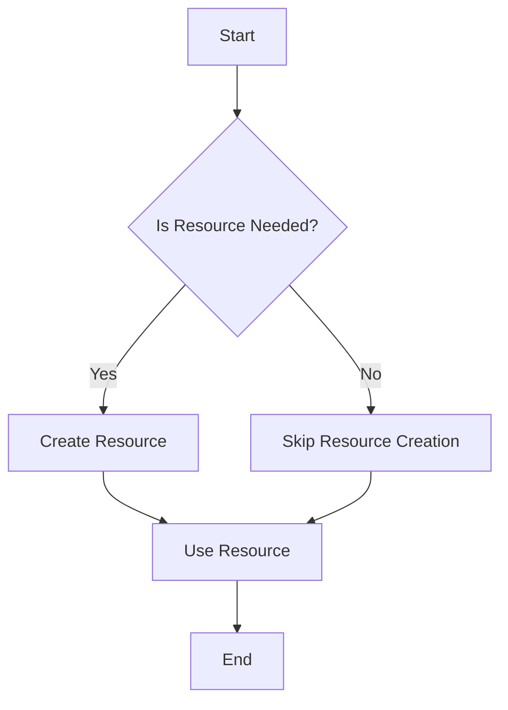

## 4.8 Lazy Initialization Pattern

In the realm of software design, the Lazy Initialization Pattern stands as a powerful technique for optimizing performance and managing resources efficiently. By deferring the creation of an object until it is actually needed, this pattern can significantly reduce initial load times and conserve system resources. In this section, we will delve into the intricacies of the Lazy Initialization Pattern, exploring its purpose, benefits, and implementation in TypeScript. We will also examine scenarios where this pattern is most beneficial and provide practical examples to illustrate its application.

### Understanding Lazy Initialization

**Lazy Initialization** is a design pattern that postpones the instantiation of an object until it is required. This approach can be particularly advantageous in scenarios where the cost of creating an object is high, or when the object may not be needed at all during the execution of a program. By delaying the creation of such objects, lazy initialization helps in reducing the initial load time and conserving memory and processing power.

#### Purpose of Lazy Initialization

The primary purpose of lazy initialization is to enhance performance by avoiding unnecessary computations and resource allocations. This pattern is especially useful when dealing with:

- **Expensive Object Creation**: Objects that require significant computational resources or time to instantiate.
- **Conditional Object Usage**: Objects that may not be used during the program's execution, depending on certain conditions or user interactions.
- **Large Data Structures**: Data structures that consume substantial memory and are not immediately required.

### Problems Addressed by Lazy Initialization

Lazy initialization addresses several common problems in software development, particularly those related to performance and resource management:

1. **Reduced Initial Load Time**: By deferring the creation of non-essential objects, applications can start up faster, providing a better user experience.

2. **Lower Memory Usage**: Delaying object instantiation can lead to reduced memory consumption, as only the necessary objects are created and maintained in memory.

3. **Improved Resource Management**: Lazy initialization allows for more efficient use of system resources, as resources are allocated only when needed.

4. **Enhanced Scalability**: Applications that utilize lazy initialization can scale more effectively, as they are not burdened by unnecessary resource usage.

### Lazy Initialization and Performance Optimization

Lazy initialization is closely tied to the concepts of performance optimization and resource management. By deferring object creation, developers can optimize the performance of their applications in several ways:

- **Minimizing Unnecessary Work**: By only performing computations when necessary, lazy initialization reduces the workload on the CPU and other system resources.

- **Efficient Resource Allocation**: Resources such as memory and processing power are allocated only when needed, preventing waste and improving overall system efficiency.

- **Responsive User Interfaces**: Applications that start up quickly and respond promptly to user interactions provide a better user experience, which is often achieved through lazy initialization.

### Implementing Lazy Initialization in TypeScript

In TypeScript, lazy initialization can be implemented using various techniques, including closures, property getters, and conditional logic. Let's explore these methods with practical examples.

#### Using Closures for Lazy Initialization

Closures are a powerful feature in JavaScript and TypeScript that can be used to implement lazy initialization. A closure allows a function to access variables from an enclosing scope, even after that scope has finished executing. This can be leveraged to defer object creation until it is needed.

```typescript
class ExpensiveResource {
    constructor() {
        console.log("ExpensiveResource created!");
        // Simulate a costly operation
    }
}

class ResourceManager {
    private _resource: ExpensiveResource | null = null;

    get resource(): ExpensiveResource {
        if (!this._resource) {
            console.log("Initializing ExpensiveResource...");
            this._resource = new ExpensiveResource();
        }
        return this._resource;
    }
}

const manager = new ResourceManager();
console.log("ResourceManager created.");
// The resource is not created yet
manager.resource; // This will trigger the creation of ExpensiveResource
```

In this example, the `ExpensiveResource` is only instantiated when the `resource` property is accessed for the first time. This ensures that the resource is created only when it is actually needed.

#### Utilizing Property Getters

TypeScript's property getters provide a clean and intuitive way to implement lazy initialization. By defining a getter method, you can control when an object is instantiated.

```typescript
class LazyLoader {
    private _data: string | null = null;

    get data(): string {
        if (this._data === null) {
            console.log("Loading data...");
            this._data = "This is the loaded data.";
        }
        return this._data;
    }
}

const loader = new LazyLoader();
console.log("LazyLoader created.");
// Data is not loaded yet
console.log(loader.data); // This will load and return the data
```

Here, the `data` property is lazily loaded when accessed, allowing the program to defer the loading operation until it is necessary.

#### Conditional Logic for Lazy Initialization

In some cases, you might want to use conditional logic to determine whether an object should be lazily initialized. This approach can be useful when the need for an object depends on specific conditions.

```typescript
class ConditionalResource {
    private _resource: string | null = null;

    loadResource(condition: boolean): string {
        if (condition && this._resource === null) {
            console.log("Condition met, loading resource...");
            this._resource = "Resource loaded based on condition.";
        }
        return this._resource || "Resource not loaded.";
    }
}

const conditionalLoader = new ConditionalResource();
console.log(conditionalLoader.loadResource(false)); // Resource not loaded
console.log(conditionalLoader.loadResource(true));  // Condition met, loading resource...
```

In this example, the resource is only loaded if a certain condition is met, demonstrating how lazy initialization can be combined with conditional logic.

### Scenarios for Lazy Initialization

Lazy initialization is particularly beneficial in the following scenarios:

- **Large Applications**: Applications with numerous components or modules that may not all be needed at once.
- **Resource-Intensive Operations**: Operations that require significant computational resources, such as data processing or complex calculations.
- **User-Driven Features**: Features that are only activated based on user interactions or preferences.
- **Network-Dependent Resources**: Resources that depend on network availability, such as remote data fetching or API calls.

### Visualizing Lazy Initialization

To better understand how lazy initialization works, let's visualize the process using a flowchart.



In this flowchart, the decision to create a resource is based on whether it is needed. If the resource is not needed, its creation is skipped, demonstrating the essence of lazy initialization.

### Try It Yourself

To gain a deeper understanding of lazy initialization, try modifying the code examples provided above. Here are some suggestions:

- **Experiment with Different Conditions**: Modify the conditions under which resources are initialized to see how it affects the program's behavior.
- **Implement Lazy Initialization for Other Data Types**: Try using lazy initialization with different data types, such as arrays or objects.
- **Combine Lazy Initialization with Other Patterns**: Explore how lazy initialization can be integrated with other design patterns, such as Singleton or Factory.

### Knowledge Check

To reinforce your understanding of lazy initialization, consider the following questions:

- What are the primary benefits of using lazy initialization?
- How does lazy initialization contribute to performance optimization?
- In what scenarios is lazy initialization most beneficial?
- How can property getters be used to implement lazy initialization in TypeScript?

### Conclusion

Lazy initialization is a valuable design pattern that can significantly enhance the performance and efficiency of your applications. By deferring object creation until it is necessary, you can reduce initial load times, conserve resources, and improve the overall user experience. As you continue to explore and implement design patterns in TypeScript, remember that lazy initialization is just one of many tools available to you. Keep experimenting, stay curious, and enjoy the journey of software development!

## Quiz Time!



### What is the primary purpose of lazy initialization?

- [x] To defer object creation until it is needed
- [ ] To create all objects at the start of the program
- [ ] To eliminate the need for object creation
- [ ] To increase memory usage

> **Explanation:** Lazy initialization defers the creation of objects until they are actually needed, optimizing performance and resource usage.

### Which of the following is a benefit of lazy initialization?

- [x] Reduced initial load time
- [ ] Increased memory usage
- [ ] Immediate object availability
- [ ] Increased CPU usage

> **Explanation:** Lazy initialization reduces initial load time by creating objects only when they are needed.

### How can lazy initialization be implemented in TypeScript?

- [x] Using property getters
- [ ] Using only constructor functions
- [ ] By creating all objects at once
- [ ] By avoiding object creation

> **Explanation:** Property getters in TypeScript can be used to implement lazy initialization by deferring object creation until the property is accessed.

### In which scenario is lazy initialization most beneficial?

- [x] When dealing with expensive object creation
- [ ] When all objects are needed immediately
- [ ] When memory usage is not a concern
- [ ] When objects are never used

> **Explanation:** Lazy initialization is most beneficial when dealing with expensive object creation, as it defers the process until necessary.

### What is a common technique for implementing lazy initialization?

- [x] Using closures
- [ ] Using global variables
- [ ] Using immediate object creation
- [ ] Using synchronous functions

> **Explanation:** Closures can be used to implement lazy initialization by capturing the state and deferring object creation until needed.

### What problem does lazy initialization address?

- [x] Reducing unnecessary computations
- [ ] Increasing initial load time
- [ ] Decreasing scalability
- [ ] Increasing resource usage

> **Explanation:** Lazy initialization reduces unnecessary computations by creating objects only when they are needed.

### How does lazy initialization relate to performance optimization?

- [x] It minimizes unnecessary work
- [ ] It increases resource allocation
- [ ] It decreases application scalability
- [ ] It increases initial load time

> **Explanation:** Lazy initialization minimizes unnecessary work by deferring object creation until it is needed, optimizing performance.

### Which of the following is a technique used in lazy initialization?

- [x] Conditional logic
- [ ] Immediate object creation
- [ ] Global state management
- [ ] Synchronous execution

> **Explanation:** Conditional logic can be used in lazy initialization to determine whether an object should be created based on specific conditions.

### What is a potential drawback of lazy initialization?

- [x] Delayed object availability
- [ ] Increased initial load time
- [ ] Increased memory usage
- [ ] Immediate resource allocation

> **Explanation:** A potential drawback of lazy initialization is that objects may not be available immediately, as they are created only when needed.

### True or False: Lazy initialization always improves performance.

- [ ] True
- [x] False

> **Explanation:** While lazy initialization can improve performance by deferring object creation, it may not always be beneficial, especially if the deferred objects are needed immediately or frequently.


