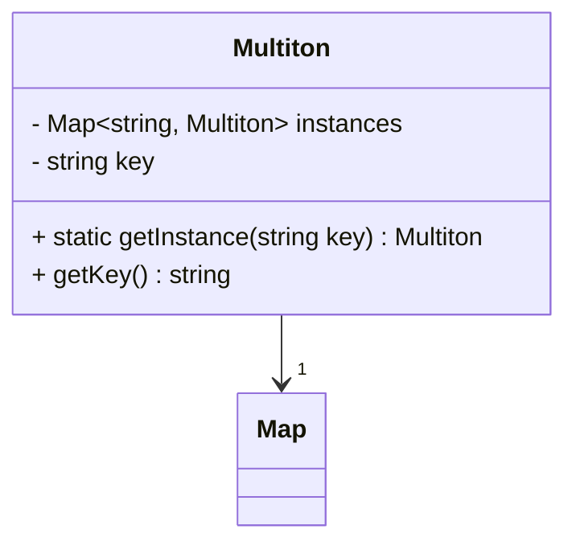

## 4.9.1 Implementing Multiton in TypeScript

In the world of software design patterns, the Multiton pattern stands out as a powerful tool for managing instances of a class. Unlike the Singleton pattern, which restricts a class to a single instance, the Multiton pattern allows for multiple instances, each associated with a unique key. This pattern is particularly useful when you need to manage a fixed number of instances, such as database connections or configuration settings, where each instance corresponds to a specific context or environment.

### Understanding the Multiton Pattern

The Multiton pattern is a variation of the Singleton pattern. While the Singleton pattern ensures that a class has only one instance, the Multiton pattern allows for multiple instances, each identified by a unique key. The pattern ensures that only one instance per key is created, and subsequent requests for the same key return the existing instance.

#### Key Characteristics of the Multiton Pattern

- **Controlled Instance Creation**: The pattern controls the creation of instances, ensuring that only one instance per key is created.
- **Efficient Resource Management**: By reusing instances, the pattern helps in managing resources efficiently.
- **Centralized Access**: Instances are accessed through a centralized method, which manages the registry of instances.

### Implementing the Multiton Pattern in TypeScript

To implement the Multiton pattern in TypeScript, we will define a class with a private constructor, a static method to manage instances, and a static registry to store these instances. Let's walk through the implementation step-by-step.

#### Step 1: Define the Class with a Private Constructor

The first step is to define a class with a private constructor. This ensures that instances of the class cannot be created directly from outside the class.

```typescript
class Multiton {
  private static instances: Map<string, Multiton> = new Map();

  private constructor(private key: string) {
    // Initialization code here
  }

  public static getInstance(key: string): Multiton {
    if (!Multiton.instances.has(key)) {
      Multiton.instances.set(key, new Multiton(key));
    }
    return Multiton.instances.get(key)!;
  }

  public getKey(): string {
    return this.key;
  }
}
```

**Explanation:**

- **Private Constructor**: The constructor is marked private to prevent direct instantiation.
- **Static Registry**: A static `Map` is used to store instances, with keys as the identifiers.
- **Static Method `getInstance`**: This method checks if an instance for the given key exists. If not, it creates a new instance and stores it in the registry.

#### Step 2: Ensure Single Instance per Key

The `getInstance` method is responsible for ensuring that only one instance per key is created. It checks the registry for an existing instance and returns it if found. Otherwise, it creates a new instance, stores it, and then returns it.

#### Step 3: Utilize TypeScript Features

TypeScript offers several features that can enhance the implementation of the Multiton pattern:

- **Generics**: If the Multiton class needs to handle different types, generics can be used to ensure type safety.
- **Index Signatures**: These can be used in the registry to allow dynamic keys.

Here is an example using generics:

```typescript
class GenericMultiton<T> {
  private static instances: Map<string, GenericMultiton<any>> = new Map();

  private constructor(private key: string, private value: T) {}

  public static getInstance<T>(key: string, value: T): GenericMultiton<T> {
    if (!GenericMultiton.instances.has(key)) {
      GenericMultiton.instances.set(key, new GenericMultiton(key, value));
    }
    return GenericMultiton.instances.get(key) as GenericMultiton<T>;
  }

  public getValue(): T {
    return this.value;
  }
}
```

**Explanation:**

- **Generics**: The class is defined with a generic type `T`, allowing it to handle different types of values.
- **Type Safety**: The `getInstance` method is type-safe, ensuring that the correct type is returned.

### Considerations for Synchronization and Concurrency

In a multi-threaded environment, synchronization is crucial to ensure that only one instance per key is created. While JavaScript (and by extension, TypeScript) is single-threaded, Node.js and browser environments can introduce concurrency through asynchronous operations.

To handle this, consider using locks or other synchronization mechanisms if your environment supports it. Alternatively, ensure that the `getInstance` method is atomic, meaning that its operations are completed without interruption.

### Visualizing the Multiton Pattern

To better understand the Multiton pattern, let's visualize it using a class diagram:



**Diagram Explanation:**

- **Multiton Class**: Represents the class implementing the pattern.
- **Instances Map**: A static map storing instances, with keys as identifiers.
- **getInstance Method**: A static method to manage instance creation and retrieval.

### Try It Yourself

To solidify your understanding, try modifying the code to add additional functionality:

- **Add a Method**: Implement a method to remove an instance from the registry.
- **Logging**: Add logging to track when instances are created or retrieved.
- **Concurrency Simulation**: Simulate concurrent requests to test the pattern's robustness.

### Knowledge Check

Before moving on, let's review some key points:

- **What is the primary purpose of the Multiton pattern?**
- **How does the Multiton pattern differ from the Singleton pattern?**
- **What TypeScript features can enhance the Multiton pattern implementation?**

### Conclusion

The Multiton pattern is a powerful tool for managing multiple instances of a class, each associated with a unique key. By leveraging TypeScript's features, we can implement this pattern efficiently and effectively. Remember, the key to mastering design patterns is practice and experimentation. Keep exploring and refining your implementations!

## Quiz Time!



### What is the primary purpose of the Multiton pattern?

- [x] To manage multiple instances of a class, each identified by a unique key.
- [ ] To ensure a class has only one instance.
- [ ] To create instances without specifying the exact class.
- [ ] To provide a simplified interface to a complex subsystem.

> **Explanation:** The Multiton pattern allows for multiple instances, each associated with a unique key, unlike the Singleton pattern, which restricts to a single instance.

### How does the Multiton pattern differ from the Singleton pattern?

- [x] The Multiton pattern allows multiple instances, each identified by a key, while the Singleton pattern restricts to one instance.
- [ ] The Multiton pattern is used for creating complex objects, while Singleton is for simple objects.
- [ ] The Multiton pattern is used for managing object lifecycles, while Singleton is for object creation.
- [ ] The Multiton pattern is a structural pattern, while Singleton is a behavioral pattern.

> **Explanation:** The Multiton pattern allows multiple instances, each with a unique key, whereas the Singleton pattern ensures only one instance exists.

### Which TypeScript feature can enhance the Multiton pattern implementation?

- [x] Generics
- [ ] Classes
- [ ] Interfaces
- [ ] Decorators

> **Explanation:** Generics can be used to ensure type safety and flexibility in the Multiton pattern implementation.

### What is the role of the `getInstance` method in the Multiton pattern?

- [x] To manage instance creation and retrieval based on a key.
- [ ] To initialize the class with default values.
- [ ] To provide a simplified interface for complex subsystems.
- [ ] To encapsulate a request as an object.

> **Explanation:** The `getInstance` method is responsible for managing instance creation and retrieval, ensuring only one instance per key is created.

### How can synchronization be ensured in a Multiton implementation in a multi-threaded environment?

- [x] By using locks or synchronization mechanisms.
- [ ] By using async/await.
- [ ] By using decorators.
- [ ] By using interfaces.

> **Explanation:** In multi-threaded environments, locks or synchronization mechanisms can ensure that only one instance per key is created.

### What data structure is commonly used to store instances in a Multiton pattern?

- [x] Map
- [ ] Array
- [ ] Set
- [ ] List

> **Explanation:** A `Map` is commonly used to store instances, with keys as identifiers, allowing efficient retrieval and management.

### What is a potential use case for the Multiton pattern?

- [x] Managing database connections for different environments.
- [ ] Creating a single instance of a configuration class.
- [ ] Providing a simplified interface to a complex API.
- [ ] Decoupling an abstraction from its implementation.

> **Explanation:** The Multiton pattern is useful for managing multiple instances, such as database connections for different environments.

### What is the benefit of using a private constructor in the Multiton pattern?

- [x] It prevents direct instantiation of the class from outside.
- [ ] It allows the class to be extended easily.
- [ ] It simplifies the class interface.
- [ ] It enables the use of decorators.

> **Explanation:** A private constructor prevents direct instantiation, ensuring instances are managed through the `getInstance` method.

### How can the Multiton pattern help in resource management?

- [x] By reusing instances, it helps in managing resources efficiently.
- [ ] By creating new instances for every request.
- [ ] By providing a simplified interface to resources.
- [ ] By encapsulating resource requests as objects.

> **Explanation:** The Multiton pattern reuses instances, helping in efficient resource management by avoiding unnecessary creation.

### True or False: The Multiton pattern is a variation of the Singleton pattern.

- [x] True
- [ ] False

> **Explanation:** True. The Multiton pattern is a variation of the Singleton pattern, allowing multiple instances, each identified by a unique key.


