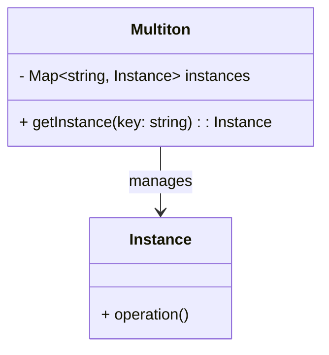

## 4.9.2 Use Cases and Examples

The Multiton Pattern is a creational design pattern that extends the Singleton Pattern by allowing multiple instances of a class, each associated with a unique key. This pattern is particularly useful when you need to manage a fixed number of instances that are logically singleton per key. In this section, we'll explore various use cases and examples where the Multiton Pattern shines, such as managing database connections, handling configuration objects, and implementing caching mechanisms.

### Understanding the Multiton Pattern

Before diving into specific use cases, let's briefly revisit the Multiton Pattern's core concept. Unlike the Singleton Pattern, which restricts a class to a single instance, the Multiton Pattern allows for multiple instances, each identified by a unique key. This pattern provides controlled access to these instances, ensuring that each key corresponds to one and only one instance.

The Multiton Pattern is particularly beneficial in scenarios where you need to manage resources that are expensive to create or maintain, such as database connections or configuration settings. By associating each resource with a unique key, the Multiton Pattern ensures efficient resource management and access control.

### Use Case 1: Managing Database Connections

One of the most common applications of the Multiton Pattern is managing database connections. In a typical application, you might have multiple databases or schemas, each requiring a separate connection. The Multiton Pattern allows you to manage these connections efficiently by associating each connection with a unique key, such as the database name or schema.

#### Example: Database Connection Manager

Consider an application that connects to multiple databases. Using the Multiton Pattern, we can create a `DatabaseConnectionManager` class that manages connections for each database:

```typescript
class DatabaseConnection {
    private constructor(private dbName: string) {
        console.log(`Connection to database ${dbName} established.`);
    }

    static connections: Map<string, DatabaseConnection> = new Map();

    static getConnection(dbName: string): DatabaseConnection {
        if (!this.connections.has(dbName)) {
            this.connections.set(dbName, new DatabaseConnection(dbName));
        }
        return this.connections.get(dbName)!;
    }

    query(sql: string) {
        console.log(`Executing query on ${this.dbName}: ${sql}`);
    }
}

// Usage
const userDbConnection = DatabaseConnection.getConnection('userDB');
userDbConnection.query('SELECT * FROM users');

const orderDbConnection = DatabaseConnection.getConnection('orderDB');
orderDbConnection.query('SELECT * FROM orders');

// Reusing the same connection
const sameUserDbConnection = DatabaseConnection.getConnection('userDB');
sameUserDbConnection.query('SELECT * FROM user_sessions');
```

In this example, `DatabaseConnection` is a Multiton that manages connections to different databases. The `getConnection` method ensures that each database has a single connection instance, identified by the database name.

### Use Case 2: Handling Configuration Objects

Another practical application of the Multiton Pattern is managing configuration objects. In complex applications, different modules might require distinct configuration settings. The Multiton Pattern allows you to manage these configurations efficiently by associating each configuration object with a unique key, such as the module name.

#### Example: Configuration Manager

Let's implement a `ConfigurationManager` class that handles configuration objects for different application modules:

```typescript
interface Config {
    [key: string]: any;
}

class ConfigurationManager {
    private static configurations: Map<string, Config> = new Map();

    private constructor() {}

    static getConfiguration(moduleName: string): Config {
        if (!this.configurations.has(moduleName)) {
            this.configurations.set(moduleName, this.loadConfiguration(moduleName));
        }
        return this.configurations.get(moduleName)!;
    }

    private static loadConfiguration(moduleName: string): Config {
        console.log(`Loading configuration for module: ${moduleName}`);
        // Simulate loading configuration from a file or database
        return { setting1: 'value1', setting2: 'value2' };
    }
}

// Usage
const userModuleConfig = ConfigurationManager.getConfiguration('userModule');
console.log(userModuleConfig);

const orderModuleConfig = ConfigurationManager.getConfiguration('orderModule');
console.log(orderModuleConfig);

// Reusing the same configuration
const sameUserModuleConfig = ConfigurationManager.getConfiguration('userModule');
console.log(sameUserModuleConfig);
```

In this example, `ConfigurationManager` is a Multiton that manages configuration objects for different modules. The `getConfiguration` method ensures that each module has a single configuration instance, identified by the module name.

### Use Case 3: Implementing Caching Mechanisms

Caching is another area where the Multiton Pattern can be effectively applied. In applications that require caching, each cache can be associated with a unique key, such as the cache name or type. The Multiton Pattern ensures efficient cache management by providing controlled access to these caches.

#### Example: Cache Manager

Let's create a `CacheManager` class that implements a caching mechanism using the Multiton Pattern:

```typescript
class Cache {
    private data: Map<string, any> = new Map();

    constructor(private cacheName: string) {}

    set(key: string, value: any) {
        this.data.set(key, value);
        console.log(`Set ${key} in ${this.cacheName} cache.`);
    }

    get(key: string): any {
        console.log(`Get ${key} from ${this.cacheName} cache.`);
        return this.data.get(key);
    }
}

class CacheManager {
    private static caches: Map<string, Cache> = new Map();

    private constructor() {}

    static getCache(cacheName: string): Cache {
        if (!this.caches.has(cacheName)) {
            this.caches.set(cacheName, new Cache(cacheName));
        }
        return this.caches.get(cacheName)!;
    }
}

// Usage
const userCache = CacheManager.getCache('userCache');
userCache.set('userId:1', { name: 'Alice', age: 30 });
console.log(userCache.get('userId:1'));

const productCache = CacheManager.getCache('productCache');
productCache.set('productId:101', { name: 'Laptop', price: 1200 });
console.log(productCache.get('productId:101'));

// Reusing the same cache
const sameUserCache = CacheManager.getCache('userCache');
console.log(sameUserCache.get('userId:1'));
```

In this example, `CacheManager` is a Multiton that manages caches for different purposes. The `getCache` method ensures that each cache is uniquely identified by its name and provides controlled access to the cache instances.

### Benefits of the Multiton Pattern

The Multiton Pattern offers several benefits, particularly in scenarios where you need to manage multiple instances that are logically singleton per key:

- **Controlled Access**: The pattern provides controlled access to instances, ensuring that each key corresponds to a single instance.
- **Efficient Resource Management**: By managing resources such as database connections or caches, the Multiton Pattern helps optimize resource usage and improve application performance.
- **Scalability**: The pattern supports scalability by allowing you to manage multiple instances without duplicating code or logic.

### Potential Drawbacks

While the Multiton Pattern offers many benefits, it also has potential drawbacks that you should consider:

- **Increased Complexity**: The pattern can introduce additional complexity, particularly in large applications with many keys and instances.
- **Memory Usage**: Managing multiple instances can increase memory usage, especially if the instances are resource-intensive.
- **Key Management**: Ensuring that each key is unique and correctly managed can be challenging, particularly in complex applications.

### Thoughtful Consideration

When considering the Multiton Pattern, it's essential to evaluate its applicability in your specific context. Consider the following questions:

- **Is the pattern necessary?** Evaluate whether the Multiton Pattern is the best solution for your problem or if a simpler pattern would suffice.
- **How will you manage keys?** Plan how you will manage and ensure the uniqueness of keys in your application.
- **What are the resource implications?** Consider the resource implications of managing multiple instances, particularly in terms of memory usage and performance.

### Visualizing the Multiton Pattern

To further enhance our understanding, let's visualize the Multiton Pattern using a class diagram. This diagram illustrates the relationship between the Multiton class and its instances, each associated with a unique key.



**Diagram Description**: The class diagram above shows the `Multiton` class managing multiple `Instance` objects. Each `Instance` is associated with a unique key, and the `Multiton` class provides a method to retrieve instances based on their keys.

### Try It Yourself

To solidify your understanding of the Multiton Pattern, try modifying the examples provided:

1. **Add a new database connection**: Extend the `DatabaseConnectionManager` to support a new database and test the connection management.
2. **Modify the configuration manager**: Add new configuration settings to the `ConfigurationManager` and observe how the pattern handles different configurations.
3. **Implement a new cache type**: Create a new cache type in the `CacheManager` and test its functionality.

### Knowledge Check

- **What is the primary purpose of the Multiton Pattern?**
- **How does the Multiton Pattern differ from the Singleton Pattern?**
- **What are some potential drawbacks of using the Multiton Pattern?**

### Conclusion

The Multiton Pattern is a powerful tool for managing multiple instances that are logically singleton per key. By providing controlled access to these instances, the pattern helps optimize resource management and improve application performance. However, it's essential to consider the pattern's complexity and resource implications when deciding whether to use it in your application.

Remember, this is just the beginning. As you progress, you'll discover more opportunities to apply the Multiton Pattern and other design patterns in your TypeScript applications. Keep experimenting, stay curious, and enjoy the journey!

## Quiz Time!



### What is the primary purpose of the Multiton Pattern?

- [x] To manage multiple instances, each associated with a unique key.
- [ ] To restrict a class to a single instance.
- [ ] To provide a global point of access to a single instance.
- [ ] To encapsulate a group of related objects.

> **Explanation:** The Multiton Pattern is designed to manage multiple instances, each associated with a unique key, unlike the Singleton Pattern, which restricts a class to a single instance.

### How does the Multiton Pattern differ from the Singleton Pattern?

- [x] The Multiton Pattern allows multiple instances, each identified by a unique key.
- [ ] The Multiton Pattern restricts a class to a single instance.
- [ ] The Singleton Pattern allows multiple instances.
- [ ] The Multiton Pattern provides a global point of access to a single instance.

> **Explanation:** The Multiton Pattern allows multiple instances, each identified by a unique key, whereas the Singleton Pattern restricts a class to a single instance.

### What is a potential drawback of using the Multiton Pattern?

- [x] Increased complexity and memory usage.
- [ ] Limited scalability.
- [ ] Lack of controlled access.
- [ ] Inefficient resource management.

> **Explanation:** The Multiton Pattern can introduce increased complexity and memory usage due to managing multiple instances.

### In which scenario is the Multiton Pattern particularly useful?

- [x] Managing database connections per database or schema.
- [ ] Restricting a class to a single instance.
- [ ] Providing a global point of access to a single instance.
- [ ] Encapsulating a group of related objects.

> **Explanation:** The Multiton Pattern is particularly useful for managing database connections per database or schema, where each connection is associated with a unique key.

### What is a key consideration when using the Multiton Pattern?

- [x] Ensuring the uniqueness of keys.
- [ ] Limiting the number of instances.
- [ ] Providing a global point of access.
- [ ] Encapsulating related objects.

> **Explanation:** Ensuring the uniqueness of keys is crucial when using the Multiton Pattern to avoid conflicts and ensure proper instance management.

### What is the benefit of using the Multiton Pattern for configuration management?

- [x] Efficiently managing configuration objects for different modules.
- [ ] Restricting a class to a single configuration object.
- [ ] Providing a global point of access to configuration objects.
- [ ] Encapsulating related configuration objects.

> **Explanation:** The Multiton Pattern efficiently manages configuration objects for different modules by associating each configuration with a unique key.

### How does the Multiton Pattern optimize resource management?

- [x] By providing controlled access to instances.
- [ ] By restricting a class to a single instance.
- [ ] By providing a global point of access to a single instance.
- [ ] By encapsulating a group of related objects.

> **Explanation:** The Multiton Pattern optimizes resource management by providing controlled access to instances, ensuring efficient use of resources.

### What is a potential challenge when implementing the Multiton Pattern?

- [x] Managing and ensuring the uniqueness of keys.
- [ ] Limiting the number of instances.
- [ ] Providing a global point of access.
- [ ] Encapsulating related objects.

> **Explanation:** Managing and ensuring the uniqueness of keys is a potential challenge when implementing the Multiton Pattern, as it is crucial for proper instance management.

### What is a common use case for the Multiton Pattern?

- [x] Implementing caching mechanisms where each key corresponds to a different cache.
- [ ] Restricting a class to a single instance.
- [ ] Providing a global point of access to a single instance.
- [ ] Encapsulating a group of related objects.

> **Explanation:** A common use case for the Multiton Pattern is implementing caching mechanisms where each key corresponds to a different cache, allowing efficient cache management.

### True or False: The Multiton Pattern is a variation of the Singleton Pattern.

- [x] True
- [ ] False

> **Explanation:** True. The Multiton Pattern is a variation of the Singleton Pattern, allowing multiple instances, each associated with a unique key, unlike the Singleton Pattern, which restricts a class to a single instance.




