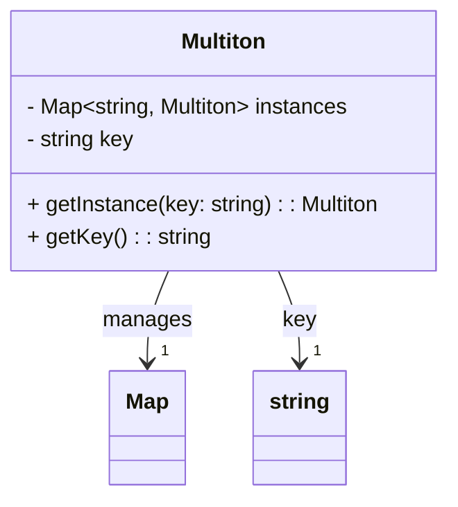

## 4.9 Multiton Pattern

In the world of software design patterns, the **Multiton Pattern** stands out as a powerful extension of the Singleton Pattern. While the Singleton Pattern ensures that a class has only one instance, the Multiton Pattern allows for the controlled creation of multiple instances, each identified by a unique key. This pattern is particularly useful in scenarios where a fixed number of instances are required, and each instance must be distinguished by a key.

### Understanding the Multiton Pattern

The Multiton Pattern is a creational design pattern that manages a map of named instances. Unlike the Singleton Pattern, which restricts the instantiation of a class to a single object, the Multiton Pattern allows for multiple instances, each associated with a unique key. This pattern ensures that a class maintains a collection of instances, each accessible through a key.

#### Key Differences from the Singleton Pattern

- **Multiple Instances**: While the Singleton Pattern restricts a class to a single instance, the Multiton Pattern allows for multiple instances, each identified by a key.
- **Keyed Access**: Instances in the Multiton Pattern are accessed using keys, providing a way to manage multiple instances efficiently.
- **Centralized Management**: The Multiton Pattern centralizes the management of instances, ensuring that each key corresponds to a unique instance.

### Problem Solved by the Multiton Pattern

The Multiton Pattern addresses the need for managing a fixed number of instances that are distinguished by keys. This is particularly useful in scenarios where:

- **Resource Management**: You need to manage a pool of resources, such as database connections or configuration settings, where each resource is identified by a key.
- **Configuration Management**: Different configurations are required for different parts of an application, and each configuration is accessed using a key.
- **State Management**: Different states or contexts are managed within an application, each identified by a unique key.

### Key Characteristics of the Multiton Pattern

- **Centralized Instance Management**: The Multiton Pattern centralizes the management of instances, ensuring that each key corresponds to a unique instance.
- **Keyed Access**: Instances are accessed using keys, providing a way to manage multiple instances efficiently.
- **Lazy Initialization**: Instances are created only when they are needed, optimizing resource usage.

### Implementing the Multiton Pattern in TypeScript

Let's dive into the implementation of the Multiton Pattern in TypeScript. We'll start by defining a class that manages a collection of instances, each identified by a key.

```typescript
class Multiton {
  private static instances: Map<string, Multiton> = new Map();

  private constructor(private key: string) {}

  public static getInstance(key: string): Multiton {
    if (!Multiton.instances.has(key)) {
      Multiton.instances.set(key, new Multiton(key));
    }
    return Multiton.instances.get(key)!;
  }

  public getKey(): string {
    return this.key;
  }
}

// Usage
const instanceA = Multiton.getInstance('A');
const instanceB = Multiton.getInstance('B');
const anotherInstanceA = Multiton.getInstance('A');

console.log(instanceA === anotherInstanceA); // true
console.log(instanceA === instanceB); // false
```

#### Explanation of the Code

- **Private Constructor**: The constructor is private to prevent direct instantiation from outside the class.
- **Static Map**: A static map (`instances`) is used to store instances, with keys as identifiers.
- **getInstance Method**: This static method checks if an instance with the given key exists. If not, it creates a new instance and stores it in the map.
- **Keyed Access**: Instances are accessed using the `getInstance` method with a key, ensuring that each key corresponds to a unique instance.

### Visualizing the Multiton Pattern

To better understand the Multiton Pattern, let's visualize the relationship between keys and instances using a class diagram.



#### Diagram Explanation

- **Multiton Class**: Represents the class that manages instances.
- **Map**: A collection that stores instances, with keys as identifiers.
- **getInstance Method**: Provides access to instances using keys.

### Try It Yourself

Now that we've explored the Multiton Pattern, try modifying the code example to add additional functionality. For instance, you could:

- **Add a Method**: Implement a method to remove an instance by its key.
- **Track Instance Count**: Add functionality to track the number of instances created.

### Further Reading

For more information on design patterns, consider exploring the following resources:

- [MDN Web Docs on Design Patterns](https://developer.mozilla.org/en-US/docs/Web/JavaScript/Guide/Design_Patterns)
- [Refactoring Guru: Design Patterns](https://refactoring.guru/design-patterns)

### Knowledge Check

Before we wrap up, let's reinforce what we've learned with a few questions:

1. What is the primary difference between the Singleton and Multiton patterns?
2. How does the Multiton Pattern manage instances?
3. In what scenarios is the Multiton Pattern particularly useful?

### Summary

The Multiton Pattern is a powerful extension of the Singleton Pattern, allowing for the controlled creation of multiple instances, each identified by a key. By centralizing instance management and providing keyed access, the Multiton Pattern addresses the need for managing a fixed number of instances efficiently. As you continue your journey in software design, consider how the Multiton Pattern can be applied to solve complex problems in your applications.

## Quiz Time!



### What is the primary difference between the Singleton and Multiton patterns?

- [x] The Multiton Pattern allows for multiple instances, each identified by a key.
- [ ] The Singleton Pattern allows for multiple instances, each identified by a key.
- [ ] The Multiton Pattern restricts a class to a single instance.
- [ ] The Singleton Pattern centralizes instance management.

> **Explanation:** The Multiton Pattern extends the Singleton Pattern by allowing multiple instances, each identified by a unique key.

### How does the Multiton Pattern manage instances?

- [x] It uses a centralized map to store instances, each identified by a key.
- [ ] It creates a new instance every time a key is requested.
- [ ] It uses a list to store instances, each identified by a key.
- [ ] It does not manage instances centrally.

> **Explanation:** The Multiton Pattern uses a centralized map to manage instances, ensuring each key corresponds to a unique instance.

### In what scenarios is the Multiton Pattern particularly useful?

- [x] When managing a fixed number of instances distinguished by keys.
- [ ] When only one instance of a class is needed.
- [ ] When instances do not need to be distinguished by keys.
- [ ] When instances are created without any keys.

> **Explanation:** The Multiton Pattern is useful when a fixed number of instances, each identified by a key, need to be managed.

### What is a key characteristic of the Multiton Pattern?

- [x] Keyed access to instances.
- [ ] Unlimited instance creation.
- [ ] Direct instantiation of instances.
- [ ] No centralized management.

> **Explanation:** The Multiton Pattern provides keyed access to instances, ensuring each key corresponds to a unique instance.

### How does the Multiton Pattern optimize resource usage?

- [x] By using lazy initialization.
- [ ] By creating all instances at once.
- [ ] By using eager initialization.
- [ ] By not managing instances.

> **Explanation:** The Multiton Pattern uses lazy initialization, creating instances only when they are needed.

### What method is used to access instances in the Multiton Pattern?

- [x] getInstance
- [ ] createInstance
- [ ] newInstance
- [ ] fetchInstance

> **Explanation:** The `getInstance` method is used to access instances in the Multiton Pattern, ensuring each key corresponds to a unique instance.

### What is the purpose of the private constructor in the Multiton Pattern?

- [x] To prevent direct instantiation from outside the class.
- [ ] To allow direct instantiation from outside the class.
- [ ] To create multiple instances directly.
- [ ] To manage instances centrally.

> **Explanation:** The private constructor prevents direct instantiation from outside the class, ensuring controlled instance creation.

### What data structure is commonly used to store instances in the Multiton Pattern?

- [x] Map
- [ ] List
- [ ] Array
- [ ] Set

> **Explanation:** A `Map` is commonly used to store instances in the Multiton Pattern, with keys as identifiers.

### Can the Multiton Pattern be used for configuration management?

- [x] True
- [ ] False

> **Explanation:** The Multiton Pattern can be used for configuration management, allowing different configurations to be accessed using keys.

### Does the Multiton Pattern allow for direct instantiation of instances?

- [ ] True
- [x] False

> **Explanation:** The Multiton Pattern does not allow for direct instantiation of instances; it uses a centralized method to manage instance creation.



Remember, this is just the beginning. As you progress, you'll build more complex and interactive applications. Keep experimenting, stay curious, and enjoy the journey!
