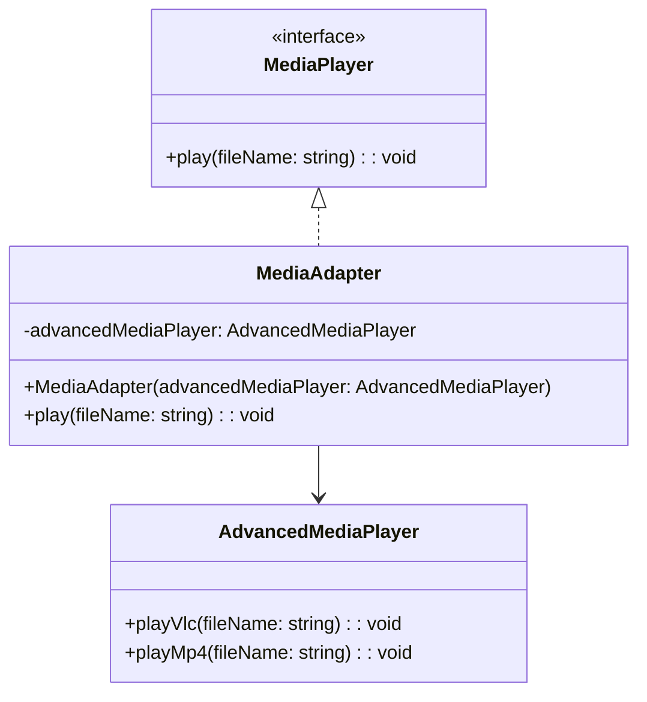

## 5.1.1 Implementing Adapter in TypeScript

In this section, we will explore the Adapter Pattern, a structural design pattern that allows objects with incompatible interfaces to work together. By implementing this pattern in TypeScript, we can leverage its powerful type system to ensure that our code is both flexible and maintainable. Let's dive into the details of how to implement the Adapter Pattern in TypeScript, complete with code examples and best practices.

### Understanding the Adapter Pattern

The Adapter Pattern acts as a bridge between two incompatible interfaces. It allows a class to work with methods or properties of another class that it otherwise couldn't due to interface mismatches. This pattern is particularly useful when integrating third-party libraries or legacy code into a new system.

#### Key Components of the Adapter Pattern

1. **Target Interface**: Defines the domain-specific interface that the client expects.
2. **Adaptee**: The existing interface that needs adapting.
3. **Adapter**: A class that implements the Target interface and translates the requests to the Adaptee.

### Step-by-Step Guide to Implementing the Adapter Pattern

Let's walk through the process of implementing the Adapter Pattern in TypeScript with a practical example.

#### Step 1: Define the Target Interface

The Target interface represents the interface that the client expects. It defines the methods that the client will use.

```typescript
// Target interface
interface MediaPlayer {
  play(fileName: string): void;
}
```

In this example, `MediaPlayer` is the Target interface with a single method `play`.

#### Step 2: Create the Adaptee Class

The Adaptee class is the existing class with a different interface that needs to be adapted.

```typescript
// Adaptee class
class AdvancedMediaPlayer {
  playVlc(fileName: string): void {
    console.log(`Playing vlc file. Name: ${fileName}`);
  }

  playMp4(fileName: string): void {
    console.log(`Playing mp4 file. Name: ${fileName}`);
  }
}
```

Here, `AdvancedMediaPlayer` is the Adaptee class with methods `playVlc` and `playMp4`, which are not compatible with the `MediaPlayer` interface.

#### Step 3: Implement the Adapter Class

The Adapter class implements the Target interface and holds a reference to an instance of the Adaptee class. It translates calls from the Target interface to the Adaptee's methods.

```typescript
// Adapter class
class MediaAdapter implements MediaPlayer {
  private advancedMediaPlayer: AdvancedMediaPlayer;

  constructor(advancedMediaPlayer: AdvancedMediaPlayer) {
    this.advancedMediaPlayer = advancedMediaPlayer;
  }

  play(fileName: string): void {
    if (fileName.endsWith(".vlc")) {
      this.advancedMediaPlayer.playVlc(fileName);
    } else if (fileName.endsWith(".mp4")) {
      this.advancedMediaPlayer.playMp4(fileName);
    } else {
      console.log("Unsupported format");
    }
  }
}
```

The `MediaAdapter` class implements the `MediaPlayer` interface and translates the `play` method calls to the appropriate method on the `AdvancedMediaPlayer`.

#### Step 4: Use the Adapter in the Client Code

Finally, we use the Adapter in the client code to play different media formats.

```typescript
// Client code
const advancedPlayer = new AdvancedMediaPlayer();
const mediaAdapter = new MediaAdapter(advancedPlayer);

mediaAdapter.play("movie.vlc");
mediaAdapter.play("video.mp4");
mediaAdapter.play("audio.mp3");
```

In this example, the client code uses the `MediaAdapter` to play different media formats, demonstrating how the Adapter Pattern allows incompatible interfaces to work together.

### Benefits of Using the Adapter Pattern in TypeScript

- **Type Safety**: TypeScript's static typing ensures that the Adapter correctly implements the Target interface, reducing runtime errors.
- **Flexibility**: The Adapter Pattern allows you to integrate new functionality without modifying existing code, enhancing flexibility.
- **Reusability**: By decoupling the client code from the Adaptee, the Adapter Pattern promotes code reusability.

### Challenges and Considerations

While the Adapter Pattern offers many benefits, there are some challenges and considerations to keep in mind:

- **Complexity**: Introducing an Adapter can add complexity to the codebase, especially if not managed properly.
- **Performance**: The Adapter Pattern may introduce a slight performance overhead due to additional method calls.
- **Asynchronous Methods**: When dealing with asynchronous methods or Promises, ensure that the Adapter handles these appropriately, possibly using async/await syntax.

### Best Practices for Code Organization and Readability

- **Clear Naming Conventions**: Use descriptive names for interfaces and classes to enhance readability.
- **Consistent Formatting**: Follow consistent formatting and indentation to make the code easier to read and maintain.
- **Documentation**: Include comments and documentation to explain the purpose and functionality of each component.

### Visualizing the Adapter Pattern

To better understand the Adapter Pattern, let's visualize the relationships between the Target, Adaptee, and Adapter using a class diagram.



This diagram illustrates how the `MediaAdapter` class implements the `MediaPlayer` interface and delegates calls to the `AdvancedMediaPlayer`.

### Try It Yourself

To deepen your understanding of the Adapter Pattern, try modifying the code examples:

- **Add a new media format**: Extend the `AdvancedMediaPlayer` class to support a new format and update the `MediaAdapter` to handle it.
- **Handle asynchronous methods**: Modify the `AdvancedMediaPlayer` methods to return Promises and update the `MediaAdapter` to handle these asynchronously using `async/await`.

### Knowledge Check

Before we conclude, let's recap some key points:

- The Adapter Pattern allows incompatible interfaces to work together by introducing an Adapter class.
- TypeScript's type system ensures that the Adapter correctly implements the Target interface.
- Consider potential challenges, such as handling asynchronous methods and managing complexity.

### Embrace the Journey

Remember, mastering design patterns is a journey. As you continue to explore and implement patterns, you'll gain a deeper understanding of how to write flexible and maintainable code. Keep experimenting, stay curious, and enjoy the journey!

## Quiz Time!



### What is the primary purpose of the Adapter Pattern?

- [x] To allow incompatible interfaces to work together.
- [ ] To enforce a single instance of a class.
- [ ] To create complex objects step by step.
- [ ] To separate object creation from its representation.

> **Explanation:** The Adapter Pattern is used to allow incompatible interfaces to work together by introducing an Adapter class that translates requests from the Target interface to the Adaptee.

### Which component of the Adapter Pattern defines the interface that the client expects?

- [x] Target
- [ ] Adaptee
- [ ] Adapter
- [ ] Client

> **Explanation:** The Target interface defines the domain-specific interface that the client expects.

### In the Adapter Pattern, what role does the Adapter class play?

- [x] It implements the Target interface and translates requests to the Adaptee.
- [ ] It defines the interface that the client expects.
- [ ] It holds the existing functionality that needs adapting.
- [ ] It acts as the client making requests.

> **Explanation:** The Adapter class implements the Target interface and translates requests to the Adaptee, allowing incompatible interfaces to work together.

### What is a potential challenge when implementing the Adapter Pattern in TypeScript?

- [x] Handling asynchronous methods or Promises.
- [ ] Ensuring a single instance of a class.
- [ ] Creating complex objects step by step.
- [ ] Separating object creation from its representation.

> **Explanation:** A potential challenge when implementing the Adapter Pattern in TypeScript is handling asynchronous methods or Promises, which may require using async/await syntax.

### Which of the following is a benefit of using the Adapter Pattern in TypeScript?

- [x] Type safety
- [ ] Increased complexity
- [ ] Performance overhead
- [ ] Tight coupling

> **Explanation:** TypeScript's static typing ensures type safety, which is a benefit of using the Adapter Pattern in TypeScript.

### How does the Adapter Pattern promote code reusability?

- [x] By decoupling the client code from the Adaptee.
- [ ] By enforcing a single instance of a class.
- [ ] By creating complex objects step by step.
- [ ] By separating object creation from its representation.

> **Explanation:** The Adapter Pattern promotes code reusability by decoupling the client code from the Adaptee, allowing for integration of new functionality without modifying existing code.

### What is the role of the Adaptee in the Adapter Pattern?

- [x] It holds the existing functionality that needs adapting.
- [ ] It defines the interface that the client expects.
- [ ] It implements the Target interface and translates requests.
- [ ] It acts as the client making requests.

> **Explanation:** The Adaptee holds the existing functionality that needs adapting to work with the Target interface.

### Which of the following best describes the relationship between the Adapter and Adaptee?

- [x] The Adapter holds a reference to an instance of the Adaptee.
- [ ] The Adaptee implements the Adapter interface.
- [ ] The Adapter and Adaptee are the same class.
- [ ] The Adapter inherits from the Adaptee.

> **Explanation:** The Adapter holds a reference to an instance of the Adaptee and translates requests from the Target interface to the Adaptee's methods.

### What is the main advantage of using TypeScript for implementing design patterns like the Adapter Pattern?

- [x] Type safety and interfaces
- [ ] Dynamic typing
- [ ] Lack of interfaces
- [ ] Weak type system

> **Explanation:** TypeScript provides type safety and interfaces, which are advantageous for implementing design patterns like the Adapter Pattern.

### True or False: The Adapter Pattern can introduce a slight performance overhead due to additional method calls.

- [x] True
- [ ] False

> **Explanation:** The Adapter Pattern can introduce a slight performance overhead due to additional method calls, as the Adapter translates requests to the Adaptee.


