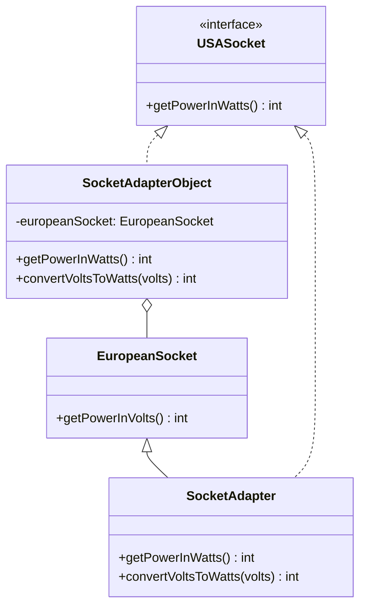

## 5.1.2 Class vs. Object Adapters

In the realm of software design patterns, the Adapter Pattern stands out as a powerful tool for enabling incompatible interfaces to work together. This pattern is particularly useful when integrating new components into existing systems without altering the existing codebase. In TypeScript, two primary approaches to implementing the Adapter Pattern are class adapters and object adapters. Understanding the differences between these two approaches is crucial for expert software engineers aiming to write maintainable and scalable code.

### Class Adapters

Class adapters leverage inheritance to adapt one interface to another. In this approach, the adapter class extends the Adaptee class and implements the Target interface. This method is straightforward and can be effective when the inheritance hierarchy is simple and well-defined.

#### Implementing Class Adapters in TypeScript

Let's consider a scenario where we have a `EuropeanSocket` class that provides power in volts, and we need to adapt it to a `USASocket` interface that expects power in watts.

```typescript
// Adaptee
class EuropeanSocket {
  public getPowerInVolts(): number {
    return 220; // European standard voltage
  }
}

// Target Interface
interface USASocket {
  getPowerInWatts(): number;
}

// Class Adapter
class SocketAdapter extends EuropeanSocket implements USASocket {
  public getPowerInWatts(): number {
    const volts = this.getPowerInVolts();
    return this.convertVoltsToWatts(volts);
  }

  private convertVoltsToWatts(volts: number): number {
    // Conversion logic (simplified for illustration)
    return volts * 0.5; // Assume 1 volt = 0.5 watts
  }
}

// Usage
const usaSocket: USASocket = new SocketAdapter();
console.log(`Power in watts: ${usaSocket.getPowerInWatts()}`);
```

In this example, `SocketAdapter` extends `EuropeanSocket` and implements the `USASocket` interface, providing a method to convert volts to watts.

#### Pros and Cons of Class Adapters

**Pros:**
- **Simpler Implementation**: Class adapters can be simpler to implement when the inheritance hierarchy is straightforward.
- **Direct Access**: The adapter has direct access to the Adaptee's methods and properties.

**Cons:**
- **Single Inheritance Limitation**: TypeScript, like JavaScript, does not support multiple inheritance. This limits the flexibility of class adapters.
- **Tight Coupling**: The adapter is tightly coupled to the Adaptee, which can reduce flexibility and increase maintenance challenges.

### Object Adapters

Object adapters use composition to achieve the same goal. Instead of extending the Adaptee, the adapter holds an instance of the Adaptee and implements the Target interface. This approach is more flexible and aligns well with TypeScript's single inheritance model.

#### Implementing Object Adapters in TypeScript

Let's revisit our socket example using an object adapter.

```typescript
// Adaptee
class EuropeanSocket {
  public getPowerInVolts(): number {
    return 220; // European standard voltage
  }
}

// Target Interface
interface USASocket {
  getPowerInWatts(): number;
}

// Object Adapter
class SocketAdapter implements USASocket {
  private europeanSocket: EuropeanSocket;

  constructor(europeanSocket: EuropeanSocket) {
    this.europeanSocket = europeanSocket;
  }

  public getPowerInWatts(): number {
    const volts = this.europeanSocket.getPowerInVolts();
    return this.convertVoltsToWatts(volts);
  }

  private convertVoltsToWatts(volts: number): number {
    // Conversion logic (simplified for illustration)
    return volts * 0.5; // Assume 1 volt = 0.5 watts
  }
}

// Usage
const europeanSocket = new EuropeanSocket();
const usaSocket: USASocket = new SocketAdapter(europeanSocket);
console.log(`Power in watts: ${usaSocket.getPowerInWatts()}`);
```

In this version, `SocketAdapter` holds an instance of `EuropeanSocket` and implements the `USASocket` interface. This allows for greater flexibility and decoupling.

#### Pros and Cons of Object Adapters

**Pros:**
- **Flexibility**: Object adapters can adapt multiple Adaptees, providing greater flexibility.
- **Better Encapsulation**: The adapter encapsulates the Adaptee, reducing tight coupling and enhancing maintainability.

**Cons:**
- **Verbosity**: Object adapters can be more verbose due to the need for composition.

### Why Object Adapters Are Generally Preferred in TypeScript

Given TypeScript's single inheritance model, object adapters are generally preferred. They offer greater flexibility and decoupling, which are essential for maintaining scalable and adaptable codebases. By using composition, object adapters can work with multiple Adaptees and provide a more modular design.

### Scenarios for Choosing Between Class and Object Adapters

While object adapters are often the go-to choice, there are scenarios where class adapters might be more suitable:

- **Class Adapters**: Use when the Adaptee class is stable and unlikely to change, and when you need direct access to protected members of the Adaptee.
- **Object Adapters**: Use when you need to adapt multiple Adaptees or when the Adaptee's interface might change frequently.

### Visualizing Class vs. Object Adapters

To better understand the differences between class and object adapters, let's visualize these concepts using a class diagram.



**Diagram Explanation**: 
- The class adapter (`SocketAdapter`) inherits from `EuropeanSocket` and implements `USASocket`.
- The object adapter (`SocketAdapterObject`) holds an instance of `EuropeanSocket` and implements `USASocket`.

### Try It Yourself

To deepen your understanding, try modifying the code examples:

1. **Experiment with Different Conversions**: Change the conversion logic in the `convertVoltsToWatts` method to see how it affects the output.
2. **Adapt Multiple Adaptees**: Extend the object adapter to work with another type of socket, such as a `UKSocket`.
3. **Refactor to Use TypeScript Generics**: If applicable, refactor the object adapter to use TypeScript generics for added flexibility.

### Knowledge Check

Before moving on, let's reinforce what we've learned:

- **Class Adapter**: Inherits from the Adaptee and implements the Target interface. Best used when direct access to the Adaptee is needed and the inheritance hierarchy is simple.
- **Object Adapter**: Uses composition to hold an instance of the Adaptee and implements the Target interface. Preferred in TypeScript for its flexibility and decoupling.

### Summary

In this section, we've explored the differences between class and object adapters in the Adapter Pattern. By understanding the pros and cons of each approach, you can make informed decisions about which to use in your TypeScript projects. Remember, the choice between class and object adapters depends on the specific requirements and constraints of your application.

## Quiz Time!



### What is a key advantage of using a class adapter?

- [x] Simpler implementation when inheritance is straightforward.
- [ ] Ability to adapt multiple Adaptees.
- [ ] Better encapsulation.
- [ ] More flexible than object adapters.

> **Explanation:** Class adapters are simpler to implement when the inheritance hierarchy is straightforward, as they directly extend the Adaptee class.

### What is a primary limitation of class adapters in TypeScript?

- [x] TypeScript's single inheritance model.
- [ ] They are more verbose than object adapters.
- [ ] They cannot adapt multiple Adaptees.
- [ ] They offer better encapsulation.

> **Explanation:** TypeScript's single inheritance model limits class adapters, as they cannot extend multiple classes.

### How do object adapters achieve flexibility?

- [x] By using composition to hold an instance of the Adaptee.
- [ ] By directly extending the Adaptee class.
- [ ] By implementing multiple interfaces.
- [ ] By using TypeScript's multiple inheritance feature.

> **Explanation:** Object adapters use composition, allowing them to hold an instance of the Adaptee and adapt multiple Adaptees.

### Which approach is generally preferred in TypeScript?

- [x] Object adapters.
- [ ] Class adapters.
- [ ] Both are equally preferred.
- [ ] Neither is preferred.

> **Explanation:** Object adapters are generally preferred in TypeScript due to their flexibility and alignment with the language's single inheritance model.

### What is a disadvantage of object adapters?

- [x] They can be more verbose due to composition.
- [ ] They are tightly coupled to the Adaptee.
- [ ] They cannot adapt multiple Adaptees.
- [ ] They require multiple inheritance.

> **Explanation:** Object adapters can be more verbose because they use composition, which involves more boilerplate code.

### In which scenario might a class adapter be more suitable?

- [x] When the Adaptee class is stable and unlikely to change.
- [ ] When adapting multiple Adaptees.
- [ ] When the Adaptee's interface changes frequently.
- [ ] When better encapsulation is needed.

> **Explanation:** Class adapters are more suitable when the Adaptee class is stable and unlikely to change, allowing for direct inheritance.

### What is a benefit of using object adapters?

- [x] Better encapsulation and decoupling.
- [ ] Simpler implementation.
- [ ] Direct access to Adaptee's protected members.
- [ ] Ability to extend multiple classes.

> **Explanation:** Object adapters provide better encapsulation and decoupling by using composition, which enhances maintainability.

### How does a class adapter interact with the Adaptee?

- [x] By extending the Adaptee class.
- [ ] By holding an instance of the Adaptee.
- [ ] By implementing a proxy for the Adaptee.
- [ ] By using a decorator pattern.

> **Explanation:** A class adapter interacts with the Adaptee by extending it, allowing direct access to its methods and properties.

### What is the role of the Target interface in the Adapter Pattern?

- [x] It defines the interface that the Adapter must implement.
- [ ] It holds an instance of the Adaptee.
- [ ] It provides a base class for the Adapter.
- [ ] It is used to convert volts to watts.

> **Explanation:** The Target interface defines the interface that the Adapter must implement, ensuring compatibility with the client.

### True or False: Object adapters are limited by TypeScript's single inheritance model.

- [ ] True
- [x] False

> **Explanation:** False. Object adapters are not limited by TypeScript's single inheritance model because they use composition instead of inheritance.



Remember, this is just the beginning. As you progress, you'll build more complex and interactive applications using these patterns. Keep experimenting, stay curious, and enjoy the journey!
