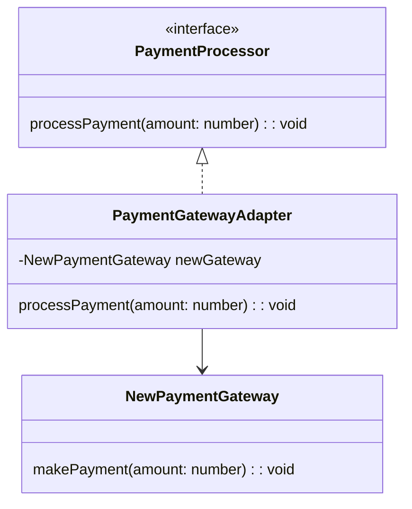

## 5.1.3 Use Cases and Examples

The Adapter Pattern is a structural design pattern that allows objects with incompatible interfaces to work together. It's akin to a power adapter that lets you plug a device into a socket with a different shape. In software development, this pattern is invaluable when integrating systems that were not designed to cooperate. Let's delve into some real-world scenarios where the Adapter Pattern shines, particularly in TypeScript.

### Integrating a New Payment Gateway API

**Scenario:** Imagine you are working on an e-commerce platform that has been using a specific payment gateway for years. The platform's payment processing module expects a particular interface to handle transactions. Now, you need to integrate a new payment gateway that offers better rates and features but has a different API.

**Solution with Adapter Pattern:** You can create an adapter that implements the expected interface and internally uses the new payment gateway's API. This way, the rest of the system can continue to operate without any changes.

#### Code Example

```typescript
// Existing interface expected by the e-commerce platform
interface PaymentProcessor {
    processPayment(amount: number): void;
}

// New payment gateway with a different interface
class NewPaymentGateway {
    makePayment(amount: number): void {
        console.log(`Processing payment of $${amount} through the new gateway.`);
    }
}

// Adapter class implementing the expected interface
class PaymentGatewayAdapter implements PaymentProcessor {
    private newGateway: NewPaymentGateway;

    constructor(newGateway: NewPaymentGateway) {
        this.newGateway = newGateway;
    }

    processPayment(amount: number): void {
        this.newGateway.makePayment(amount);
    }
}

// Usage
const newGateway = new NewPaymentGateway();
const adapter = new PaymentGatewayAdapter(newGateway);
adapter.processPayment(100);
```

**Benefits:**
- **Reuse of Existing Code:** The existing payment processing logic remains unchanged.
- **Loose Coupling:** The adapter decouples the e-commerce platform from the new payment gateway.
- **Facilitates Gradual Integration:** Allows for a seamless transition to the new gateway.

**Drawbacks:**
- **Added Complexity:** Introduces an additional layer of abstraction.
- **Performance Overhead:** Slightly more processing due to the adapter layer.

### Adapting a Logging Library's Interface

**Scenario:** Your application has a custom logging infrastructure, but you want to leverage a third-party logging library that offers advanced features like log rotation and remote logging. However, the library's interface is different from your application's logging interface.

**Solution with Adapter Pattern:** Implement an adapter that translates your application's logging calls into the third-party library's API.

#### Code Example

```typescript
// Application's logging interface
interface Logger {
    log(message: string): void;
}

// Third-party logging library
class ThirdPartyLogger {
    writeLog(msg: string): void {
        console.log(`Third-party log: ${msg}`);
    }
}

// Adapter class
class LoggerAdapter implements Logger {
    private thirdPartyLogger: ThirdPartyLogger;

    constructor(thirdPartyLogger: ThirdPartyLogger) {
        this.thirdPartyLogger = thirdPartyLogger;
    }

    log(message: string): void {
        this.thirdPartyLogger.writeLog(message);
    }
}

// Usage
const thirdPartyLogger = new ThirdPartyLogger();
const loggerAdapter = new LoggerAdapter(thirdPartyLogger);
loggerAdapter.log("This is a log message.");
```

**Benefits:**
- **Integration of Advanced Features:** Leverage the third-party library's capabilities without altering your logging infrastructure.
- **Loose Coupling:** The adapter isolates the application from the third-party library.
- **Gradual Replacement:** Allows for testing and gradual adoption of the new logging system.

**Drawbacks:**
- **Complexity:** Adds another layer to the logging process.
- **Potential for Bugs:** Misalignment between the adapter and the library's API can introduce bugs.

### Using an External Data Source with a Different Data Format

**Scenario:** Your application processes data in a specific format, but you need to integrate an external data source that provides data in a different format. Directly modifying your application to accommodate the new format would be costly and error-prone.

**Solution with Adapter Pattern:** Create an adapter that converts the external data format into the format expected by your application.

#### Code Example

```typescript
// Expected data format
interface DataModel {
    id: number;
    name: string;
}

// External data source format
class ExternalData {
    getData(): { identifier: number; fullName: string } {
        return { identifier: 1, fullName: "John Doe" };
    }
}

// Adapter class
class DataAdapter implements DataModel {
    private externalData: ExternalData;

    constructor(externalData: ExternalData) {
        this.externalData = externalData;
    }

    get id(): number {
        return this.externalData.getData().identifier;
    }

    get name(): string {
        return this.externalData.getData().fullName;
    }
}

// Usage
const externalData = new ExternalData();
const adaptedData: DataModel = new DataAdapter(externalData);
console.log(`ID: ${adaptedData.id}, Name: ${adaptedData.name}`);
```

**Benefits:**
- **Data Format Compatibility:** Seamlessly integrates the external data source without altering the core application.
- **Loose Coupling:** The adapter acts as a bridge, maintaining separation between the application and the data source.
- **Flexibility:** Easily switch to different data sources by implementing new adapters.

**Drawbacks:**
- **Performance Overhead:** Data conversion might introduce latency.
- **Complexity:** Managing multiple adapters can become cumbersome.

### Visualizing the Adapter Pattern

To better understand how the Adapter Pattern works, let's visualize the relationships between the components involved.



**Diagram Description:** This diagram illustrates the relationship between the `PaymentProcessor` interface, the `NewPaymentGateway` class, and the `PaymentGatewayAdapter`. The adapter implements the `PaymentProcessor` interface and delegates the payment processing to the `NewPaymentGateway`.

### Encouragement to Use the Adapter Pattern

When faced with integration challenges, consider the Adapter Pattern as a viable solution. It allows you to bridge the gap between incompatible interfaces without modifying existing code, promoting code reuse and flexibility. However, be mindful of the added complexity and potential performance implications.

### Try It Yourself

Experiment with the provided code examples by modifying them to fit your own scenarios. For instance, try adapting a different API or data format to see how the Adapter Pattern can simplify integration. Remember, the key is to maintain loose coupling and promote code reuse.

### Knowledge Check

- **Question:** What are the main benefits of using the Adapter Pattern?
- **Question:** How does the Adapter Pattern promote loose coupling?
- **Question:** What are some potential drawbacks of using the Adapter Pattern?

### Summary

The Adapter Pattern is a powerful tool for integrating systems with incompatible interfaces. By creating adapters, you can seamlessly integrate new components into existing systems without altering the core logic. This pattern is particularly useful in scenarios involving legacy code, third-party libraries, and external data sources. While it introduces some complexity, the benefits of code reuse, loose coupling, and flexibility often outweigh the drawbacks.

## Quiz Time!



### What is the primary purpose of the Adapter Pattern?

- [x] To allow incompatible interfaces to work together.
- [ ] To enhance the performance of an application.
- [ ] To simplify the user interface design.
- [ ] To reduce the number of classes in a system.

> **Explanation:** The Adapter Pattern is used to enable objects with incompatible interfaces to work together by providing a compatible interface.

### In the payment gateway example, what role does the `PaymentGatewayAdapter` play?

- [x] It implements the expected interface and adapts the new gateway's API.
- [ ] It directly modifies the new gateway's API to fit the existing system.
- [ ] It replaces the existing payment processing logic.
- [ ] It serves as a database for transaction records.

> **Explanation:** The `PaymentGatewayAdapter` implements the `PaymentProcessor` interface and translates calls to the new gateway's API, allowing the existing system to use the new gateway without changes.

### What is a potential drawback of using the Adapter Pattern?

- [x] Added complexity and potential performance overhead.
- [ ] Increased coupling between components.
- [ ] Inability to reuse existing code.
- [ ] Difficulty in testing the application.

> **Explanation:** The Adapter Pattern can introduce additional complexity and performance overhead due to the extra layer of abstraction.

### How does the Adapter Pattern promote loose coupling?

- [x] By isolating the application from the specific implementation details of external components.
- [ ] By merging multiple interfaces into a single one.
- [ ] By directly modifying the existing codebase.
- [ ] By eliminating the need for interfaces altogether.

> **Explanation:** The Adapter Pattern isolates the application from the specifics of external components, allowing for changes without affecting the core system.

### Which of the following is NOT a benefit of using the Adapter Pattern?

- [ ] Enables the reuse of existing code.
- [ ] Promotes loose coupling between components.
- [ ] Facilitates gradual integration or replacement of components.
- [x] Guarantees improved performance.

> **Explanation:** While the Adapter Pattern offers many benefits, it does not inherently guarantee improved performance and may introduce overhead.

### In the logging library example, what does the `LoggerAdapter` do?

- [x] It adapts the third-party logging library to match the application's logging interface.
- [ ] It directly modifies the third-party library to fit the application's needs.
- [ ] It serves as a storage for log messages.
- [ ] It replaces the application's logging infrastructure.

> **Explanation:** The `LoggerAdapter` adapts the third-party library's interface to match the application's logging interface, enabling seamless integration.

### What is a common use case for the Adapter Pattern?

- [x] Integrating a new API with an existing system.
- [ ] Optimizing database queries.
- [ ] Designing a user-friendly interface.
- [ ] Reducing the number of classes in a system.

> **Explanation:** The Adapter Pattern is commonly used to integrate new APIs or components with existing systems that expect a specific interface.

### How does the Adapter Pattern facilitate gradual integration?

- [x] By allowing new components to be integrated without altering the existing system.
- [ ] By requiring immediate changes to the entire codebase.
- [ ] By merging multiple interfaces into one.
- [ ] By eliminating the need for testing.

> **Explanation:** The Adapter Pattern allows new components to be integrated gradually by providing a compatible interface, minimizing disruption to the existing system.

### True or False: The Adapter Pattern can only be used with third-party libraries.

- [ ] True
- [x] False

> **Explanation:** The Adapter Pattern can be used in various scenarios, including integrating legacy code, third-party libraries, and external data sources.

### Which of the following best describes the role of an adapter in the Adapter Pattern?

- [x] It acts as a bridge between two incompatible interfaces.
- [ ] It replaces the existing implementation with a new one.
- [ ] It merges multiple interfaces into a single one.
- [ ] It eliminates the need for interfaces altogether.

> **Explanation:** An adapter acts as a bridge between two incompatible interfaces, allowing them to work together without modifying the existing code.



Remember, this is just the beginning. As you progress, you'll build more complex and interactive systems using the Adapter Pattern and other design patterns. Keep experimenting, stay curious, and enjoy the journey!
