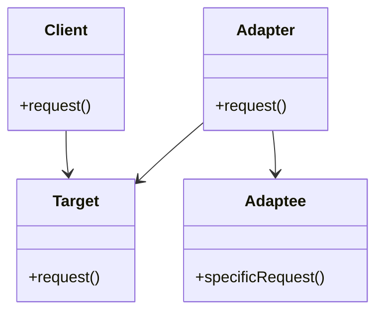
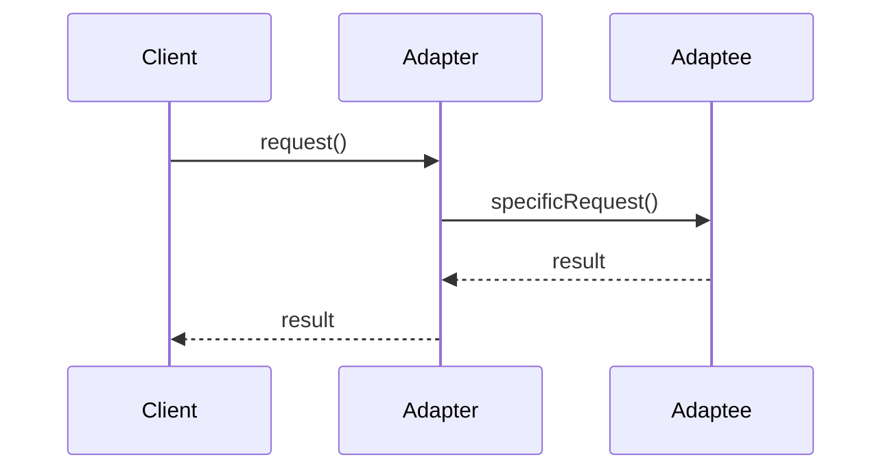

## 5.1 Adapter Pattern

The Adapter Pattern is a structural design pattern that enables objects with incompatible interfaces to collaborate. This pattern acts as a bridge between two incompatible interfaces, allowing them to work together without altering their source code. In TypeScript, the Adapter Pattern is particularly useful for integrating third-party libraries or legacy code into new applications, ensuring that different parts of a system can communicate seamlessly.

### Understanding the Adapter Pattern

#### Definition and Intent

The primary intent of the Adapter Pattern is to allow the interface of an existing class (the Adaptee) to be used as another interface (the Target) that clients expect. By doing so, it enables the integration of classes with incompatible interfaces without modifying their source code. This pattern is especially useful when you need to use existing classes but cannot change their interfaces to match the rest of your application.

#### Problem Solved

In software development, it is common to encounter situations where you need to integrate components with incompatible interfaces. For instance, you might be working with a third-party library that provides a set of functionalities but exposes them through an interface that does not match the one your application expects. The Adapter Pattern solves this problem by introducing an intermediary (the Adapter) that translates the interface of the Adaptee into the Target interface that the client can work with.

### Key Components of the Adapter Pattern

To fully understand how the Adapter Pattern works, let's break down its key components:

- **Target**: The interface that the client expects. This is the interface that the Adapter will implement to make the Adaptee compatible with the client.
- **Adapter**: The class that implements the Target interface and translates requests from the client to the Adaptee. The Adapter acts as a middleman, converting the client's requests into a format that the Adaptee can understand.
- **Adaptee**: The existing class with an incompatible interface that needs adapting. The Adaptee contains the functionality that the client wants to use but cannot directly due to interface incompatibility.
- **Client**: The class that uses the Target interface. The client interacts with the Adapter as if it were interacting with the Target, unaware of the underlying Adaptee.

### UML Class Diagram

To visualize the relationships between these components, let's look at a UML class diagram:



In this diagram, the `Client` interacts with the `Target` interface. The `Adapter` implements the `Target` interface and holds a reference to an `Adaptee` object. When the `Client` calls the `request()` method on the `Adapter`, the `Adapter` translates this call into a `specificRequest()` call on the `Adaptee`.

### Implementing the Adapter Pattern in TypeScript

Let's delve into a practical implementation of the Adapter Pattern in TypeScript. We'll use a real-world analogy to make the concept more relatable.

#### Real-World Analogy

Consider a scenario where you have a European plug that you need to use with an American socket. The plug and socket have incompatible interfaces, but you can use an adapter to bridge the gap. The adapter allows the European plug to connect to the American socket, enabling them to work together.

#### Code Example

Let's implement this analogy in TypeScript:

```typescript
// Target interface
interface AmericanSocket {
    provideElectricity(): string;
}

// Adaptee class
class EuropeanPlug {
    public specificRequest(): string {
        return "Electricity from European plug";
    }
}

// Adapter class
class PlugAdapter implements AmericanSocket {
    private europeanPlug: EuropeanPlug;

    constructor(europeanPlug: EuropeanPlug) {
        this.europeanPlug = europeanPlug;
    }

    public provideElectricity(): string {
        // Translate the specific request to the target interface
        return this.europeanPlug.specificRequest();
    }
}

// Client code
const europeanPlug = new EuropeanPlug();
const adapter = new PlugAdapter(europeanPlug);

console.log(adapter.provideElectricity()); // Output: Electricity from European plug
```

In this example, the `AmericanSocket` interface represents the `Target` interface that the client expects. The `EuropeanPlug` class is the `Adaptee` with an incompatible interface. The `PlugAdapter` class implements the `AmericanSocket` interface and translates the `specificRequest()` from the `EuropeanPlug` into the `provideElectricity()` method expected by the client.

### Promoting Flexibility and Reusability

The Adapter Pattern promotes flexibility and reusability by decoupling the client from the concrete implementations of the Adaptee. By using an adapter, you can integrate new or existing classes without modifying their source code, making your system more modular and easier to maintain.

#### Benefits of the Adapter Pattern

- **Decoupling**: The Adapter Pattern decouples the client from the Adaptee, allowing them to evolve independently.
- **Reusability**: You can reuse existing classes without altering their code, making it easier to integrate third-party libraries or legacy systems.
- **Flexibility**: The Adapter Pattern provides a flexible way to adapt interfaces, enabling you to switch between different implementations without affecting the client code.

### Advanced Implementation Details

For expert-level TypeScript professionals, let's explore some advanced implementation details and TypeScript-specific features that can enhance the Adapter Pattern.

#### Using TypeScript Generics

TypeScript generics can be used to create more flexible adapters that can work with a variety of Adaptees. Here's an example:

```typescript
// Generic Target interface
interface Socket<T> {
    provideElectricity(): T;
}

// Generic Adapter class
class GenericPlugAdapter<T> implements Socket<T> {
    private adaptee: { specificRequest: () => T };

    constructor(adaptee: { specificRequest: () => T }) {
        this.adaptee = adaptee;
    }

    public provideElectricity(): T {
        return this.adaptee.specificRequest();
    }
}

// Client code
const europeanPlug = new EuropeanPlug();
const genericAdapter = new GenericPlugAdapter(europeanPlug);

console.log(genericAdapter.provideElectricity()); // Output: Electricity from European plug
```

In this example, the `Socket` interface and `GenericPlugAdapter` class use TypeScript generics to allow for different types of Adaptees, making the adapter more versatile.

#### Adapter Pattern with Class Adapters

In some cases, you might want to use inheritance to create a class adapter. Here's how you can implement a class adapter in TypeScript:

```typescript
// Class Adapter using inheritance
class ClassPlugAdapter extends EuropeanPlug implements AmericanSocket {
    public provideElectricity(): string {
        return this.specificRequest();
    }
}

// Client code
const classAdapter = new ClassPlugAdapter();

console.log(classAdapter.provideElectricity()); // Output: Electricity from European plug
```

In this example, the `ClassPlugAdapter` class inherits from the `EuropeanPlug` class and implements the `AmericanSocket` interface. This approach is useful when you want to extend the functionality of the Adaptee while adapting its interface.

### Real-World Use Cases

The Adapter Pattern is widely used in software development to integrate systems with incompatible interfaces. Here are some real-world use cases:

- **Third-Party Libraries**: When integrating third-party libraries into your application, you might encounter incompatible interfaces. The Adapter Pattern allows you to create a wrapper around the library's interface, making it compatible with your application's expected interface.
- **Legacy Systems**: In situations where you need to integrate legacy systems with modern applications, the Adapter Pattern can bridge the gap between old and new interfaces.
- **Cross-Platform Development**: When developing cross-platform applications, you might need to adapt platform-specific interfaces to a common interface that your application can use.

### Try It Yourself

To deepen your understanding of the Adapter Pattern, try modifying the code examples provided. Here are some suggestions:

- **Experiment with Different Adaptees**: Create new classes with different interfaces and use the Adapter Pattern to integrate them with the client code.
- **Implement a Class Adapter**: Try implementing a class adapter using inheritance and compare it with the object adapter approach.
- **Use TypeScript Generics**: Modify the generic adapter example to work with different types of Adaptees and observe how generics enhance flexibility.

### Visualizing the Adapter Pattern

To further illustrate the Adapter Pattern, let's use a sequence diagram to show the interaction between the client, adapter, and adaptee:



This sequence diagram demonstrates how the client interacts with the adapter, which in turn communicates with the adaptee to fulfill the client's request.

### Knowledge Check

Before we conclude, let's reinforce your understanding of the Adapter Pattern with a few questions:

1. What is the primary purpose of the Adapter Pattern?
2. How does the Adapter Pattern promote flexibility and reusability?
3. What are the key components of the Adapter Pattern?
4. How can TypeScript generics enhance the Adapter Pattern?
5. What are some real-world use cases of the Adapter Pattern?

### Summary

The Adapter Pattern is a powerful tool for integrating systems with incompatible interfaces. By providing a mediator that translates one interface into another, it enables seamless communication between different parts of a system. In TypeScript, the Adapter Pattern leverages the language's features, such as generics and interfaces, to create flexible and reusable solutions. As you continue to explore design patterns, remember that the Adapter Pattern is just one of many tools at your disposal for building robust and maintainable software.

## Quiz Time!



### What is the primary purpose of the Adapter Pattern?

- [x] To allow incompatible interfaces to work together
- [ ] To create a new interface for existing classes
- [ ] To modify the source code of existing classes
- [ ] To simplify complex interfaces

> **Explanation:** The Adapter Pattern allows incompatible interfaces to work together by providing a mediator that translates one interface into another that clients expect.

### Which component of the Adapter Pattern represents the interface that the client expects?

- [x] Target
- [ ] Adapter
- [ ] Adaptee
- [ ] Client

> **Explanation:** The Target is the interface that the client expects and interacts with.

### What role does the Adapter play in the Adapter Pattern?

- [x] It implements the Target interface and translates requests to the Adaptee
- [ ] It provides the functionality that the client wants to use
- [ ] It acts as the client in the pattern
- [ ] It modifies the Adaptee's interface

> **Explanation:** The Adapter implements the Target interface and translates requests from the client to the Adaptee.

### How does the Adapter Pattern promote flexibility?

- [x] By decoupling the client from the concrete implementations of the Adaptee
- [ ] By modifying the Adaptee's source code
- [ ] By creating new interfaces for all classes
- [ ] By simplifying the client's interface

> **Explanation:** The Adapter Pattern promotes flexibility by decoupling the client from the concrete implementations of the Adaptee, allowing them to evolve independently.

### What is a real-world analogy for the Adapter Pattern?

- [x] Using a plug adapter to connect a European plug to an American socket
- [ ] Using a universal remote to control different devices
- [ ] Using a translator to communicate between different languages
- [ ] Using a bridge to connect two separate islands

> **Explanation:** A plug adapter allows a European plug to connect to an American socket, similar to how the Adapter Pattern bridges incompatible interfaces.

### How can TypeScript generics enhance the Adapter Pattern?

- [x] By creating more flexible adapters that can work with various Adaptees
- [ ] By simplifying the implementation of the Adaptee
- [ ] By modifying the Target interface
- [ ] By reducing the number of classes needed

> **Explanation:** TypeScript generics allow for more flexible adapters that can work with different types of Adaptees.

### What is the benefit of using a class adapter in TypeScript?

- [x] It allows for extending the functionality of the Adaptee while adapting its interface
- [ ] It simplifies the client's code
- [ ] It reduces the number of interfaces needed
- [ ] It modifies the Adaptee's source code

> **Explanation:** A class adapter allows for extending the functionality of the Adaptee while adapting its interface, using inheritance.

### Which of the following is a benefit of the Adapter Pattern?

- [x] Reusability of existing classes without altering their code
- [ ] Simplifying the client's interface
- [ ] Modifying the Adaptee's source code
- [ ] Creating new interfaces for all classes

> **Explanation:** The Adapter Pattern allows for the reusability of existing classes without altering their code, making it easier to integrate third-party libraries or legacy systems.

### What is the role of the Client in the Adapter Pattern?

- [x] It uses the Target interface
- [ ] It implements the Target interface
- [ ] It provides the functionality that the Adaptee needs
- [ ] It modifies the Adapter's interface

> **Explanation:** The Client uses the Target interface to interact with the Adapter.

### True or False: The Adapter Pattern can only be used in object-oriented programming languages.

- [ ] True
- [x] False

> **Explanation:** The Adapter Pattern can be implemented in various programming paradigms, not just object-oriented languages.



Remember, mastering design patterns like the Adapter Pattern is a journey. As you continue to explore and apply these patterns in your projects, you'll gain a deeper understanding of how to build flexible, maintainable, and scalable software. Keep experimenting, stay curious, and enjoy the journey!
