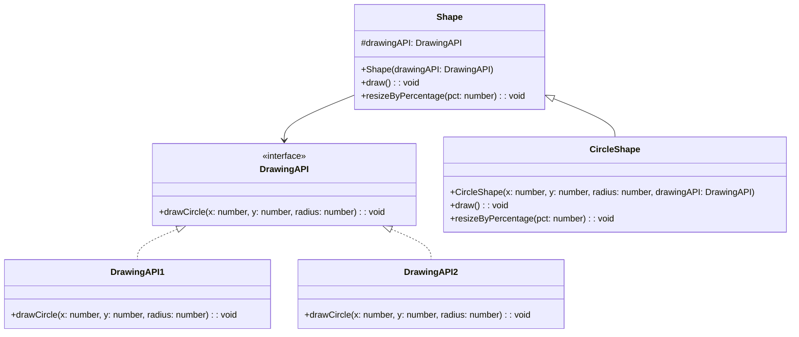

## 5.2.1 Implementing Bridge in TypeScript

The Bridge Pattern is a structural design pattern that decouples an abstraction from its implementation, allowing both to vary independently. This pattern is particularly useful when you need to switch between different implementations at runtime without altering the client code. In this section, we will explore how to implement the Bridge Pattern in TypeScript, leveraging its strong typing and interface capabilities.

### Understanding the Bridge Pattern

The Bridge Pattern involves four main components:

1. **Abstraction**: Defines the abstraction's interface and maintains a reference to an object of type Implementor.
2. **Implementor**: Declares the interface for implementation classes.
3. **Concrete Implementor**: Provides concrete implementations of the Implementor interface.
4. **Refined Abstraction**: Extends the interface defined by Abstraction.

By separating the abstraction from the implementation, the Bridge Pattern allows you to change the implementation without modifying the abstraction or the client code.

### Step-by-Step Implementation

Let's walk through a step-by-step implementation of the Bridge Pattern in TypeScript.

#### Step 1: Define the Implementor Interface

The Implementor interface declares the methods that concrete implementors must provide. This interface acts as a bridge between the abstraction and the concrete implementations.

```typescript
// Implementor interface
interface DrawingAPI {
    drawCircle(x: number, y: number, radius: number): void;
}
```

In this example, the `DrawingAPI` interface declares a method `drawCircle`, which concrete implementors will define.

#### Step 2: Create Concrete Implementor Classes

Concrete Implementor classes provide specific implementations of the methods declared in the Implementor interface.

```typescript
// Concrete Implementor 1
class DrawingAPI1 implements DrawingAPI {
    drawCircle(x: number, y: number, radius: number): void {
        console.log(`API1.circle at (${x}, ${y}) with radius ${radius}`);
    }
}

// Concrete Implementor 2
class DrawingAPI2 implements DrawingAPI {
    drawCircle(x: number, y: number, radius: number): void {
        console.log(`API2.circle at (${x}, ${y}) with radius ${radius}`);
    }
}
```

Here, `DrawingAPI1` and `DrawingAPI2` are two different implementations of the `DrawingAPI` interface.

#### Step 3: Define the Abstraction

The Abstraction class maintains a reference to an Implementor object and delegates the actual work to the Implementor.

```typescript
// Abstraction
abstract class Shape {
    protected drawingAPI: DrawingAPI;

    constructor(drawingAPI: DrawingAPI) {
        this.drawingAPI = drawingAPI;
    }

    abstract draw(): void;
    abstract resizeByPercentage(pct: number): void;
}
```

The `Shape` class is an abstract class that holds a reference to a `DrawingAPI` object. It provides abstract methods `draw` and `resizeByPercentage` that must be implemented by subclasses.

#### Step 4: Create Refined Abstraction Classes

Refined Abstraction classes extend the interface defined by the Abstraction class.

```typescript
// Refined Abstraction
class CircleShape extends Shape {
    private x: number;
    private y: number;
    private radius: number;

    constructor(x: number, y: number, radius: number, drawingAPI: DrawingAPI) {
        super(drawingAPI);
        this.x = x;
        this.y = y;
        this.radius = radius;
    }

    draw(): void {
        this.drawingAPI.drawCircle(this.x, this.y, this.radius);
    }

    resizeByPercentage(pct: number): void {
        this.radius *= pct;
    }
}
```

The `CircleShape` class extends the `Shape` class and provides implementations for the `draw` and `resizeByPercentage` methods.

#### Step 5: Use the Bridge Pattern in Client Code

Now, let's see how to use the Bridge Pattern in client code to switch implementations at runtime.

```typescript
// Client code
const shapes: Shape[] = [
    new CircleShape(1, 2, 3, new DrawingAPI1()),
    new CircleShape(5, 7, 11, new DrawingAPI2())
];

shapes.forEach(shape => {
    shape.resizeByPercentage(2.5);
    shape.draw();
});
```

In the client code, we create an array of `Shape` objects, each using a different `DrawingAPI` implementation. We then iterate over the array, resizing and drawing each shape.

### TypeScript-Specific Considerations

TypeScript's strong typing and interface capabilities make it an excellent choice for implementing the Bridge Pattern. Here are some considerations:

- **Type Safety**: TypeScript ensures that the methods declared in the Implementor interface are implemented by concrete classes, providing compile-time type safety.
- **Access Modifiers**: Use access modifiers like `protected` to control access to the Implementor reference within the Abstraction class.
- **Constructor Injection**: Inject the Implementor into the Abstraction through constructor injection, promoting loose coupling and flexibility.

### Visualizing the Bridge Pattern

To better understand the Bridge Pattern, let's visualize the relationships between the components using a class diagram.



This diagram illustrates the relationships between the `DrawingAPI`, `DrawingAPI1`, `DrawingAPI2`, `Shape`, and `CircleShape` classes.

### Try It Yourself

Now that we've covered the implementation of the Bridge Pattern in TypeScript, try modifying the code to add a new shape, such as a rectangle. Implement a new `RectangleShape` class that extends the `Shape` class and provides its own implementations for the `draw` and `resizeByPercentage` methods. Experiment with different `DrawingAPI` implementations and see how easily you can switch between them.

### Key Takeaways

- The Bridge Pattern decouples an abstraction from its implementation, allowing both to vary independently.
- TypeScript's interfaces and strong typing facilitate the implementation of the Bridge Pattern.
- Constructor injection promotes loose coupling and flexibility.
- The Bridge Pattern is useful when you need to switch between different implementations at runtime.

### Further Reading

For more information on the Bridge Pattern, check out the following resources:

- [Bridge Pattern on Wikipedia](https://en.wikipedia.org/wiki/Bridge_pattern)
- [MDN Web Docs: Interfaces](https://developer.mozilla.org/en-US/docs/Web/JavaScript/Guide/Interfaces)
- [TypeScript Handbook: Interfaces](https://www.typescriptlang.org/docs/handbook/interfaces.html)

## Quiz Time!



### What is the primary purpose of the Bridge Pattern?

- [x] To decouple an abstraction from its implementation
- [ ] To provide a simplified interface to a complex subsystem
- [ ] To allow incompatible interfaces to work together
- [ ] To attach additional responsibilities to an object dynamically

> **Explanation:** The Bridge Pattern is designed to decouple an abstraction from its implementation, allowing both to vary independently.

### Which component in the Bridge Pattern declares the methods to be implemented by concrete implementors?

- [ ] Abstraction
- [x] Implementor
- [ ] Concrete Implementor
- [ ] Refined Abstraction

> **Explanation:** The Implementor interface declares the methods that concrete implementors must provide.

### How is the Implementor typically injected into the Abstraction in TypeScript?

- [ ] Through method injection
- [x] Through constructor injection
- [ ] Through property injection
- [ ] Through interface injection

> **Explanation:** The Implementor is typically injected into the Abstraction through constructor injection, promoting loose coupling and flexibility.

### What is the role of the Refined Abstraction in the Bridge Pattern?

- [ ] To provide specific implementations of the Implementor interface
- [x] To extend the interface defined by the Abstraction
- [ ] To declare the methods to be implemented by concrete implementors
- [ ] To maintain a reference to an Implementor object

> **Explanation:** The Refined Abstraction extends the interface defined by the Abstraction class.

### In the provided example, what method is declared in the Implementor interface?

- [x] drawCircle
- [ ] drawRectangle
- [ ] resizeByPercentage
- [ ] draw

> **Explanation:** The `drawCircle` method is declared in the Implementor interface, which concrete implementors must define.

### What is the benefit of using TypeScript's interfaces in the Bridge Pattern?

- [x] They provide compile-time type safety
- [ ] They allow for dynamic typing
- [ ] They simplify the implementation of the pattern
- [ ] They eliminate the need for access modifiers

> **Explanation:** TypeScript's interfaces provide compile-time type safety, ensuring that the methods declared in the Implementor interface are implemented by concrete classes.

### Which access modifier is used in the Abstraction class to control access to the Implementor reference?

- [ ] public
- [x] protected
- [ ] private
- [ ] readonly

> **Explanation:** The `protected` access modifier is used to control access to the Implementor reference within the Abstraction class.

### What is a key advantage of the Bridge Pattern?

- [x] It allows for switching implementations at runtime without altering client code
- [ ] It simplifies the client code by providing a unified interface
- [ ] It enhances performance by reducing memory usage
- [ ] It ensures that only one instance of a class is created

> **Explanation:** The Bridge Pattern allows for switching implementations at runtime without altering client code, providing flexibility and decoupling.

### Which of the following is NOT a component of the Bridge Pattern?

- [ ] Abstraction
- [ ] Implementor
- [x] Adapter
- [ ] Concrete Implementor

> **Explanation:** The Adapter is not a component of the Bridge Pattern. The Bridge Pattern consists of the Abstraction, Implementor, Concrete Implementor, and Refined Abstraction.

### True or False: The Bridge Pattern is useful when you need to switch between different implementations at runtime.

- [x] True
- [ ] False

> **Explanation:** True. The Bridge Pattern is particularly useful when you need to switch between different implementations at runtime without altering the client code.



Remember, this is just the beginning. As you progress, you'll build more complex and interactive applications using the Bridge Pattern and other design patterns. Keep experimenting, stay curious, and enjoy the journey!
