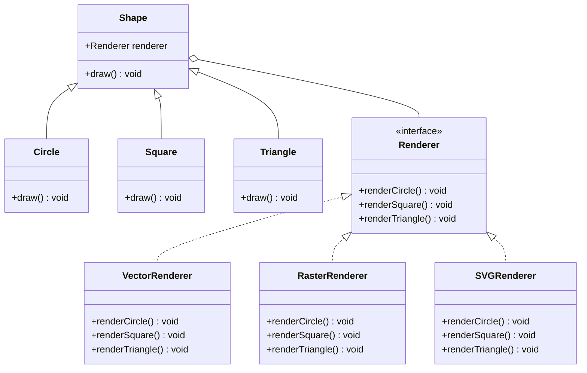

## 5.2.2 Decoupling Abstraction and Implementation

In the realm of software engineering, the ability to adapt and evolve codebases without introducing instability is paramount. This is where the concept of decoupling abstraction from implementation shines. By separating these two facets, we can achieve greater flexibility, scalability, and maintainability in our applications. In this section, we will delve into the principles and benefits of decoupling abstraction from implementation, explore practical examples, and discuss its impact on testing and code maintenance.

### Understanding Abstraction and Implementation

Before we dive into the benefits of decoupling, let's clarify what we mean by abstraction and implementation:

- **Abstraction**: This refers to the high-level interface or contract that defines what an object can do. It focuses on the "what" rather than the "how."
- **Implementation**: This is the concrete realization of the abstraction. It provides the actual code that performs the operations defined by the abstraction.

In many traditional designs, abstraction and implementation are tightly coupled. This means that changes to the implementation can necessitate changes to the abstraction, and vice versa. The Bridge Pattern is a structural design pattern that helps decouple these two, allowing them to vary independently.

### Benefits of Decoupling

#### 1. Greater Flexibility

Decoupling abstraction from implementation allows developers to change the implementation without affecting the abstraction. This is particularly useful when you need to support multiple implementations of an abstraction, such as different database engines or UI themes.

#### 2. Enhanced Scalability

As applications grow, the ability to add new features or support new platforms without rewriting existing code becomes crucial. Decoupling enables developers to introduce new abstractions and implementations seamlessly.

#### 3. Improved Maintainability

By separating concerns, code becomes cleaner and more modular. This makes it easier to understand, maintain, and extend. Developers can focus on specific parts of the code without worrying about unintended side effects elsewhere.

#### 4. Simplified Testing

Decoupling facilitates testing by allowing developers to mock implementations easily. This is especially beneficial in unit testing, where you want to isolate the component under test from its dependencies.

### Implementing Decoupling with the Bridge Pattern

The Bridge Pattern provides a way to decouple abstraction from implementation, allowing both to evolve independently. Let's explore how this pattern can be implemented in TypeScript.

#### Example: Decoupling a Shape Abstraction from its Rendering Implementation

Consider a scenario where we have different shapes that can be rendered in various ways. We want to decouple the shape abstraction from its rendering implementation.

```typescript
// Abstraction
abstract class Shape {
    protected renderer: Renderer;

    constructor(renderer: Renderer) {
        this.renderer = renderer;
    }

    abstract draw(): void;
}

// Refined Abstraction
class Circle extends Shape {
    draw(): void {
        this.renderer.renderCircle();
    }
}

class Square extends Shape {
    draw(): void {
        this.renderer.renderSquare();
    }
}

// Implementation Interface
interface Renderer {
    renderCircle(): void;
    renderSquare(): void;
}

// Concrete Implementations
class VectorRenderer implements Renderer {
    renderCircle(): void {
        console.log("Drawing a circle using vector rendering.");
    }

    renderSquare(): void {
        console.log("Drawing a square using vector rendering.");
    }
}

class RasterRenderer implements Renderer {
    renderCircle(): void {
        console.log("Drawing a circle using raster rendering.");
    }

    renderSquare(): void {
        console.log("Drawing a square using raster rendering.");
    }
}

// Client code
const vectorCircle = new Circle(new VectorRenderer());
vectorCircle.draw();

const rasterSquare = new Square(new RasterRenderer());
rasterSquare.draw();
```

In this example, the `Shape` class is the abstraction, and the `Renderer` interface represents the implementation. The `Circle` and `Square` classes are refined abstractions, while `VectorRenderer` and `RasterRenderer` are concrete implementations. This setup allows us to mix and match shapes and rendering techniques without modifying existing code.

### Adding New Abstractions and Implementations

One of the key advantages of decoupling is the ability to introduce new abstractions and implementations without altering existing code. Let's see how we can add a new shape and a new rendering technique.

#### Adding a New Shape: Triangle

```typescript
class Triangle extends Shape {
    draw(): void {
        this.renderer.renderTriangle();
    }
}

// Update Renderer Interface
interface Renderer {
    renderCircle(): void;
    renderSquare(): void;
    renderTriangle(): void; // New method
}

// Update Concrete Implementations
class VectorRenderer implements Renderer {
    renderCircle(): void {
        console.log("Drawing a circle using vector rendering.");
    }

    renderSquare(): void {
        console.log("Drawing a square using vector rendering.");
    }

    renderTriangle(): void {
        console.log("Drawing a triangle using vector rendering.");
    }
}

class RasterRenderer implements Renderer {
    renderCircle(): void {
        console.log("Drawing a circle using raster rendering.");
    }

    renderSquare(): void {
        console.log("Drawing a square using raster rendering.");
    }

    renderTriangle(): void {
        console.log("Drawing a triangle using raster rendering.");
    }
}

// Client code
const vectorTriangle = new Triangle(new VectorRenderer());
vectorTriangle.draw();
```

#### Adding a New Rendering Technique: SVGRenderer

```typescript
class SVGRenderer implements Renderer {
    renderCircle(): void {
        console.log("Drawing a circle using SVG rendering.");
    }

    renderSquare(): void {
        console.log("Drawing a square using SVG rendering.");
    }

    renderTriangle(): void {
        console.log("Drawing a triangle using SVG rendering.");
    }
}

// Client code
const svgCircle = new Circle(new SVGRenderer());
svgCircle.draw();
```

By adding the `Triangle` class and the `SVGRenderer` implementation, we have expanded the functionality of our application without modifying existing classes. This illustrates the power of decoupling abstraction from implementation.

### Visualizing the Bridge Pattern

To better understand the relationships between abstraction and implementation in the Bridge Pattern, let's visualize it using a class diagram.



### Impact on Testing

Decoupling abstraction from implementation has a significant impact on testing. By isolating the implementation, we can easily mock dependencies and test the abstraction in isolation. This leads to more reliable and maintainable tests.

#### Example: Testing the Circle Class

Let's see how we can test the `Circle` class using a mock renderer.

```typescript
class MockRenderer implements Renderer {
    renderCircle(): void {
        console.log("Mock render circle.");
    }

    renderSquare(): void {
        // No-op
    }

    renderTriangle(): void {
        // No-op
    }
}

// Test code
const mockRenderer = new MockRenderer();
const circle = new Circle(mockRenderer);
circle.draw(); // Output: Mock render circle.
```

By using a `MockRenderer`, we can test the `Circle` class without relying on the actual rendering logic. This makes our tests faster and more focused.

### Try It Yourself

To deepen your understanding, try modifying the code examples:

1. **Add a new shape**: Implement a `Rectangle` class and update the renderers to support it.
2. **Introduce a new rendering technique**: Create a `CanvasRenderer` class that simulates rendering on an HTML canvas.
3. **Test a different shape**: Write a test for the `Square` class using a mock renderer.

### Conclusion

Decoupling abstraction from implementation is a powerful design principle that enhances flexibility, scalability, and maintainability. By using the Bridge Pattern, we can achieve this separation, allowing both abstraction and implementation to evolve independently. This leads to cleaner code, easier testing, and the ability to extend functionality without modifying existing code.

### Key Takeaways

- **Decoupling** allows for independent evolution of abstraction and implementation.
- **Flexibility and scalability** are enhanced by enabling new features without modifying existing code.
- **Testing** becomes simpler with the ability to mock implementations.
- **Maintainability** improves through cleaner, more modular code.

### Further Reading

For more information on the Bridge Pattern and other structural design patterns, check out the following resources:

- [MDN Web Docs on Design Patterns](https://developer.mozilla.org/en-US/docs/Web/JavaScript/Guide/Design_Patterns)
- [Refactoring Guru: Bridge Pattern](https://refactoring.guru/design-patterns/bridge)
- [TypeScript Official Documentation](https://www.typescriptlang.org/docs/)

## Quiz Time!



### What is the primary benefit of decoupling abstraction from implementation?

- [x] It allows both to evolve independently.
- [ ] It increases code complexity.
- [ ] It reduces the need for testing.
- [ ] It makes code less readable.

> **Explanation:** Decoupling abstraction from implementation allows both to evolve independently, enhancing flexibility and scalability.

### How does the Bridge Pattern help in decoupling?

- [x] By separating abstraction from implementation.
- [ ] By combining multiple implementations.
- [ ] By reducing the number of classes.
- [ ] By increasing code coupling.

> **Explanation:** The Bridge Pattern separates abstraction from implementation, allowing them to vary independently.

### What is a key advantage of decoupling in terms of testing?

- [x] It allows for easy mocking of implementations.
- [ ] It eliminates the need for unit tests.
- [ ] It makes tests more complex.
- [ ] It requires integration testing.

> **Explanation:** Decoupling allows for easy mocking of implementations, simplifying unit testing.

### Which of the following is an example of a refined abstraction in the provided code?

- [x] Circle
- [ ] Renderer
- [ ] VectorRenderer
- [ ] SVGRenderer

> **Explanation:** `Circle` is a refined abstraction that extends the `Shape` class.

### What does the Renderer interface represent in the Bridge Pattern example?

- [x] The implementation interface.
- [ ] The abstraction interface.
- [ ] A concrete implementation.
- [ ] A client class.

> **Explanation:** The `Renderer` interface represents the implementation interface in the Bridge Pattern.

### How can new shapes be added to the system without modifying existing code?

- [x] By creating new classes that extend the Shape class.
- [ ] By modifying the Renderer interface.
- [ ] By changing existing concrete implementations.
- [ ] By altering the client code.

> **Explanation:** New shapes can be added by creating new classes that extend the `Shape` class.

### What is the role of the VectorRenderer class in the example?

- [x] It is a concrete implementation of the Renderer interface.
- [ ] It is an abstraction.
- [ ] It is a client class.
- [ ] It is a mock implementation.

> **Explanation:** `VectorRenderer` is a concrete implementation of the `Renderer` interface.

### What does decoupling abstraction from implementation improve in terms of code?

- [x] Maintainability and modularity.
- [ ] Complexity and coupling.
- [ ] Redundancy and duplication.
- [ ] Hardcoding and inflexibility.

> **Explanation:** Decoupling improves maintainability and modularity by separating concerns.

### Which pattern is used to achieve decoupling of abstraction and implementation?

- [x] Bridge Pattern
- [ ] Singleton Pattern
- [ ] Factory Pattern
- [ ] Observer Pattern

> **Explanation:** The Bridge Pattern is used to decouple abstraction from implementation.

### True or False: Decoupling abstraction and implementation can lead to cleaner, more maintainable code.

- [x] True
- [ ] False

> **Explanation:** True. Decoupling leads to cleaner, more maintainable code by separating concerns.


