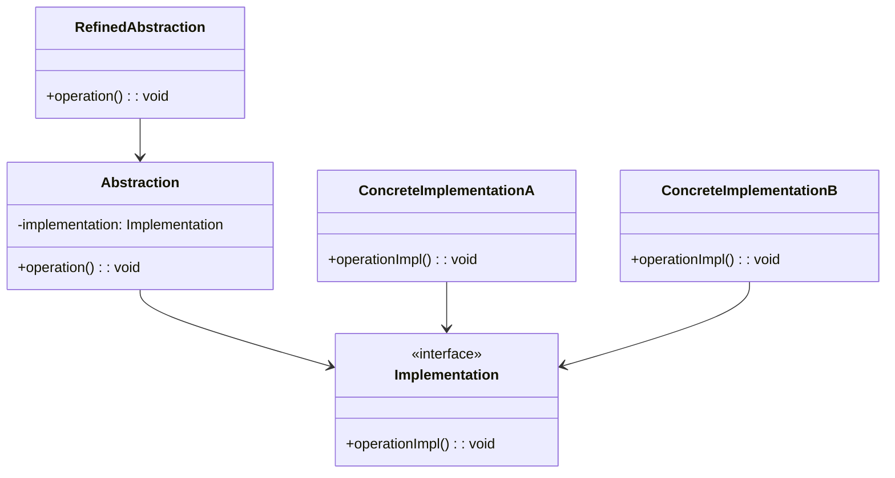

## 5.2.3 Use Cases and Examples

The Bridge Pattern is a structural design pattern that decouples an abstraction from its implementation, allowing both to vary independently. This pattern is particularly useful in scenarios where you need to support multiple platforms, APIs, or data sources. In this section, we'll explore various use cases and examples where the Bridge Pattern can be effectively applied, providing flexibility and extensibility in software design.

### Developing a Graphical Application with Multiple Rendering APIs

#### Problem Statement

Imagine you're developing a graphical application that needs to support different rendering APIs, such as DirectX and OpenGL. Each API has its own set of functionalities and methods for rendering graphics, and you want your application to be able to switch between these APIs seamlessly.

#### Applying the Bridge Pattern

The Bridge Pattern can be applied here to separate the abstraction (the graphical application) from the implementation (the rendering APIs). By doing so, you can easily extend your application to support new rendering APIs in the future without modifying the core logic of your application.

#### Implementation in TypeScript

Let's implement this scenario using TypeScript:

```typescript
// Define the abstraction
interface Renderer {
  renderCircle(radius: number): void;
  renderSquare(size: number): void;
}

// Implement the concrete implementations
class DirectXRenderer implements Renderer {
  renderCircle(radius: number): void {
    console.log(`DirectX: Rendering a circle with radius ${radius}`);
  }
  renderSquare(size: number): void {
    console.log(`DirectX: Rendering a square with size ${size}`);
  }
}

class OpenGLRenderer implements Renderer {
  renderCircle(radius: number): void {
    console.log(`OpenGL: Rendering a circle with radius ${radius}`);
  }
  renderSquare(size: number): void {
    console.log(`OpenGL: Rendering a square with size ${size}`);
  }
}

// Define the abstraction that uses the renderer
class Shape {
  constructor(protected renderer: Renderer) {}

  drawCircle(radius: number): void {
    this.renderer.renderCircle(radius);
  }

  drawSquare(size: number): void {
    this.renderer.renderSquare(size);
  }
}

// Client code
const directXRenderer = new DirectXRenderer();
const openGLRenderer = new OpenGLRenderer();

const shape1 = new Shape(directXRenderer);
shape1.drawCircle(5);

const shape2 = new Shape(openGLRenderer);
shape2.drawSquare(10);
```

#### Explanation

In this example, the `Renderer` interface acts as the bridge between the `Shape` abstraction and its concrete implementations (`DirectXRenderer` and `OpenGLRenderer`). This setup allows us to switch between different rendering APIs without changing the `Shape` class.

#### Benefits

- **Flexibility**: Easily switch between different rendering APIs.
- **Extensibility**: Add support for new rendering APIs without modifying existing code.

#### Drawbacks

- **Increased Complexity**: Introducing an additional layer of abstraction can make the codebase more complex.
- **Initial Setup Overhead**: Setting up the bridge structure requires additional effort compared to a straightforward implementation.

### Creating a Messaging System with Multiple Channels

#### Problem Statement

Consider a messaging system that needs to send messages via different channels, such as email, SMS, and push notifications. Each channel has its own method of sending messages, and you want to provide a unified interface for sending messages across these channels.

#### Applying the Bridge Pattern

The Bridge Pattern can be used to decouple the message abstraction from the channel implementations, allowing you to add new channels in the future without altering the core messaging logic.

#### Implementation in TypeScript

Here's how you can implement this scenario using TypeScript:

```typescript
// Define the abstraction
interface MessageSender {
  sendMessage(message: string): void;
}

// Implement the concrete implementations
class EmailSender implements MessageSender {
  sendMessage(message: string): void {
    console.log(`Sending email: ${message}`);
  }
}

class SMSSender implements MessageSender {
  sendMessage(message: string): void {
    console.log(`Sending SMS: ${message}`);
  }
}

class PushNotificationSender implements MessageSender {
  sendMessage(message: string): void {
    console.log(`Sending push notification: ${message}`);
  }
}

// Define the abstraction that uses the message sender
class Message {
  constructor(protected sender: MessageSender) {}

  send(message: string): void {
    this.sender.sendMessage(message);
  }
}

// Client code
const emailSender = new EmailSender();
const smsSender = new SMSSender();
const pushNotificationSender = new PushNotificationSender();

const emailMessage = new Message(emailSender);
emailMessage.send("Hello via Email!");

const smsMessage = new Message(smsSender);
smsMessage.send("Hello via SMS!");

const pushNotificationMessage = new Message(pushNotificationSender);
pushNotificationMessage.send("Hello via Push Notification!");
```

#### Explanation

In this example, the `MessageSender` interface serves as the bridge between the `Message` abstraction and its concrete implementations (`EmailSender`, `SMSSender`, and `PushNotificationSender`). This allows the messaging system to support multiple channels without altering the core logic.

#### Benefits

- **Unified Interface**: Provides a consistent interface for sending messages across different channels.
- **Scalability**: Easily add new messaging channels without modifying existing code.

#### Drawbacks

- **Complexity**: The additional layer of abstraction can increase the complexity of the system.
- **Setup Overhead**: Initial setup requires more effort compared to a simple implementation.

### Designing a Data Access Layer for Multiple Databases

#### Problem Statement

Suppose you're designing a data access layer that needs to work with various databases, such as MySQL, PostgreSQL, and MongoDB. Each database has its own API and query language, and you want to provide a unified interface for accessing data across these databases.

#### Applying the Bridge Pattern

The Bridge Pattern can be applied to separate the data access abstraction from the database implementations, allowing you to support new databases in the future without modifying the core data access logic.

#### Implementation in TypeScript

Here's how you can implement this scenario using TypeScript:

```typescript
// Define the abstraction
interface Database {
  connect(): void;
  query(sql: string): void;
}

// Implement the concrete implementations
class MySQLDatabase implements Database {
  connect(): void {
    console.log("Connecting to MySQL database");
  }
  query(sql: string): void {
    console.log(`Executing MySQL query: ${sql}`);
  }
}

class PostgreSQLDatabase implements Database {
  connect(): void {
    console.log("Connecting to PostgreSQL database");
  }
  query(sql: string): void {
    console.log(`Executing PostgreSQL query: ${sql}`);
  }
}

class MongoDBDatabase implements Database {
  connect(): void {
    console.log("Connecting to MongoDB database");
  }
  query(sql: string): void {
    console.log(`Executing MongoDB query: ${sql}`);
  }
}

// Define the abstraction that uses the database
class DataAccess {
  constructor(protected database: Database) {}

  executeQuery(sql: string): void {
    this.database.connect();
    this.database.query(sql);
  }
}

// Client code
const mysqlDatabase = new MySQLDatabase();
const postgresqlDatabase = new PostgreSQLDatabase();
const mongoDBDatabase = new MongoDBDatabase();

const dataAccess1 = new DataAccess(mysqlDatabase);
dataAccess1.executeQuery("SELECT * FROM users");

const dataAccess2 = new DataAccess(postgresqlDatabase);
dataAccess2.executeQuery("SELECT * FROM orders");

const dataAccess3 = new DataAccess(mongoDBDatabase);
dataAccess3.executeQuery("{ find: 'products' }");
```

#### Explanation

In this example, the `Database` interface acts as the bridge between the `DataAccess` abstraction and its concrete implementations (`MySQLDatabase`, `PostgreSQLDatabase`, and `MongoDBDatabase`). This allows the data access layer to support multiple databases without altering the core logic.

#### Benefits

- **Database Agnostic**: Provides a unified interface for accessing data across different databases.
- **Extensibility**: Easily add support for new databases without modifying existing code.

#### Drawbacks

- **Complexity**: The additional layer of abstraction can increase the complexity of the system.
- **Setup Overhead**: Initial setup requires more effort compared to a simple implementation.

### Considerations for Using the Bridge Pattern

When considering the Bridge Pattern, it's important to weigh the benefits against the potential drawbacks. The pattern provides flexibility and extensibility, making it ideal for scenarios where you need to vary abstraction and implementation independently. However, it also introduces additional complexity and setup overhead, which may not be justified for simpler use cases.

#### Key Considerations

- **Flexibility**: The Bridge Pattern excels in scenarios where you need to support multiple platforms, APIs, or data sources.
- **Extensibility**: The pattern allows you to add new implementations without modifying existing code, making it ideal for scalable systems.
- **Complexity**: The additional layer of abstraction can increase the complexity of the system, which may not be justified for simpler use cases.
- **Setup Overhead**: Initial setup requires more effort compared to a straightforward implementation, which may not be justified for simpler use cases.

### Try It Yourself

To better understand the Bridge Pattern, try modifying the examples provided above. Here are a few suggestions:

- **Add a New Rendering API**: Extend the graphical application example by adding a new rendering API, such as Vulkan, and implement the necessary methods.
- **Introduce a New Messaging Channel**: In the messaging system example, add a new channel, such as a social media platform, and implement the necessary methods.
- **Support a New Database**: In the data access layer example, add support for a new database, such as SQLite, and implement the necessary methods.

By experimenting with these examples, you'll gain a deeper understanding of how the Bridge Pattern can be applied to real-world scenarios.

### Visualizing the Bridge Pattern

To further enhance your understanding of the Bridge Pattern, let's visualize the relationships between the abstraction and implementation layers using a class diagram.



#### Diagram Explanation

- **Abstraction**: Represents the high-level interface that clients interact with.
- **RefinedAbstraction**: Extends the abstraction to provide additional functionality.
- **Implementation**: Defines the interface for the implementation classes.
- **ConcreteImplementationA/B**: Provide specific implementations of the `Implementation` interface.

This diagram illustrates how the Bridge Pattern separates the abstraction from its implementation, allowing both to vary independently.

### References and Further Reading

To deepen your understanding of the Bridge Pattern and its applications, consider exploring the following resources:

- [Design Patterns: Elements of Reusable Object-Oriented Software](https://www.amazon.com/Design-Patterns-Elements-Reusable-Object-Oriented/dp/0201633612) by Erich Gamma, Richard Helm, Ralph Johnson, and John Vlissides.
- [Refactoring Guru: Bridge Pattern](https://refactoring.guru/design-patterns/bridge) - A comprehensive guide to the Bridge Pattern with examples.
- [TypeScript Handbook](https://www.typescriptlang.org/docs/handbook/intro.html) - Official TypeScript documentation for language features and best practices.

### Knowledge Check

Before we wrap up, let's test your understanding of the Bridge Pattern with a few questions:

1. What is the primary benefit of using the Bridge Pattern?
2. How does the Bridge Pattern differ from the Adapter Pattern?
3. What are some potential drawbacks of using the Bridge Pattern?
4. In what scenarios is the Bridge Pattern most useful?
5. How does the Bridge Pattern facilitate extensibility in software design?

### Embrace the Journey

Remember, this is just the beginning of your exploration of design patterns in TypeScript. As you progress, you'll encounter more complex scenarios where the Bridge Pattern and other design patterns can be applied. Keep experimenting, stay curious, and enjoy the journey!

## Quiz Time!



### What is the primary benefit of using the Bridge Pattern?

- [x] It decouples abstraction from implementation.
- [ ] It simplifies the user interface.
- [ ] It enhances security.
- [ ] It reduces code duplication.

> **Explanation:** The Bridge Pattern is primarily used to decouple abstraction from implementation, allowing both to vary independently.

### How does the Bridge Pattern differ from the Adapter Pattern?

- [x] The Bridge Pattern separates abstraction from implementation, while the Adapter Pattern makes incompatible interfaces compatible.
- [ ] The Bridge Pattern is used for simplifying interfaces, while the Adapter Pattern is used for enhancing security.
- [ ] The Bridge Pattern is used for performance optimization, while the Adapter Pattern is used for reducing code duplication.
- [ ] The Bridge Pattern is used for data access, while the Adapter Pattern is used for rendering graphics.

> **Explanation:** The Bridge Pattern focuses on separating abstraction from implementation, whereas the Adapter Pattern is used to make incompatible interfaces work together.

### What are some potential drawbacks of using the Bridge Pattern?

- [x] Increased complexity and initial setup overhead.
- [ ] Reduced code readability.
- [ ] Limited scalability.
- [ ] Lack of flexibility.

> **Explanation:** The Bridge Pattern can introduce increased complexity and initial setup overhead due to the additional layer of abstraction.

### In what scenarios is the Bridge Pattern most useful?

- [x] When you need to vary abstraction and implementation independently.
- [ ] When you need to enhance security.
- [ ] When you need to reduce code duplication.
- [ ] When you need to simplify the user interface.

> **Explanation:** The Bridge Pattern is most useful in scenarios where you need to vary abstraction and implementation independently.

### How does the Bridge Pattern facilitate extensibility in software design?

- [x] By allowing new implementations to be added without modifying existing code.
- [ ] By simplifying the user interface.
- [ ] By enhancing security.
- [ ] By reducing code duplication.

> **Explanation:** The Bridge Pattern facilitates extensibility by allowing new implementations to be added without modifying existing code.

### What is a key consideration when using the Bridge Pattern?

- [x] Balancing the benefits of flexibility and extensibility against the complexity it introduces.
- [ ] Ensuring the user interface is simplified.
- [ ] Enhancing security.
- [ ] Reducing code duplication.

> **Explanation:** A key consideration when using the Bridge Pattern is balancing the benefits of flexibility and extensibility against the complexity it introduces.

### What is the role of the `Implementation` interface in the Bridge Pattern?

- [x] It defines the interface for the implementation classes.
- [ ] It simplifies the user interface.
- [ ] It enhances security.
- [ ] It reduces code duplication.

> **Explanation:** The `Implementation` interface defines the interface for the implementation classes in the Bridge Pattern.

### How does the Bridge Pattern differ from the Strategy Pattern?

- [x] The Bridge Pattern decouples abstraction from implementation, while the Strategy Pattern defines a family of algorithms.
- [ ] The Bridge Pattern simplifies the user interface, while the Strategy Pattern enhances security.
- [ ] The Bridge Pattern reduces code duplication, while the Strategy Pattern is used for data access.
- [ ] The Bridge Pattern is used for rendering graphics, while the Strategy Pattern is used for performance optimization.

> **Explanation:** The Bridge Pattern focuses on decoupling abstraction from implementation, whereas the Strategy Pattern defines a family of algorithms.

### What is a potential benefit of using the Bridge Pattern in a messaging system?

- [x] It allows new messaging channels to be added without modifying existing code.
- [ ] It simplifies the user interface.
- [ ] It enhances security.
- [ ] It reduces code duplication.

> **Explanation:** The Bridge Pattern allows new messaging channels to be added without modifying existing code, providing flexibility and extensibility.

### True or False: The Bridge Pattern is only useful for graphical applications.

- [ ] True
- [x] False

> **Explanation:** False. The Bridge Pattern is versatile and can be applied to various scenarios, not just graphical applications.




