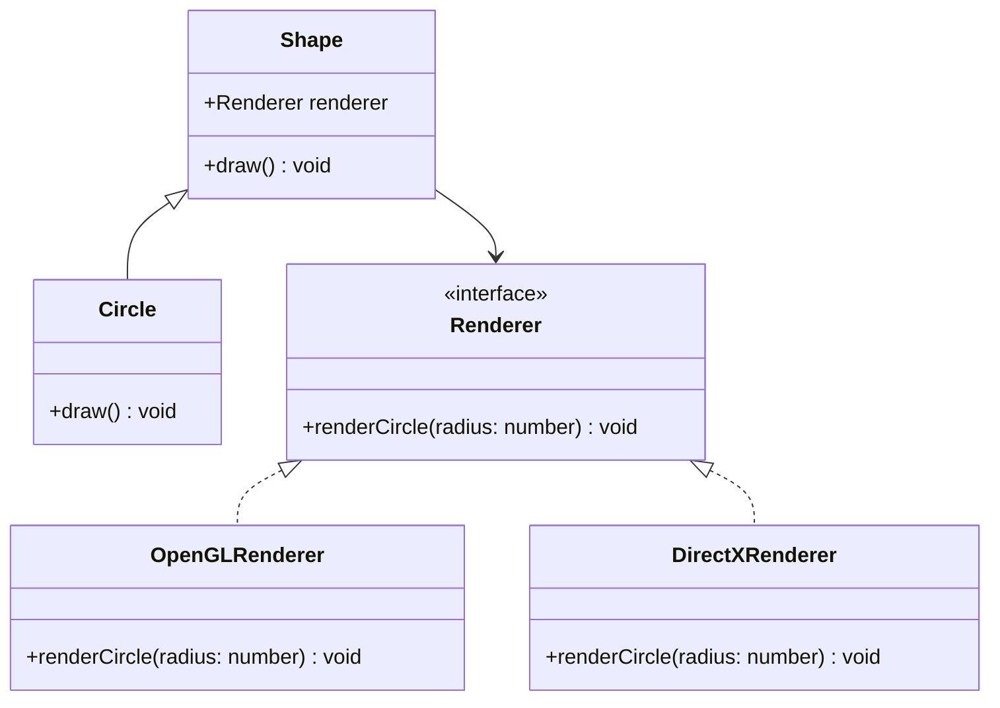

## 5.2 Bridge Pattern

The Bridge Pattern is a structural design pattern that plays a crucial role in decoupling an abstraction from its implementation, allowing the two to vary independently. This pattern is particularly useful in scenarios where we need to manage multiple dimensions of variation in our codebase, promoting flexibility and scalability. Let's delve into the intricacies of the Bridge Pattern, its components, and how it can be effectively implemented in TypeScript.

### Understanding the Bridge Pattern

#### Definition and Intent

The Bridge Pattern is designed to "bridge" the gap between an abstraction and its implementation. By separating these two components, the pattern allows them to evolve independently without affecting each other. The primary intent of the Bridge Pattern is to avoid a proliferation of classes that can occur when combining multiple dimensions of variation.

#### Problem Solved by the Bridge Pattern

In software development, it's common to encounter situations where a class needs to support multiple variations. For instance, consider a graphical application that needs to support different shapes (circle, square) and different rendering engines (OpenGL, DirectX). Without the Bridge Pattern, you might end up creating a separate class for each combination, leading to a combinatorial explosion of classes.

The Bridge Pattern addresses this issue by decoupling the abstraction (e.g., shapes) from the implementation (e.g., rendering engines). This separation allows developers to add new shapes or rendering engines without modifying existing code, adhering to the Open/Closed Principle.

### Key Components of the Bridge Pattern

The Bridge Pattern consists of four main components:

1. **Abstraction**: Defines the abstraction's interface and holds a reference to an Implementor.
2. **Refined Abstraction**: Extends the interface defined by Abstraction.
3. **Implementor**: Defines the interface for implementation classes.
4. **Concrete Implementor**: Implements the Implementor interface.

Let's explore each component in detail.

#### Abstraction

The Abstraction component defines the high-level interface for the client. It contains a reference to an Implementor, which it uses to delegate the actual work. The Abstraction does not implement the behavior directly; instead, it relies on the Implementor to provide the necessary functionality.

```typescript
// Abstraction
abstract class Shape {
    protected renderer: Renderer;

    constructor(renderer: Renderer) {
        this.renderer = renderer;
    }

    abstract draw(): void;
}
```

#### Refined Abstraction

The Refined Abstraction extends the Abstraction and provides additional functionality. It can override methods defined in the Abstraction to provide specific behavior.

```typescript
// Refined Abstraction
class Circle extends Shape {
    private radius: number;

    constructor(renderer: Renderer, radius: number) {
        super(renderer);
        this.radius = radius;
    }

    draw(): void {
        this.renderer.renderCircle(this.radius);
    }
}
```

#### Implementor

The Implementor defines the interface for implementation classes. It provides the methods that the Abstraction will use to perform its tasks.

```typescript
// Implementor
interface Renderer {
    renderCircle(radius: number): void;
}
```

#### Concrete Implementor

The Concrete Implementor implements the Implementor interface and provides the actual functionality. Different Concrete Implementors can provide different implementations of the same interface.

```typescript
// Concrete Implementor
class OpenGLRenderer implements Renderer {
    renderCircle(radius: number): void {
        console.log(`OpenGL rendering a circle with radius ${radius}`);
    }
}

class DirectXRenderer implements Renderer {
    renderCircle(radius: number): void {
        console.log(`DirectX rendering a circle with radius ${radius}`);
    }
}
```

### Visualizing the Bridge Pattern

To better understand the relationship between the components, let's visualize the Bridge Pattern using a class diagram.



**Diagram Description**: The diagram illustrates the separation of the Abstraction (Shape) and the Implementor (Renderer). The Circle class is a Refined Abstraction, and OpenGLRenderer and DirectXRenderer are Concrete Implementors.

### Implementing the Bridge Pattern in TypeScript

Now that we have a theoretical understanding of the Bridge Pattern, let's implement it in TypeScript with a practical example.

#### Example: Rendering Shapes with Different Engines

We'll create a simple application that renders shapes using different rendering engines. This example will demonstrate how the Bridge Pattern allows us to add new shapes and rendering engines independently.

```typescript
// Abstraction
abstract class Shape {
    protected renderer: Renderer;

    constructor(renderer: Renderer) {
        this.renderer = renderer;
    }

    abstract draw(): void;
}

// Refined Abstraction
class Circle extends Shape {
    private radius: number;

    constructor(renderer: Renderer, radius: number) {
        super(renderer);
        this.radius = radius;
    }

    draw(): void {
        this.renderer.renderCircle(this.radius);
    }
}

// Implementor
interface Renderer {
    renderCircle(radius: number): void;
}

// Concrete Implementors
class OpenGLRenderer implements Renderer {
    renderCircle(radius: number): void {
        console.log(`OpenGL rendering a circle with radius ${radius}`);
    }
}

class DirectXRenderer implements Renderer {
    renderCircle(radius: number): void {
        console.log(`DirectX rendering a circle with radius ${radius}`);
    }
}

// Client code
const openglRenderer = new OpenGLRenderer();
const directxRenderer = new DirectXRenderer();

const circle1 = new Circle(openglRenderer, 5);
const circle2 = new Circle(directxRenderer, 10);

circle1.draw(); // OpenGL rendering a circle with radius 5
circle2.draw(); // DirectX rendering a circle with radius 10
```

### Promoting the Open/Closed Principle

The Bridge Pattern is a powerful tool for promoting the Open/Closed Principle. By decoupling the abstraction from the implementation, the pattern allows us to extend the system with new abstractions and implementations without modifying existing code. This flexibility is crucial in large-scale systems where changes can have far-reaching consequences.

#### Adding New Abstractions

To add a new abstraction, such as a `Square`, we simply create a new class that extends the `Shape` class.

```typescript
// New Refined Abstraction
class Square extends Shape {
    private side: number;

    constructor(renderer: Renderer, side: number) {
        super(renderer);
        this.side = side;
    }

    draw(): void {
        this.renderer.renderSquare(this.side);
    }
}
```

#### Adding New Implementations

To add a new implementation, such as a `VulkanRenderer`, we implement the `Renderer` interface.

```typescript
// New Concrete Implementor
class VulkanRenderer implements Renderer {
    renderCircle(radius: number): void {
        console.log(`Vulkan rendering a circle with radius ${radius}`);
    }

    renderSquare(side: number): void {
        console.log(`Vulkan rendering a square with side ${side}`);
    }
}
```

### Try It Yourself

To deepen your understanding of the Bridge Pattern, try modifying the code examples. Here are a few suggestions:

- **Add a new shape**: Implement a `Triangle` class that extends `Shape` and uses the `Renderer` interface.
- **Add a new rendering engine**: Create a `MetalRenderer` class that implements the `Renderer` interface.
- **Experiment with different combinations**: Create instances of different shapes with different rendering engines and observe the output.

### Knowledge Check

Before we move on, let's reinforce our understanding of the Bridge Pattern with a few questions:

- What problem does the Bridge Pattern solve?
- How does the Bridge Pattern promote the Open/Closed Principle?
- What are the key components of the Bridge Pattern?

### Conclusion

The Bridge Pattern is a versatile design pattern that provides a robust solution for managing multiple dimensions of variation in software systems. By decoupling abstraction from implementation, it promotes flexibility, scalability, and adherence to the Open/Closed Principle. As you continue your journey in software design, remember that the Bridge Pattern is a valuable tool in your toolkit, enabling you to build systems that are both adaptable and maintainable.

## Quiz Time!



### What is the primary intent of the Bridge Pattern?

- [x] To decouple an abstraction from its implementation, allowing both to vary independently.
- [ ] To provide a simplified interface to a complex subsystem.
- [ ] To define a one-to-many dependency between objects.
- [ ] To ensure a class has only one instance.

> **Explanation:** The Bridge Pattern is intended to decouple an abstraction from its implementation, allowing both to vary independently.

### Which component of the Bridge Pattern defines the abstraction's interface?

- [x] Abstraction
- [ ] Implementor
- [ ] Refined Abstraction
- [ ] Concrete Implementor

> **Explanation:** The Abstraction component defines the abstraction's interface and holds a reference to an Implementor.

### How does the Bridge Pattern promote the Open/Closed Principle?

- [x] By allowing new abstractions and implementations to be added independently without modifying existing code.
- [ ] By simplifying the interface to a complex subsystem.
- [ ] By ensuring a class has only one instance.
- [ ] By defining a one-to-many dependency between objects.

> **Explanation:** The Bridge Pattern promotes the Open/Closed Principle by allowing new abstractions and implementations to be added independently without modifying existing code.

### In the Bridge Pattern, what role does the Refined Abstraction play?

- [x] It extends the interface defined by the Abstraction.
- [ ] It defines the interface for implementation classes.
- [ ] It implements the Implementor interface.
- [ ] It provides the actual functionality.

> **Explanation:** The Refined Abstraction extends the interface defined by the Abstraction and provides additional functionality.

### What is the purpose of the Implementor in the Bridge Pattern?

- [x] To define the interface for implementation classes.
- [ ] To extend the interface defined by the Abstraction.
- [ ] To provide the actual functionality.
- [ ] To hold a reference to an Implementor.

> **Explanation:** The Implementor defines the interface for implementation classes, which the Abstraction uses to perform its tasks.

### Which of the following is a benefit of using the Bridge Pattern?

- [x] It avoids a proliferation of classes due to combining multiple dimensions of variation.
- [ ] It ensures a class has only one instance.
- [ ] It provides a simplified interface to a complex subsystem.
- [ ] It defines a one-to-many dependency between objects.

> **Explanation:** The Bridge Pattern avoids a proliferation of classes by decoupling abstraction from implementation, allowing both to vary independently.

### What is the role of the Concrete Implementor in the Bridge Pattern?

- [x] It implements the Implementor interface and provides the actual functionality.
- [ ] It defines the interface for implementation classes.
- [ ] It extends the interface defined by the Abstraction.
- [ ] It holds a reference to an Implementor.

> **Explanation:** The Concrete Implementor implements the Implementor interface and provides the actual functionality.

### How can you add a new shape in the Bridge Pattern?

- [x] By creating a new class that extends the Shape class.
- [ ] By implementing a new Renderer interface.
- [ ] By modifying the existing Concrete Implementor.
- [ ] By adding a new method to the Implementor interface.

> **Explanation:** To add a new shape, you create a new class that extends the Shape class, which is the Abstraction.

### How can you add a new rendering engine in the Bridge Pattern?

- [x] By implementing the Renderer interface.
- [ ] By extending the Shape class.
- [ ] By modifying the existing Abstraction.
- [ ] By adding a new method to the Refined Abstraction.

> **Explanation:** To add a new rendering engine, you implement the Renderer interface, which is the Implementor.

### True or False: The Bridge Pattern is a creational design pattern.

- [ ] True
- [x] False

> **Explanation:** The Bridge Pattern is a structural design pattern, not a creational one.



Remember, this is just the beginning. As you progress, you'll build more complex and interactive systems using the Bridge Pattern. Keep experimenting, stay curious, and enjoy the journey!
