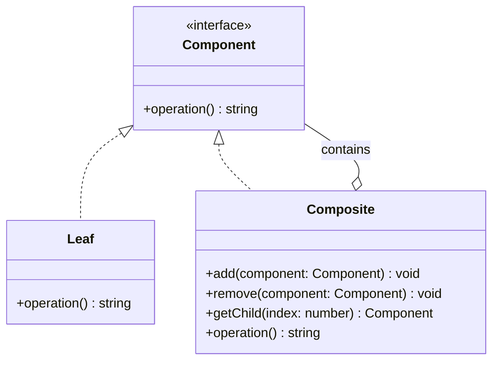

## 5.3.1 Implementing Composite in TypeScript

The Composite Pattern is a structural design pattern that allows you to compose objects into tree structures to represent part-whole hierarchies. This pattern lets clients treat individual objects and compositions of objects uniformly. In TypeScript, the Composite Pattern is particularly useful for building complex UI components, file systems, or any hierarchical data structure.

### Understanding the Composite Pattern

The Composite Pattern is designed to solve the problem of treating individual objects and compositions of objects uniformly. It is especially useful when you need to work with tree structures, where each node can be either a leaf (an end node) or a composite (a node that can have children).

#### Key Concepts

- **Component**: An interface or abstract class that defines the common operations for both leaf and composite objects.
- **Leaf**: A class that represents individual elements in the composition. It implements the Component interface.
- **Composite**: A class that can contain multiple Components, which can be either Leaf or Composite instances. It also implements the Component interface.

### Implementing the Composite Pattern in TypeScript

Let's dive into the implementation of the Composite Pattern in TypeScript. We'll start by defining the `Component` interface, followed by the `Leaf` and `Composite` classes.

#### Step 1: Define the Component Interface

The `Component` interface will declare the common operations for both leaf and composite objects. This includes operations like `operation()`, which will be implemented differently by the `Leaf` and `Composite` classes.

```typescript
// Component.ts
export interface Component {
  operation(): string;
}
```

#### Step 2: Implement the Leaf Class

The `Leaf` class represents the end objects of a composition. A leaf has no children, and it implements the `Component` interface.

```typescript
// Leaf.ts
import { Component } from './Component';

export class Leaf implements Component {
  private name: string;

  constructor(name: string) {
    this.name = name;
  }

  operation(): string {
    return `Leaf: ${this.name}`;
  }
}
```

#### Step 3: Implement the Composite Class

The `Composite` class can contain multiple `Component` objects, which can be either `Leaf` or `Composite` instances. It implements the `Component` interface and provides methods to add, remove, and get child components.

```typescript
// Composite.ts
import { Component } from './Component';

export class Composite implements Component {
  private children: Component[] = [];

  add(component: Component): void {
    this.children.push(component);
  }

  remove(component: Component): void {
    const componentIndex = this.children.indexOf(component);
    if (componentIndex !== -1) {
      this.children.splice(componentIndex, 1);
    }
  }

  getChild(index: number): Component {
    return this.children[index];
  }

  operation(): string {
    const results = this.children.map(child => child.operation());
    return `Composite: [${results.join(', ')}]`;
  }
}
```

### Using the Composite Pattern

Now that we have our `Component`, `Leaf`, and `Composite` classes, let's see how we can use them to create a composite structure and perform operations on it.

```typescript
// Client.ts
import { Leaf } from './Leaf';
import { Composite } from './Composite';

const leaf1 = new Leaf('Leaf 1');
const leaf2 = new Leaf('Leaf 2');
const composite1 = new Composite();
composite1.add(leaf1);
composite1.add(leaf2);

const leaf3 = new Leaf('Leaf 3');
const composite2 = new Composite();
composite2.add(composite1);
composite2.add(leaf3);

console.log(composite2.operation());
// Output: Composite: [Composite: [Leaf: Leaf 1, Leaf: Leaf 2], Leaf: Leaf 3]
```

### Iterating Over the Composite Structure

One of the strengths of the Composite Pattern is the ability to iterate over the composite structure and perform operations on each component. In our example, the `operation()` method in the `Composite` class iterates over its children and calls their `operation()` method.

### TypeScript's Role in Facilitating the Composite Pattern

TypeScript's type system and interfaces make it easier to implement the Composite Pattern by providing type safety and ensuring that all components adhere to the same interface. This helps prevent runtime errors and makes the code more maintainable.

#### Addressing Type Safety and Recursion

When implementing the Composite Pattern, it's important to ensure type safety, especially when dealing with recursive structures. TypeScript's interfaces and type checking help ensure that only valid components are added to the composite structure.

However, recursion can lead to performance issues if not handled properly. It's important to consider the depth of the composite structure and optimize the recursion if necessary.

### Visualizing the Composite Pattern

To better understand the Composite Pattern, let's visualize the structure using a class diagram.



**Diagram Description**: The diagram illustrates the relationship between the `Component` interface, `Leaf` class, and `Composite` class. The `Composite` class can contain multiple `Component` objects, which can be either `Leaf` or `Composite` instances.

### Try It Yourself

Now that you've seen how the Composite Pattern is implemented in TypeScript, try modifying the code to add new functionality. For example, you could:

- Add a method to count the total number of `Leaf` nodes in a composite structure.
- Implement a method to find a `Leaf` by name within a composite structure.
- Experiment with different data structures for storing child components.

### Knowledge Check

Before we wrap up, let's reinforce what we've learned:

- What is the purpose of the Composite Pattern?
- How does the `Composite` class manage its children?
- How does TypeScript's type system aid in implementing the Composite Pattern?

### Conclusion

The Composite Pattern is a powerful tool for building complex hierarchical structures in TypeScript. By leveraging TypeScript's interfaces and type system, you can create flexible and maintainable code that treats individual objects and compositions uniformly. Remember, this is just the beginning. As you progress, you'll build more complex and interactive applications. Keep experimenting, stay curious, and enjoy the journey!

## Quiz Time!



### What is the main purpose of the Composite Pattern?

- [x] To treat individual objects and compositions of objects uniformly.
- [ ] To encapsulate a request as an object.
- [ ] To provide a simplified interface to a complex subsystem.
- [ ] To define a family of algorithms.

> **Explanation:** The Composite Pattern allows clients to treat individual objects and compositions of objects uniformly, making it ideal for tree structures.

### Which class in the Composite Pattern can contain multiple components?

- [ ] Leaf
- [x] Composite
- [ ] Component
- [ ] Client

> **Explanation:** The `Composite` class can contain multiple `Component` objects, which can be either `Leaf` or `Composite` instances.

### What method is used to add a child component to a Composite?

- [x] add
- [ ] remove
- [ ] getChild
- [ ] operation

> **Explanation:** The `add` method is used to add a child component to a `Composite`.

### How does TypeScript's type system help in implementing the Composite Pattern?

- [x] By providing type safety and ensuring all components adhere to the same interface.
- [ ] By allowing dynamic typing.
- [ ] By providing runtime type checking.
- [ ] By enforcing strict null checks.

> **Explanation:** TypeScript's type system provides type safety and ensures that all components adhere to the same interface, preventing runtime errors.

### What is a potential issue when implementing the Composite Pattern with recursion?

- [x] Performance issues due to deep recursion.
- [ ] Lack of type safety.
- [ ] Inability to add child components.
- [ ] Difficulty in removing components.

> **Explanation:** Recursion can lead to performance issues if the composite structure is too deep, so it's important to optimize recursion if necessary.

### In the provided code example, what does the `operation()` method in the `Composite` class do?

- [x] It iterates over its children and calls their `operation()` method.
- [ ] It adds a new child component.
- [ ] It removes a child component.
- [ ] It returns the number of child components.

> **Explanation:** The `operation()` method in the `Composite` class iterates over its children and calls their `operation()` method to perform operations on each component.

### Which of the following is NOT a part of the Composite Pattern?

- [ ] Component
- [ ] Leaf
- [ ] Composite
- [x] Adapter

> **Explanation:** The `Adapter` is not a part of the Composite Pattern; it is a separate design pattern used to allow incompatible interfaces to work together.

### What is the role of the `Leaf` class in the Composite Pattern?

- [x] To represent individual elements in the composition.
- [ ] To contain multiple components.
- [ ] To define the common operations for both leaf and composite objects.
- [ ] To manage child components.

> **Explanation:** The `Leaf` class represents individual elements in the composition and implements the `Component` interface.

### How can you modify the code to count the total number of `Leaf` nodes in a composite structure?

- [x] Implement a method in the `Composite` class that recursively counts `Leaf` nodes.
- [ ] Use a global variable to keep track of `Leaf` nodes.
- [ ] Modify the `Leaf` class to keep a count of instances.
- [ ] Use a static method in the `Component` interface.

> **Explanation:** You can implement a method in the `Composite` class that recursively counts `Leaf` nodes by iterating over its children.

### True or False: The Composite Pattern is only useful for UI components.

- [ ] True
- [x] False

> **Explanation:** False. The Composite Pattern is useful for any hierarchical data structure, not just UI components.


