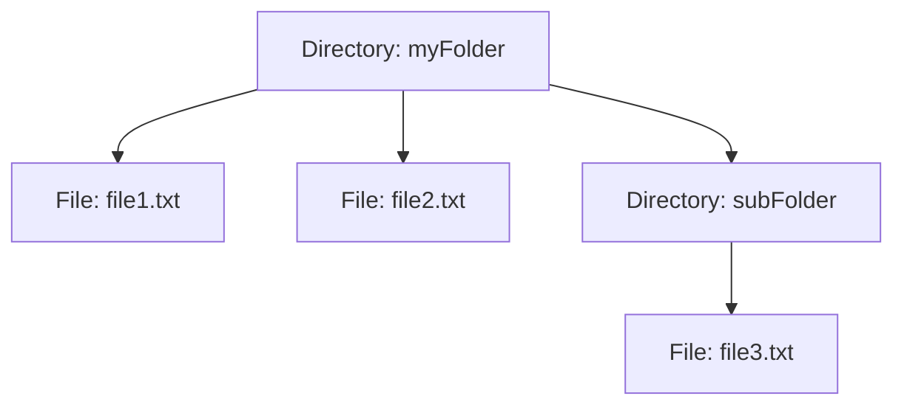

## 5.3.2 Handling Hierarchies with Composite Pattern in TypeScript

In software engineering, managing complex hierarchies is a common challenge. The Composite Pattern offers a powerful solution for handling tree structures, allowing developers to treat individual objects and compositions of objects uniformly. This section delves into how the Composite Pattern simplifies client code, reduces complexity, and enhances maintainability in TypeScript applications.

### Understanding the Composite Pattern

The Composite Pattern is a structural design pattern that lets you compose objects into tree structures to represent part-whole hierarchies. This pattern allows clients to treat individual objects and compositions of objects uniformly. In essence, it enables you to build complex structures from simple components and treat them as a single entity.

#### Key Concepts

- **Component Interface**: This defines the common interface for all objects in the composition, both leaf and composite nodes.
- **Leaf**: Represents the end objects of a composition. A leaf has no children.
- **Composite**: Represents a component that can have children. It implements the component interface and contains a collection of child components.

### Simplifying Client Code with Composite Pattern

One of the main advantages of the Composite Pattern is its ability to simplify client code. By using a common interface, clients can interact with both leaf and composite objects without needing to distinguish between them. This uniformity reduces code complexity and enhances maintainability.

#### Example: File System Hierarchy

Consider a file system where files and directories are represented as objects. Directories can contain both files and other directories, forming a tree structure. The Composite Pattern allows us to treat files and directories uniformly.

```typescript
// Component interface
interface FileSystemComponent {
  getName(): string;
  getSize(): number;
}

// Leaf class
class File implements FileSystemComponent {
  constructor(private name: string, private size: number) {}

  getName(): string {
    return this.name;
  }

  getSize(): number {
    return this.size;
  }
}

// Composite class
class Directory implements FileSystemComponent {
  private children: FileSystemComponent[] = [];

  constructor(private name: string) {}

  getName(): string {
    return this.name;
  }

  getSize(): number {
    return this.children.reduce((total, child) => total + child.getSize(), 0);
  }

  add(component: FileSystemComponent): void {
    this.children.push(component);
  }

  remove(component: FileSystemComponent): void {
    const index = this.children.indexOf(component);
    if (index !== -1) {
      this.children.splice(index, 1);
    }
  }
}
```

In this example, both `File` and `Directory` implement the `FileSystemComponent` interface. Clients can interact with files and directories using the same methods, such as `getName()` and `getSize()`.

### Propagating Operations Through the Composite Structure

The Composite Pattern allows operations to be propagated through the composite structure. This means that operations performed on a composite object are automatically propagated to its children.

#### Example: Calculating Total Size

Let's extend our file system example to calculate the total size of a directory, including all its files and subdirectories.

```typescript
// Create files
const file1 = new File('file1.txt', 100);
const file2 = new File('file2.txt', 200);

// Create a directory and add files
const directory = new Directory('myFolder');
directory.add(file1);
directory.add(file2);

// Create a subdirectory
const subDirectory = new Directory('subFolder');
subDirectory.add(new File('file3.txt', 300));

// Add subdirectory to the main directory
directory.add(subDirectory);

// Calculate total size
console.log(`Total size of ${directory.getName()}: ${directory.getSize()} bytes`);
```

In this example, the `getSize()` method of the `Directory` class recursively calculates the total size of all its children, demonstrating how operations are propagated through the composite structure.

### Reducing Code Complexity and Improving Maintainability

By allowing clients to treat individual and composite objects uniformly, the Composite Pattern reduces code complexity. This uniformity simplifies the client code, making it easier to maintain and extend.

#### Benefits of Uniform Treatment

- **Simplified Client Code**: Clients can interact with complex structures using a simple interface, reducing the need for complex conditionals.
- **Enhanced Flexibility**: New types of components can be added without modifying existing client code.
- **Improved Maintainability**: Changes to the component interface automatically propagate to all components, ensuring consistency.

### Traversing and Manipulating the Composite Structure

Traversing and manipulating a composite structure involves iterating over its components and performing operations on them. The Composite Pattern provides a flexible way to traverse hierarchies and perform operations on each component.

#### Strategy for Traversal

To traverse a composite structure, you can implement a recursive strategy that visits each component and performs the desired operation.

```typescript
function printStructure(component: FileSystemComponent, indent: string = ''): void {
  console.log(`${indent}${component.getName()}`);
  if (component instanceof Directory) {
    for (const child of component['children']) {
      printStructure(child, indent + '  ');
    }
  }
}

// Print the structure of the directory
printStructure(directory);
```

In this example, the `printStructure()` function recursively traverses the composite structure, printing the name of each component with indentation to represent the hierarchy.

### Try It Yourself

To deepen your understanding of the Composite Pattern, try modifying the code examples:

- **Add More Components**: Extend the hierarchy by adding more files and directories.
- **Implement Additional Operations**: Add methods to calculate the number of files or directories.
- **Experiment with Different Structures**: Create different tree structures and observe how operations propagate.

### Visualizing the Composite Pattern

To better understand the Composite Pattern, let's visualize a simple file system hierarchy using a diagram.



**Figure 1**: A visual representation of a file system hierarchy using the Composite Pattern. The `myFolder` directory contains two files and a subdirectory, which in turn contains another file.

### Further Reading

For more information on the Composite Pattern and its applications, consider exploring the following resources:

- [MDN Web Docs: Composite Pattern](https://developer.mozilla.org/en-US/docs/Web/JavaScript/Guide/Composite_Pattern)
- [Refactoring Guru: Composite Pattern](https://refactoring.guru/design-patterns/composite)
- [W3Schools: TypeScript Classes](https://www.w3schools.com/typescript/typescript_classes.php)

### Knowledge Check

To reinforce your understanding of the Composite Pattern, consider the following questions:

1. How does the Composite Pattern simplify client code?
2. What are the key components of the Composite Pattern?
3. How does the Composite Pattern handle operations on composite structures?
4. What are the benefits of treating individual and composite objects uniformly?
5. How can you traverse a composite structure?

### Conclusion

The Composite Pattern is a powerful tool for managing hierarchies in TypeScript applications. By enabling uniform treatment of individual and composite objects, it simplifies client code, reduces complexity, and enhances maintainability. As you continue your journey in software engineering, remember to leverage the Composite Pattern to handle complex structures with ease.

## Quiz Time!



### What is the primary benefit of using the Composite Pattern?

- [x] Simplifies client code by allowing uniform treatment of individual and composite objects.
- [ ] Improves performance by optimizing memory usage.
- [ ] Enhances security by encrypting data.
- [ ] Increases the speed of data processing.

> **Explanation:** The Composite Pattern simplifies client code by allowing uniform treatment of individual and composite objects, reducing complexity and improving maintainability.

### Which of the following is NOT a component of the Composite Pattern?

- [ ] Component Interface
- [ ] Leaf
- [ ] Composite
- [x] Adapter

> **Explanation:** The Adapter is not a component of the Composite Pattern. The main components are the Component Interface, Leaf, and Composite.

### How does the Composite Pattern handle operations on composite structures?

- [x] It propagates operations through the composite structure, allowing operations on composite objects to affect their children.
- [ ] It prevents operations from affecting child components.
- [ ] It requires manual handling of operations for each component.
- [ ] It only allows operations on leaf components.

> **Explanation:** The Composite Pattern propagates operations through the composite structure, allowing operations on composite objects to affect their children.

### What is a key advantage of treating individual and composite objects uniformly?

- [x] Simplified client code and enhanced maintainability.
- [ ] Increased performance and reduced memory usage.
- [ ] Improved security and data encryption.
- [ ] Faster execution of operations.

> **Explanation:** Treating individual and composite objects uniformly simplifies client code and enhances maintainability by reducing complexity.

### How can you traverse a composite structure in TypeScript?

- [x] By implementing a recursive strategy that visits each component and performs the desired operation.
- [ ] By using a for loop to iterate over all components.
- [ ] By manually accessing each component and performing operations.
- [ ] By using a while loop to traverse the structure.

> **Explanation:** Traversing a composite structure can be done by implementing a recursive strategy that visits each component and performs the desired operation.

### What is the role of the Leaf in the Composite Pattern?

- [x] Represents the end objects of a composition with no children.
- [ ] Acts as the root of the composite structure.
- [ ] Manages the collection of child components.
- [ ] Defines the common interface for all objects in the composition.

> **Explanation:** The Leaf represents the end objects of a composition with no children, implementing the component interface.

### What is one way to improve the maintainability of a composite structure?

- [x] By ensuring that changes to the component interface automatically propagate to all components.
- [ ] By hardcoding values into the composite structure.
- [ ] By using global variables to manage state.
- [ ] By minimizing the number of components in the structure.

> **Explanation:** Ensuring that changes to the component interface automatically propagate to all components improves maintainability by maintaining consistency.

### What is a common use case for the Composite Pattern?

- [x] Managing file system hierarchies.
- [ ] Encrypting sensitive data.
- [ ] Optimizing network traffic.
- [ ] Enhancing user authentication.

> **Explanation:** A common use case for the Composite Pattern is managing file system hierarchies, where directories and files form a tree structure.

### True or False: The Composite Pattern can only be used in file system hierarchies.

- [ ] True
- [x] False

> **Explanation:** False. The Composite Pattern can be used in various scenarios where part-whole hierarchies are present, not just file system hierarchies.

### What is the main purpose of the Component Interface in the Composite Pattern?

- [x] To define the common interface for all objects in the composition.
- [ ] To manage the collection of child components.
- [ ] To represent the end objects of a composition.
- [ ] To act as the root of the composite structure.

> **Explanation:** The Component Interface defines the common interface for all objects in the composition, allowing uniform treatment of individual and composite objects.



Remember, this is just the beginning. As you progress, you'll build more complex and interactive applications using the Composite Pattern. Keep experimenting, stay curious, and enjoy the journey!
