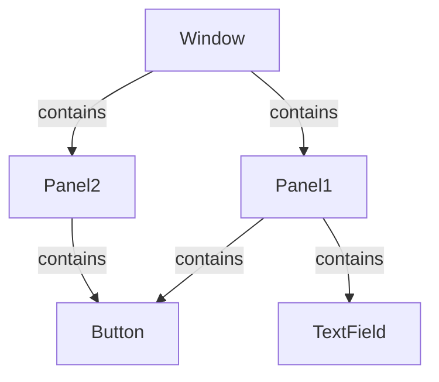

## 5.3.3 Composite Pattern Use Cases and Examples

The Composite Pattern is a structural design pattern that allows you to compose objects into tree structures to represent part-whole hierarchies. This pattern treats individual objects and compositions of objects uniformly, making it ideal for scenarios where you need to work with tree-like structures. In this section, we will delve into practical examples of the Composite Pattern in TypeScript, exploring its application in graphical user interfaces (GUIs), file systems, and organizational structures.

### Understanding the Composite Pattern

Before diving into examples, let's briefly recap the core concepts of the Composite Pattern. The pattern involves three main components:

1. **Component**: This is the interface for all objects in the composition, both leaf and composite nodes. It declares common operations that can be performed on the objects.

2. **Leaf**: Represents the end objects of a composition. A leaf has no children and implements the component interface.

3. **Composite**: This class represents complex components that may have children. It implements the component interface and provides methods to add, remove, and access child components.

By using these components, the Composite Pattern allows clients to treat individual objects and compositions of objects uniformly.

### Use Case 1: Graphical User Interface Hierarchies

One of the most common applications of the Composite Pattern is in the representation of graphical user interfaces. A GUI is inherently hierarchical, with windows containing panels, which in turn contain buttons, text fields, and other widgets. The Composite Pattern provides a flexible way to manage these hierarchies.

#### Example: GUI Components in TypeScript

Consider a simple GUI framework where we have different UI components such as windows, panels, buttons, and text fields. We can represent this hierarchy using the Composite Pattern.

```typescript
// Component interface
interface GUIComponent {
    render(): void;
}

// Leaf class
class Button implements GUIComponent {
    render(): void {
        console.log("Rendering a button");
    }
}

class TextField implements GUIComponent {
    render(): void {
        console.log("Rendering a text field");
    }
}

// Composite class
class Panel implements GUIComponent {
    private children: GUIComponent[] = [];

    add(component: GUIComponent): void {
        this.children.push(component);
    }

    remove(component: GUIComponent): void {
        const index = this.children.indexOf(component);
        if (index !== -1) {
            this.children.splice(index, 1);
        }
    }

    render(): void {
        console.log("Rendering a panel");
        for (const child of this.children) {
            child.render();
        }
    }
}

// Client code
const mainPanel = new Panel();
mainPanel.add(new Button());
mainPanel.add(new TextField());

const subPanel = new Panel();
subPanel.add(new Button());
mainPanel.add(subPanel);

mainPanel.render();
```

In this example, the `Panel` class acts as a composite, allowing us to add and manage child components like `Button` and `TextField`. The `render` method demonstrates how each component renders itself, with composites delegating rendering to their children.

#### Benefits in GUI Hierarchies

- **Uniformity**: The Composite Pattern allows us to treat individual components and compositions uniformly, simplifying client code.
- **Scalability**: Adding new component types is straightforward, as they only need to implement the `GUIComponent` interface.
- **Reusability**: Components can be reused across different parts of the application, enhancing modularity.

### Use Case 2: Modeling File Systems

File systems are another classic example of hierarchical structures. In a file system, directories can contain files or other directories, forming a tree-like structure. The Composite Pattern is well-suited for modeling such systems.

#### Example: File System in TypeScript

Let's model a simple file system with files and directories using the Composite Pattern.

```typescript
// Component interface
interface FileSystemComponent {
    getName(): string;
    display(indent: string): void;
}

// Leaf class
class File implements FileSystemComponent {
    constructor(private name: string) {}

    getName(): string {
        return this.name;
    }

    display(indent: string): void {
        console.log(`${indent}- ${this.name}`);
    }
}

// Composite class
class Directory implements FileSystemComponent {
    private children: FileSystemComponent[] = [];

    constructor(private name: string) {}

    add(component: FileSystemComponent): void {
        this.children.push(component);
    }

    remove(component: FileSystemComponent): void {
        const index = this.children.indexOf(component);
        if (index !== -1) {
            this.children.splice(index, 1);
        }
    }

    getName(): string {
        return this.name;
    }

    display(indent: string): void {
        console.log(`${indent}+ ${this.name}`);
        for (const child of this.children) {
            child.display(indent + "  ");
        }
    }
}

// Client code
const root = new Directory("root");
const home = new Directory("home");
const user = new Directory("user");

const file1 = new File("file1.txt");
const file2 = new File("file2.txt");

user.add(file1);
home.add(user);
root.add(home);
root.add(file2);

root.display("");
```

In this example, the `Directory` class acts as a composite, allowing us to add and manage child components like `File`. The `display` method recursively displays the structure of the file system.

#### Benefits in File Systems

- **Ease of Navigation**: The Composite Pattern simplifies navigating and managing complex file structures.
- **Flexibility**: Directories and files can be manipulated uniformly, allowing for easy addition or removal of components.
- **Scalability**: New file types or directory structures can be added with minimal changes to existing code.

### Use Case 3: Organizational Structures

Organizational structures, such as company hierarchies, are another area where the Composite Pattern shines. Companies have departments, which contain teams, which in turn contain employees. This hierarchical structure can be effectively modeled using the Composite Pattern.

#### Example: Organizational Structure in TypeScript

Let's model a simple organizational structure with departments and employees.

```typescript
// Component interface
interface OrganizationComponent {
    getName(): string;
    display(indent: string): void;
}

// Leaf class
class Employee implements OrganizationComponent {
    constructor(private name: string) {}

    getName(): string {
        return this.name;
    }

    display(indent: string): void {
        console.log(`${indent}- ${this.name}`);
    }
}

// Composite class
class Department implements OrganizationComponent {
    private members: OrganizationComponent[] = [];

    constructor(private name: string) {}

    add(component: OrganizationComponent): void {
        this.members.push(component);
    }

    remove(component: OrganizationComponent): void {
        const index = this.members.indexOf(component);
        if (index !== -1) {
            this.members.splice(index, 1);
        }
    }

    getName(): string {
        return this.name;
    }

    display(indent: string): void {
        console.log(`${indent}+ ${this.name}`);
        for (const member of this.members) {
            member.display(indent + "  ");
        }
    }
}

// Client code
const company = new Department("Company");
const hr = new Department("HR");
const it = new Department("IT");

const employee1 = new Employee("Alice");
const employee2 = new Employee("Bob");

hr.add(employee1);
it.add(employee2);
company.add(hr);
company.add(it);

company.display("");
```

In this example, the `Department` class acts as a composite, allowing us to add and manage child components like `Employee`. The `display` method recursively displays the organizational structure.

#### Benefits in Organizational Structures

- **Clarity**: The Composite Pattern provides a clear representation of complex organizational hierarchies.
- **Modularity**: Departments and employees can be managed independently, enhancing modularity.
- **Scalability**: New departments or employee roles can be added with minimal changes to existing code.

### Considerations and Pitfalls

While the Composite Pattern offers numerous benefits, there are some considerations and potential pitfalls to be aware of:

- **Managing Parent References**: In some cases, it may be necessary to maintain references to parent components, which can complicate the design.
- **Circular Dependencies**: Care must be taken to avoid circular dependencies, especially when components can be added or removed dynamically.
- **Performance**: In large hierarchies, operations like rendering or displaying can become performance bottlenecks if not optimized.

### Try It Yourself

To deepen your understanding of the Composite Pattern, try modifying the examples above:

- **Add New Component Types**: Extend the GUI example by adding new components like `Checkbox` or `Dropdown`.
- **Implement Additional Operations**: Enhance the file system example by implementing operations like `move` or `copy`.
- **Model Complex Hierarchies**: Expand the organizational structure example to include teams and projects.

### Visualizing the Composite Pattern

To further illustrate the Composite Pattern, let's visualize the hierarchical structure of a GUI using a Mermaid.js diagram.



**Diagram Description**: This diagram represents a simple GUI hierarchy where a window contains two panels. The first panel contains a button and a text field, while the second panel contains a button.

### References and Links

For further reading on the Composite Pattern and its applications, consider exploring the following resources:

- [MDN Web Docs on Design Patterns](https://developer.mozilla.org/en-US/docs/Web/JavaScript/Guide/Design_Patterns)
- [Refactoring Guru: Composite Pattern](https://refactoring.guru/design-patterns/composite)
- [W3Schools: TypeScript Tutorial](https://www.w3schools.com/typescript/)

### Knowledge Check

To reinforce your understanding of the Composite Pattern, consider the following questions:

- How does the Composite Pattern facilitate the management of hierarchical structures?
- What are the benefits of using the Composite Pattern in GUI design?
- How can the Composite Pattern be applied to model file systems and organizational structures?

### Embrace the Journey

Remember, mastering design patterns is a journey. As you continue to explore and apply the Composite Pattern, you'll gain deeper insights into its versatility and power. Keep experimenting, stay curious, and enjoy the journey!

## Quiz Time!



### Which of the following best describes the Composite Pattern?

- [x] A pattern that allows you to compose objects into tree structures to represent part-whole hierarchies.
- [ ] A pattern that provides a simplified interface to a complex subsystem.
- [ ] A pattern that defines a family of algorithms and makes them interchangeable.
- [ ] A pattern that ensures a class has only one instance.

> **Explanation:** The Composite Pattern is specifically designed to handle part-whole hierarchies, allowing individual objects and compositions to be treated uniformly.

### In the GUI example, what role does the `Panel` class play?

- [x] Composite
- [ ] Leaf
- [ ] Component
- [ ] Client

> **Explanation:** The `Panel` class acts as a composite, managing child components and delegating operations to them.

### What is a key benefit of using the Composite Pattern in file systems?

- [x] It simplifies navigating and managing complex file structures.
- [ ] It ensures that only one instance of a file exists.
- [ ] It provides a way to encapsulate file operations.
- [ ] It allows files to be treated as algorithms.

> **Explanation:** The Composite Pattern allows for uniform treatment of files and directories, simplifying navigation and management.

### How does the Composite Pattern enhance scalability in organizational structures?

- [x] By allowing new departments or employee roles to be added with minimal changes.
- [ ] By ensuring that only one department exists.
- [ ] By providing a single interface for all departments.
- [ ] By encapsulating all employee operations.

> **Explanation:** The Composite Pattern's uniform treatment of components allows for easy addition of new elements, enhancing scalability.

### What potential pitfall should be considered when using the Composite Pattern?

- [x] Managing parent references can complicate the design.
- [ ] It always leads to circular dependencies.
- [ ] It prevents the addition of new component types.
- [ ] It simplifies all performance issues.

> **Explanation:** Managing parent references can add complexity, especially in dynamic hierarchies.

### Which of the following is NOT a typical use case for the Composite Pattern?

- [ ] GUI hierarchies
- [ ] File systems
- [ ] Organizational structures
- [x] Singleton management

> **Explanation:** The Composite Pattern is not typically used for managing single instances, which is the domain of the Singleton Pattern.

### How can the Composite Pattern improve code reusability?

- [x] By allowing components to be reused across different parts of the application.
- [ ] By ensuring that components are never reused.
- [ ] By encapsulating all operations in a single class.
- [ ] By preventing the addition of new components.

> **Explanation:** The Composite Pattern's modular structure allows components to be reused, enhancing code reusability.

### What is the primary role of the `Leaf` class in the Composite Pattern?

- [x] To represent end objects of a composition with no children.
- [ ] To manage child components and delegate operations.
- [ ] To provide a simplified interface to complex operations.
- [ ] To ensure a class has only one instance.

> **Explanation:** The `Leaf` class represents the simplest components in the hierarchy, with no children.

### How does the Composite Pattern handle hierarchical structures?

- [x] By treating individual objects and compositions uniformly.
- [ ] By ensuring that only one instance of each object exists.
- [ ] By encapsulating all operations in a single class.
- [ ] By preventing the addition of new components.

> **Explanation:** The Composite Pattern allows for uniform treatment of individual objects and compositions, facilitating hierarchical management.

### The Composite Pattern is ideal for scenarios where you need to work with tree-like structures.

- [x] True
- [ ] False

> **Explanation:** The Composite Pattern is specifically designed to handle tree-like structures, making it ideal for such scenarios.


