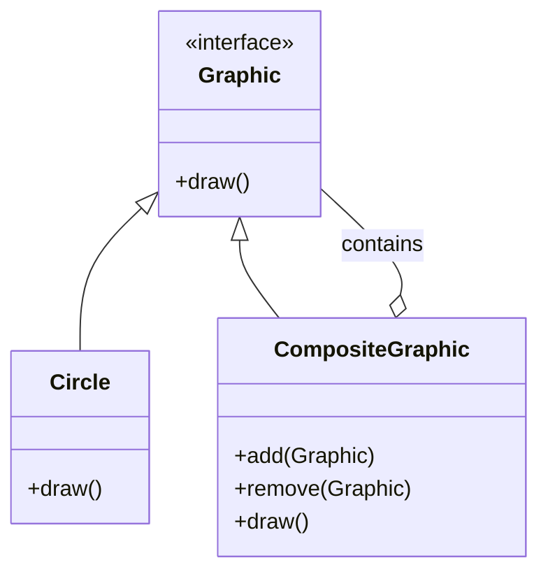

## 5.3 Composite Pattern

In the realm of software design patterns, the Composite Pattern stands out as a powerful tool for managing complex hierarchical structures. This pattern allows you to compose objects into tree structures to represent part-whole hierarchies. By doing so, it enables clients to treat individual objects and compositions of objects uniformly. Let's delve into the intricacies of the Composite Pattern, its components, and how it can be implemented in TypeScript.

### Understanding the Composite Pattern

The Composite Pattern is a structural design pattern that facilitates the creation of tree-like structures. It allows you to build complex objects by combining simpler ones, enabling you to treat both individual objects and compositions of objects in a consistent manner. This uniformity simplifies client code, as it doesn't have to distinguish between single objects and compositions.

#### Intent of the Composite Pattern

The primary intent of the Composite Pattern is to "compose objects into tree structures to represent part-whole hierarchies." This pattern allows clients to treat individual objects and compositions uniformly. It is particularly useful in scenarios where you need to work with a hierarchy of objects, such as graphical user interfaces, file systems, or organizational structures.

#### Problems Solved by the Composite Pattern

The Composite Pattern addresses several common problems in software design:

1. **Complex Hierarchical Structures**: When dealing with complex hierarchies, client code can become cumbersome and difficult to manage. The Composite Pattern simplifies this by providing a uniform interface for both individual and composite objects.

2. **Uniform Treatment**: By allowing clients to treat leaves and composites uniformly, the pattern reduces the complexity of client code. This uniformity means that clients do not need to differentiate between individual objects and compositions.

3. **Dynamic Hierarchies**: The pattern supports dynamic hierarchies, allowing you to add or remove components at runtime. This flexibility is crucial for applications that require dynamic behavior.

4. **Scalability**: The Composite Pattern enhances scalability by enabling the addition of new component types without modifying existing code. This extensibility is achieved through polymorphism and inheritance.

### Key Participants in the Composite Pattern

To implement the Composite Pattern, you need to understand its key participants:

#### 1. Component

The `Component` is an interface or abstract class that defines the common operations for both leaf and composite objects. It declares operations that can be performed on both individual and composite objects, ensuring uniformity.

```typescript
// Component Interface
interface Graphic {
    draw(): void;
}
```

#### 2. Leaf

The `Leaf` represents the individual objects in the composition. It implements the `Component` interface and defines behavior for the primitive objects in the hierarchy. Leaves do not have any children.

```typescript
// Leaf Class
class Circle implements Graphic {
    draw(): void {
        console.log("Drawing a Circle");
    }
}
```

#### 3. Composite

The `Composite` represents nodes with children. It implements the `Component` interface and defines behavior for components that have children. The `Composite` class maintains a collection of child components and implements methods to manage them.

```typescript
// Composite Class
class CompositeGraphic implements Graphic {
    private children: Graphic[] = [];

    add(graphic: Graphic): void {
        this.children.push(graphic);
    }

    remove(graphic: Graphic): void {
        const index = this.children.indexOf(graphic);
        if (index !== -1) {
            this.children.splice(index, 1);
        }
    }

    draw(): void {
        this.children.forEach(child => child.draw());
    }
}
```

### Visualizing the Composite Pattern

To better understand the Composite Pattern, let's visualize a typical composite structure using a class diagram. This diagram illustrates the relationships between the `Component`, `Leaf`, and `Composite` participants.



**Diagram Explanation**: The diagram shows the `Graphic` interface, which is implemented by both `Circle` (a `Leaf`) and `CompositeGraphic` (a `Composite`). The `CompositeGraphic` class contains a collection of `Graphic` objects, allowing it to manage its children.

### Implementing the Composite Pattern in TypeScript

Let's walk through a practical implementation of the Composite Pattern in TypeScript. We'll create a simple graphical application that uses the pattern to manage different shapes.

#### Step 1: Define the Component Interface

First, define the `Graphic` interface, which declares the `draw` method.

```typescript
interface Graphic {
    draw(): void;
}
```

#### Step 2: Implement the Leaf Class

Next, implement the `Circle` class, which represents a leaf in the composition.

```typescript
class Circle implements Graphic {
    draw(): void {
        console.log("Drawing a Circle");
    }
}
```

#### Step 3: Implement the Composite Class

Now, implement the `CompositeGraphic` class, which represents a composite object with children.

```typescript
class CompositeGraphic implements Graphic {
    private children: Graphic[] = [];

    add(graphic: Graphic): void {
        this.children.push(graphic);
    }

    remove(graphic: Graphic): void {
        const index = this.children.indexOf(graphic);
        if (index !== -1) {
            this.children.splice(index, 1);
        }
    }

    draw(): void {
        this.children.forEach(child => child.draw());
    }
}
```

#### Step 4: Use the Composite Pattern

Finally, use the Composite Pattern to create and manage a hierarchy of graphical objects.

```typescript
// Create leaf objects
const circle1 = new Circle();
const circle2 = new Circle();

// Create a composite object
const composite = new CompositeGraphic();

// Add leaf objects to the composite
composite.add(circle1);
composite.add(circle2);

// Draw all graphics
composite.draw();
```

**Output Explanation**: When you run this code, it will output:

```
Drawing a Circle
Drawing a Circle
```

This output demonstrates how the `CompositeGraphic` class manages its children and delegates the `draw` operation to them.

### Benefits of the Composite Pattern

The Composite Pattern offers several benefits:

1. **Simplified Client Code**: By providing a uniform interface for both individual and composite objects, the pattern simplifies client code. Clients can treat all objects in the hierarchy uniformly, reducing complexity.

2. **Flexibility**: The pattern supports dynamic hierarchies, allowing you to add or remove components at runtime. This flexibility is essential for applications that require dynamic behavior.

3. **Scalability**: The Composite Pattern enhances scalability by enabling the addition of new component types without modifying existing code. This extensibility is achieved through polymorphism and inheritance.

4. **Reusability**: By defining a common interface for all components, the pattern promotes reusability. You can easily reuse components in different contexts without modification.

### Challenges and Considerations

While the Composite Pattern offers many benefits, it also presents some challenges:

1. **Complexity**: Implementing the Composite Pattern can introduce complexity, especially in large hierarchies. Managing the relationships between components and ensuring consistency can be challenging.

2. **Performance**: The pattern may impact performance, particularly in large hierarchies. Traversing the hierarchy and managing child components can be resource-intensive.

3. **Design Overhead**: Designing a system using the Composite Pattern requires careful planning and consideration. You need to define clear interfaces and manage the relationships between components effectively.

### Try It Yourself

To deepen your understanding of the Composite Pattern, try modifying the code examples provided. Here are a few suggestions:

- **Add New Shapes**: Implement additional leaf classes, such as `Rectangle` or `Triangle`, and add them to the composite structure.
- **Nested Composites**: Create a composite that contains other composites, and observe how the pattern handles nested hierarchies.
- **Dynamic Behavior**: Implement methods to dynamically add or remove components at runtime, and explore how this affects the hierarchy.

### Further Reading

For more information on the Composite Pattern and related concepts, consider exploring the following resources:

- [MDN Web Docs: Design Patterns](https://developer.mozilla.org/en-US/docs/Web/JavaScript/Guide/Design_Patterns)
- [Refactoring Guru: Composite Pattern](https://refactoring.guru/design-patterns/composite)
- [Design Patterns: Elements of Reusable Object-Oriented Software](https://en.wikipedia.org/wiki/Design_Patterns)

### Knowledge Check

Before we conclude, let's reinforce what we've learned with a few key takeaways:

- The Composite Pattern enables you to compose objects into tree structures, allowing uniform treatment of individual and composite objects.
- It simplifies client code by providing a common interface for all components in the hierarchy.
- The pattern supports dynamic hierarchies and enhances scalability by enabling the addition of new component types without modifying existing code.

Remember, mastering the Composite Pattern is just one step on your journey to becoming an expert in design patterns. Keep experimenting, stay curious, and enjoy the journey!

## Quiz Time!



### What is the primary intent of the Composite Pattern?

- [x] To compose objects into tree structures to represent part-whole hierarchies.
- [ ] To provide a simplified interface to a complex subsystem.
- [ ] To ensure a class has only one instance with a global access point.
- [ ] To define a family of algorithms, encapsulate each one, and make them interchangeable.

> **Explanation:** The Composite Pattern's primary intent is to compose objects into tree structures to represent part-whole hierarchies, allowing clients to treat individual objects and compositions uniformly.

### Which of the following is NOT a key participant in the Composite Pattern?

- [ ] Component
- [x] Adapter
- [ ] Leaf
- [ ] Composite

> **Explanation:** The key participants in the Composite Pattern are Component, Leaf, and Composite. The Adapter is a participant in the Adapter Pattern, not the Composite Pattern.

### What role does the Leaf play in the Composite Pattern?

- [x] Represents leaf objects in the composition with no children.
- [ ] Represents nodes with children, implementing methods to manage child components.
- [ ] Provides a simplified interface to a complex subsystem.
- [ ] Ensures a class has only one instance with a global access point.

> **Explanation:** In the Composite Pattern, the Leaf represents leaf objects in the composition with no children.

### How does the Composite Pattern simplify client code?

- [x] By providing a uniform interface for both individual and composite objects.
- [ ] By ensuring a class has only one instance with a global access point.
- [ ] By allowing incompatible interfaces to work together via a mediator.
- [ ] By defining a family of algorithms, encapsulating each one, and making them interchangeable.

> **Explanation:** The Composite Pattern simplifies client code by providing a uniform interface for both individual and composite objects, allowing clients to treat them uniformly.

### What is a potential challenge when implementing the Composite Pattern?

- [x] Complexity in managing relationships between components.
- [ ] Ensuring a class has only one instance with a global access point.
- [ ] Allowing incompatible interfaces to work together via a mediator.
- [ ] Defining a family of algorithms, encapsulating each one, and making them interchangeable.

> **Explanation:** A potential challenge when implementing the Composite Pattern is the complexity in managing relationships between components, especially in large hierarchies.

### What is a benefit of using the Composite Pattern?

- [x] Enhanced scalability by enabling the addition of new component types without modifying existing code.
- [ ] Ensuring a class has only one instance with a global access point.
- [ ] Allowing incompatible interfaces to work together via a mediator.
- [ ] Defining a family of algorithms, encapsulating each one, and making them interchangeable.

> **Explanation:** A benefit of using the Composite Pattern is enhanced scalability by enabling the addition of new component types without modifying existing code.

### Which method is typically used by the Composite class to manage its children?

- [x] add() and remove()
- [ ] connect() and disconnect()
- [ ] start() and stop()
- [ ] open() and close()

> **Explanation:** The Composite class typically uses methods like add() and remove() to manage its children.

### What does the Composite Pattern enable in terms of hierarchy?

- [x] Dynamic hierarchies, allowing you to add or remove components at runtime.
- [ ] Static hierarchies, fixed at compile time.
- [ ] Hierarchies that only allow leaf nodes.
- [ ] Hierarchies that do not support polymorphism.

> **Explanation:** The Composite Pattern enables dynamic hierarchies, allowing you to add or remove components at runtime.

### True or False: The Composite Pattern is particularly useful for applications that require dynamic behavior.

- [x] True
- [ ] False

> **Explanation:** True. The Composite Pattern is particularly useful for applications that require dynamic behavior, as it supports dynamic hierarchies and allows components to be added or removed at runtime.

### Which of the following is a typical use case for the Composite Pattern?

- [x] Graphical user interfaces
- [ ] Database connections
- [ ] Network protocols
- [ ] Memory management

> **Explanation:** A typical use case for the Composite Pattern is graphical user interfaces, where it helps manage complex hierarchies of UI components.


