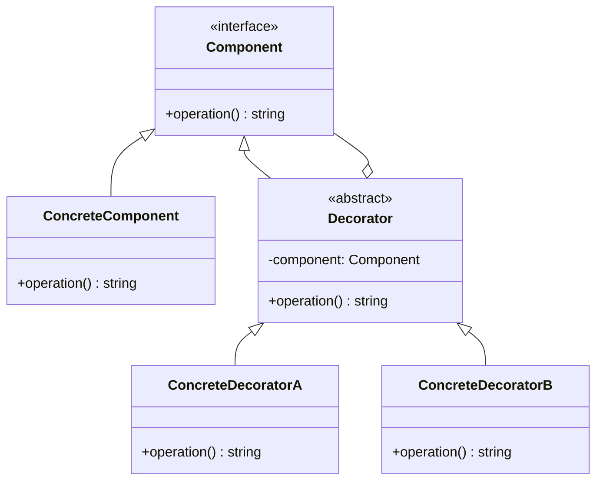

## 5.4.1 Implementing Decorator in TypeScript

The Decorator Pattern is a structural design pattern that allows behavior to be added to individual objects, either statically or dynamically, without affecting the behavior of other objects from the same class. This pattern is particularly useful when you want to add responsibilities to objects without subclassing.

### Understanding the Decorator Pattern

In the Decorator Pattern, we have several key components:

1. **Component Interface**: This defines the interface for objects that can have responsibilities added to them dynamically.
2. **ConcreteComponent**: This class implements the `Component` interface and provides the basic functionality that can be extended by decorators.
3. **Decorator**: This abstract class implements the `Component` interface and contains a reference to a `Component` object. It delegates all operations to the component it decorates.
4. **ConcreteDecorator**: This class extends the `Decorator` class and adds additional responsibilities to the component.

### Implementing the Decorator Pattern in TypeScript

Let's walk through the implementation of the Decorator Pattern in TypeScript step by step.

#### Step 1: Define the `Component` Interface

The `Component` interface declares the operations that can be altered by decorators.

```typescript
// Component interface
interface Component {
    operation(): string;
}
```

#### Step 2: Implement the `ConcreteComponent` Class

The `ConcreteComponent` class provides the default implementation of the `Component` interface. It can be decorated by adding new behaviors.

```typescript
// ConcreteComponent class
class ConcreteComponent implements Component {
    operation(): string {
        return "ConcreteComponent";
    }
}
```

#### Step 3: Create the `Decorator` Abstract Class

The `Decorator` class implements the `Component` interface and contains a reference to a `Component` object. It delegates all operations to the component it decorates.

```typescript
// Decorator abstract class
abstract class Decorator implements Component {
    protected component: Component;

    constructor(component: Component) {
        this.component = component;
    }

    operation(): string {
        return this.component.operation();
    }
}
```

#### Step 4: Implement `ConcreteDecorator` Classes

The `ConcreteDecorator` classes extend the `Decorator` class and add additional responsibilities to the component.

```typescript
// ConcreteDecoratorA class
class ConcreteDecoratorA extends Decorator {
    operation(): string {
        return `ConcreteDecoratorA(${super.operation()})`;
    }
}

// ConcreteDecoratorB class
class ConcreteDecoratorB extends Decorator {
    operation(): string {
        return `ConcreteDecoratorB(${super.operation()})`;
    }
}
```

### Using the Decorator Pattern

Now that we have our classes set up, let's see how we can use them to add responsibilities to objects at runtime.

```typescript
// Client code
const simple = new ConcreteComponent();
console.log("Client: I've got a simple component:");
console.log(`RESULT: ${simple.operation()}`);

const decorator1 = new ConcreteDecoratorA(simple);
const decorator2 = new ConcreteDecoratorB(decorator1);
console.log("Client: Now I've got a decorated component:");
console.log(`RESULT: ${decorator2.operation()}`);
```

**Output:**

```
Client: I've got a simple component:
RESULT: ConcreteComponent
Client: Now I've got a decorated component:
RESULT: ConcreteDecoratorB(ConcreteDecoratorA(ConcreteComponent))
```

### Key Points and TypeScript Features

- **TypeScript Interfaces**: Interfaces in TypeScript are used to define contracts for classes. They ensure that classes implement certain methods, which is crucial for the Decorator Pattern.
- **Abstract Classes**: TypeScript supports abstract classes, which allow us to define methods that must be implemented by subclasses. This is useful for creating the `Decorator` class.
- **Class Inheritance**: The Decorator Pattern heavily relies on class inheritance to extend functionality. TypeScript's class syntax makes this straightforward.
- **Super Keyword**: The `super` keyword is used to call methods from the parent class. This is essential when extending the functionality of the `Decorator` class.

### Visualizing the Decorator Pattern

Below is a class diagram illustrating the relationships between the components in the Decorator Pattern.



### Try It Yourself

To get a better grasp of the Decorator Pattern, try the following exercises:

1. **Modify the Decorators**: Add a new `ConcreteDecoratorC` class that adds a different behavior. Experiment with the order of decorators and observe how the output changes.
2. **Add New Methods**: Extend the `Component` interface with a new method and implement it in the `ConcreteComponent` and `Decorator` classes. See how this affects the decorators.
3. **Create a Logging Decorator**: Implement a decorator that logs the execution time of the `operation` method.

### Knowledge Check

- What is the primary purpose of the Decorator Pattern?
- How does TypeScript's class and interface system aid in implementing the Decorator Pattern?
- What are the benefits of using decorators over subclassing?

### Conclusion

The Decorator Pattern is a powerful tool in a developer's toolkit, allowing for flexible and dynamic extension of object behavior. By leveraging TypeScript's class and interface features, we can implement this pattern effectively, ensuring our code remains maintainable and scalable.

Remember, this is just the beginning. As you progress, you'll build more complex and interactive applications using the Decorator Pattern. Keep experimenting, stay curious, and enjoy the journey!

## Quiz Time!



### What is the primary purpose of the Decorator Pattern?

- [x] To add responsibilities to objects dynamically
- [ ] To create a single instance of a class
- [ ] To separate an abstraction from its implementation
- [ ] To provide a simplified interface to a complex subsystem

> **Explanation:** The Decorator Pattern is used to add responsibilities to objects dynamically without affecting other objects from the same class.

### Which TypeScript feature is crucial for defining contracts in the Decorator Pattern?

- [x] Interfaces
- [ ] Enums
- [ ] Type Aliases
- [ ] Generics

> **Explanation:** Interfaces in TypeScript are used to define contracts for classes, ensuring they implement certain methods, which is crucial for the Decorator Pattern.

### What does the `super` keyword do in the context of the Decorator Pattern?

- [x] Calls methods from the parent class
- [ ] Creates a new instance of a class
- [ ] Defines a new method in a class
- [ ] Implements an interface

> **Explanation:** The `super` keyword is used to call methods from the parent class, which is essential when extending the functionality of the `Decorator` class.

### How does the Decorator Pattern differ from subclassing?

- [x] It allows for dynamic addition of responsibilities
- [ ] It creates a new class hierarchy
- [ ] It requires more memory
- [ ] It simplifies code

> **Explanation:** The Decorator Pattern allows for dynamic addition of responsibilities to objects without creating a new class hierarchy, unlike subclassing.

### What is a key benefit of using decorators over subclassing?

- [x] Flexibility in adding functionality
- [ ] Reduced code complexity
- [ ] Improved performance
- [ ] Easier debugging

> **Explanation:** Decorators provide flexibility in adding functionality to objects without modifying existing code, unlike subclassing, which requires creating new subclasses for each variation.

### Which class in the Decorator Pattern holds a reference to a `Component` object?

- [x] Decorator
- [ ] ConcreteComponent
- [ ] ConcreteDecoratorA
- [ ] ConcreteDecoratorB

> **Explanation:** The `Decorator` class holds a reference to a `Component` object and delegates operations to it.

### What is the role of the `ConcreteComponent` class in the Decorator Pattern?

- [x] Provides the basic functionality that can be extended by decorators
- [ ] Holds a reference to a `Component` object
- [ ] Adds additional responsibilities to the component
- [ ] Defines the interface for objects that can have responsibilities added

> **Explanation:** The `ConcreteComponent` class provides the basic functionality that can be extended by decorators.

### How can you dynamically add responsibilities to objects using the Decorator Pattern?

- [x] By wrapping them with decorator classes
- [ ] By subclassing them
- [ ] By using interfaces
- [ ] By modifying their source code

> **Explanation:** Responsibilities can be dynamically added to objects by wrapping them with decorator classes.

### What is the output of the following code snippet?

```typescript
const simple = new ConcreteComponent();
const decorator1 = new ConcreteDecoratorA(simple);
const decorator2 = new ConcreteDecoratorB(decorator1);
console.log(decorator2.operation());
```

- [x] ConcreteDecoratorB(ConcreteDecoratorA(ConcreteComponent))
- [ ] ConcreteDecoratorA(ConcreteDecoratorB(ConcreteComponent))
- [ ] ConcreteComponent
- [ ] ConcreteDecoratorB(ConcreteComponent)

> **Explanation:** The output is `ConcreteDecoratorB(ConcreteDecoratorA(ConcreteComponent))` because the decorators wrap the `ConcreteComponent` in the order they are applied.

### True or False: The Decorator Pattern can only be used with classes that implement interfaces.

- [x] True
- [ ] False

> **Explanation:** True. The Decorator Pattern relies on interfaces to define the operations that can be altered by decorators.


