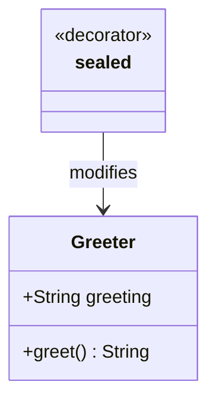

## 5.4.2 Utilizing TypeScript Decorators

In the world of TypeScript, decorators provide a powerful way to modify and enhance classes and their members at design time or runtime. They allow developers to add metadata, change behavior, and implement cross-cutting concerns like logging and validation with minimal code changes. In this section, we'll delve into the various types of TypeScript decorators, how to enable them, and best practices for their use.

### What are TypeScript Decorators?

TypeScript decorators are a special kind of declaration that can be attached to classes, methods, accessors, properties, or parameters. They are essentially functions that provide a way to add annotations and a meta-programming syntax for class declarations and members. Decorators are a stage 2 proposal for JavaScript and are available as an experimental feature in TypeScript.

#### Enabling Decorators in TypeScript

Before using decorators, you need to enable them in your TypeScript project. This is done by setting the `experimentalDecorators` option to `true` in your `tsconfig.json` file:

```json
{
  "compilerOptions": {
    "target": "ES6",
    "experimentalDecorators": true
  }
}
```

This configuration tells the TypeScript compiler to allow the use of decorators in your code.

### Types of TypeScript Decorators

TypeScript supports several types of decorators, each serving a different purpose. Let's explore each type with examples.

#### Class Decorators

Class decorators are applied to the class constructor and can be used to observe, modify, or replace a class definition. They are declared just before the class keyword.

```typescript
function sealed(constructor: Function) {
  Object.seal(constructor);
  Object.seal(constructor.prototype);
}

@sealed
class Greeter {
  greeting: string;
  constructor(message: string) {
    this.greeting = message;
  }
  greet() {
    return `Hello, ${this.greeting}`;
  }
}
```

In this example, the `sealed` decorator seals the class, preventing new properties from being added to it.

#### Method Decorators

Method decorators are used to modify the behavior of methods within a class. They are applied just before a method declaration.

```typescript
function log(target: Object, propertyKey: string, descriptor: PropertyDescriptor) {
  const originalMethod = descriptor.value;
  descriptor.value = function (...args: any[]) {
    console.log(`Calling ${propertyKey} with arguments`, args);
    return originalMethod.apply(this, args);
  };
}

class Calculator {
  @log
  add(a: number, b: number): number {
    return a + b;
  }
}

const calculator = new Calculator();
calculator.add(2, 3); // Logs: Calling add with arguments [2, 3]
```

Here, the `log` decorator logs the method name and arguments each time the `add` method is called.

#### Accessor Decorators

Accessor decorators are similar to method decorators but are applied to getters and setters. They can be used to modify the behavior of property accessors.

```typescript
function configurable(value: boolean) {
  return function (target: any, propertyKey: string, descriptor: PropertyDescriptor) {
    descriptor.configurable = value;
  };
}

class Point {
  private _x: number;
  private _y: number;

  constructor(x: number, y: number) {
    this._x = x;
    this._y = y;
  }

  @configurable(false)
  get x() {
    return this._x;
  }

  @configurable(false)
  get y() {
    return this._y;
  }
}
```

In this example, the `configurable` decorator is used to make the accessors non-configurable.

#### Property Decorators

Property decorators are applied to class properties and can be used to add metadata or modify property behavior.

```typescript
function readonly(target: any, propertyKey: string) {
  Object.defineProperty(target, propertyKey, {
    writable: false
  });
}

class Book {
  @readonly
  title: string;

  constructor(title: string) {
    this.title = title;
  }
}

const book = new Book("TypeScript Essentials");
book.title = "New Title"; // Error: Cannot assign to read only property 'title'
```

The `readonly` decorator makes the `title` property immutable.

#### Parameter Decorators

Parameter decorators are used to add metadata to method parameters. They are declared just before a parameter in a method declaration.

```typescript
function logParameter(target: Object, propertyKey: string, parameterIndex: number) {
  const metadataKey = `log_${propertyKey}_parameters`;
  if (Array.isArray(target[metadataKey])) {
    target[metadataKey].push(parameterIndex);
  } else {
    target[metadataKey] = [parameterIndex];
  }
}

class Logger {
  log(@logParameter message: string) {
    console.log(message);
  }
}
```

In this example, the `logParameter` decorator adds metadata about the parameters of the `log` method.

### Implementing Decorators to Add Metadata or Modify Behavior

Decorators can be used to add metadata to classes and their members, which can be useful for various purposes such as validation, logging, and more. Let's explore some practical implementations.

#### Adding Metadata

Decorators can be used to add metadata to class properties, which can be accessed at runtime for various purposes.

```typescript
function metadata(key: string, value: any) {
  return function (target: any, propertyKey: string) {
    if (!target.constructor._metadata) {
      target.constructor._metadata = {};
    }
    target.constructor._metadata[propertyKey] = value;
  };
}

class User {
  @metadata("role", "admin")
  name: string;

  constructor(name: string) {
    this.name = name;
  }
}

console.log(User._metadata); // { name: "admin" }
```

In this example, the `metadata` decorator adds a role metadata to the `name` property of the `User` class.

#### Modifying Behavior

Decorators can also be used to modify the behavior of methods or properties.

```typescript
function measure(target: any, propertyKey: string, descriptor: PropertyDescriptor) {
  const originalMethod = descriptor.value;
  descriptor.value = function (...args: any[]) {
    console.time(propertyKey);
    const result = originalMethod.apply(this, args);
    console.timeEnd(propertyKey);
    return result;
  };
}

class MathOperations {
  @measure
  multiply(a: number, b: number): number {
    return a * b;
  }
}

const operations = new MathOperations();
operations.multiply(5, 10); // Logs the time taken to execute the multiply method
```

Here, the `measure` decorator logs the time taken to execute the `multiply` method.

### Comparing TypeScript Decorators with the Decorator Pattern

While TypeScript decorators and the Decorator Pattern share a name, they serve different purposes and are used in different contexts.

- **TypeScript Decorators**: These are a language feature that allows you to annotate and modify classes and their members. They are used for adding metadata, modifying behavior, and implementing cross-cutting concerns at design time or runtime.

- **Decorator Pattern**: This is a structural design pattern that allows behavior to be added to individual objects, either statically or dynamically, without affecting the behavior of other objects from the same class. It is used to extend the functionality of objects by wrapping them with additional behavior.

#### Key Differences

- **Scope**: TypeScript decorators are applied at the class or member level, while the Decorator Pattern is applied at the object level.
- **Purpose**: TypeScript decorators are primarily used for meta-programming, whereas the Decorator Pattern is used to extend object functionality.
- **Implementation**: TypeScript decorators are a language feature, while the Decorator Pattern is a design pattern implemented in code.

### Best Practices and Considerations

When using TypeScript decorators, it's important to follow best practices to ensure maintainability and readability of your code.

- **Use Descriptive Names**: Name your decorators descriptively to convey their purpose clearly.
- **Keep Decorators Simple**: Avoid adding too much logic in decorators to keep them simple and focused.
- **Document Decorators**: Provide documentation for custom decorators to explain their purpose and usage.
- **Consider Performance**: Be mindful of the performance impact of decorators, especially if they add significant overhead.
- **Test Thoroughly**: Ensure that decorators are thoroughly tested to avoid unexpected behavior.

### Try It Yourself

To get hands-on experience with TypeScript decorators, try modifying the examples provided. Experiment with adding new decorators, combining multiple decorators, and observing their effects on classes and methods. This will help solidify your understanding and inspire new ways to leverage decorators in your projects.

### Visualizing Decorator Usage

To better understand how decorators interact with classes and methods, let's visualize their application using a class diagram.



This diagram illustrates how the `sealed` decorator modifies the `Greeter` class by sealing it.

### References and Links

- [TypeScript Handbook: Decorators](https://www.typescriptlang.org/docs/handbook/decorators.html)
- [MDN Web Docs: Decorators](https://developer.mozilla.org/en-US/docs/Web/JavaScript/Reference/Global_Objects/Reflect/decorator)
- [W3Schools: TypeScript Decorators](https://www.w3schools.com/typescript/typescript_decorators.php)

### Knowledge Check

- What are TypeScript decorators and how are they enabled?
- List the different types of decorators available in TypeScript.
- How do TypeScript decorators differ from the Decorator Pattern?
- What are some best practices when using decorators?

### Embrace the Journey

Remember, mastering TypeScript decorators is just the beginning. As you continue to explore and experiment, you'll discover new ways to enhance your code and implement powerful features with ease. Keep learning, stay curious, and enjoy the journey!

## Quiz Time!



### What is the primary purpose of TypeScript decorators?

- [x] To add metadata and modify behavior of classes and their members
- [ ] To create new classes
- [ ] To compile TypeScript code to JavaScript
- [ ] To manage dependencies between modules

> **Explanation:** TypeScript decorators are used to add metadata and modify the behavior of classes and their members.

### How do you enable decorators in a TypeScript project?

- [x] By setting `experimentalDecorators` to `true` in `tsconfig.json`
- [ ] By installing a special TypeScript plugin
- [ ] By using a specific command line flag
- [ ] By writing a custom decorator function

> **Explanation:** Decorators are enabled by setting `experimentalDecorators` to `true` in the `tsconfig.json` file.

### Which decorator type is used to modify the behavior of a class method?

- [ ] Class decorator
- [x] Method decorator
- [ ] Property decorator
- [ ] Parameter decorator

> **Explanation:** Method decorators are used to modify the behavior of class methods.

### What is a key difference between TypeScript decorators and the Decorator Pattern?

- [x] TypeScript decorators are a language feature, while the Decorator Pattern is a design pattern
- [ ] TypeScript decorators are used only for properties
- [ ] The Decorator Pattern is specific to TypeScript
- [ ] TypeScript decorators cannot modify class methods

> **Explanation:** TypeScript decorators are a language feature, whereas the Decorator Pattern is a design pattern used to extend object functionality.

### What is a best practice when using TypeScript decorators?

- [x] Keep decorators simple and focused
- [ ] Use decorators for all class members
- [ ] Avoid documenting decorators
- [ ] Use decorators to replace all class logic

> **Explanation:** It's important to keep decorators simple and focused to ensure maintainability.

### Which decorator type is applied to class properties?

- [ ] Class decorator
- [ ] Method decorator
- [x] Property decorator
- [ ] Parameter decorator

> **Explanation:** Property decorators are applied to class properties.

### What is the role of a class decorator?

- [x] To observe, modify, or replace a class definition
- [ ] To modify method parameters
- [ ] To add new methods to a class
- [ ] To change the class constructor

> **Explanation:** Class decorators are used to observe, modify, or replace a class definition.

### Can TypeScript decorators be used to add metadata to class methods?

- [x] Yes
- [ ] No

> **Explanation:** TypeScript decorators can be used to add metadata to class methods.

### What should you consider when using decorators in terms of performance?

- [x] Be mindful of the performance impact, especially if they add significant overhead
- [ ] Decorators have no impact on performance
- [ ] Only use decorators in performance-critical code
- [ ] Avoid using decorators in production code

> **Explanation:** It's important to consider the performance impact of decorators, especially if they add significant overhead.

### True or False: TypeScript decorators can be used to implement cross-cutting concerns like logging and validation.

- [x] True
- [ ] False

> **Explanation:** TypeScript decorators can be used to implement cross-cutting concerns like logging and validation.


