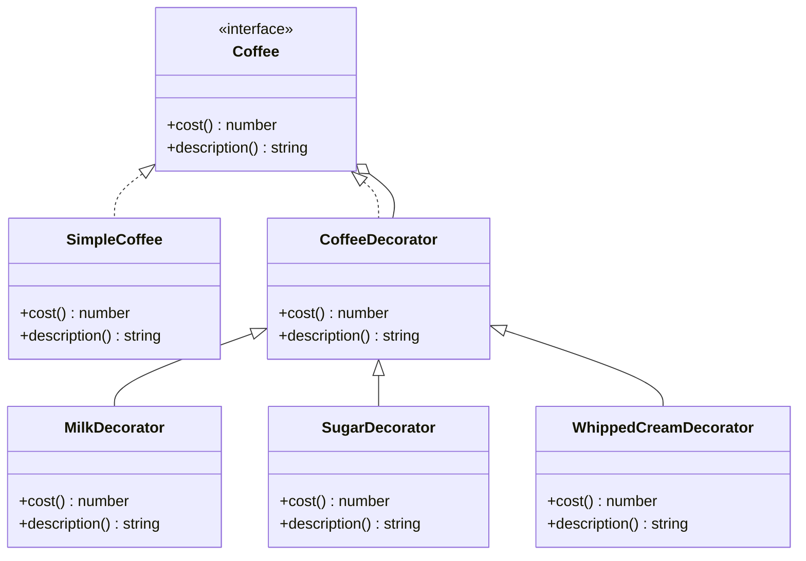

## 5.4.3 Enhancing Object Functionality

The Decorator Pattern is a structural design pattern that allows behavior to be added to individual objects, either statically or dynamically, without affecting the behavior of other objects from the same class. This pattern is particularly useful in TypeScript for enhancing object functionality while adhering to the Open/Closed Principle, which states that software entities should be open for extension but closed for modification.

### Understanding the Decorator Pattern

The Decorator Pattern involves a set of decorator classes that are used to wrap concrete components. Decorators provide a flexible alternative to subclassing for extending functionality. By using decorators, we can add new responsibilities to objects dynamically and transparently, without affecting other objects.

#### Key Concepts

- **Component Interface**: This defines the interface for objects that can have responsibilities added to them dynamically.
- **Concrete Component**: This is the class of objects to which additional responsibilities can be attached.
- **Decorator**: This class maintains a reference to a component object and defines an interface that conforms to the component's interface.
- **Concrete Decorator**: This class adds responsibilities to the component.

### Implementing the Decorator Pattern in TypeScript

Let's explore how to implement the Decorator Pattern in TypeScript with a practical example. Consider a scenario where we have a basic `Coffee` class, and we want to add various condiments like milk, sugar, and whipped cream dynamically.

#### Step-by-Step Implementation

1. **Define the Component Interface**

```typescript
// Component Interface
interface Coffee {
    cost(): number;
    description(): string;
}
```

2. **Create the Concrete Component**

```typescript
// Concrete Component
class SimpleCoffee implements Coffee {
    cost(): number {
        return 5;
    }

    description(): string {
        return "Simple Coffee";
    }
}
```

3. **Create the Decorator Class**

```typescript
// Decorator
class CoffeeDecorator implements Coffee {
    protected coffee: Coffee;

    constructor(coffee: Coffee) {
        this.coffee = coffee;
    }

    cost(): number {
        return this.coffee.cost();
    }

    description(): string {
        return this.coffee.description();
    }
}
```

4. **Create Concrete Decorators**

```typescript
// Concrete Decorators
class MilkDecorator extends CoffeeDecorator {
    cost(): number {
        return this.coffee.cost() + 1;
    }

    description(): string {
        return this.coffee.description() + ", Milk";
    }
}

class SugarDecorator extends CoffeeDecorator {
    cost(): number {
        return this.coffee.cost() + 0.5;
    }

    description(): string {
        return this.coffee.description() + ", Sugar";
    }
}

class WhippedCreamDecorator extends CoffeeDecorator {
    cost(): number {
        return this.coffee.cost() + 1.5;
    }

    description(): string {
        return this.coffee.description() + ", Whipped Cream";
    }
}
```

5. **Using the Decorators**

```typescript
// Client code
let myCoffee: Coffee = new SimpleCoffee();
console.log(myCoffee.description() + " $" + myCoffee.cost());

myCoffee = new MilkDecorator(myCoffee);
console.log(myCoffee.description() + " $" + myCoffee.cost());

myCoffee = new SugarDecorator(myCoffee);
console.log(myCoffee.description() + " $" + myCoffee.cost());

myCoffee = new WhippedCreamDecorator(myCoffee);
console.log(myCoffee.description() + " $" + myCoffee.cost());
```

### Benefits of the Decorator Pattern

- **Flexibility**: The Decorator Pattern allows for the dynamic composition of behavior, enabling us to add new functionality to objects at runtime.
- **Adherence to the Open/Closed Principle**: By using decorators, we can extend the functionality of objects without modifying existing code.
- **Avoidance of Subclass Explosion**: Instead of creating a subclass for every possible combination of features, decorators allow us to mix and match features as needed.

### Extending Functionality at Runtime

The Decorator Pattern is particularly powerful when we need to extend functionality based on conditions or configurations that are not known at compile time. For example, in a web application, we might want to apply different decorators based on user preferences or roles.

#### Example: User Notification System

Consider a notification system where different types of notifications (e.g., email, SMS, push) can be sent based on user preferences.

```typescript
// Component Interface
interface Notification {
    send(message: string): void;
}

// Concrete Component
class BasicNotification implements Notification {
    send(message: string): void {
        console.log("Sending notification: " + message);
    }
}

// Decorator
class NotificationDecorator implements Notification {
    protected notification: Notification;

    constructor(notification: Notification) {
        this.notification = notification;
    }

    send(message: string): void {
        this.notification.send(message);
    }
}

// Concrete Decorators
class EmailNotificationDecorator extends NotificationDecorator {
    send(message: string): void {
        super.send(message);
        console.log("Sending email notification: " + message);
    }
}

class SMSNotificationDecorator extends NotificationDecorator {
    send(message: string): void {
        super.send(message);
        console.log("Sending SMS notification: " + message);
    }
}

class PushNotificationDecorator extends NotificationDecorator {
    send(message: string): void {
        super.send(message);
        console.log("Sending push notification: " + message);
    }
}

// Client code
let notification: Notification = new BasicNotification();
notification = new EmailNotificationDecorator(notification);
notification = new SMSNotificationDecorator(notification);
notification.send("Hello, User!");
```

### Avoiding Extensive Subclassing

Without the Decorator Pattern, we might be tempted to create a subclass for each combination of features. This approach quickly becomes unmanageable as the number of combinations grows. The Decorator Pattern provides a more scalable solution by allowing us to compose features dynamically.

### Performance Considerations

While the Decorator Pattern offers numerous benefits, it also introduces additional layers of wrapping, which can impact performance. Each decorator adds a level of indirection, which can increase the time it takes to execute a method call. However, in most cases, the performance impact is negligible compared to the benefits of increased flexibility and maintainability.

### Visualizing the Decorator Pattern

Below is a class diagram representing the Decorator Pattern:



### Try It Yourself

Experiment with the code examples by adding new decorators or modifying existing ones. Consider creating a `VanillaDecorator` or a `CaramelDecorator` to further enhance the coffee. Try changing the order of decorators to see how it affects the final cost and description.

### Knowledge Check

- What are the main components of the Decorator Pattern?
- How does the Decorator Pattern adhere to the Open/Closed Principle?
- What are the potential performance considerations when using the Decorator Pattern?

### Summary

The Decorator Pattern is a powerful tool for enhancing object functionality in TypeScript. By allowing us to add responsibilities to objects dynamically, it promotes flexibility and scalability while adhering to the Open/Closed Principle. Although there may be some performance considerations due to the additional layers of wrapping, the benefits of maintainability and reduced subclassing complexity often outweigh these concerns.

Remember, this is just the beginning. As you progress, you'll discover more ways to leverage the Decorator Pattern to create flexible and maintainable software. Keep experimenting, stay curious, and enjoy the journey!

## Quiz Time!



### What is the primary benefit of using the Decorator Pattern?

- [x] It allows for dynamic addition of responsibilities to objects.
- [ ] It simplifies the code by reducing the number of classes.
- [ ] It improves performance by reducing method calls.
- [ ] It eliminates the need for interfaces.

> **Explanation:** The Decorator Pattern allows for dynamic addition of responsibilities to objects without modifying their code, adhering to the Open/Closed Principle.

### How does the Decorator Pattern adhere to the Open/Closed Principle?

- [x] By allowing objects to be extended without modifying existing code.
- [ ] By making all classes final and non-extendable.
- [ ] By using only abstract classes and interfaces.
- [ ] By reducing the number of subclasses.

> **Explanation:** The Decorator Pattern enables extending object functionality without altering existing code, thus adhering to the Open/Closed Principle.

### Which of the following is NOT a component of the Decorator Pattern?

- [ ] Component Interface
- [ ] Concrete Component
- [ ] Decorator
- [x] Singleton

> **Explanation:** The Singleton is not a component of the Decorator Pattern. The pattern involves a Component Interface, Concrete Component, and Decorators.

### What is a potential downside of using the Decorator Pattern?

- [ ] It makes the code less flexible.
- [x] It can introduce additional layers of wrapping, impacting performance.
- [ ] It requires extensive subclassing.
- [ ] It violates the Open/Closed Principle.

> **Explanation:** The Decorator Pattern can introduce additional layers of wrapping, which may impact performance, although it generally increases flexibility.

### In the provided coffee example, what would be the cost of a Simple Coffee with Milk and Sugar decorators applied?

- [ ] $5
- [x] $6.5
- [ ] $7
- [ ] $7.5

> **Explanation:** The Simple Coffee costs $5, Milk adds $1, and Sugar adds $0.5, totaling $6.5.

### How can decorators be applied at runtime?

- [x] By wrapping objects with decorators based on runtime conditions or configurations.
- [ ] By modifying the base class at runtime.
- [ ] By using reflection to add methods dynamically.
- [ ] By subclassing the object at runtime.

> **Explanation:** Decorators can be applied at runtime by wrapping objects with decorators based on conditions or configurations.

### What is the role of the Concrete Decorator in the Decorator Pattern?

- [ ] It defines the interface for objects that can have responsibilities added.
- [ ] It is the class of objects to which additional responsibilities can be attached.
- [x] It adds responsibilities to the component.
- [ ] It maintains a reference to a component object.

> **Explanation:** The Concrete Decorator adds responsibilities to the component, enhancing its functionality.

### Which pattern is used to avoid subclass explosion?

- [ ] Singleton Pattern
- [x] Decorator Pattern
- [ ] Factory Pattern
- [ ] Observer Pattern

> **Explanation:** The Decorator Pattern helps avoid subclass explosion by allowing dynamic composition of behavior.

### True or False: The Decorator Pattern can only be used with classes that implement interfaces.

- [x] True
- [ ] False

> **Explanation:** The Decorator Pattern is typically used with classes that implement interfaces to ensure that decorators conform to the component's interface.

### What is a practical use case for the Decorator Pattern?

- [x] Adding features to a notification system based on user preferences.
- [ ] Creating a single instance of a class.
- [ ] Observing changes in object state.
- [ ] Managing object creation.

> **Explanation:** The Decorator Pattern can be used to add features to a notification system based on user preferences, allowing for dynamic enhancement of functionality.


