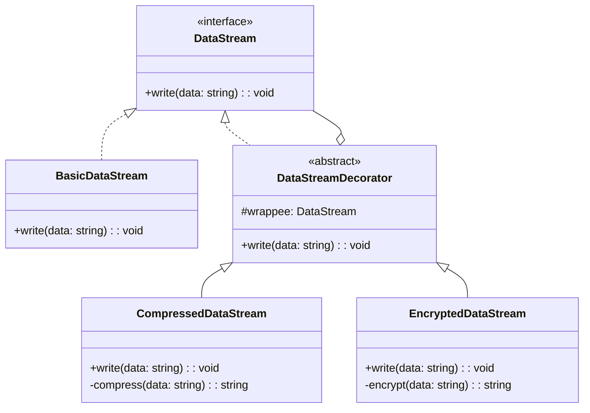

## 5.4.4 Use Cases and Examples

The Decorator Pattern is a structural design pattern that allows behavior to be added to individual objects, either statically or dynamically, without affecting the behavior of other objects from the same class. This pattern is particularly useful in scenarios where you need to add responsibilities to objects without modifying their code. In this section, we will explore practical use cases and examples of the Decorator Pattern in TypeScript, including logging, access control, and enhancing user interface components.

### Implementing a Data Stream Framework

One of the most common applications of the Decorator Pattern is in the implementation of a data stream framework where additional functionalities, such as compression or encryption, can be added to streams as decorators. This approach provides a flexible way to extend the capabilities of data streams without altering their core functionality.

#### Example: Data Stream with Compression and Encryption

Let's consider a scenario where we have a basic data stream, and we want to add compression and encryption functionalities to it. We can achieve this by implementing decorators for compression and encryption.

```typescript
// Base interface for a data stream
interface DataStream {
    write(data: string): void;
}

// Concrete implementation of a basic data stream
class BasicDataStream implements DataStream {
    write(data: string): void {
        console.log(`Writing data: ${data}`);
    }
}

// Abstract decorator class implementing the DataStream interface
abstract class DataStreamDecorator implements DataStream {
    protected wrappee: DataStream;

    constructor(stream: DataStream) {
        this.wrappee = stream;
    }

    write(data: string): void {
        this.wrappee.write(data);
    }
}

// Concrete decorator for compression
class CompressedDataStream extends DataStreamDecorator {
    write(data: string): void {
        const compressedData = this.compress(data);
        super.write(compressedData);
    }

    private compress(data: string): string {
        console.log(`Compressing data: ${data}`);
        return `compressed(${data})`;
    }
}

// Concrete decorator for encryption
class EncryptedDataStream extends DataStreamDecorator {
    write(data: string): void {
        const encryptedData = this.encrypt(data);
        super.write(encryptedData);
    }

    private encrypt(data: string): string {
        console.log(`Encrypting data: ${data}`);
        return `encrypted(${data})`;
    }
}

// Usage
const basicStream = new BasicDataStream();
const compressedStream = new CompressedDataStream(basicStream);
const encryptedCompressedStream = new EncryptedDataStream(compressedStream);

encryptedCompressedStream.write("Hello, World!");
```

**Explanation**: In this example, the `BasicDataStream` class implements the `DataStream` interface. We then create two decorators, `CompressedDataStream` and `EncryptedDataStream`, which extend the functionality of the basic data stream by adding compression and encryption, respectively. This approach allows us to combine these functionalities in any order, providing great flexibility.

### Adding Logging Functionality

Another common use case for the Decorator Pattern is adding logging functionality to methods. By wrapping methods with decorators, we can log method calls, arguments, and results without modifying the original method code.

#### Example: Method Logging

Consider a scenario where we have a class with several methods, and we want to log each method call along with its arguments and results.

```typescript
// Base class with methods to be logged
class Calculator {
    add(a: number, b: number): number {
        return a + b;
    }

    subtract(a: number, b: number): number {
        return a - b;
    }
}

// Decorator function for logging
function logMethod(target: any, propertyKey: string, descriptor: PropertyDescriptor) {
    const originalMethod = descriptor.value;

    descriptor.value = function (...args: any[]) {
        console.log(`Calling ${propertyKey} with arguments: ${JSON.stringify(args)}`);
        const result = originalMethod.apply(this, args);
        console.log(`Result of ${propertyKey}: ${result}`);
        return result;
    };

    return descriptor;
}

// Applying the decorator to methods
class LoggedCalculator extends Calculator {
    @logMethod
    add(a: number, b: number): number {
        return super.add(a, b);
    }

    @logMethod
    subtract(a: number, b: number): number {
        return super.subtract(a, b);
    }
}

// Usage
const calculator = new LoggedCalculator();
calculator.add(5, 3);
calculator.subtract(10, 4);
```

**Explanation**: In this example, we define a `logMethod` decorator function that wraps the original method and logs its calls, arguments, and results. We then apply this decorator to the `add` and `subtract` methods of the `LoggedCalculator` class. This approach allows us to add logging functionality without modifying the original methods.

### Enhancing User Interface Components

The Decorator Pattern is also widely used in enhancing user interface (UI) components. By using decorators, we can extend the functionality of UI components, such as adding scrollbars, borders, or other visual enhancements, without altering the original component code.

#### Example: UI Component with Additional Features

Let's consider a scenario where we have a basic UI component, and we want to add additional features, such as a border and a scrollbar.

```typescript
// Base interface for a UI component
interface UIComponent {
    render(): void;
}

// Concrete implementation of a basic UI component
class BasicComponent implements UIComponent {
    render(): void {
        console.log("Rendering basic component");
    }
}

// Abstract decorator class implementing the UIComponent interface
abstract class UIComponentDecorator implements UIComponent {
    protected component: UIComponent;

    constructor(component: UIComponent) {
        this.component = component;
    }

    render(): void {
        this.component.render();
    }
}

// Concrete decorator for adding a border
class BorderDecorator extends UIComponentDecorator {
    render(): void {
        console.log("Adding border");
        super.render();
    }
}

// Concrete decorator for adding a scrollbar
class ScrollbarDecorator extends UIComponentDecorator {
    render(): void {
        console.log("Adding scrollbar");
        super.render();
    }
}

// Usage
const basicComponent = new BasicComponent();
const borderedComponent = new BorderDecorator(basicComponent);
const scrollableBorderedComponent = new ScrollbarDecorator(borderedComponent);

scrollableBorderedComponent.render();
```

**Explanation**: In this example, the `BasicComponent` class implements the `UIComponent` interface. We then create two decorators, `BorderDecorator` and `ScrollbarDecorator`, which extend the functionality of the basic component by adding a border and a scrollbar, respectively. This approach allows us to combine these features in any order, providing great flexibility in enhancing UI components.

### Flexibility and Trade-offs

The Decorator Pattern provides significant flexibility by allowing you to add responsibilities to objects without modifying their code. This flexibility is particularly useful in scenarios where you need to extend the functionality of objects dynamically or when you want to apply different combinations of features.

However, there are some trade-offs and considerations to keep in mind when using the Decorator Pattern:

- **Complexity**: The use of multiple decorators can lead to increased complexity, making it harder to understand the flow of the program. It's essential to document the decorators and their order of application to maintain clarity.
- **Debugging Challenges**: Debugging can become more challenging when multiple decorators are applied, as it may not be immediately clear which decorator is responsible for a particular behavior.
- **Performance Overhead**: Each decorator adds an additional layer of abstraction, which can introduce performance overhead. It's important to consider the impact on performance, especially in performance-critical applications.

### Encouragement to Use the Decorator Pattern

When you need to add responsibilities to objects without modifying their code, consider using the Decorator Pattern. This pattern provides a flexible and scalable solution for extending the functionality of objects, making it an excellent choice for scenarios such as logging, access control, and enhancing UI components.

### Try It Yourself

To deepen your understanding of the Decorator Pattern, try experimenting with the code examples provided. Here are some suggestions for modifications:

- **Add More Decorators**: Create additional decorators, such as a `CachingDecorator` for data streams or a `TooltipDecorator` for UI components, and see how they can be combined with existing decorators.
- **Experiment with Order**: Change the order of decorators and observe how it affects the behavior of the decorated objects.
- **Implement Custom Decorators**: Think of a real-world scenario in your projects where the Decorator Pattern could be applied, and implement custom decorators to solve the problem.

### Visualizing the Decorator Pattern

To better understand the Decorator Pattern, let's visualize the relationships between the components using a class diagram.



**Diagram Description**: This class diagram illustrates the relationships between the `DataStream` interface, the `BasicDataStream` class, and the decorators `CompressedDataStream` and `EncryptedDataStream`. The `DataStreamDecorator` class is an abstract class that implements the `DataStream` interface and contains a reference to a `DataStream` object, allowing the decorators to extend its functionality.

### Key Takeaways

- The Decorator Pattern is a powerful tool for adding responsibilities to objects without modifying their code.
- It provides flexibility in extending the functionality of objects, making it suitable for scenarios such as logging, access control, and enhancing UI components.
- While the Decorator Pattern offers significant advantages, it's important to consider the trade-offs, such as increased complexity and potential performance overhead.
- Experimenting with the Decorator Pattern in your projects can help you better understand its benefits and limitations.

Remember, this is just the beginning. As you progress, you'll build more complex and interactive applications using the Decorator Pattern. Keep experimenting, stay curious, and enjoy the journey!

## Quiz Time!



### What is the primary purpose of the Decorator Pattern?

- [x] To add responsibilities to objects without modifying their code.
- [ ] To create a single instance of a class.
- [ ] To define a family of algorithms.
- [ ] To provide a simplified interface to a complex subsystem.

> **Explanation:** The Decorator Pattern is used to add responsibilities to objects without modifying their code, allowing for flexible and dynamic extension of object functionality.

### In the provided data stream example, what is the role of the `DataStreamDecorator` class?

- [x] It serves as an abstract class that implements the `DataStream` interface and allows decorators to extend functionality.
- [ ] It compresses data before writing it to the stream.
- [ ] It encrypts data before writing it to the stream.
- [ ] It writes data directly to the stream without any modifications.

> **Explanation:** The `DataStreamDecorator` class is an abstract class that implements the `DataStream` interface and contains a reference to a `DataStream` object, allowing decorators to extend its functionality.

### How does the Decorator Pattern enhance user interface components?

- [x] By adding additional features, such as borders or scrollbars, without altering the original component code.
- [ ] By creating a single instance of a UI component.
- [ ] By defining a family of UI components.
- [ ] By providing a simplified interface to complex UI components.

> **Explanation:** The Decorator Pattern enhances user interface components by adding additional features, such as borders or scrollbars, without altering the original component code.

### What is a potential trade-off of using the Decorator Pattern?

- [x] Increased complexity and potential performance overhead.
- [ ] Reduced flexibility in extending object functionality.
- [ ] Difficulty in creating a single instance of a class.
- [ ] Limited ability to define a family of algorithms.

> **Explanation:** A potential trade-off of using the Decorator Pattern is increased complexity and potential performance overhead due to the additional layers of abstraction introduced by decorators.

### Which of the following is a common use case for the Decorator Pattern?

- [x] Adding logging functionality to methods.
- [ ] Creating a single instance of a class.
- [ ] Defining a family of algorithms.
- [ ] Providing a simplified interface to a complex subsystem.

> **Explanation:** A common use case for the Decorator Pattern is adding logging functionality to methods by wrapping them with decorators.

### In the method logging example, what does the `logMethod` decorator function do?

- [x] It wraps the original method and logs its calls, arguments, and results.
- [ ] It compresses data before writing it to the stream.
- [ ] It encrypts data before writing it to the stream.
- [ ] It writes data directly to the stream without any modifications.

> **Explanation:** The `logMethod` decorator function wraps the original method and logs its calls, arguments, and results, adding logging functionality without modifying the original method code.

### What is the benefit of using decorators for data streams?

- [x] They allow for flexible extension of data stream functionality, such as compression and encryption.
- [ ] They create a single instance of a data stream.
- [ ] They define a family of data stream algorithms.
- [ ] They provide a simplified interface to complex data streams.

> **Explanation:** Decorators allow for flexible extension of data stream functionality, such as compression and encryption, without altering the core functionality of the data stream.

### How can you experiment with the Decorator Pattern in your projects?

- [x] By creating additional decorators and experimenting with their order and combinations.
- [ ] By creating a single instance of a class.
- [ ] By defining a family of algorithms.
- [ ] By providing a simplified interface to a complex subsystem.

> **Explanation:** You can experiment with the Decorator Pattern in your projects by creating additional decorators and experimenting with their order and combinations to better understand their impact on object functionality.

### What does the class diagram illustrate in the provided example?

- [x] The relationships between the `DataStream` interface, `BasicDataStream` class, and decorators `CompressedDataStream` and `EncryptedDataStream`.
- [ ] The creation of a single instance of a class.
- [ ] The definition of a family of algorithms.
- [ ] The provision of a simplified interface to a complex subsystem.

> **Explanation:** The class diagram illustrates the relationships between the `DataStream` interface, `BasicDataStream` class, and decorators `CompressedDataStream` and `EncryptedDataStream`, showing how decorators extend the functionality of the data stream.

### True or False: The Decorator Pattern can be used to add responsibilities to objects dynamically.

- [x] True
- [ ] False

> **Explanation:** True. The Decorator Pattern can be used to add responsibilities to objects dynamically, allowing for flexible and scalable extension of object functionality.


