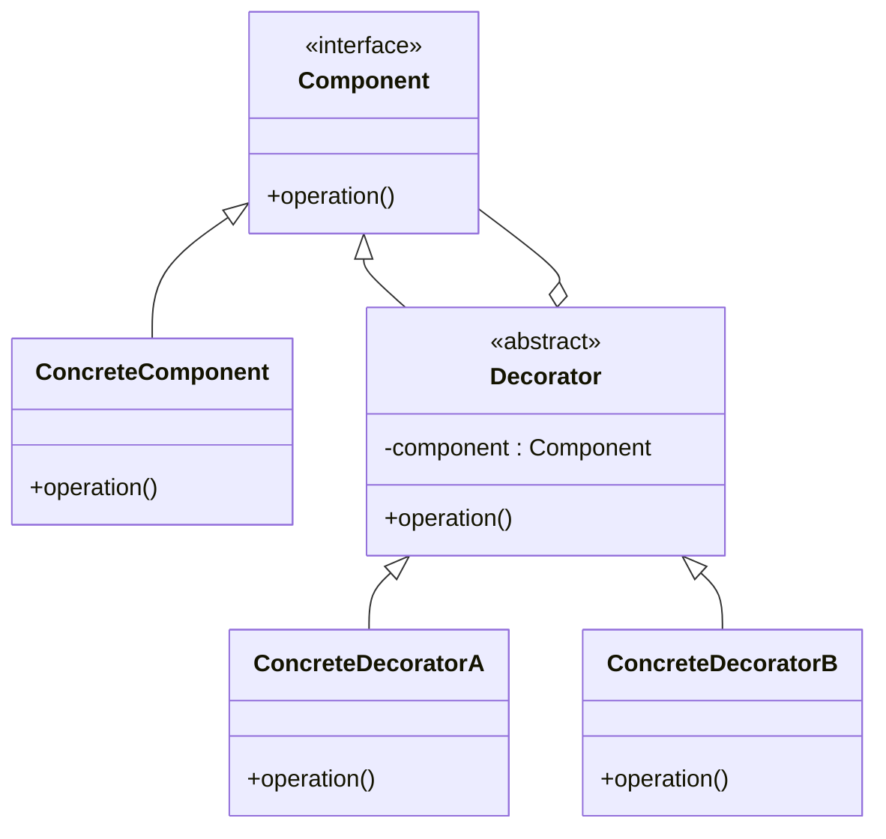

## 5.4 Decorator Pattern

### Introduction

The Decorator Pattern is a structural design pattern that allows behavior to be added to individual objects, either statically or dynamically, without affecting the behavior of other objects from the same class. It provides a flexible alternative to subclassing for extending functionality. This pattern is particularly useful when you need to add responsibilities to objects without modifying their code, adhering to the Open/Closed Principle, which states that software entities should be open for extension but closed for modification.

### Problem Statement

In software development, there are often scenarios where you need to add new functionality to existing objects. The traditional approach might involve subclassing, which can lead to a proliferation of subclasses and make the system more rigid and difficult to maintain. The Decorator Pattern addresses this problem by allowing you to attach additional responsibilities to an object dynamically. This means you can enhance an object's behavior without altering its structure, making your code more flexible and easier to maintain.

### Key Components of the Decorator Pattern

Let's break down the key components of the Decorator Pattern:

- **Component**: This is an interface or abstract class that defines the original object. It declares the methods that will be implemented by both the ConcreteComponent and the Decorators.

- **ConcreteComponent**: This class represents the original object to which new functionality can be added. It implements the Component interface.

- **Decorator**: This is an abstract class or interface that wraps a Component object. It maintains a reference to a Component object and defines an interface that conforms to the Component's interface.

- **ConcreteDecorator**: These are classes that extend the Decorator and add new behaviors. They override the methods of the Decorator to provide additional functionality.

### Visualizing the Decorator Pattern

To better understand how the Decorator Pattern works, let's visualize it using a class diagram.



**Diagram Description**: The diagram illustrates the relationship between the Component, ConcreteComponent, Decorator, and ConcreteDecorators. The Decorator holds a reference to a Component and delegates the operation to it, while ConcreteDecorators extend the Decorator to add new behaviors.

### Implementing the Decorator Pattern in TypeScript

Let's implement the Decorator Pattern in TypeScript with a practical example. Suppose we have a simple `Coffee` class, and we want to add different types of condiments to it dynamically.

#### Step 1: Define the Component Interface

First, we define the `Coffee` interface, which will be implemented by our ConcreteComponent.

```typescript
// Component
interface Coffee {
    cost(): number;
    description(): string;
}
```

#### Step 2: Create the ConcreteComponent

Next, we create the `SimpleCoffee` class, which implements the `Coffee` interface.

```typescript
// ConcreteComponent
class SimpleCoffee implements Coffee {
    cost(): number {
        return 5;
    }

    description(): string {
        return "Simple Coffee";
    }
}
```

#### Step 3: Create the Decorator Abstract Class

We then create an abstract `CoffeeDecorator` class that implements the `Coffee` interface and holds a reference to a `Coffee` object.

```typescript
// Decorator
abstract class CoffeeDecorator implements Coffee {
    protected coffee: Coffee;

    constructor(coffee: Coffee) {
        this.coffee = coffee;
    }

    cost(): number {
        return this.coffee.cost();
    }

    description(): string {
        return this.coffee.description();
    }
}
```

#### Step 4: Implement ConcreteDecorators

Now, we implement different ConcreteDecorators to add new functionalities. For example, we can create a `MilkDecorator` and a `SugarDecorator`.

```typescript
// ConcreteDecoratorA
class MilkDecorator extends CoffeeDecorator {
    cost(): number {
        return this.coffee.cost() + 1;
    }

    description(): string {
        return this.coffee.description() + ", Milk";
    }
}

// ConcreteDecoratorB
class SugarDecorator extends CoffeeDecorator {
    cost(): number {
        return this.coffee.cost() + 0.5;
    }

    description(): string {
        return this.coffee.description() + ", Sugar";
    }
}
```

#### Step 5: Use the Decorators

Finally, let's use our decorators to add functionality to a `SimpleCoffee` object.

```typescript
// Client code
let myCoffee: Coffee = new SimpleCoffee();
console.log(myCoffee.description() + " $" + myCoffee.cost());

myCoffee = new MilkDecorator(myCoffee);
console.log(myCoffee.description() + " $" + myCoffee.cost());

myCoffee = new SugarDecorator(myCoffee);
console.log(myCoffee.description() + " $" + myCoffee.cost());
```

**Output**:
```
Simple Coffee $5
Simple Coffee, Milk $6
Simple Coffee, Milk, Sugar $6.5
```

### Promoting the Open/Closed Principle

The Decorator Pattern is a perfect example of the Open/Closed Principle in action. By using decorators, we can extend the functionality of objects without modifying their code. This makes our system more flexible and easier to maintain, as we can add new features by simply creating new decorator classes.

### Advantages of the Decorator Pattern

- **Flexibility**: Decorators provide a flexible alternative to subclassing for extending functionality.
- **Reusability**: You can mix and match decorators to create different combinations of behavior.
- **Open/Closed Principle**: The pattern supports the Open/Closed Principle by allowing behavior to be added without modifying existing code.

### Disadvantages of the Decorator Pattern

- **Complexity**: The pattern can introduce complexity, as it requires creating multiple small classes.
- **Debugging**: It can be difficult to debug, as the flow of control can become convoluted with multiple layers of decorators.

### Try It Yourself

Experiment with the Decorator Pattern by adding more decorators to the `Coffee` example. Consider creating a `WhippedCreamDecorator` or a `VanillaDecorator`. Observe how easily you can extend the functionality without modifying existing classes.

### Further Reading

For more information on the Decorator Pattern, visit the following resources:

- [MDN Web Docs on Decorators](https://developer.mozilla.org/en-US/docs/Web/JavaScript/Reference/Classes#Decorators)
- [Refactoring Guru: Decorator Pattern](https://refactoring.guru/design-patterns/decorator)

### Knowledge Check

- What problem does the Decorator Pattern solve?
- How does the Decorator Pattern adhere to the Open/Closed Principle?
- What are the key components of the Decorator Pattern?
- What are the advantages and disadvantages of using the Decorator Pattern?

### Embrace the Journey

Remember, the Decorator Pattern is just one of many design patterns that can help you write more maintainable and scalable code. As you continue to explore design patterns, you'll discover new ways to enhance your software architecture. Keep experimenting, stay curious, and enjoy the journey!

## Quiz Time!



### What is the primary purpose of the Decorator Pattern?

- [x] To add responsibilities to objects dynamically without altering their structure.
- [ ] To provide a single instance of a class globally.
- [ ] To create families of related objects without specifying their concrete classes.
- [ ] To define a skeleton of an algorithm in a method, deferring some steps to subclasses.

> **Explanation:** The Decorator Pattern is used to add responsibilities to objects dynamically, providing a flexible alternative to subclassing.

### Which component in the Decorator Pattern defines the original object?

- [x] Component
- [ ] ConcreteComponent
- [ ] Decorator
- [ ] ConcreteDecorator

> **Explanation:** The Component is the interface or abstract class that defines the original object in the Decorator Pattern.

### In the Decorator Pattern, what is the role of the ConcreteDecorator?

- [x] To extend the Decorator and add new behaviors.
- [ ] To define the original object.
- [ ] To create a single instance of a class.
- [ ] To encapsulate a request as an object.

> **Explanation:** The ConcreteDecorator extends the Decorator and adds new behaviors to the object.

### How does the Decorator Pattern adhere to the Open/Closed Principle?

- [x] By allowing behavior to be added without modifying existing code.
- [ ] By ensuring a class has only one instance.
- [ ] By providing a way to access elements of a collection sequentially.
- [ ] By defining a family of algorithms.

> **Explanation:** The Decorator Pattern adheres to the Open/Closed Principle by allowing behavior to be added without modifying existing code.

### What is a disadvantage of using the Decorator Pattern?

- [x] It can introduce complexity with multiple small classes.
- [ ] It does not support dynamic behavior.
- [ ] It requires modifying existing code.
- [ ] It does not adhere to the Open/Closed Principle.

> **Explanation:** The Decorator Pattern can introduce complexity, as it requires creating multiple small classes to achieve the desired behavior.

### Which of the following is a key advantage of the Decorator Pattern?

- [x] Flexibility in extending object functionality.
- [ ] Simplicity in implementation.
- [ ] Ensuring a single instance of a class.
- [ ] Providing a way to access elements of a collection sequentially.

> **Explanation:** The Decorator Pattern provides flexibility in extending object functionality without modifying existing code.

### What is the role of the Decorator in the Decorator Pattern?

- [x] To wrap a Component object and define an interface that conforms to the Component's interface.
- [ ] To create a single instance of a class.
- [ ] To define a family of algorithms.
- [ ] To encapsulate a request as an object.

> **Explanation:** The Decorator wraps a Component object and defines an interface that conforms to the Component's interface, allowing for additional behavior to be added.

### In the Coffee example, what does the MilkDecorator do?

- [x] It adds milk to the coffee and increases the cost.
- [ ] It creates a new instance of coffee.
- [ ] It removes sugar from the coffee.
- [ ] It defines the original coffee object.

> **Explanation:** The MilkDecorator adds milk to the coffee and increases the cost, demonstrating how decorators can add functionality.

### True or False: The Decorator Pattern can be used to add multiple behaviors to an object by stacking decorators.

- [x] True
- [ ] False

> **Explanation:** True. The Decorator Pattern allows multiple behaviors to be added to an object by stacking decorators, each adding its own functionality.

### What is a practical use case for the Decorator Pattern?

- [x] Adding features like milk or sugar to a coffee object dynamically.
- [ ] Ensuring a single instance of a database connection.
- [ ] Iterating over a collection of items.
- [ ] Defining a family of related UI components.

> **Explanation:** A practical use case for the Decorator Pattern is adding features like milk or sugar to a coffee object dynamically, allowing for flexible customization.


