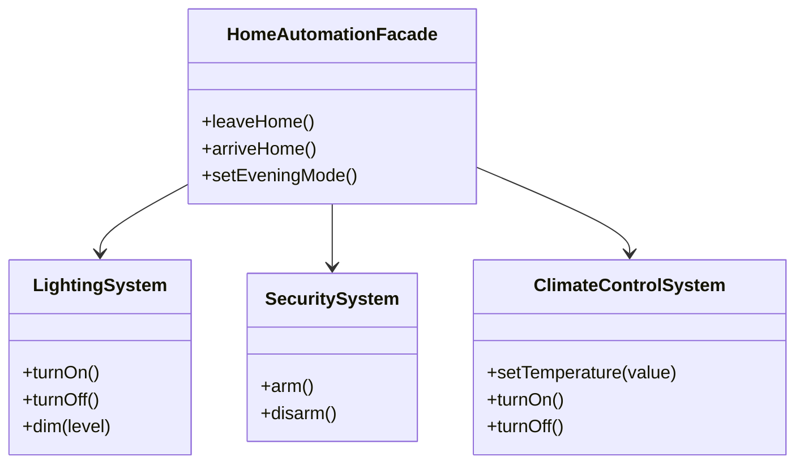

## 5.5.1 Implementing Facade in TypeScript

In the world of software engineering, complexity is inevitable. As systems grow, they often become intricate collections of interconnected classes and functions. The Facade Pattern is a structural design pattern that provides a simplified interface to a complex subsystem, making it easier for clients to interact with the system. In this section, we will explore how to implement the Facade Pattern in TypeScript, leveraging its features to encapsulate complexity and improve code maintainability.

### Understanding the Facade Pattern

The Facade Pattern acts as a front-facing interface that masks the more complex underlying or structural code. It allows clients to interact with the system without needing to understand its intricacies. This pattern is particularly useful when dealing with complex libraries or APIs, where the goal is to provide a simpler interface for common tasks.

#### Key Concepts

- **Facade**: A single class that provides a simplified interface to a complex subsystem.
- **Subsystem**: A collection of classes or functions that perform the actual work. These are often complex and interdependent.
- **Client**: The code or application that interacts with the Facade rather than directly with the subsystem.

### Benefits of the Facade Pattern

- **Simplification**: Reduces the complexity of interacting with a subsystem.
- **Decoupling**: Clients are decoupled from the subsystem, allowing for easier changes and maintenance.
- **Improved Readability**: Code becomes more readable and maintainable.
- **Encapsulation**: Hides the complexities of the subsystem from the client.

### Implementing the Facade Pattern in TypeScript

Let's dive into a practical example to understand how the Facade Pattern can be implemented in TypeScript. We'll create a simple home automation system with various subsystems such as lighting, security, and climate control. The Facade will provide a unified interface to control these subsystems.

#### Step 1: Identify the Complex Subsystem

First, we need to define the subsystems that our Facade will encapsulate. In this example, we'll have three subsystems: `LightingSystem`, `SecuritySystem`, and `ClimateControlSystem`.

```typescript
// LightingSystem.ts
export class LightingSystem {
  turnOn() {
    console.log("Lights are on.");
  }

  turnOff() {
    console.log("Lights are off.");
  }

  dim(level: number) {
    console.log(`Lights dimmed to ${level}%.`);
  }
}

// SecuritySystem.ts
export class SecuritySystem {
  arm() {
    console.log("Security system armed.");
  }

  disarm() {
    console.log("Security system disarmed.");
  }
}

// ClimateControlSystem.ts
export class ClimateControlSystem {
  setTemperature(value: number) {
    console.log(`Temperature set to ${value} degrees.`);
  }

  turnOn() {
    console.log("Climate control is on.");
  }

  turnOff() {
    console.log("Climate control is off.");
  }
}
```

#### Step 2: Create the Facade Class

Next, we'll create the `HomeAutomationFacade` class that will provide a simplified interface to these subsystems.

```typescript
// HomeAutomationFacade.ts
import { LightingSystem } from './LightingSystem';
import { SecuritySystem } from './SecuritySystem';
import { ClimateControlSystem } from './ClimateControlSystem';

export class HomeAutomationFacade {
  private lighting: LightingSystem;
  private security: SecuritySystem;
  private climateControl: ClimateControlSystem;

  constructor() {
    this.lighting = new LightingSystem();
    this.security = new SecuritySystem();
    this.climateControl = new ClimateControlSystem();
  }

  public leaveHome() {
    console.log("Leaving home...");
    this.lighting.turnOff();
    this.security.arm();
    this.climateControl.turnOff();
  }

  public arriveHome() {
    console.log("Arriving home...");
    this.lighting.turnOn();
    this.security.disarm();
    this.climateControl.turnOn();
  }

  public setEveningMode() {
    console.log("Setting evening mode...");
    this.lighting.dim(50);
    this.climateControl.setTemperature(22);
  }
}
```

#### Step 3: Client Interaction with the Facade

Now, let's see how a client would interact with the `HomeAutomationFacade` instead of dealing with each subsystem directly.

```typescript
// Client.ts
import { HomeAutomationFacade } from './HomeAutomationFacade';

const homeFacade = new HomeAutomationFacade();

homeFacade.leaveHome(); // Simplified operation
homeFacade.arriveHome(); // Simplified operation
homeFacade.setEveningMode(); // Simplified operation
```

### How TypeScript Features Aid in Implementing the Facade Pattern

TypeScript provides several features that make implementing the Facade Pattern more effective:

- **Modules**: By using TypeScript modules, we can encapsulate each subsystem in its own file, promoting separation of concerns and modularity.
- **Access Modifiers**: TypeScript's access modifiers (`private`, `protected`, `public`) help in controlling the visibility of class members, ensuring that only the Facade exposes the necessary methods to the client.
- **Strong Typing**: The strong typing system in TypeScript ensures that interactions with the Facade and subsystems are type-safe, reducing runtime errors.

### Visualizing the Facade Pattern

To better understand the interaction between the Facade and the subsystems, let's visualize the structure using a class diagram.



### Try It Yourself

Experiment with the code by adding new subsystems or extending the existing ones. For instance, you could add a `MusicSystem` with methods like `playMusic()` and `stopMusic()`, and integrate it into the `HomeAutomationFacade`.

### Knowledge Check

- What are the main benefits of using the Facade Pattern?
- How does the Facade Pattern improve code maintainability?
- Why is it beneficial to use TypeScript's modules and access modifiers when implementing the Facade Pattern?

### Summary

The Facade Pattern is a powerful tool for managing complexity in software systems. By providing a simplified interface to a set of subsystems, it enhances code readability, maintainability, and decoupling. TypeScript's features, such as modules and access modifiers, further aid in implementing this pattern effectively.

## Quiz Time!



### What is the primary purpose of the Facade Pattern?

- [x] To provide a simplified interface to a complex subsystem
- [ ] To increase the complexity of a system
- [ ] To directly expose all subsystem functionalities
- [ ] To replace the subsystem entirely

> **Explanation:** The Facade Pattern is designed to provide a simplified interface to a complex subsystem, making it easier for clients to interact with the system.

### How does the Facade Pattern improve code maintainability?

- [x] By decoupling clients from the subsystem
- [ ] By increasing the number of classes
- [ ] By exposing all internal details of the subsystem
- [ ] By making the subsystem more complex

> **Explanation:** The Facade Pattern improves code maintainability by decoupling clients from the subsystem, allowing changes to be made to the subsystem without affecting the client.

### Which TypeScript feature helps in controlling the visibility of class members?

- [x] Access modifiers
- [ ] Interfaces
- [ ] Generics
- [ ] Type aliases

> **Explanation:** Access modifiers in TypeScript (`private`, `protected`, `public`) help control the visibility of class members, ensuring encapsulation.

### What is a benefit of using TypeScript modules when implementing the Facade Pattern?

- [x] They promote separation of concerns and modularity
- [ ] They make the code more complex
- [ ] They expose all internal details of the subsystem
- [ ] They are not useful in implementing the Facade Pattern

> **Explanation:** TypeScript modules promote separation of concerns and modularity, making it easier to manage and encapsulate subsystems.

### In the provided example, what does the `leaveHome` method in the `HomeAutomationFacade` class do?

- [x] Turns off lights, arms security, and turns off climate control
- [ ] Turns on lights, disarms security, and turns on climate control
- [ ] Only arms the security system
- [ ] Only turns off the climate control

> **Explanation:** The `leaveHome` method in the `HomeAutomationFacade` class turns off lights, arms security, and turns off climate control, providing a simplified operation for leaving home.

### Why is strong typing beneficial in implementing the Facade Pattern in TypeScript?

- [x] It ensures type-safe interactions with the Facade and subsystems
- [ ] It makes the code harder to read
- [ ] It increases runtime errors
- [ ] It is not beneficial at all

> **Explanation:** Strong typing in TypeScript ensures type-safe interactions with the Facade and subsystems, reducing runtime errors and improving code reliability.

### What is the role of the `HomeAutomationFacade` class in the example?

- [x] To provide a simplified interface to control the home automation subsystems
- [ ] To directly expose all functionalities of the subsystems
- [ ] To replace the subsystems entirely
- [ ] To make the subsystems more complex

> **Explanation:** The `HomeAutomationFacade` class provides a simplified interface to control the home automation subsystems, making it easier for clients to interact with them.

### How can you extend the example to include a new subsystem?

- [x] By adding a new subsystem class and integrating it into the Facade
- [ ] By modifying the existing subsystems only
- [ ] By removing existing subsystems
- [ ] By not changing anything

> **Explanation:** You can extend the example by adding a new subsystem class and integrating it into the Facade, allowing the Facade to manage the new subsystem as well.

### Which of the following is NOT a benefit of the Facade Pattern?

- [ ] Simplification of client interaction
- [ ] Decoupling of clients from subsystems
- [x] Increasing the complexity of the subsystem
- [ ] Improved code readability

> **Explanation:** Increasing the complexity of the subsystem is not a benefit of the Facade Pattern. The pattern aims to simplify and improve readability.

### True or False: The Facade Pattern can only be used in object-oriented programming languages.

- [ ] True
- [x] False

> **Explanation:** The Facade Pattern can be used in any programming paradigm, not just object-oriented languages. It is about providing a simplified interface, which can be applied in various contexts.



Remember, this is just the beginning. As you progress, you'll build more complex and interactive systems. Keep experimenting, stay curious, and enjoy the journey!
