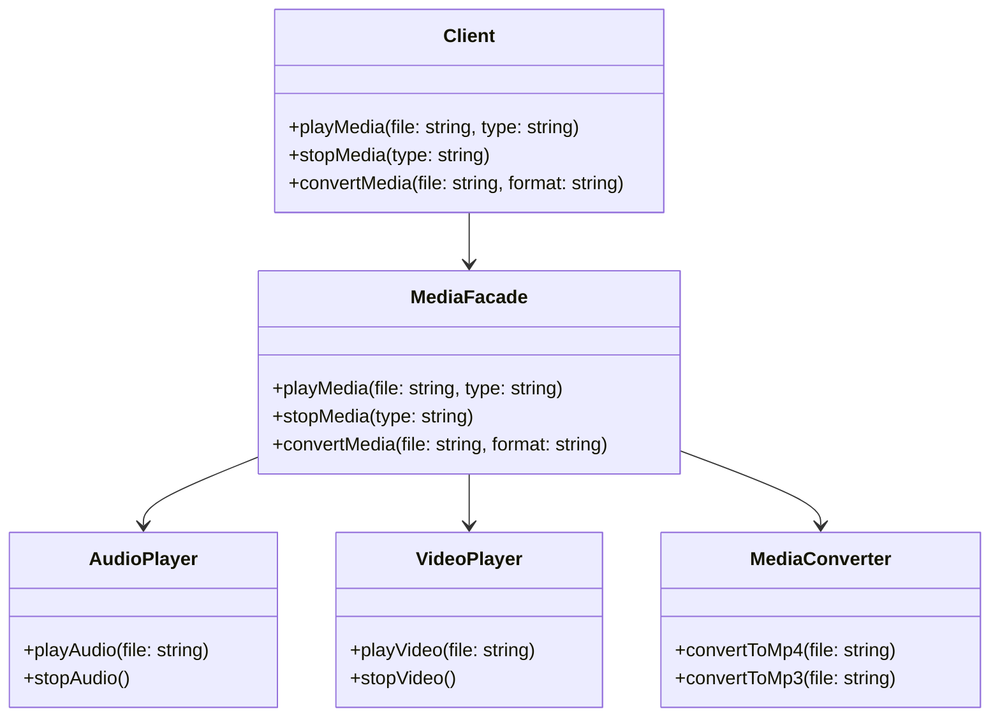

## 5.5.2 Simplifying Complex Subsystems

In the realm of software engineering, complexity is often an inevitable byproduct of building robust and feature-rich systems. As systems grow, so do the intricacies of their subsystems, which can become cumbersome for developers to interact with directly. The Facade Pattern emerges as a powerful structural design pattern to address this challenge by providing a simplified interface to these complex subsystems. This section delves into the benefits of using the Facade Pattern, illustrating how it reduces the learning curve, minimizes the impact of changes, and enhances code maintainability and readability.

### Understanding the Facade Pattern

The Facade Pattern is a structural design pattern that offers a unified interface to a set of interfaces in a subsystem. It defines a higher-level interface that makes the subsystem easier to use. By encapsulating the complexities of the subsystem, the Facade Pattern allows clients to interact with the system without needing to understand its intricate details.

#### Key Benefits of the Facade Pattern

1. **Reduced Learning Curve**: By abstracting the complexities of the subsystem, the Facade Pattern allows developers to interact with a simplified interface. This reduces the amount of knowledge required to use the subsystem effectively.

2. **Minimized Impact of Changes**: Changes within the subsystem can be isolated from the client code. The facade acts as a buffer, ensuring that modifications to the subsystem do not ripple through to the client, thus maintaining stability.

3. **Improved Maintainability and Readability**: By providing a clear and concise interface, the Facade Pattern enhances code readability and maintainability. It allows developers to focus on the high-level operations without getting bogged down by the underlying details.

### Implementing the Facade Pattern in TypeScript

Let's explore how the Facade Pattern can be implemented in TypeScript to simplify interactions with a complex subsystem. Consider a scenario where we have a multimedia subsystem responsible for handling audio and video operations.

#### Subsystem Without Facade

First, let's look at how the subsystem might be structured without a facade:

```typescript
class AudioPlayer {
  playAudio(file: string) {
    console.log(`Playing audio file: ${file}`);
  }

  stopAudio() {
    console.log("Stopping audio playback.");
  }
}

class VideoPlayer {
  playVideo(file: string) {
    console.log(`Playing video file: ${file}`);
  }

  stopVideo() {
    console.log("Stopping video playback.");
  }
}

class MediaConverter {
  convertToMp4(file: string) {
    console.log(`Converting ${file} to MP4 format.`);
  }

  convertToMp3(file: string) {
    console.log(`Converting ${file} to MP3 format.`);
  }
}
```

To play a video and convert it to a different format, the client would need to interact with multiple classes:

```typescript
const audioPlayer = new AudioPlayer();
const videoPlayer = new VideoPlayer();
const mediaConverter = new MediaConverter();

videoPlayer.playVideo("movie.avi");
mediaConverter.convertToMp4("movie.avi");
videoPlayer.stopVideo();
```

#### Simplifying with a Facade

By introducing a facade, we can encapsulate these operations into a single, cohesive interface:

```typescript
class MediaFacade {
  private audioPlayer: AudioPlayer;
  private videoPlayer: VideoPlayer;
  private mediaConverter: MediaConverter;

  constructor() {
    this.audioPlayer = new AudioPlayer();
    this.videoPlayer = new VideoPlayer();
    this.mediaConverter = new MediaConverter();
  }

  playMedia(file: string, type: "audio" | "video") {
    if (type === "audio") {
      this.audioPlayer.playAudio(file);
    } else if (type === "video") {
      this.videoPlayer.playVideo(file);
    }
  }

  stopMedia(type: "audio" | "video") {
    if (type === "audio") {
      this.audioPlayer.stopAudio();
    } else if (type === "video") {
      this.videoPlayer.stopVideo();
    }
  }

  convertMedia(file: string, format: "mp3" | "mp4") {
    if (format === "mp3") {
      this.mediaConverter.convertToMp3(file);
    } else if (format === "mp4") {
      this.mediaConverter.convertToMp4(file);
    }
  }
}

// Client code
const mediaFacade = new MediaFacade();
mediaFacade.playMedia("movie.avi", "video");
mediaFacade.convertMedia("movie.avi", "mp4");
mediaFacade.stopMedia("video");
```

With the facade in place, the client code becomes significantly simpler and more intuitive. The facade handles the complexity of interacting with multiple classes, allowing the client to focus on the high-level operations.

### Visualizing the Facade Pattern

To further illustrate how the Facade Pattern simplifies complex subsystems, let's visualize the interaction between the client, the facade, and the subsystem components.



**Diagram Description**: The diagram illustrates the interaction between the client and the subsystem through the MediaFacade. The facade acts as a single point of interaction, simplifying the client's operations.

### Real-World Applications of the Facade Pattern

The Facade Pattern is widely used in software development to manage complex subsystems. Here are some real-world scenarios where the facade can be particularly beneficial:

1. **Web Service Integration**: When integrating with multiple web services, a facade can provide a unified API, hiding the complexities of different service protocols and data formats.

2. **Database Operations**: In applications with complex database interactions, a facade can simplify CRUD operations, transactions, and query execution, providing a consistent interface to the client.

3. **UI Frameworks**: Facades are often used in UI frameworks to encapsulate complex rendering logic, event handling, and state management, offering a simplified API to developers.

### Try It Yourself

To deepen your understanding of the Facade Pattern, try modifying the code examples provided:

- **Add New Functionality**: Extend the MediaFacade to include additional operations, such as pausing and resuming media playback.
- **Refactor Subsystems**: Experiment with refactoring the subsystem classes to see how the facade isolates changes from the client code.
- **Create Your Own Facade**: Identify a complex subsystem in your current projects and design a facade to simplify its interactions.

### Knowledge Check

Before we wrap up, let's reinforce what we've learned with a few questions:

- How does the Facade Pattern reduce the learning curve for developers?
- What are the benefits of using a facade in terms of code maintainability?
- Can you think of a scenario where a facade might not be the best solution?

### Conclusion

The Facade Pattern is a powerful tool for managing complexity in software systems. By providing a unified interface to complex subsystems, it reduces the learning curve, minimizes the impact of changes, and enhances code maintainability and readability. As you continue your journey in software development, consider how the Facade Pattern can be applied to simplify interactions with complex systems, making your code more intuitive and maintainable.

## Quiz Time!



### How does the Facade Pattern help in simplifying complex subsystems?

- [x] By providing a unified interface to interact with the subsystem.
- [ ] By increasing the number of classes in the subsystem.
- [ ] By exposing all the internal details of the subsystem.
- [ ] By making the subsystem more complex.

> **Explanation:** The Facade Pattern simplifies complex subsystems by providing a unified interface that hides the complexities and details of the subsystem from the client.

### What is one of the key benefits of using the Facade Pattern?

- [x] It reduces the learning curve for developers.
- [ ] It increases the number of dependencies.
- [ ] It complicates the client code.
- [ ] It requires more detailed knowledge of the subsystem.

> **Explanation:** The Facade Pattern reduces the learning curve by providing a simpler interface, allowing developers to interact with the subsystem without needing to understand its complexities.

### In the provided code example, what role does the `MediaFacade` class play?

- [x] It acts as a single point of interaction with the multimedia subsystem.
- [ ] It directly manipulates the audio and video files.
- [ ] It replaces the functionality of the `AudioPlayer` and `VideoPlayer`.
- [ ] It exposes all methods of the subsystem to the client.

> **Explanation:** The `MediaFacade` class acts as a single point of interaction, simplifying the client's operations by encapsulating the complexities of the multimedia subsystem.

### Which of the following is a real-world application of the Facade Pattern?

- [x] Web service integration.
- [ ] Increasing the complexity of a UI framework.
- [ ] Direct database access without abstraction.
- [ ] Exposing all internal methods of a library.

> **Explanation:** The Facade Pattern is often used in web service integration to provide a unified API that hides the complexities of different service protocols and data formats.

### How does the Facade Pattern improve code maintainability?

- [x] By providing a clear and concise interface.
- [ ] By increasing the number of classes and interfaces.
- [ ] By exposing all subsystem details to the client.
- [ ] By making the code more complex.

> **Explanation:** The Facade Pattern improves code maintainability by offering a clear and concise interface, allowing developers to focus on high-level operations without dealing with underlying complexities.

### What is a potential drawback of using the Facade Pattern?

- [x] It might hide too much functionality, limiting flexibility.
- [ ] It always increases the complexity of the subsystem.
- [ ] It exposes all internal details of the subsystem.
- [ ] It requires clients to understand the entire subsystem.

> **Explanation:** While the Facade Pattern simplifies interactions, it might hide too much functionality, which can limit flexibility for clients who need more control over the subsystem.

### What is the primary purpose of the Facade Pattern?

- [x] To provide a simplified interface to a complex subsystem.
- [ ] To increase the complexity of the subsystem.
- [ ] To expose all internal details of the subsystem.
- [ ] To make the subsystem more difficult to use.

> **Explanation:** The primary purpose of the Facade Pattern is to provide a simplified interface to a complex subsystem, making it easier for clients to interact with.

### Which of the following is NOT a benefit of the Facade Pattern?

- [ ] Reducing the learning curve.
- [ ] Minimizing the impact of subsystem changes.
- [ ] Improving code maintainability.
- [x] Increasing the number of dependencies.

> **Explanation:** The Facade Pattern does not increase the number of dependencies; instead, it reduces the complexity of interactions by providing a unified interface.

### True or False: The Facade Pattern can be used to simplify interactions with complex UI frameworks.

- [x] True
- [ ] False

> **Explanation:** True. The Facade Pattern is often used in UI frameworks to encapsulate complex rendering logic, event handling, and state management, offering a simplified API to developers.

### True or False: The Facade Pattern requires clients to understand all the details of the subsystem.

- [ ] True
- [x] False

> **Explanation:** False. The Facade Pattern abstracts the complexities of the subsystem, allowing clients to interact with a simplified interface without needing to understand all the details.



Remember, the journey of mastering design patterns is ongoing. Keep exploring, experimenting, and applying these patterns to create more intuitive and maintainable software systems.
