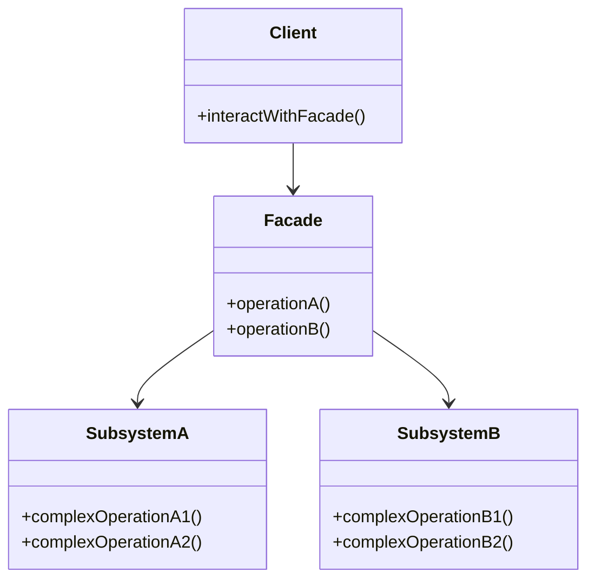

## 5.5.3 Use Cases and Examples

The Facade Pattern is a structural design pattern that provides a simplified interface to a complex subsystem. This pattern is particularly useful in scenarios where a system is composed of multiple interdependent classes or when dealing with complex libraries. By introducing a Facade, we can hide the complexities of the subsystem and offer a cleaner, more intuitive interface to the client. Let's explore some practical use cases and examples of the Facade Pattern in TypeScript.

### Simplifying Multimedia Library Usage

Imagine you are developing a multimedia application that needs to interact with a complex multimedia library. This library might offer a wide range of functionalities, such as playing, pausing, stopping, and seeking within media files. However, the library's API could be cumbersome, requiring multiple steps to perform even simple tasks.

#### Example: Multimedia Facade

Let's create a Facade for a hypothetical multimedia library. This Facade will provide a simple interface for playing, pausing, and stopping media files.

```typescript
// Complex multimedia library interfaces
class VideoDecoder {
    decode(file: string): void {
        console.log(`Decoding video file: ${file}`);
    }
}

class AudioDecoder {
    decode(file: string): void {
        console.log(`Decoding audio file: ${file}`);
    }
}

class MediaPlayer {
    play(): void {
        console.log("Playing media...");
    }

    pause(): void {
        console.log("Pausing media...");
    }

    stop(): void {
        console.log("Stopping media...");
    }
}

// Facade class
class MediaFacade {
    private videoDecoder: VideoDecoder;
    private audioDecoder: AudioDecoder;
    private mediaPlayer: MediaPlayer;

    constructor() {
        this.videoDecoder = new VideoDecoder();
        this.audioDecoder = new AudioDecoder();
        this.mediaPlayer = new MediaPlayer();
    }

    playMedia(file: string): void {
        this.videoDecoder.decode(file);
        this.audioDecoder.decode(file);
        this.mediaPlayer.play();
    }

    pauseMedia(): void {
        this.mediaPlayer.pause();
    }

    stopMedia(): void {
        this.mediaPlayer.stop();
    }
}

// Client code
const mediaFacade = new MediaFacade();
mediaFacade.playMedia("example.mp4");
mediaFacade.pauseMedia();
mediaFacade.stopMedia();
```

**Explanation:** In this example, the `MediaFacade` class simplifies the interaction with the multimedia library. The client no longer needs to understand the intricacies of decoding video and audio separately. Instead, they can use straightforward methods like `playMedia`, `pauseMedia`, and `stopMedia`.

### Simplifying Database Operations

When working with databases, developers often use Object-Relational Mapping (ORM) tools to abstract the database interactions. However, these ORMs can be complex and require a deep understanding of their APIs. A Facade can simplify database operations by providing a more intuitive interface.

#### Example: Database Facade

Consider a scenario where you have a complex ORM for managing user data. We can create a Facade to simplify common operations such as creating, reading, updating, and deleting users.

```typescript
// Complex ORM interfaces
class UserRepository {
    createUser(data: any): void {
        console.log(`Creating user: ${JSON.stringify(data)}`);
    }

    getUser(id: string): any {
        console.log(`Fetching user with ID: ${id}`);
        return { id, name: "John Doe" };
    }

    updateUser(id: string, data: any): void {
        console.log(`Updating user with ID: ${id} with data: ${JSON.stringify(data)}`);
    }

    deleteUser(id: string): void {
        console.log(`Deleting user with ID: ${id}`);
    }
}

// Facade class
class UserFacade {
    private userRepository: UserRepository;

    constructor() {
        this.userRepository = new UserRepository();
    }

    addUser(data: any): void {
        this.userRepository.createUser(data);
    }

    findUser(id: string): any {
        return this.userRepository.getUser(id);
    }

    modifyUser(id: string, data: any): void {
        this.userRepository.updateUser(id, data);
    }

    removeUser(id: string): void {
        this.userRepository.deleteUser(id);
    }
}

// Client code
const userFacade = new UserFacade();
userFacade.addUser({ name: "Alice" });
const user = userFacade.findUser("1");
console.log(user);
userFacade.modifyUser("1", { name: "Alice Smith" });
userFacade.removeUser("1");
```

**Explanation:** The `UserFacade` class provides a simplified interface for managing users. The client can perform CRUD operations without needing to understand the underlying ORM complexities.

### Interacting with Microservices

In a microservices architecture, an application might need to interact with multiple services. Each service can have its own API, making it challenging for clients to manage these interactions. A Facade can provide a unified interface for interacting with a set of microservices.

#### Example: Microservices Facade

Let's create a Facade that interacts with a set of microservices for managing orders, payments, and notifications.

```typescript
// Complex microservice interfaces
class OrderService {
    createOrder(order: any): void {
        console.log(`Order created: ${JSON.stringify(order)}`);
    }
}

class PaymentService {
    processPayment(payment: any): void {
        console.log(`Payment processed: ${JSON.stringify(payment)}`);
    }
}

class NotificationService {
    sendNotification(message: string): void {
        console.log(`Notification sent: ${message}`);
    }
}

// Facade class
class ECommerceFacade {
    private orderService: OrderService;
    private paymentService: PaymentService;
    private notificationService: NotificationService;

    constructor() {
        this.orderService = new OrderService();
        this.paymentService = new PaymentService();
        this.notificationService = new NotificationService();
    }

    placeOrder(order: any, payment: any): void {
        this.orderService.createOrder(order);
        this.paymentService.processPayment(payment);
        this.notificationService.sendNotification("Order placed successfully!");
    }
}

// Client code
const ecommerceFacade = new ECommerceFacade();
ecommerceFacade.placeOrder({ item: "Laptop", quantity: 1 }, { amount: 1000, method: "Credit Card" });
```

**Explanation:** The `ECommerceFacade` class simplifies the process of placing an order. The client can interact with multiple microservices through a single method, `placeOrder`, without needing to manage each service individually.

### Improving Client Experience and Promoting Loose Coupling

The Facade Pattern significantly improves the client experience by providing a simple and consistent interface. This pattern promotes loose coupling between the client and the subsystem, as the client interacts only with the Facade and not the complex classes behind it.

#### Benefits of the Facade Pattern

- **Simplified Interface:** The Facade provides a straightforward interface, making it easier for clients to use the subsystem.
- **Loose Coupling:** Clients are decoupled from the complex subsystem, reducing dependencies and improving maintainability.
- **Improved Readability:** Code becomes more readable and maintainable, as clients interact with a clear and concise API.
- **Encapsulation:** The Facade encapsulates the complexities of the subsystem, hiding unnecessary details from the client.

#### Considerations and Limitations

While the Facade Pattern offers numerous benefits, there are some considerations to keep in mind:

- **Limited Access to Advanced Features:** The Facade may not expose all the functionalities of the subsystem, potentially limiting access to advanced features.
- **Overhead:** Introducing a Facade can add an extra layer of abstraction, which might introduce some overhead.
- **Maintenance:** The Facade needs to be maintained alongside the subsystem, requiring updates if the subsystem changes.

### Try It Yourself

To deepen your understanding of the Facade Pattern, try modifying the examples above:

- **Extend the Multimedia Facade** to include additional functionalities like seeking or adjusting volume.
- **Enhance the Database Facade** to support batch operations or transactions.
- **Expand the Microservices Facade** to include additional services, such as inventory management or customer support.

### Visualizing the Facade Pattern

To better understand the Facade Pattern, let's visualize the interaction between the client, the Facade, and the subsystem using a class diagram.



**Description:** In this diagram, the `Client` interacts with the `Facade`, which in turn communicates with `SubsystemA` and `SubsystemB`. The Facade simplifies the client's interaction by providing a unified interface.

### References and Further Reading

- [MDN Web Docs: Design Patterns](https://developer.mozilla.org/en-US/docs/Web/JavaScript/Guide/Design_Patterns)
- [Refactoring Guru: Facade Pattern](https://refactoring.guru/design-patterns/facade)
- [TypeScript Handbook](https://www.typescriptlang.org/docs/)

### Knowledge Check

Before moving on, let's review some key points:

- The Facade Pattern provides a simplified interface to a complex subsystem.
- It promotes loose coupling by decoupling the client from the subsystem.
- While beneficial, the Facade may limit access to advanced features and introduce some overhead.

Remember, mastering design patterns is a journey. Keep experimenting, stay curious, and enjoy the process of building robust and maintainable software!

## Quiz Time!



### What is the primary purpose of the Facade Pattern?

- [x] To provide a simplified interface to a complex subsystem
- [ ] To increase the complexity of a system
- [ ] To directly expose all functionalities of a subsystem
- [ ] To replace the subsystem entirely

> **Explanation:** The Facade Pattern aims to provide a simplified interface to a complex subsystem, making it easier for clients to interact with it.

### Which of the following is a benefit of using the Facade Pattern?

- [x] Simplified interface for clients
- [ ] Increased coupling between client and subsystem
- [ ] Direct access to all subsystem features
- [ ] Reduced readability of client code

> **Explanation:** The Facade Pattern simplifies the interface for clients, promoting loose coupling and improving code readability.

### In the multimedia example, what role does the `MediaFacade` class play?

- [x] It acts as a simplified interface for playing, pausing, and stopping media
- [ ] It decodes video and audio files directly
- [ ] It replaces the `MediaPlayer` class
- [ ] It adds complexity to the multimedia library

> **Explanation:** The `MediaFacade` class provides a simplified interface for interacting with the multimedia library, handling the complexities internally.

### What is a potential limitation of the Facade Pattern?

- [x] Limited access to advanced features of the subsystem
- [ ] Increased complexity for the client
- [ ] Direct interaction with the subsystem
- [ ] Reduced encapsulation of the subsystem

> **Explanation:** The Facade Pattern may not expose all advanced features of the subsystem, potentially limiting functionality.

### How does the Facade Pattern promote loose coupling?

- [x] By decoupling the client from the subsystem
- [ ] By exposing all subsystem details to the client
- [ ] By increasing dependencies between classes
- [ ] By requiring the client to manage subsystem interactions

> **Explanation:** The Facade Pattern promotes loose coupling by providing a simplified interface, decoupling the client from the subsystem.

### Which of the following scenarios is suitable for applying the Facade Pattern?

- [x] Simplifying interactions with a complex library
- [ ] Directly accessing all features of a subsystem
- [ ] Increasing the complexity of client code
- [ ] Replacing the subsystem with a new implementation

> **Explanation:** The Facade Pattern is suitable for simplifying interactions with complex libraries or subsystems.

### In the database example, what does the `UserFacade` class achieve?

- [x] It simplifies CRUD operations for the client
- [ ] It directly manages database connections
- [ ] It replaces the `UserRepository` class
- [ ] It increases the complexity of database operations

> **Explanation:** The `UserFacade` class simplifies CRUD operations, providing a straightforward interface for the client.

### What is a key characteristic of the Facade Pattern?

- [x] It provides a unified interface to a set of interfaces in a subsystem
- [ ] It increases the complexity of the subsystem
- [ ] It requires the client to manage subsystem interactions
- [ ] It directly exposes all subsystem functionalities

> **Explanation:** The Facade Pattern provides a unified interface, simplifying interactions with a complex subsystem.

### True or False: The Facade Pattern can introduce some overhead due to an extra layer of abstraction.

- [x] True
- [ ] False

> **Explanation:** The Facade Pattern can introduce some overhead as it adds an extra layer of abstraction between the client and the subsystem.

### True or False: The Facade Pattern is used to replace the subsystem entirely.

- [ ] True
- [x] False

> **Explanation:** The Facade Pattern does not replace the subsystem; it provides a simplified interface for interacting with it.


