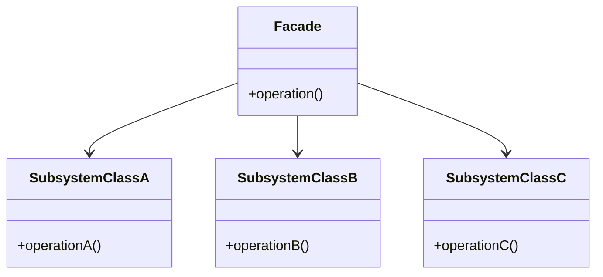
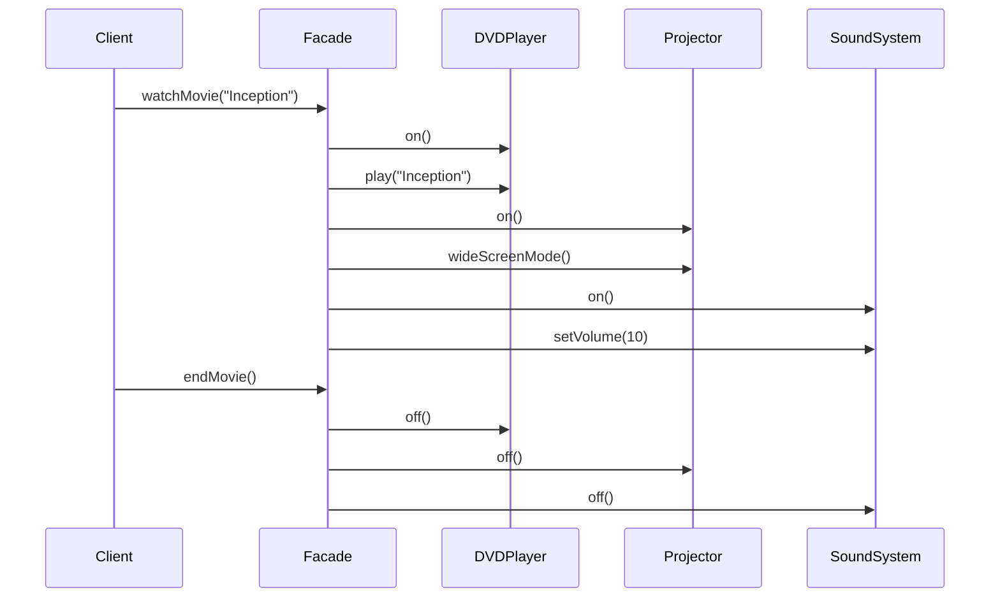

## 5.5 Facade Pattern

In the realm of software engineering, complexity is often an unavoidable reality. As systems grow, they tend to become more intricate, with numerous components interacting in various ways. The Facade Pattern emerges as a beacon of simplicity amidst this complexity, providing a streamlined interface to complex subsystems. This pattern is particularly valuable in TypeScript, where it can enhance code readability and maintainability while promoting loose coupling between components.

### Understanding the Facade Pattern

The Facade Pattern is a structural design pattern that offers a simplified interface to a complex subsystem. It acts as a "facade" or front-facing interface that masks the underlying complexity of the subsystem, making it easier for clients to interact with it. This pattern is akin to a concierge at a hotel who simplifies the guest's experience by handling various services on their behalf.

#### Intent of the Facade Pattern

The primary intent of the Facade Pattern is to provide a unified and straightforward interface to a set of interfaces in a subsystem. It aims to:

- Reduce the complexity of interacting with a subsystem.
- Minimize dependencies on the complex subsystem by decoupling it from the client.
- Enhance code readability and maintainability by hiding intricate details.

### The Problem Facade Pattern Solves

In large systems, clients often need to interact with multiple components or classes to perform a single task. This can lead to several challenges:

- **Complexity**: Clients must understand and manage the interactions between various subsystem classes, leading to complex and hard-to-maintain code.
- **Tight Coupling**: Direct interaction with subsystem classes results in tight coupling, making the system less flexible and harder to modify.
- **Redundancy**: Similar code may be repeated across different clients as they interact with the subsystem.

The Facade Pattern addresses these issues by introducing a single point of interaction for clients, thereby reducing complexity and promoting loose coupling.

### Key Components of the Facade Pattern

The Facade Pattern consists of two primary components:

1. **Facade**: This is the class that provides a simplified interface to the subsystem. It delegates client requests to appropriate subsystem classes and may perform additional operations to simplify the client's task.

2. **Subsystem Classes**: These are the classes that perform the actual work of the subsystem. They are complex and may have intricate interactions among themselves, but the facade hides these details from the client.

#### Diagram: Facade Pattern Structure

To better understand the interaction between the facade and subsystem classes, let's visualize the structure using a class diagram.



**Diagram Description**: The diagram illustrates the Facade Pattern structure, where the `Facade` class interacts with multiple `SubsystemClass` instances, providing a simplified interface for the client.

### Implementing the Facade Pattern in TypeScript

Let's delve into a practical example to see how the Facade Pattern can be implemented in TypeScript. Consider a scenario where we have a complex subsystem responsible for managing a home theater system, including components like a DVD player, projector, and sound system.

#### Step-by-Step Implementation

1. **Define Subsystem Classes**

   These classes represent the components of the home theater system.

   ```typescript
   class DVDPlayer {
       public on(): void {
           console.log("DVD Player is on.");
       }

       public play(movie: string): void {
           console.log(`Playing movie: ${movie}`);
       }

       public off(): void {
           console.log("DVD Player is off.");
       }
   }

   class Projector {
       public on(): void {
           console.log("Projector is on.");
       }

       public wideScreenMode(): void {
           console.log("Projector is set to widescreen mode.");
       }

       public off(): void {
           console.log("Projector is off.");
       }
   }

   class SoundSystem {
       public on(): void {
           console.log("Sound system is on.");
       }

       public setVolume(level: number): void {
           console.log(`Sound system volume set to ${level}.`);
       }

       public off(): void {
           console.log("Sound system is off.");
       }
   }
   ```

2. **Create the Facade Class**

   The `HomeTheaterFacade` class provides a simplified interface to the subsystem.

   ```typescript
   class HomeTheaterFacade {
       private dvdPlayer: DVDPlayer;
       private projector: Projector;
       private soundSystem: SoundSystem;

       constructor(dvdPlayer: DVDPlayer, projector: Projector, soundSystem: SoundSystem) {
           this.dvdPlayer = dvdPlayer;
           this.projector = projector;
           this.soundSystem = soundSystem;
       }

       public watchMovie(movie: string): void {
           console.log("Get ready to watch a movie...");
           this.dvdPlayer.on();
           this.dvdPlayer.play(movie);
           this.projector.on();
           this.projector.wideScreenMode();
           this.soundSystem.on();
           this.soundSystem.setVolume(10);
       }

       public endMovie(): void {
           console.log("Shutting down the home theater...");
           this.dvdPlayer.off();
           this.projector.off();
           this.soundSystem.off();
       }
   }
   ```

3. **Client Code**

   The client interacts with the `HomeTheaterFacade` to control the home theater system.

   ```typescript
   const dvdPlayer = new DVDPlayer();
   const projector = new Projector();
   const soundSystem = new SoundSystem();

   const homeTheater = new HomeTheaterFacade(dvdPlayer, projector, soundSystem);

   homeTheater.watchMovie("Inception");
   homeTheater.endMovie();
   ```

#### Explanation

In this example, the `HomeTheaterFacade` class simplifies the process of watching and ending a movie by coordinating the interactions between the `DVDPlayer`, `Projector`, and `SoundSystem` classes. The client code only needs to interact with the facade, reducing complexity and dependencies on the subsystem classes.

### Benefits of the Facade Pattern

The Facade Pattern offers several advantages:

- **Loose Coupling**: By providing a single point of interaction, the facade decouples the client from the subsystem, making the system more flexible and easier to modify.
- **Improved Readability**: The facade simplifies the client's code by hiding the complexity of the subsystem, making it more readable and maintainable.
- **Reduced Complexity**: Clients do not need to manage the intricate interactions between subsystem classes, reducing the overall complexity of the system.

### Visualizing the Facade Pattern in Action

To further illustrate the Facade Pattern, let's visualize the interaction between the client, facade, and subsystem classes using a sequence diagram.



**Diagram Description**: The sequence diagram shows the flow of interactions when the client uses the `HomeTheaterFacade` to watch and end a movie. The facade coordinates the actions of the subsystem classes, providing a simplified interface for the client.

### Promoting Loose Coupling and Code Readability

The Facade Pattern is instrumental in promoting loose coupling and improving code readability. By encapsulating the complexity of the subsystem, the facade allows clients to interact with the system without being burdened by its intricacies. This separation of concerns leads to more maintainable and adaptable code.

### Try It Yourself

To deepen your understanding of the Facade Pattern, try modifying the example code:

- **Add a New Subsystem Component**: Introduce a new component, such as a lighting system, and update the facade to control it.
- **Enhance the Facade**: Add new methods to the `HomeTheaterFacade` for additional functionality, such as pausing or resuming a movie.
- **Refactor the Subsystem Classes**: Experiment with refactoring the subsystem classes to see how the facade shields the client from changes.

### References and Further Reading

For more information on the Facade Pattern and its applications, consider exploring the following resources:

- [Facade Pattern on Wikipedia](https://en.wikipedia.org/wiki/Facade_pattern)
- [MDN Web Docs on Design Patterns](https://developer.mozilla.org/en-US/docs/Glossary/Design_Pattern)
- [Refactoring Guru: Facade Pattern](https://refactoring.guru/design-patterns/facade)

### Knowledge Check

Before moving on, let's reinforce what we've learned about the Facade Pattern:

- How does the Facade Pattern reduce complexity in a system?
- What are the key components of the Facade Pattern?
- How does the Facade Pattern promote loose coupling?

### Embrace the Journey

Remember, mastering design patterns is a journey. The Facade Pattern is just one tool in your toolkit for managing complexity and enhancing code quality. As you continue to explore and apply design patterns, you'll develop a deeper understanding of how to build robust and maintainable systems. Keep experimenting, stay curious, and enjoy the journey!

## Quiz Time!



### What is the primary intent of the Facade Pattern?

- [x] To provide a simplified interface to a complex subsystem
- [ ] To increase the complexity of a system
- [ ] To tightly couple the client with the subsystem
- [ ] To replace all subsystem classes with a single class

> **Explanation:** The Facade Pattern aims to provide a unified and straightforward interface to a set of interfaces in a subsystem, reducing complexity and dependencies.

### Which component in the Facade Pattern provides a simplified interface to the subsystem?

- [x] Facade
- [ ] Subsystem Classes
- [ ] Client
- [ ] Adapter

> **Explanation:** The Facade class is responsible for providing a simplified interface to the subsystem, coordinating interactions with subsystem classes.

### How does the Facade Pattern promote loose coupling?

- [x] By decoupling the client from the subsystem
- [ ] By increasing the number of dependencies
- [ ] By making the client interact directly with subsystem classes
- [ ] By eliminating all subsystem classes

> **Explanation:** The Facade Pattern promotes loose coupling by providing a single point of interaction for clients, reducing their dependency on the subsystem.

### What is a potential benefit of using the Facade Pattern?

- [x] Improved code readability
- [ ] Increased system complexity
- [ ] Tighter coupling between components
- [ ] Reduced functionality

> **Explanation:** The Facade Pattern improves code readability by hiding the complexity of the subsystem from the client.

### In the provided example, which subsystem class is responsible for playing a movie?

- [x] DVDPlayer
- [ ] Projector
- [ ] SoundSystem
- [ ] HomeTheaterFacade

> **Explanation:** The `DVDPlayer` class is responsible for playing a movie in the example.

### What role does the `HomeTheaterFacade` play in the example?

- [x] It simplifies the process of watching and ending a movie
- [ ] It directly interacts with the client
- [ ] It replaces all subsystem classes
- [ ] It increases the complexity of the home theater system

> **Explanation:** The `HomeTheaterFacade` simplifies the client's interaction with the home theater system by coordinating the actions of subsystem classes.

### Which of the following is NOT a subsystem class in the example?

- [x] HomeTheaterFacade
- [ ] DVDPlayer
- [ ] Projector
- [ ] SoundSystem

> **Explanation:** The `HomeTheaterFacade` is the facade class, not a subsystem class.

### How can you extend the functionality of the `HomeTheaterFacade`?

- [x] By adding new methods for additional functionality
- [ ] By removing existing subsystem classes
- [ ] By tightly coupling the client with the subsystem
- [ ] By eliminating the facade class

> **Explanation:** You can extend the functionality of the `HomeTheaterFacade` by adding new methods to provide additional functionality.

### What is the benefit of using diagrams to illustrate the Facade Pattern?

- [x] They help visualize the interaction between the facade and subsystem classes
- [ ] They increase the complexity of understanding the pattern
- [ ] They replace the need for code examples
- [ ] They make the pattern harder to understand

> **Explanation:** Diagrams help visualize the interaction between the facade and subsystem classes, aiding in understanding the pattern.

### True or False: The Facade Pattern eliminates the need for subsystem classes.

- [ ] True
- [x] False

> **Explanation:** The Facade Pattern does not eliminate subsystem classes; it provides a simplified interface to interact with them.


