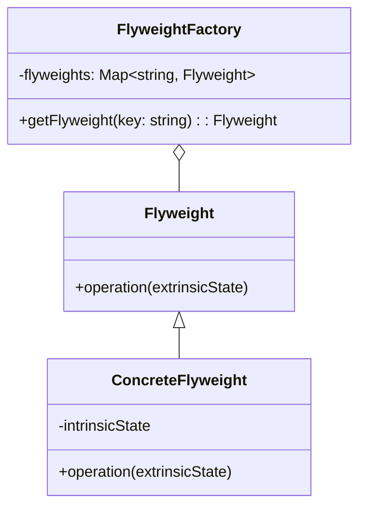

## 5.6.3 Use Cases and Examples

The Flyweight Pattern is a structural design pattern that focuses on minimizing memory usage by sharing as much data as possible with similar objects. This pattern is particularly useful when dealing with a large number of objects that share common data. By using the Flyweight Pattern, you can significantly reduce the memory footprint of your applications and improve performance.

### Understanding the Flyweight Pattern

Before diving into specific use cases, let's briefly recap the Flyweight Pattern's core concept. The pattern involves creating a Flyweight object that stores shared data, known as intrinsic state, and allowing multiple instances to reference this shared data. The extrinsic state, which varies between objects, is stored outside the Flyweight and passed to it when needed.

### Use Case 1: Text Rendering

One of the classic examples of the Flyweight Pattern is text rendering. When rendering large amounts of text, each character can be represented as a glyph, which is a graphical representation of a character. Instead of creating a unique object for each character, the Flyweight Pattern allows us to share glyph objects among multiple characters.

#### Implementing Text Rendering with Flyweight Pattern

Let's consider a scenario where we need to render a paragraph of text. Each character in the text can be represented by a glyph object, which contains the character's graphical representation. The Flyweight Pattern allows us to reuse glyph objects for repeated characters, reducing memory usage.

```typescript
// Flyweight interface
interface Glyph {
  render(position: Position): void;
}

// Concrete Flyweight
class CharacterGlyph implements Glyph {
  private character: string;

  constructor(character: string) {
    this.character = character;
  }

  render(position: Position): void {
    console.log(`Rendering character '${this.character}' at position (${position.x}, ${position.y})`);
  }
}

// Flyweight Factory
class GlyphFactory {
  private glyphs: Map<string, Glyph> = new Map();

  getGlyph(character: string): Glyph {
    if (!this.glyphs.has(character)) {
      this.glyphs.set(character, new CharacterGlyph(character));
    }
    return this.glyphs.get(character)!;
  }
}

// Position class representing extrinsic state
class Position {
  constructor(public x: number, public y: number) {}
}

// Client code
const text = "Hello, Flyweight Pattern!";
const factory = new GlyphFactory();
let position = new Position(0, 0);

for (const char of text) {
  const glyph = factory.getGlyph(char);
  glyph.render(position);
  position.x += 10; // Move to the next character position
}
```

In this example, the `GlyphFactory` ensures that each unique character is only created once. The `CharacterGlyph` class represents the intrinsic state, while the `Position` class represents the extrinsic state.

### Use Case 2: Game Object Management

In game development, managing a large number of objects with similar characteristics is a common challenge. For instance, in a particle system, thousands of particles may share the same texture or behavior. The Flyweight Pattern can be used to manage these objects efficiently.

#### Implementing Game Object Management with Flyweight Pattern

Consider a scenario where we have a game with numerous particles. Each particle has a position, velocity, and texture. By using the Flyweight Pattern, we can share the texture among all particles, reducing memory usage.

```typescript
// Flyweight interface
interface Particle {
  render(position: Position): void;
}

// Concrete Flyweight
class ParticleTexture implements Particle {
  private texture: string;

  constructor(texture: string) {
    this.texture = texture;
  }

  render(position: Position): void {
    console.log(`Rendering particle with texture '${this.texture}' at position (${position.x}, ${position.y})`);
  }
}

// Flyweight Factory
class ParticleFactory {
  private textures: Map<string, Particle> = new Map();

  getParticle(texture: string): Particle {
    if (!this.textures.has(texture)) {
      this.textures.set(texture, new ParticleTexture(texture));
    }
    return this.textures.get(texture)!;
  }
}

// Client code
const factory = new ParticleFactory();
const particles = [
  { position: new Position(10, 20), texture: "fire" },
  { position: new Position(30, 40), texture: "fire" },
  { position: new Position(50, 60), texture: "smoke" },
];

for (const particle of particles) {
  const particleTexture = factory.getParticle(particle.texture);
  particleTexture.render(particle.position);
}
```

In this example, the `ParticleFactory` manages the creation of `ParticleTexture` objects, ensuring that each texture is only created once. This approach significantly reduces memory usage when dealing with a large number of particles.

### Use Case 3: Caching Mechanisms

Caching is another area where the Flyweight Pattern can be effectively applied. When dealing with expensive-to-create objects that are frequently reused, caching can improve performance by reusing existing instances instead of creating new ones.

#### Implementing Caching Mechanisms with Flyweight Pattern

Let's consider a scenario where we have a system that generates reports. Each report has a template, and generating these templates is resource-intensive. By using the Flyweight Pattern, we can cache and reuse report templates.

```typescript
// Flyweight interface
interface ReportTemplate {
  generate(data: any): void;
}

// Concrete Flyweight
class Template implements ReportTemplate {
  private templateName: string;

  constructor(templateName: string) {
    this.templateName = templateName;
  }

  generate(data: any): void {
    console.log(`Generating report using template '${this.templateName}' with data:`, data);
  }
}

// Flyweight Factory
class TemplateFactory {
  private templates: Map<string, ReportTemplate> = new Map();

  getTemplate(templateName: string): ReportTemplate {
    if (!this.templates.has(templateName)) {
      this.templates.set(templateName, new Template(templateName));
    }
    return this.templates.get(templateName)!;
  }
}

// Client code
const factory = new TemplateFactory();
const reportData = [
  { template: "financial", data: { revenue: 1000, expenses: 500 } },
  { template: "financial", data: { revenue: 2000, expenses: 800 } },
  { template: "sales", data: { unitsSold: 150, region: "North" } },
];

for (const report of reportData) {
  const template = factory.getTemplate(report.template);
  template.generate(report.data);
}
```

In this example, the `TemplateFactory` manages the creation and caching of `Template` objects. This approach reduces the overhead of generating new templates for each report.

### Potential Drawbacks and Complexities

While the Flyweight Pattern offers significant memory savings and performance improvements, it also introduces some complexities:

- **Complexity in Managing Extrinsic State**: The pattern requires careful management of extrinsic state, which can increase the complexity of the code.
- **Increased Code Complexity**: The introduction of a Flyweight Factory and the separation of intrinsic and extrinsic states can make the codebase more complex and harder to understand.
- **Potential for Overhead**: In some cases, the overhead of managing shared objects and extrinsic state can outweigh the benefits, especially if the objects are not frequently reused.

### When to Consider the Flyweight Pattern

The Flyweight Pattern is most beneficial when:

- You have a large number of similar objects that can share data.
- Memory usage is a concern, and you need to optimize resource usage.
- The intrinsic state of objects is relatively stable and can be shared.

### Visualizing the Flyweight Pattern

To better understand the Flyweight Pattern, let's visualize how it works with a diagram:



In this diagram, the `Flyweight` class represents the shared interface, while `ConcreteFlyweight` contains the intrinsic state. The `FlyweightFactory` manages the creation and sharing of `Flyweight` objects.

### Try It Yourself

To deepen your understanding of the Flyweight Pattern, try modifying the code examples:

1. **Experiment with Different Intrinsic States**: Add more glyphs or textures and observe how the Flyweight Pattern handles them.
2. **Implement Additional Use Cases**: Consider other scenarios where the Flyweight Pattern might be applicable, such as managing UI components or network connections.
3. **Optimize the Flyweight Factory**: Explore ways to improve the efficiency of the Flyweight Factory, such as using more advanced caching strategies.

### References and Further Reading

- [MDN Web Docs: Design Patterns](https://developer.mozilla.org/en-US/docs/Web/JavaScript/Guide/Design_Patterns)
- [Refactoring Guru: Flyweight Pattern](https://refactoring.guru/design-patterns/flyweight)
- [Design Patterns: Elements of Reusable Object-Oriented Software](https://en.wikipedia.org/wiki/Design_Patterns) by Erich Gamma et al.

### Key Takeaways

- The Flyweight Pattern is a powerful tool for optimizing memory usage by sharing data among similar objects.
- It is particularly useful in scenarios like text rendering, game object management, and caching mechanisms.
- While it offers significant benefits, it also introduces complexities that need to be carefully managed.
- Consider the Flyweight Pattern when dealing with large numbers of similar objects that can share data.

Remember, this is just the beginning. As you progress, you'll discover more opportunities to apply the Flyweight Pattern in your projects. Keep experimenting, stay curious, and enjoy the journey!

## Quiz Time!



### What is the primary benefit of using the Flyweight Pattern?

- [x] Reducing memory usage by sharing data among similar objects
- [ ] Simplifying code structure
- [ ] Enhancing object encapsulation
- [ ] Improving network performance

> **Explanation:** The Flyweight Pattern reduces memory usage by sharing data among similar objects, making it ideal for scenarios with many similar instances.

### In the Flyweight Pattern, what is the intrinsic state?

- [x] The shared data among objects
- [ ] The data unique to each object
- [ ] The external state passed to the Flyweight
- [ ] The state that changes frequently

> **Explanation:** The intrinsic state is the shared data among objects, which is stored within the Flyweight.

### Which of the following is a common use case for the Flyweight Pattern?

- [x] Text rendering with shared glyphs
- [ ] Implementing a singleton class
- [ ] Building a REST API
- [ ] Creating a new database schema

> **Explanation:** Text rendering with shared glyphs is a classic use case for the Flyweight Pattern, as it involves sharing graphical representations.

### What role does the Flyweight Factory play in the pattern?

- [x] It manages the creation and sharing of Flyweight objects
- [ ] It stores the extrinsic state of objects
- [ ] It handles network communication
- [ ] It provides a user interface for the application

> **Explanation:** The Flyweight Factory manages the creation and sharing of Flyweight objects, ensuring that shared data is reused.

### What is a potential drawback of using the Flyweight Pattern?

- [x] Increased code complexity
- [ ] Reduced memory usage
- [ ] Enhanced performance
- [ ] Simplified object creation

> **Explanation:** The Flyweight Pattern can increase code complexity due to the need to manage shared and extrinsic states.

### How does the Flyweight Pattern handle extrinsic state?

- [x] It is stored outside the Flyweight and passed to it when needed
- [ ] It is stored within the Flyweight
- [ ] It is ignored by the pattern
- [ ] It is managed by the Flyweight Factory

> **Explanation:** The extrinsic state is stored outside the Flyweight and passed to it when needed, allowing for shared intrinsic state.

### In which scenario would the Flyweight Pattern be least effective?

- [x] When objects have highly unique data
- [ ] When objects share a lot of common data
- [ ] When memory usage is a concern
- [ ] When objects are frequently reused

> **Explanation:** The Flyweight Pattern is least effective when objects have highly unique data, as there is little opportunity for sharing.

### What is the main challenge when implementing the Flyweight Pattern?

- [x] Managing the extrinsic state
- [ ] Creating unique objects
- [ ] Handling network requests
- [ ] Designing user interfaces

> **Explanation:** Managing the extrinsic state is a main challenge, as it involves ensuring that shared data is used appropriately.

### True or False: The Flyweight Pattern can be used to optimize network performance.

- [ ] True
- [x] False

> **Explanation:** The Flyweight Pattern is primarily focused on optimizing memory usage, not network performance.

### What is a key consideration when deciding to use the Flyweight Pattern?

- [x] The potential for sharing data among objects
- [ ] The need for real-time data processing
- [ ] The requirement for high network throughput
- [ ] The complexity of database interactions

> **Explanation:** A key consideration is the potential for sharing data among objects, which is the core benefit of the Flyweight Pattern.


