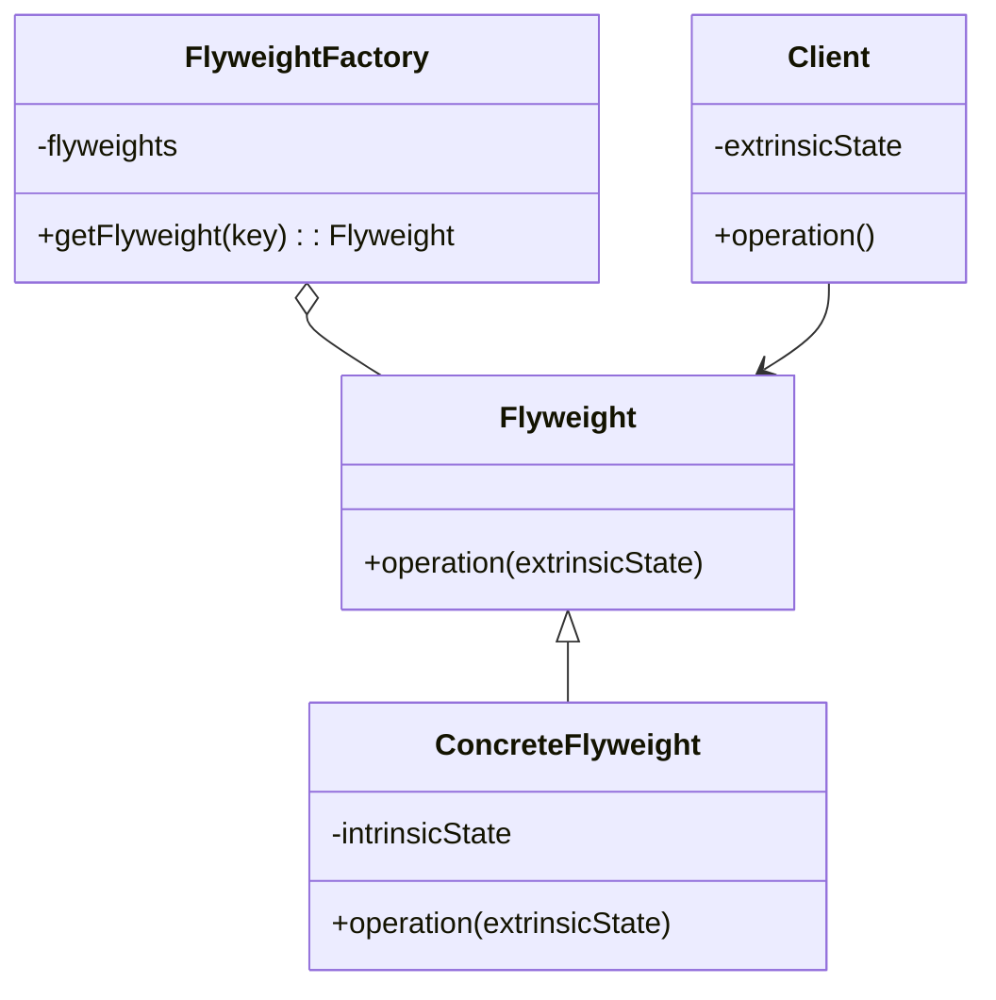

## 5.6 Flyweight Pattern

In the world of software engineering, especially in applications with high-performance requirements, managing memory efficiently is crucial. The Flyweight Pattern is a structural design pattern that allows us to minimize memory usage by sharing as much data as possible with similar objects. This pattern is particularly useful when dealing with a large number of objects that share common data.

### Understanding the Flyweight Pattern

The Flyweight Pattern is designed to reduce the memory footprint of an application by sharing common parts of objects. It achieves this by separating the intrinsic state, which is shared, from the extrinsic state, which is unique to each object. The pattern is particularly effective when:

- An application uses a large number of objects.
- Storage costs are high due to the sheer volume of objects.
- The majority of object states can be made extrinsic.

#### Intent of the Flyweight Pattern

The primary intent of the Flyweight Pattern is to use sharing to support large numbers of fine-grained objects efficiently. By minimizing the amount of memory required to store these objects, the pattern helps improve the performance and scalability of applications.

### Problem Solved by the Flyweight Pattern

In many applications, especially those involving graphical elements or large datasets, we encounter scenarios where a large number of similar objects are created. Each object may have some unique attributes, but a significant portion of their data is identical. Creating separate instances for each object can lead to excessive memory consumption, which can degrade performance and increase costs.

The Flyweight Pattern addresses this problem by sharing the common data among multiple objects. This reduces the overall memory footprint and allows the application to handle more objects efficiently.

### Key Components of the Flyweight Pattern

To implement the Flyweight Pattern, we need to understand its key components:

1. **Flyweight**: This is an interface or abstract class that defines the methods for flyweight objects. It provides the common operations that can be performed on the shared data.

2. **ConcreteFlyweight**: This class implements the Flyweight interface and stores the intrinsic state, which is shared among multiple objects. It provides methods to manipulate the intrinsic state.

3. **FlyweightFactory**: This class manages the flyweight objects. It ensures that objects are shared properly and provides access to them. The factory checks if a flyweight with the required intrinsic state already exists; if not, it creates a new one.

4. **Client**: The client uses flyweight objects and provides the extrinsic state, which is unique to each object. The client is responsible for passing the extrinsic state to the flyweight objects when needed.

### Visualizing the Flyweight Pattern

To better understand how the Flyweight Pattern works, let's visualize the relationships between these components using a class diagram.



**Diagram Description**: This diagram illustrates the Flyweight Pattern's structure. The `Flyweight` interface is implemented by `ConcreteFlyweight`, which stores the intrinsic state. The `FlyweightFactory` manages the creation and sharing of `Flyweight` objects. The `Client` interacts with the `Flyweight` objects, providing the extrinsic state.

### Implementing the Flyweight Pattern in TypeScript

Let's dive into a practical example to see how the Flyweight Pattern can be implemented in TypeScript. We'll create a simple application that manages a large number of graphical shapes, such as circles, where the color is shared among many shapes.

#### Step 1: Define the Flyweight Interface

First, we define the `Flyweight` interface that declares the common operations for flyweight objects.

```typescript
// Flyweight.ts
export interface Flyweight {
    operation(extrinsicState: string): void;
}
```

#### Step 2: Implement the ConcreteFlyweight Class

Next, we implement the `ConcreteFlyweight` class, which stores the intrinsic state (e.g., color) and implements the `Flyweight` interface.

```typescript
// ConcreteFlyweight.ts
import { Flyweight } from './Flyweight';

export class ConcreteFlyweight implements Flyweight {
    private intrinsicState: string;

    constructor(intrinsicState: string) {
        this.intrinsicState = intrinsicState;
    }

    public operation(extrinsicState: string): void {
        console.log(`Intrinsic State: ${this.intrinsicState}, Extrinsic State: ${extrinsicState}`);
    }
}
```

#### Step 3: Create the FlyweightFactory Class

The `FlyweightFactory` class is responsible for managing the flyweight objects. It ensures that flyweights are shared properly.

```typescript
// FlyweightFactory.ts
import { Flyweight } from './Flyweight';
import { ConcreteFlyweight } from './ConcreteFlyweight';

export class FlyweightFactory {
    private flyweights: { [key: string]: Flyweight } = {};

    public getFlyweight(key: string): Flyweight {
        if (!(key in this.flyweights)) {
            this.flyweights[key] = new ConcreteFlyweight(key);
            console.log(`Creating new flyweight for key: ${key}`);
        } else {
            console.log(`Reusing existing flyweight for key: ${key}`);
        }
        return this.flyweights[key];
    }
}
```

#### Step 4: Use the Flyweight Pattern in the Client

Finally, the `Client` uses the flyweight objects and provides the extrinsic state.

```typescript
// Client.ts
import { FlyweightFactory } from './FlyweightFactory';

const factory = new FlyweightFactory();

const colors = ['red', 'green', 'blue'];
const extrinsicStates = ['circle', 'square', 'triangle'];

for (const color of colors) {
    for (const shape of extrinsicStates) {
        const flyweight = factory.getFlyweight(color);
        flyweight.operation(shape);
    }
}
```

### How the Flyweight Pattern Works

In this example, the `ConcreteFlyweight` class stores the intrinsic state, which is the color of the shape. The `FlyweightFactory` manages the creation and sharing of flyweight objects. When the `Client` requests a flyweight, the factory checks if a flyweight with the required intrinsic state already exists. If not, it creates a new one. The `Client` provides the extrinsic state, which is the shape of the object.

### Separating Intrinsic and Extrinsic State

A key aspect of the Flyweight Pattern is the separation of intrinsic and extrinsic state. This separation allows the shared intrinsic state to be reused across multiple objects, while the unique extrinsic state is provided by the client.

- **Intrinsic State**: This is the state that is shared among multiple objects. In our example, the color of the shapes is intrinsic because many shapes can share the same color.

- **Extrinsic State**: This is the state that is unique to each object. In our example, the shape (circle, square, triangle) is extrinsic because it is specific to each instance.

### Benefits of the Flyweight Pattern

The Flyweight Pattern offers several benefits:

- **Reduced Memory Usage**: By sharing common data, the pattern significantly reduces the memory footprint of applications with a large number of similar objects.

- **Improved Performance**: With less memory usage, applications can perform more efficiently, especially in environments with limited resources.

- **Scalability**: The pattern allows applications to scale more effectively by managing resources efficiently.

### Limitations of the Flyweight Pattern

While the Flyweight Pattern is powerful, it also has limitations:

- **Complexity**: The pattern introduces additional complexity in managing the separation of intrinsic and extrinsic state.

- **Overhead**: There is some overhead in managing the flyweight objects and ensuring they are shared properly.

- **Not Always Applicable**: The pattern is most effective when there is a significant amount of shared data. In scenarios where objects are highly unique, the pattern may not provide significant benefits.

### Try It Yourself

To gain a deeper understanding of the Flyweight Pattern, try modifying the code examples above:

- **Experiment with Different Intrinsic States**: Add more colors or other intrinsic properties to see how the pattern handles them.

- **Add More Extrinsic States**: Introduce additional shapes or other extrinsic properties to observe how the client interacts with the flyweights.

- **Measure Memory Usage**: Use tools to measure memory usage before and after applying the Flyweight Pattern to see its impact.

### Further Reading

For more information on the Flyweight Pattern and its applications, consider exploring the following resources:

- [Design Patterns: Elements of Reusable Object-Oriented Software](https://en.wikipedia.org/wiki/Design_Patterns) by Erich Gamma, Richard Helm, Ralph Johnson, and John Vlissides.
- [MDN Web Docs on Memory Management](https://developer.mozilla.org/en-US/docs/Web/JavaScript/Memory_Management)

### Summary

The Flyweight Pattern is a powerful tool for optimizing memory usage in applications with a large number of similar objects. By sharing common data and separating intrinsic and extrinsic state, the pattern enables efficient resource management, improved performance, and scalability. As with any design pattern, it is important to consider the specific needs of your application and weigh the benefits against the complexity introduced by the pattern.

## Quiz Time!



### What is the primary intent of the Flyweight Pattern?

- [x] To minimize memory usage by sharing common parts of objects.
- [ ] To simplify object creation by using a factory.
- [ ] To provide a simplified interface to a complex subsystem.
- [ ] To allow incompatible interfaces to work together.

> **Explanation:** The Flyweight Pattern is designed to minimize memory usage by sharing common parts of objects, especially when dealing with a large number of similar objects.

### Which component of the Flyweight Pattern is responsible for managing and providing access to flyweight objects?

- [ ] Flyweight
- [ ] ConcreteFlyweight
- [x] FlyweightFactory
- [ ] Client

> **Explanation:** The FlyweightFactory is responsible for managing and providing access to flyweight objects, ensuring they are shared properly.

### What is the intrinsic state in the Flyweight Pattern?

- [ ] State that is unique to each object.
- [x] State that is shared among multiple objects.
- [ ] State that is managed by the client.
- [ ] State that is stored in the FlyweightFactory.

> **Explanation:** The intrinsic state is the state that is shared among multiple objects, allowing for memory optimization.

### What is the extrinsic state in the Flyweight Pattern?

- [x] State that is unique to each object.
- [ ] State that is shared among multiple objects.
- [ ] State that is managed by the FlyweightFactory.
- [ ] State that is stored in the ConcreteFlyweight.

> **Explanation:** The extrinsic state is unique to each object and is provided by the client when using the flyweight.

### Which of the following is a benefit of the Flyweight Pattern?

- [x] Reduced memory usage
- [ ] Simplified code structure
- [ ] Increased complexity
- [ ] Increased memory usage

> **Explanation:** The Flyweight Pattern reduces memory usage by sharing common data among objects, which is one of its primary benefits.

### In the provided TypeScript example, what does the `operation` method in `ConcreteFlyweight` do?

- [ ] It creates a new flyweight object.
- [x] It performs an operation using both intrinsic and extrinsic state.
- [ ] It manages the flyweight objects.
- [ ] It stores the extrinsic state.

> **Explanation:** The `operation` method in `ConcreteFlyweight` performs an operation using both the intrinsic state (shared) and the extrinsic state (unique).

### What is a limitation of the Flyweight Pattern?

- [x] Increased complexity
- [ ] Reduced memory usage
- [ ] Simplified object creation
- [ ] Improved performance

> **Explanation:** While the Flyweight Pattern reduces memory usage, it introduces increased complexity in managing the separation of intrinsic and extrinsic state.

### How does the Flyweight Pattern improve scalability?

- [x] By managing resources efficiently and reducing memory usage.
- [ ] By simplifying the code structure.
- [ ] By increasing the number of objects.
- [ ] By reducing the number of objects.

> **Explanation:** The Flyweight Pattern improves scalability by managing resources efficiently and reducing memory usage, allowing applications to handle more objects.

### True or False: The Flyweight Pattern is most effective when objects are highly unique.

- [ ] True
- [x] False

> **Explanation:** The Flyweight Pattern is most effective when there is a significant amount of shared data among objects, not when objects are highly unique.

### What should you consider when deciding to use the Flyweight Pattern?

- [x] The specific needs of your application and the balance between benefits and complexity.
- [ ] Only the memory usage of your application.
- [ ] The number of objects in your application.
- [ ] The complexity of your application's code.

> **Explanation:** When deciding to use the Flyweight Pattern, consider the specific needs of your application and weigh the benefits against the complexity introduced by the pattern.



Remember, this is just the beginning. As you progress, you'll build more complex and interactive applications. Keep experimenting, stay curious, and enjoy the journey!
