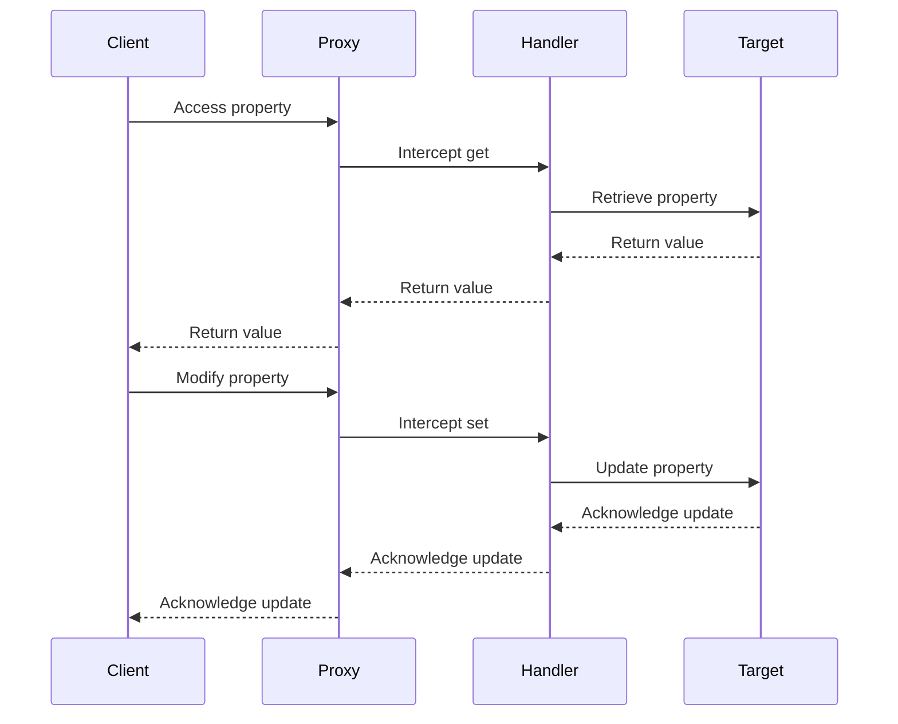

## 5.7.1 Implementing Proxy in TypeScript

The Proxy Pattern is a structural design pattern that provides an object representing another object. It acts as an intermediary, adding a layer of control over the access to the underlying object. In TypeScript, the Proxy Pattern can be effectively implemented using ES6 Proxy objects, which allow you to intercept and redefine fundamental operations for target objects.

### Understanding ES6 Proxy Objects

ES6 introduced the `Proxy` object, a powerful feature that enables developers to intercept and customize operations on target objects. This includes operations like property access, assignment, enumeration, function invocation, and more. A `Proxy` object is created with two parameters: the target object and a handler object. The handler object contains traps, which are methods that provide property access.

#### Key Concepts of Proxy Objects

- **Target**: The object that the proxy virtualizes. The proxy can intercept operations on this target.
- **Handler**: An object that defines the traps, or the custom behavior, for the proxy. Each trap corresponds to a fundamental operation (e.g., `get`, `set`).

### Creating a Proxy in TypeScript

Let's start by creating a simple proxy in TypeScript. We'll use a basic object and intercept its `get` and `set` operations.

```typescript
// Define a simple target object
const target = {
  message: "Hello, World!"
};

// Define a handler with traps
const handler = {
  get: (obj, prop) => {
    console.log(`Getting property ${String(prop)}`);
    return obj[prop];
  },
  set: (obj, prop, value) => {
    console.log(`Setting property ${String(prop)} to ${value}`);
    obj[prop] = value;
    return true;
  }
};

// Create a proxy object
const proxy = new Proxy(target, handler);

// Access and modify properties through the proxy
console.log(proxy.message); // Logs: Getting property message
proxy.message = "Hello, TypeScript!"; // Logs: Setting property message to Hello, TypeScript!
console.log(proxy.message); // Logs: Getting property message
```

In this example, we define a `target` object with a single property, `message`. The `handler` object contains two traps: `get` and `set`. These traps log messages to the console whenever properties are accessed or modified.

### Adding Behavior with Proxies

Proxies are not just about intercepting operations; they can also add additional behavior such as logging, validation, or access control. Let's explore these possibilities.

#### Logging with Proxies

Logging is a common use case for proxies. By intercepting operations, you can log every interaction with an object.

```typescript
// Define a logging handler
const loggingHandler = {
  get: (obj, prop) => {
    console.log(`Accessing property ${String(prop)}`);
    return obj[prop];
  },
  set: (obj, prop, value) => {
    console.log(`Modifying property ${String(prop)} to ${value}`);
    obj[prop] = value;
    return true;
  }
};

// Create a proxy with logging capabilities
const loggingProxy = new Proxy(target, loggingHandler);

// Test the logging proxy
loggingProxy.message; // Logs: Accessing property message
loggingProxy.message = "New Message"; // Logs: Modifying property message to New Message
```

#### Validation with Proxies

Proxies can enforce validation rules before allowing operations to proceed. This is useful for ensuring data integrity.

```typescript
// Define a validation handler
const validationHandler = {
  set: (obj, prop, value) => {
    if (typeof value !== 'string') {
      throw new TypeError(`Property ${String(prop)} must be a string`);
    }
    obj[prop] = value;
    return true;
  }
};

// Create a proxy with validation
const validationProxy = new Proxy(target, validationHandler);

// Test the validation proxy
validationProxy.message = "Valid String"; // Works fine
// validationProxy.message = 42; // Throws TypeError: Property message must be a string
```

#### Access Control with Proxies

Access control is another powerful application of proxies. You can restrict access to certain properties based on custom logic.

```typescript
// Define an access control handler
const accessControlHandler = {
  get: (obj, prop) => {
    if (prop === 'secret') {
      throw new Error("Access denied to secret property");
    }
    return obj[prop];
  }
};

// Create a proxy with access control
const accessControlProxy = new Proxy(target, accessControlHandler);

// Test the access control proxy
console.log(accessControlProxy.message); // Works fine
// console.log(accessControlProxy.secret); // Throws Error: Access denied to secret property
```

### TypeScript and Proxy Objects

TypeScript's type system can be leveraged to work with proxies, ensuring type safety and better developer experience. However, there are some considerations to keep in mind.

#### Type Definitions for Proxies

When using proxies, it's crucial to define the types of the target and handler objects. This helps in maintaining type safety and catching errors at compile time.

```typescript
interface Target {
  message: string;
}

const typedTarget: Target = {
  message: "Hello, TypeScript!"
};

const typedHandler: ProxyHandler<Target> = {
  get: (obj, prop) => {
    console.log(`Accessing property ${String(prop)}`);
    return obj[prop];
  },
  set: (obj, prop, value) => {
    console.log(`Modifying property ${String(prop)} to ${value}`);
    obj[prop] = value;
    return true;
  }
};

const typedProxy = new Proxy(typedTarget, typedHandler);
```

In this example, we define a `Target` interface to ensure that the `typedTarget` object adheres to the expected structure. The `ProxyHandler<Target>` type ensures that the handler's traps are correctly typed.

### Limitations and Considerations

While proxies offer powerful capabilities, there are limitations and considerations to be aware of:

- **Performance Overhead**: Proxies introduce a performance overhead due to the additional layer of indirection. This can impact performance-sensitive applications.
- **Compatibility**: Not all JavaScript environments fully support proxies. Ensure that your target environment supports ES6 features.
- **TypeScript Limitations**: TypeScript's type system may not fully capture all proxy behaviors, especially when dynamically adding or removing properties.

### Visualizing Proxy Operations

To better understand how proxies work, let's visualize the interaction between a proxy, its target, and the handler.



This diagram illustrates the flow of operations when a client interacts with a proxy. The proxy intercepts the operation, delegates it to the handler, and the handler performs the necessary actions on the target object.

### Try It Yourself

Experiment with the provided code examples by modifying the handler traps. Try adding new traps like `has`, `deleteProperty`, or `apply` to explore their effects. Consider implementing a proxy that caches results of expensive computations or one that tracks changes to an object over time.

### Knowledge Check

- What are the primary components of a proxy in TypeScript?
- How can proxies be used to enforce validation rules?
- What are some limitations of using proxies in TypeScript?

### Summary

In this section, we've explored the Proxy Pattern in TypeScript using ES6 Proxy objects. We've seen how proxies can intercept and customize operations, adding additional behavior such as logging, validation, and access control. By leveraging TypeScript's type system, we can ensure type safety while working with proxies. However, it's important to be aware of the limitations and performance considerations when using proxies in your applications.

Remember, this is just the beginning. As you progress, you'll discover more advanced applications of proxies and how they can enhance your TypeScript projects. Keep experimenting, stay curious, and enjoy the journey!

## Quiz Time!



### What is the primary role of a Proxy in TypeScript?

- [x] To act as an intermediary that controls access to another object.
- [ ] To replace the original object entirely.
- [ ] To enhance the performance of the original object.
- [ ] To simplify the original object's interface.

> **Explanation:** A Proxy acts as an intermediary that controls access to another object, allowing for additional behavior like logging or validation.

### Which ES6 feature allows interception of operations on objects?

- [x] Proxy objects
- [ ] Promises
- [ ] Generators
- [ ] Decorators

> **Explanation:** ES6 introduced Proxy objects, which allow interception and customization of fundamental operations on objects.

### What is a common use case for Proxies?

- [x] Logging property access and modifications
- [ ] Compiling TypeScript code
- [ ] Managing asynchronous operations
- [ ] Rendering UI components

> **Explanation:** Proxies are commonly used for logging property access and modifications, among other behaviors.

### How can Proxies enforce validation rules?

- [x] By intercepting the `set` operation and checking values before assignment.
- [ ] By modifying the target object's constructor.
- [ ] By using TypeScript decorators.
- [ ] By altering the prototype chain.

> **Explanation:** Proxies can enforce validation rules by intercepting the `set` operation and checking values before they are assigned to the target object.

### Which of the following is a limitation of using Proxies?

- [x] Performance overhead due to additional indirection
- [ ] Inability to handle asynchronous operations
- [ ] Lack of support for ES6 features
- [ ] Incompatibility with TypeScript's type system

> **Explanation:** Proxies introduce a performance overhead due to the additional layer of indirection, which can impact performance-sensitive applications.

### What is the role of the handler in a Proxy?

- [x] To define traps that intercept operations on the target object
- [ ] To store the original object's state
- [ ] To replace the target object
- [ ] To enhance the target object's performance

> **Explanation:** The handler defines traps that intercept operations on the target object, allowing for custom behavior.

### How does TypeScript ensure type safety with Proxies?

- [x] By using type definitions and interfaces for the target and handler
- [ ] By compiling code to JavaScript
- [ ] By using decorators
- [ ] By enforcing strict mode

> **Explanation:** TypeScript ensures type safety with Proxies by using type definitions and interfaces for the target and handler objects.

### What is a potential drawback of using Proxies in TypeScript?

- [x] TypeScript's type system may not fully capture all proxy behaviors.
- [ ] Proxies cannot be used with classes.
- [ ] Proxies are not compatible with ES6.
- [ ] Proxies cannot intercept method calls.

> **Explanation:** TypeScript's type system may not fully capture all proxy behaviors, especially when dynamically adding or removing properties.

### Can Proxies be used for access control?

- [x] True
- [ ] False

> **Explanation:** Proxies can be used for access control by intercepting operations and implementing custom logic to restrict access to certain properties.

### What is a Proxy's `get` trap used for?

- [x] Intercepting property access on the target object
- [ ] Modifying the target object's prototype
- [ ] Enhancing the target object's performance
- [ ] Compiling TypeScript code

> **Explanation:** The `get` trap is used to intercept property access on the target object, allowing for custom behavior like logging or validation.


