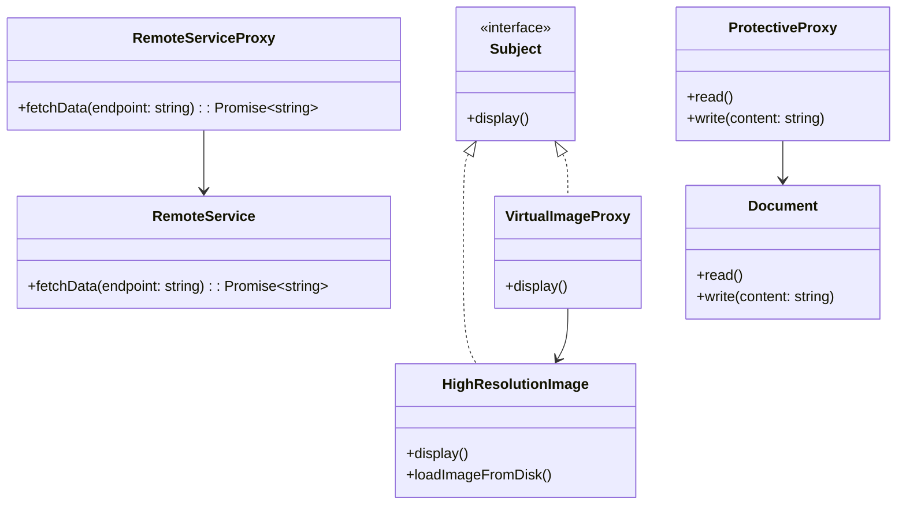

## 5.7.2 Types of Proxies

In the realm of software design patterns, the Proxy Pattern stands out as a versatile structural pattern that provides a surrogate or placeholder for another object to control access to it. Proxies are used to manage access to objects, often to add an additional layer of functionality or to defer the cost of object creation and initialization. In this section, we will delve into three primary types of proxies: Virtual Proxies, Remote Proxies, and Protective Proxies. Each type serves a unique purpose and can be implemented in TypeScript to solve specific problems.

### Virtual Proxy

**Definition**: A Virtual Proxy is used to manage the creation and initialization of expensive objects. It acts as a stand-in for the real object and handles the instantiation and loading of the object only when it is needed.

#### Use Case: Lazy-Loading Images in a Photo Viewer

Imagine a photo viewer application that needs to display a large number of high-resolution images. Loading all images at once would consume significant memory and processing power. A Virtual Proxy can be employed to load images on demand, improving performance and user experience.

#### Implementing a Virtual Proxy in TypeScript

Let's consider a scenario where we have an `Image` class that represents a high-resolution image. We'll create a `VirtualImageProxy` class that will manage the loading of the image.

```typescript
// RealSubject: The actual high-resolution image
class HighResolutionImage {
    private filename: string;

    constructor(filename: string) {
        this.filename = filename;
        this.loadImageFromDisk();
    }

    private loadImageFromDisk() {
        console.log(`Loading image from disk: ${this.filename}`);
    }

    public display() {
        console.log(`Displaying image: ${this.filename}`);
    }
}

// Proxy: The virtual proxy for the image
class VirtualImageProxy {
    private realImage: HighResolutionImage | null = null;
    private filename: string;

    constructor(filename: string) {
        this.filename = filename;
    }

    public display() {
        if (!this.realImage) {
            this.realImage = new HighResolutionImage(this.filename);
        }
        this.realImage.display();
    }
}

// Client code
const image1 = new VirtualImageProxy("photo1.jpg");
const image2 = new VirtualImageProxy("photo2.jpg");

// Images are loaded only when display is called
image1.display();
image2.display();
```

In this example, the `VirtualImageProxy` class defers the loading of the `HighResolutionImage` until the `display` method is called. This lazy-loading approach optimizes resource usage, especially when dealing with numerous large images.

#### Considerations for Choosing a Virtual Proxy

When deciding to use a Virtual Proxy, consider the following:

- **Resource Intensity**: Use a Virtual Proxy when the object is resource-intensive to create or load.
- **Frequency of Access**: If the object is not frequently accessed, a Virtual Proxy can save resources by delaying its creation.
- **User Experience**: Ensure that the delay in loading does not negatively impact the user experience.

### Remote Proxy

**Definition**: A Remote Proxy represents an object located in a different address space, often on a different machine or network. It is used to communicate with remote services or components.

#### Use Case: Communicating with a Service Over the Network

Consider a scenario where an application needs to interact with a remote service, such as a REST API. A Remote Proxy can be used to encapsulate the network communication, providing a local interface to the remote service.

#### Implementing a Remote Proxy in TypeScript

Let's create a `RemoteServiceProxy` class that acts as a proxy for a remote service.

```typescript
// RealSubject: The actual remote service
class RemoteService {
    public fetchData(endpoint: string): Promise<string> {
        return new Promise((resolve) => {
            console.log(`Fetching data from remote service at ${endpoint}`);
            setTimeout(() => resolve(`Data from ${endpoint}`), 1000);
        });
    }
}

// Proxy: The remote proxy for the service
class RemoteServiceProxy {
    private realService: RemoteService;

    constructor() {
        this.realService = new RemoteService();
    }

    public fetchData(endpoint: string): Promise<string> {
        console.log(`Proxy: Forwarding request to remote service`);
        return this.realService.fetchData(endpoint);
    }
}

// Client code
const serviceProxy = new RemoteServiceProxy();
serviceProxy.fetchData("/api/data").then((data) => console.log(data));
```

In this example, the `RemoteServiceProxy` class forwards requests to the `RemoteService`. This setup allows the client to interact with the remote service as if it were a local object, abstracting the complexities of network communication.

#### Considerations for Choosing a Remote Proxy

When implementing a Remote Proxy, keep in mind:

- **Network Latency**: Be aware of potential delays due to network communication.
- **Error Handling**: Implement robust error handling for network failures.
- **Security**: Ensure secure communication, especially when dealing with sensitive data.

### Protective Proxy

**Definition**: A Protective Proxy controls access to an object based on permissions. It is used to enforce access rights and ensure that only authorized users can perform certain actions.

#### Use Case: Enforcing User Access Rights in a System

In a multi-user system, different users may have different access rights. A Protective Proxy can be used to enforce these rights, ensuring that users can only access resources they are authorized to use.

#### Implementing a Protective Proxy in TypeScript

Let's create a `Document` class and a `ProtectiveProxy` that controls access to it based on user roles.

```typescript
// RealSubject: The actual document
class Document {
    private content: string;

    constructor(content: string) {
        this.content = content;
    }

    public read() {
        console.log(`Reading document: ${this.content}`);
    }

    public write(content: string) {
        this.content = content;
        console.log(`Writing to document: ${this.content}`);
    }
}

// Proxy: The protective proxy for the document
class ProtectiveProxy {
    private document: Document;
    private userRole: string;

    constructor(document: Document, userRole: string) {
        this.document = document;
        this.userRole = userRole;
    }

    public read() {
        console.log(`Proxy: Checking read permissions for role: ${this.userRole}`);
        if (this.userRole === "admin" || this.userRole === "editor") {
            this.document.read();
        } else {
            console.log("Access denied: Insufficient permissions to read the document.");
        }
    }

    public write(content: string) {
        console.log(`Proxy: Checking write permissions for role: ${this.userRole}`);
        if (this.userRole === "admin") {
            this.document.write(content);
        } else {
            console.log("Access denied: Insufficient permissions to write to the document.");
        }
    }
}

// Client code
const doc = new Document("Initial Content");
const adminProxy = new ProtectiveProxy(doc, "admin");
const viewerProxy = new ProtectiveProxy(doc, "viewer");

adminProxy.read();
adminProxy.write("New Content");

viewerProxy.read();
viewerProxy.write("Attempt to Write");
```

In this example, the `ProtectiveProxy` class checks the user's role before allowing access to the `Document` methods. This ensures that only users with the appropriate permissions can read or write to the document.

#### Considerations for Choosing a Protective Proxy

When implementing a Protective Proxy, consider:

- **Access Control**: Clearly define access levels and permissions.
- **Security**: Ensure that the proxy cannot be bypassed to access the real object directly.
- **Scalability**: Consider how the proxy will handle a large number of users or roles.

### Visualizing Proxy Types

To better understand how these proxies interact with their respective RealSubjects, let's visualize the relationships using a class diagram.



This diagram illustrates how each proxy type implements the `Subject` interface and interacts with the `RealSubject`.

### Choosing the Appropriate Type of Proxy

When deciding which type of proxy to implement, consider the following:

- **Virtual Proxy**: Ideal for managing expensive object creation and initialization. Use it when you need to defer resource-intensive operations.
- **Remote Proxy**: Suitable for interacting with remote services or components. Use it to encapsulate network communication and provide a local interface to remote objects.
- **Protective Proxy**: Best for enforcing access control and permissions. Use it to ensure that only authorized users can access certain resources.

### Try It Yourself

To deepen your understanding, try modifying the provided code examples:

- **Virtual Proxy**: Experiment with different types of resources, such as videos or documents, and implement lazy-loading for them.
- **Remote Proxy**: Simulate network latency and error conditions to see how the proxy handles them.
- **Protective Proxy**: Add additional roles and permissions to see how the proxy enforces access control.

### Summary

Proxies are powerful tools in software design, providing a way to add additional functionality or control access to objects. By understanding and implementing different types of proxies—Virtual, Remote, and Protective—you can optimize resource usage, encapsulate network communication, and enforce access control in your TypeScript applications. Remember, each type of proxy serves a unique purpose, and choosing the right one depends on the specific needs of your application.

## Quiz Time!



### Which type of proxy is used to manage the creation and initialization of expensive objects?

- [x] Virtual Proxy
- [ ] Remote Proxy
- [ ] Protective Proxy
- [ ] None of the above

> **Explanation:** A Virtual Proxy is used to manage the creation and initialization of expensive objects by deferring their loading until needed.

### What is the primary purpose of a Remote Proxy?

- [ ] To enforce access control
- [x] To represent an object located in a different address space
- [ ] To manage object creation
- [ ] To provide caching

> **Explanation:** A Remote Proxy represents an object located in a different address space, often used for network communication.

### Which proxy type is ideal for enforcing user access rights?

- [ ] Virtual Proxy
- [ ] Remote Proxy
- [x] Protective Proxy
- [ ] None of the above

> **Explanation:** A Protective Proxy is used to enforce user access rights by controlling access based on permissions.

### In the provided Virtual Proxy example, when is the high-resolution image loaded?

- [ ] At the time of proxy creation
- [ ] When the application starts
- [x] When the display method is called
- [ ] When the image is deleted

> **Explanation:** The high-resolution image is loaded when the `display` method is called, demonstrating lazy-loading.

### What should be considered when implementing a Remote Proxy?

- [x] Network latency
- [x] Error handling
- [x] Security
- [ ] All of the above

> **Explanation:** When implementing a Remote Proxy, consider network latency, error handling, and security to ensure robust communication.

### How does a Protective Proxy modify the behavior of the RealSubject?

- [x] By checking permissions before allowing access
- [ ] By caching results
- [ ] By logging access
- [ ] By encrypting data

> **Explanation:** A Protective Proxy modifies the behavior of the RealSubject by checking permissions before allowing access to its methods.

### Which of the following is NOT a type of proxy discussed in this section?

- [ ] Virtual Proxy
- [ ] Remote Proxy
- [ ] Protective Proxy
- [x] Caching Proxy

> **Explanation:** Caching Proxy is not discussed in this section. The focus is on Virtual, Remote, and Protective Proxies.

### What is a key benefit of using a Virtual Proxy?

- [ ] Reducing network traffic
- [x] Optimizing resource usage
- [ ] Simplifying code
- [ ] Increasing security

> **Explanation:** A key benefit of using a Virtual Proxy is optimizing resource usage by deferring the creation of expensive objects.

### True or False: A Remote Proxy can be used to encapsulate network communication.

- [x] True
- [ ] False

> **Explanation:** True. A Remote Proxy encapsulates network communication, providing a local interface to a remote object.

### True or False: A Protective Proxy can be bypassed to access the RealSubject directly.

- [ ] True
- [x] False

> **Explanation:** False. A Protective Proxy is designed to prevent unauthorized access to the RealSubject, ensuring that it cannot be bypassed.



Remember, this is just the beginning. As you progress, you'll build more complex and interactive applications using these proxy patterns. Keep experimenting, stay curious, and enjoy the journey!
