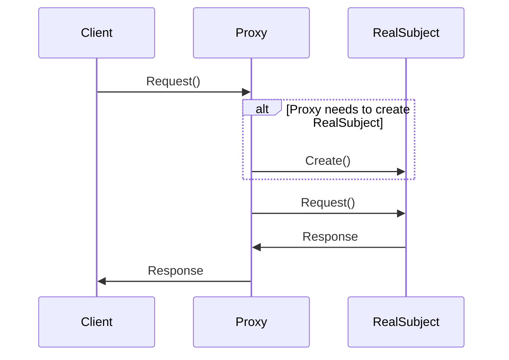

## 5.7.3 Use Cases and Examples

The Proxy Pattern is a powerful structural design pattern that provides a surrogate or placeholder for another object to control access to it. This pattern is particularly useful in scenarios where you need to add an intermediary to manage access, enhance functionality, or defer resource-intensive operations. In this section, we will explore practical use cases for the Proxy Pattern in TypeScript, including security proxies, virtual proxies for lazy loading, and logging proxies.

### Understanding the Proxy Pattern

Before diving into the examples, let's briefly revisit the core concept of the Proxy Pattern. A proxy acts as an intermediary for an object, providing a controlled way to access the original object. This can be beneficial for various reasons:

- **Access Control**: Restrict or manage access to sensitive resources.
- **Lazy Loading**: Defer the creation or loading of resource-intensive objects until they are needed.
- **Logging and Monitoring**: Record interactions with an object for auditing or debugging purposes.
- **Performance Optimization**: Cache results or reduce the overhead of expensive operations.

### Implementing a Security Proxy

One of the most common use cases for the Proxy Pattern is implementing a security proxy. This proxy checks user permissions before allowing access to certain methods or resources. This is particularly useful in applications where different users have varying levels of access.

#### Example: Security Proxy in TypeScript

Let's consider a scenario where we have a `Document` class that represents confidential documents. We want to ensure that only authorized users can access or modify these documents.

```typescript
// Define an interface for the document
interface Document {
  read(): string;
  write(content: string): void;
}

// Concrete implementation of the Document
class ConfidentialDocument implements Document {
  private content: string;

  constructor(content: string) {
    this.content = content;
  }

  read(): string {
    return this.content;
  }

  write(content: string): void {
    this.content = content;
  }
}

// Security Proxy
class DocumentProxy implements Document {
  private document: ConfidentialDocument;
  private userRole: string;

  constructor(document: ConfidentialDocument, userRole: string) {
    this.document = document;
    this.userRole = userRole;
  }

  read(): string {
    if (this.userRole === 'admin' || this.userRole === 'editor') {
      return this.document.read();
    } else {
      throw new Error('Access Denied: You do not have permission to read this document.');
    }
  }

  write(content: string): void {
    if (this.userRole === 'admin') {
      this.document.write(content);
    } else {
      throw new Error('Access Denied: You do not have permission to write to this document.');
    }
  }
}

// Usage
const doc = new ConfidentialDocument("Top Secret Content");
const adminProxy = new DocumentProxy(doc, 'admin');
const viewerProxy = new DocumentProxy(doc, 'viewer');

console.log(adminProxy.read()); // Outputs: Top Secret Content
// viewerProxy.read(); // Throws Error: Access Denied
```

In this example, the `DocumentProxy` class controls access to the `ConfidentialDocument` based on the user's role. This ensures that only authorized users can read or modify the document, enhancing security.

### Using a Virtual Proxy for Lazy Loading

A virtual proxy is used to delay the creation or loading of an object until it is actually needed. This can be particularly useful when dealing with large data sets or resource-intensive operations.

#### Example: Virtual Proxy for Lazy Loading

Imagine an application that displays high-resolution images. Loading all images at once can be resource-intensive and slow down the application. Instead, we can use a virtual proxy to load images only when they are needed.

```typescript
// Image interface
interface Image {
  display(): void;
}

// Real Image class
class HighResolutionImage implements Image {
  private filename: string;

  constructor(filename: string) {
    this.filename = filename;
    this.loadImageFromDisk();
  }

  private loadImageFromDisk(): void {
    console.log(`Loading ${this.filename} from disk...`);
  }

  display(): void {
    console.log(`Displaying ${this.filename}`);
  }
}

// Proxy Image class
class ImageProxy implements Image {
  private realImage: HighResolutionImage | null = null;
  private filename: string;

  constructor(filename: string) {
    this.filename = filename;
  }

  display(): void {
    if (this.realImage === null) {
      this.realImage = new HighResolutionImage(this.filename);
    }
    this.realImage.display();
  }
}

// Usage
const image1 = new ImageProxy("photo1.jpg");
const image2 = new ImageProxy("photo2.jpg");

// Image is loaded from disk only when display is called
image1.display();
image2.display();
```

In this example, the `ImageProxy` class delays the loading of the `HighResolutionImage` until the `display` method is called. This approach optimizes performance by avoiding unnecessary loading of images.

### Creating a Logging Proxy

A logging proxy can be used to record method calls and parameters, which is useful for debugging, auditing, or monitoring purposes. This proxy intercepts calls to the original object and logs the details before delegating the call.

#### Example: Logging Proxy in TypeScript

Consider a scenario where we have a `BankAccount` class. We want to log all transactions for auditing purposes.

```typescript
// Bank Account interface
interface BankAccount {
  deposit(amount: number): void;
  withdraw(amount: number): void;
  getBalance(): number;
}

// Concrete implementation of BankAccount
class RealBankAccount implements BankAccount {
  private balance: number = 0;

  deposit(amount: number): void {
    this.balance += amount;
    console.log(`Deposited: $${amount}`);
  }

  withdraw(amount: number): void {
    if (amount <= this.balance) {
      this.balance -= amount;
      console.log(`Withdrew: $${amount}`);
    } else {
      console.log('Insufficient funds');
    }
  }

  getBalance(): number {
    return this.balance;
  }
}

// Logging Proxy
class LoggingProxy implements BankAccount {
  private realAccount: RealBankAccount;

  constructor(realAccount: RealBankAccount) {
    this.realAccount = realAccount;
  }

  deposit(amount: number): void {
    console.log(`Logging: Deposit $${amount}`);
    this.realAccount.deposit(amount);
  }

  withdraw(amount: number): void {
    console.log(`Logging: Withdraw $${amount}`);
    this.realAccount.withdraw(amount);
  }

  getBalance(): number {
    const balance = this.realAccount.getBalance();
    console.log(`Logging: Get Balance $${balance}`);
    return balance;
  }
}

// Usage
const account = new RealBankAccount();
const loggingAccount = new LoggingProxy(account);

loggingAccount.deposit(100);
loggingAccount.withdraw(50);
console.log(`Balance: $${loggingAccount.getBalance()}`);
```

In this example, the `LoggingProxy` class logs each transaction before delegating the call to the `RealBankAccount`. This approach provides a transparent way to monitor all interactions with the bank account.

### Performance Impacts and Complexities

While the Proxy Pattern offers numerous benefits, it also introduces some performance overhead and complexity. Here are a few considerations:

- **Performance Overhead**: Proxies add an additional layer of abstraction, which can introduce slight performance overhead. However, this is often negligible compared to the benefits they provide, such as improved security or deferred loading.
- **Complexity**: Implementing proxies can increase the complexity of your codebase. It's important to weigh the benefits against the added complexity, especially in large systems.
- **Maintenance**: Proxies can make the system harder to maintain if not documented properly. Ensure that the purpose and functionality of each proxy are clearly documented.

### When to Use the Proxy Pattern

Consider using the Proxy Pattern in scenarios where you need to:

- **Control Access**: Implement access control mechanisms to protect sensitive resources.
- **Optimize Performance**: Use lazy loading to defer resource-intensive operations.
- **Monitor Interactions**: Log or audit interactions with objects for debugging or compliance purposes.
- **Enhance Functionality**: Add additional behavior to objects without modifying their code.

### Try It Yourself

To deepen your understanding, try modifying the examples provided:

- **Security Proxy**: Add additional roles and permissions to the `DocumentProxy` example. Experiment with different access levels and see how the proxy handles them.
- **Virtual Proxy**: Implement a caching mechanism in the `ImageProxy` example to store loaded images and avoid reloading them.
- **Logging Proxy**: Extend the `LoggingProxy` to include timestamps and user information in the logs.

### Visualizing the Proxy Pattern

To better understand the flow of the Proxy Pattern, let's visualize it using a sequence diagram. This diagram illustrates the interaction between the client, proxy, and real subject.



**Diagram Description**: This sequence diagram shows how a client interacts with a proxy, which in turn interacts with the real subject. The proxy may create the real subject if it doesn't already exist, demonstrating lazy loading.

### References and Further Reading

For more information on the Proxy Pattern and its applications, consider exploring the following resources:

- [MDN Web Docs: Proxy](https://developer.mozilla.org/en-US/docs/Web/JavaScript/Reference/Global_Objects/Proxy)
- [Design Patterns: Elements of Reusable Object-Oriented Software](https://en.wikipedia.org/wiki/Design_Patterns) by Erich Gamma, Richard Helm, Ralph Johnson, John Vlissides
- [Refactoring Guru: Proxy Pattern](https://refactoring.guru/design-patterns/proxy)

### Knowledge Check

To reinforce your understanding of the Proxy Pattern, consider the following questions:

- How does a proxy differ from a decorator?
- What are some potential drawbacks of using the Proxy Pattern?
- In what scenarios would a virtual proxy be particularly beneficial?

### Embrace the Journey

Remember, mastering design patterns is a journey. As you continue to explore and apply these patterns, you'll develop a deeper understanding of how they can enhance your software design. Keep experimenting, stay curious, and enjoy the process!

## Quiz Time!



### What is a primary use case for the Proxy Pattern?

- [x] Controlling access to an object
- [ ] Directly modifying an object's state
- [ ] Replacing an object with a new implementation
- [ ] Simplifying an object's interface

> **Explanation:** The Proxy Pattern is primarily used to control access to an object, often adding an intermediary layer for security, lazy loading, or logging.

### How does a virtual proxy optimize performance?

- [x] By deferring the creation of resource-intensive objects
- [ ] By caching all method calls
- [ ] By reducing the number of method calls
- [ ] By simplifying the object's interface

> **Explanation:** A virtual proxy optimizes performance by deferring the creation or loading of resource-intensive objects until they are needed, reducing initial load times.

### What is a potential drawback of using the Proxy Pattern?

- [x] Increased complexity in the codebase
- [ ] Direct access to the object's methods
- [ ] Reduced security of the object
- [ ] Simplified object interactions

> **Explanation:** The Proxy Pattern can increase the complexity of the codebase due to the additional layer of abstraction it introduces.

### In the security proxy example, what role is allowed to write to the document?

- [x] Admin
- [ ] Editor
- [ ] Viewer
- [ ] Guest

> **Explanation:** In the security proxy example, only the 'admin' role is allowed to write to the document, ensuring controlled access.

### What does a logging proxy primarily do?

- [x] Records method calls and parameters
- [ ] Simplifies method calls
- [ ] Enhances object security
- [ ] Reduces method call frequency

> **Explanation:** A logging proxy records method calls and parameters, providing a way to monitor interactions with an object.

### What is the main benefit of using a virtual proxy for images?

- [x] Delaying image loading until needed
- [ ] Reducing image quality
- [ ] Increasing image resolution
- [ ] Simplifying image manipulation

> **Explanation:** The main benefit of using a virtual proxy for images is delaying the loading of images until they are needed, optimizing performance.

### Which of the following is NOT a typical use case for the Proxy Pattern?

- [ ] Access control
- [ ] Lazy loading
- [ ] Logging
- [x] Direct object manipulation

> **Explanation:** Direct object manipulation is not a typical use case for the Proxy Pattern, which focuses on controlling access and adding functionality.

### How can a proxy affect performance?

- [x] It can introduce slight overhead due to additional abstraction
- [ ] It always improves performance by caching
- [ ] It reduces the number of method calls
- [ ] It simplifies the object's interface

> **Explanation:** A proxy can introduce slight overhead due to the additional layer of abstraction, though this is often outweighed by its benefits.

### What is a key characteristic of a security proxy?

- [x] It checks permissions before allowing access
- [ ] It logs all method calls
- [ ] It caches method results
- [ ] It simplifies the object's interface

> **Explanation:** A security proxy checks permissions before allowing access to certain methods or resources, enhancing security.

### True or False: A proxy can be used to add new functionality to an object without modifying its code.

- [x] True
- [ ] False

> **Explanation:** True. A proxy can add new functionality to an object without modifying its code, by intercepting and handling method calls.


