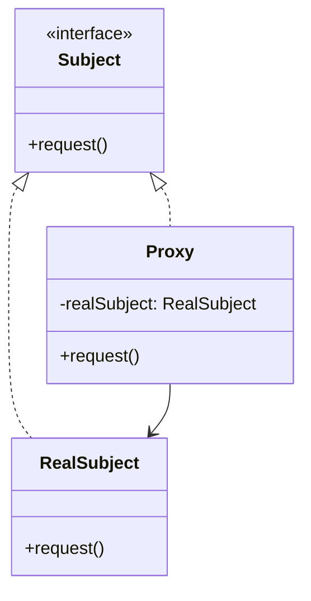
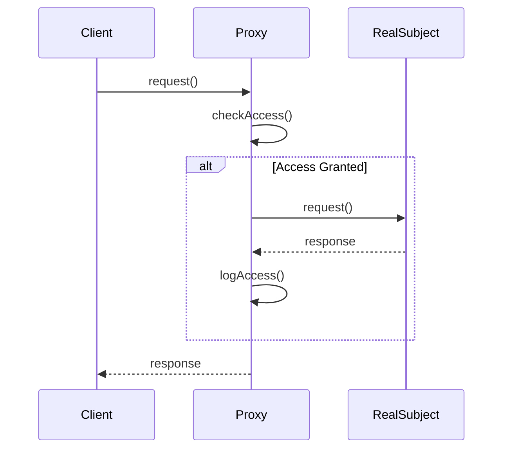

## 5.7 Proxy Pattern

In the realm of software design, the Proxy Pattern stands out as a versatile structural pattern that provides a surrogate or placeholder for another object to control access to it. This pattern introduces a level of indirection in object-oriented design, allowing developers to add additional behavior or control access to resources seamlessly.

### Understanding the Proxy Pattern

The Proxy Pattern is primarily used to manage access to an object, often referred to as the **RealSubject**, by placing a proxy object in front of it. This proxy acts as an intermediary, handling requests to the RealSubject and potentially adding additional behavior or controls.

#### Intent of the Proxy Pattern

The primary intent of the Proxy Pattern is to provide a surrogate or placeholder for another object to control access to it. This can be particularly useful in scenarios where direct access to the RealSubject is either not possible or not desirable due to constraints such as security, performance, or complexity.

### Problems Solved by the Proxy Pattern

The Proxy Pattern addresses several common challenges in software design:

- **Access Control**: Proxies can restrict access to the RealSubject, ensuring that only authorized clients can interact with it.
- **Lazy Initialization**: Proxies can delay the creation or initialization of the RealSubject until it is actually needed, optimizing resource usage.
- **Logging and Auditing**: Proxies can add logging or auditing functionality to track interactions with the RealSubject.
- **Remote Access**: Proxies can facilitate communication with objects located in different address spaces, such as networked services.
- **Caching**: Proxies can cache results of expensive operations to improve performance.

### Key Components of the Proxy Pattern

To implement the Proxy Pattern, we need to understand its key components:

- **Subject**: This is an interface or abstract class that defines the common methods that both the RealSubject and the Proxy will implement. It ensures that the Proxy can be used in place of the RealSubject.

- **RealSubject**: This is the actual object that the Proxy represents. It implements the Subject interface and contains the core functionality that clients are interested in.

- **Proxy**: This object also implements the Subject interface and controls access to the RealSubject. It may add additional behavior such as access control, logging, or lazy initialization.

#### Diagram: Proxy Pattern Structure

Let's visualize the relationships between these components using a class diagram.



**Diagram Description**: This diagram illustrates the Proxy Pattern structure, where both the `RealSubject` and `Proxy` implement the `Subject` interface. The `Proxy` holds a reference to the `RealSubject` and controls access to it.

### Implementing the Proxy Pattern in TypeScript

Now, let's dive into implementing the Proxy Pattern in TypeScript. We'll create a simple example to demonstrate how a proxy can control access to a RealSubject.

#### Step 1: Define the Subject Interface

First, we'll define the `Subject` interface that both the RealSubject and Proxy will implement.

```typescript
// Subject.ts
export interface Subject {
    request(): void;
}
```

#### Step 2: Implement the RealSubject

Next, we'll implement the `RealSubject` class, which contains the core functionality.

```typescript
// RealSubject.ts
import { Subject } from './Subject';

export class RealSubject implements Subject {
    request(): void {
        console.log('RealSubject: Handling request.');
    }
}
```

#### Step 3: Implement the Proxy

Now, let's implement the `Proxy` class, which controls access to the RealSubject.

```typescript
// Proxy.ts
import { Subject } from './Subject';
import { RealSubject } from './RealSubject';

export class Proxy implements Subject {
    private realSubject: RealSubject;

    constructor(realSubject: RealSubject) {
        this.realSubject = realSubject;
    }

    request(): void {
        if (this.checkAccess()) {
            this.realSubject.request();
            this.logAccess();
        }
    }

    private checkAccess(): boolean {
        console.log('Proxy: Checking access prior to firing a real request.');
        // Simulate access check logic
        return true;
    }

    private logAccess(): void {
        console.log('Proxy: Logging the time of request.');
    }
}
```

#### Step 4: Using the Proxy

Finally, let's see how we can use the Proxy to control access to the RealSubject.

```typescript
// Client.ts
import { RealSubject } from './RealSubject';
import { Proxy } from './Proxy';

function clientCode(subject: Subject) {
    subject.request();
}

console.log('Client: Executing the client code with a real subject:');
const realSubject = new RealSubject();
clientCode(realSubject);

console.log('');

console.log('Client: Executing the same client code with a proxy:');
const proxy = new Proxy(realSubject);
clientCode(proxy);
```

**Code Explanation**: In this example, the `Proxy` class controls access to the `RealSubject` by implementing the `checkAccess` and `logAccess` methods. The client code can interact with the Proxy as if it were the RealSubject, thanks to the common `Subject` interface.

### Situations Where Proxies Are Beneficial

Proxies can be beneficial in various scenarios, including:

- **Virtual Proxy**: Used for lazy initialization, where the RealSubject is created only when needed.
- **Protection Proxy**: Used to control access to the RealSubject, ensuring that only authorized clients can access it.
- **Remote Proxy**: Used to represent an object located in a different address space, such as a networked service.
- **Smart Proxy**: Used to add additional behavior, such as logging or reference counting, to the RealSubject.

### Visualizing Proxy Use Cases

Let's use a sequence diagram to visualize how a Proxy can control access to a RealSubject.



**Diagram Description**: This sequence diagram shows the interaction between the Client, Proxy, and RealSubject. The Proxy checks access before forwarding the request to the RealSubject and logs the access after the request is handled.

### Try It Yourself

Now that we've covered the basics of the Proxy Pattern, let's encourage you to experiment with the code. Try modifying the `checkAccess` method to implement more complex access control logic or add additional logging functionality in the `logAccess` method.

### Knowledge Check

- **What is the primary intent of the Proxy Pattern?**
- **How does the Proxy Pattern help in controlling access to resources?**
- **What are the key components of the Proxy Pattern?**
- **Can you identify different types of proxies and their use cases?**

### Summary

In this section, we've explored the Proxy Pattern, a powerful structural design pattern that provides a surrogate or placeholder for another object to control access to it. We've discussed its intent, the problems it solves, and its key components. We've also implemented the Proxy Pattern in TypeScript and visualized its structure and use cases. Remember, the Proxy Pattern is a versatile tool in your design pattern toolkit, offering solutions for access control, lazy initialization, logging, and more.

## Quiz Time!



### What is the primary intent of the Proxy Pattern?

- [x] To provide a surrogate or placeholder for another object to control access to it.
- [ ] To create a family of related objects without specifying their concrete classes.
- [ ] To define a one-to-many dependency between objects.
- [ ] To compose objects into tree structures to represent part-whole hierarchies.

> **Explanation:** The primary intent of the Proxy Pattern is to provide a surrogate or placeholder for another object to control access to it.

### Which of the following is NOT a problem solved by the Proxy Pattern?

- [ ] Access Control
- [ ] Lazy Initialization
- [ ] Logging and Auditing
- [x] Sorting Algorithms

> **Explanation:** The Proxy Pattern is not used for sorting algorithms; it is used for access control, lazy initialization, logging, and auditing.

### What are the key components of the Proxy Pattern?

- [x] Subject, RealSubject, Proxy
- [ ] Factory, Product, Creator
- [ ] Observer, Subject, ConcreteObserver
- [ ] Component, Composite, Leaf

> **Explanation:** The key components of the Proxy Pattern are Subject, RealSubject, and Proxy.

### In the Proxy Pattern, what is the role of the Proxy component?

- [x] To control access to the RealSubject and potentially add additional behavior.
- [ ] To define the common interface for RealSubject and Proxy.
- [ ] To handle system events and delegate work.
- [ ] To encapsulate a request as an object.

> **Explanation:** The Proxy component controls access to the RealSubject and may add additional behavior such as access control or logging.

### Which type of proxy is used for lazy initialization?

- [x] Virtual Proxy
- [ ] Protection Proxy
- [ ] Remote Proxy
- [ ] Smart Proxy

> **Explanation:** A Virtual Proxy is used for lazy initialization, where the RealSubject is created only when needed.

### What is a Protection Proxy used for?

- [x] To control access to the RealSubject, ensuring that only authorized clients can access it.
- [ ] To represent an object located in a different address space.
- [ ] To add additional behavior, such as logging or reference counting.
- [ ] To cache results of expensive operations.

> **Explanation:** A Protection Proxy is used to control access to the RealSubject, ensuring that only authorized clients can access it.

### How does a Remote Proxy differ from other types of proxies?

- [x] It represents an object located in a different address space, such as a networked service.
- [ ] It adds additional behavior, such as logging or reference counting.
- [ ] It controls access to the RealSubject.
- [ ] It is used for lazy initialization.

> **Explanation:** A Remote Proxy represents an object located in a different address space, such as a networked service.

### What is the role of the RealSubject in the Proxy Pattern?

- [x] To implement the core functionality that clients are interested in.
- [ ] To control access to the RealSubject.
- [ ] To define the common interface for RealSubject and Proxy.
- [ ] To encapsulate a request as an object.

> **Explanation:** The RealSubject implements the core functionality that clients are interested in.

### Can the Proxy Pattern be used for caching?

- [x] True
- [ ] False

> **Explanation:** True. The Proxy Pattern can be used for caching results of expensive operations to improve performance.

### Which of the following is a benefit of using the Proxy Pattern?

- [x] It allows for additional behavior such as logging or access control to be added without modifying the RealSubject.
- [ ] It simplifies the creation of a family of related objects.
- [ ] It provides a way to access elements of a collection sequentially.
- [ ] It defines a one-to-many dependency between objects.

> **Explanation:** The Proxy Pattern allows for additional behavior such as logging or access control to be added without modifying the RealSubject.



Remember, this is just the beginning. As you progress, you'll build more complex and interactive applications using design patterns like the Proxy Pattern. Keep experimenting, stay curious, and enjoy the journey!
